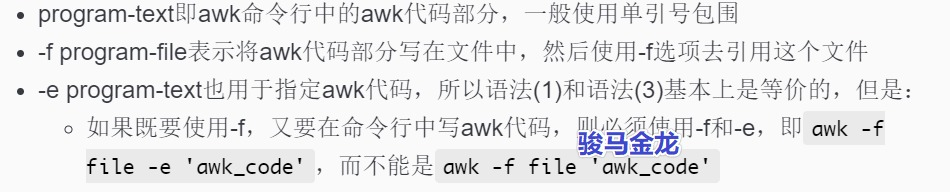

# awk命令结构和awk语法结构

## awk命令行结构

```
awk [ -- ] program-text file ...        (1)
awk -f program-file [ -- ] file ...     (2)
awk -e program-text [ -- ] file ...     (3)
```

　　其中：

​​

## awk语法结构

　　awk语法结构即awk代码部分的结构。

　　awk的语法充斥着`pattern{action}`​的模式，它们称为awk rule。

　　例如：

```
awk '
  BEGIN{n=3} 
  /^[0-9]/{$1>5{$1=333;print $1}
  /Alice/{print "Alice"}
  END{print "hello"}
' a.txt

# 等价的单行式:
awk 'BEGIN{n=3} /^[0-9]/{$1>5{$1=333;print $1} /Alice/{print "Alice"} END{print "hello"}' a.txt
```

　　上面示例中，有BEGIN语句块，有END语句块，还有2个main代码块，两个main代码块都使用了正则表达式作为pattern。

　　关于awk的语法：

* 多个`pattern{action}`​可以直接连接连用
* action中多个语句如果写在同一行，则需使用分号分隔
* pattern部分用于筛选行，action表示在筛选通过后执行的操作
* pattern和action都可以省略

  * 省略`pattern`​，等价于对每一行数据都执行action

    * 例如：`awk '{print $0}' a.txt`​
  * 省略代码块`{action}`​，等价于`{print}`​即输出所有行

    * 例如：`awk '/Alice/' a.txt`​等价于`awk '/Alice/{print $0}' a.txt`​
  * 省略代码块中的`action`​，表示对筛选的行什么都不做

    * 例如：`awk '/Alice/{}' a.txt`​
  * ​`pattern{action}`​任何一部分都可以省略

    * 例如:`awk '' a.txt`​

## pattern和action

　　对于`pattern{action}`​语句结构(都称之为语句块)，其中的pattern部分可以使用下面列出的模式：

```
# 特殊pattern
BEGIN
END

# 布尔代码块
/regular expression/    # 正则匹配成功与否 /a.*ef/{action}
relational expression   # 即等值比较、大小比较 3>2{action}
pattern && pattern      # 逻辑与 3>2 && 3>1 {action}
pattern || pattern      # 逻辑或 3>2 || 3<1 {action}
! pattern               # 逻辑取反 !/a.*ef/{action}
(pattern)               # 改变优先级
pattern ? pattern : pattern  # 三目运算符决定的布尔值

# 范围pattern，非布尔代码块
pattern1, pattern2      # 范围，pat1打开、pat2关闭，即flip,flop模式
```

　　action部分，可以是任何语句，例如print。
