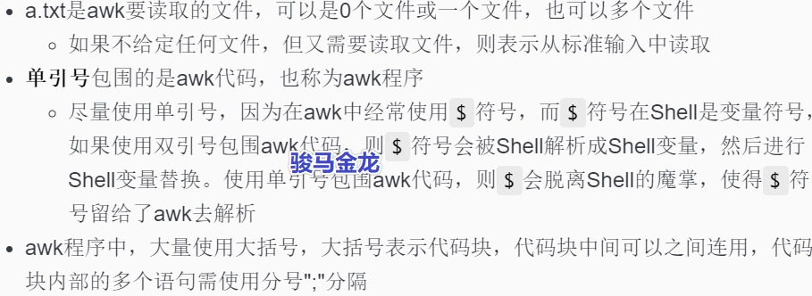

# awk用法入门

```
awk 'awk_program' a.txt
```

　　​[https://www.junmajinlong.com/img/shell/awk/733013-20191123152604065-684766254.jpg](https://www.junmajinlong.com/img/shell/awk/733013-20191123152604065-684766254.jpg)

　　awk示例:

```
# 输出a.txt中的每一行
awk '{print $0}' a.txt

# 多个代码块，代码块中多个语句
# 输出每行之后还输出两行：hello行和world行
awk '{print $0}{print "hello";print "world"}' a.txt
```

　　对于`awk '{print $0}' a.txt`​，它类似于shell的while循环`while read line;do echo "$line";done <a.txt`​。awk隐藏了读取每一行的while循环，它会自动读取每一行，其中的`{print $0}`​对应于Shell的while循环体`echo "$line"`​部分。

　　下面再分析该awk命令的执行过程：

1. 读取文件第一行(awk默认按行读取文件)
2. 将所读取的行赋值给awk的变量`$0`​，于是`$0`​中保存的就是本次所读取的行数据
3. 进入代码块`{print $0}`​并执行其中代码`print $0`​，即输出`$0`​，也即输出当前所读取的行
4. 执行完本次代码之后，进入下一轮awk循环：继续读取下一行(第二行)

    * 将第二行赋值给变量`$0`​
    * 进入代码块执行`print $0`​
    * 执行完代码块后再次进入下一轮awk循环，即读取第三行，然后赋值给`$0`​，再执行代码块
    * …不断循环，直到读完文件所有数据…
5. 退出awk
