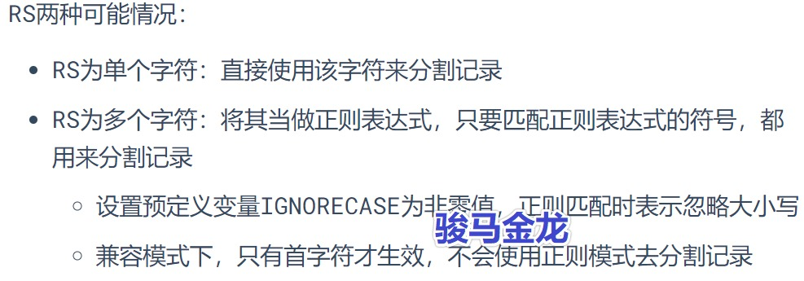

# awk读取行的细节

## 详细分析awk如何读取文件

　　awk读取输入文件时，每次读取一条记录(record)(默认情况下按行读取，所以此时记录就是行)。每读取一条记录，将其保存到`$0`​中，然后执行一次main代码段。

```
awk '{print $0}' a.txt
```

　　如果是空文件，则因为无法读取到任何一条记录，将导致直接关闭文件，而不会进入main代码段。

```
touch x.log  # 创建一个空文件
awk '{print "hello world"}' x.log
```

　　可设置表示输入记录分隔符的预定义变量RS(Record Separator)来改变每次读取的记录模式。

```
# RS="\n" 、 RS="m"
awk 'BEGIN{RS="\n"}{print $0}' a.txt
awk 'BEGIN{RS="m"}{print $0}' a.txt
```

　　RS通常设置在BEGIN代码块中，因为要先于读取文件就确定好RS分隔符。

> RS指定输入记录分隔符时，所读取的记录中是不包含分隔符字符的。例如`RS="a"`​，则`$0`​中一定不可能出现字符a。

​​

　　特殊的RS值用来解决特殊读取需求：

* ​`RS=""`​：按段落读取
* ​`RS="\0"`​：一次性读取所有数据，但有些特殊文件中包含了空字符`\0`​
* ​`RS="^$"`​：真正的一次性读取所有数据，因为非空文件不可能匹配成功
* ​`RS="\n+"`​：按行读取，但忽略所有空行

　　示例：

```
# 按段落读取：RS=''
$ awk 'BEGIN{RS=""}{print $0"------"}' a.txt   

# 一次性读取所有数据：RS='\0' RS="^$"
$ awk 'BEGIN{RS="\0"}{print $0"------"}' a.txt   
$ awk 'BEGIN{RS="^$"}{print $0"------"}' a.txt  

# 忽略空行：RS='\n+'
$ awk 'BEGIN{RS="\n+"}{print $0"------"}' a.txt 

# 忽略大小写：预定义变量IGNORECASE设置为非0值
$ awk 'BEGIN{IGNORECASE=1}{print $0"------"}' RS='[ab]' a.txt  
```

> 预定义变量RT：
>
> 在awk每次读完一条记录时，会设置一个称为RT的预定义变量，表示Record Termination。
>
> 当RS为单个字符时，RT的值和RS的值是相同的。
>
> 当RS为多个字符(正则表达式)时，则RT设置为正则匹配到记录分隔符之后，真正用于划分记录时的字符。
>
> 当无法匹配到记录分隔符时，RT设置为控制空字符串(即默认的初始值)。
>
> awk ‘BEGIN{RS\=”(fe)?male”}{print RT}’ a.txt

## 两种行号：NR和FNR

　　在读取每条记录之后，将其赋值给\$0，同时还会设置NR、FNR、RT。

* NR：所有文件的行号计数器
* FNR：是各个文件的行号计数器

```
awk '{print NR}' a.txt a.txt
awk '{print FNR}' a.txt a.txt
```
