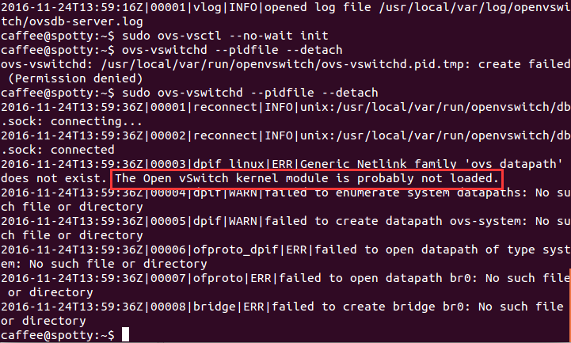

# modprobe

自动处理可载入模块

**modprobe命令** 用于智能地向内核中加载模块或者从内核中移除模块。

modprobe可载入指定的个别模块，或是载入一组相依的模块。modprobe会根据depmod所产生的相依关系，决定要载入哪些模块。若在载入过程中发生错误，在modprobe会卸载整组的模块。

查看模块 lsmod

删除模块 rmmod

### 语法

```
modprobe(选项)(参数)
```

### 选项

```
-a或--all：载入全部的模块；
-c或--show-conf：显示所有模块的设置信息；
-d或--debug：使用排错模式；
-l或--list：显示可用的模块；
-r或--remove：模块闲置不用时，即自动卸载模块；
-t或--type：指定模块类型；
-v或--verbose：执行时显示详细的信息；
-V或--version：显示版本信息；
-help：显示帮助。
```

### 参数

模块名：要加载或移除的模块名称。

### 实例

**查看modules的配置文件：**

```
modprobe -c
```

这里，可以查看modules的配置文件，比如模块的alias别名是什么等。会打印许多行信息，例如其中的一行会类似如下：

```
alias symbol:ip_conntrack_unregister_notifier ip_conntrack
```

**列出内核中所有已经或者未挂载的所有模块：**

```
modprobe -l
```

这里，我们能查看到我们所需要的模块，然后根据我们的需要来挂载；其实`modprobe -l`​读取的模块列表就位于/lib/modules/`uname -r `​目录中；其中`uname -r`​是内核的版本，例如输出结果的其中一行是：

```
/lib/modules/2.6.18-348.6.1.el5/kernel/net/netfilter/xt_statistic.ko
```

**挂载vfat模块：**

```
modprobe vfat
```

这里，使用格式`modprobe 模块名`​来挂载一个模块。挂载之后，用lsmod可以查看已经挂载的模块。模块名是不能带有后缀的，我们通过`modprobe -l`​所看到的模块，都是带有`.ko`​或`.o`​后缀。

**移除已经加载的模块：**

```
modprobe -r 模块名
```

这里，移除已加载的模块，和rmmod功能相同。

‍

### modprobe与insmod的区别

最近在做OVS相关的工作，安装完OVS后，没啥大问题，基本上也都可以按照流程走下去，但是重启机器后，当我重新启动OVS的时候，就出现了问题:

​​

大意就是说我在启动`ovs-vswitchd`​进程的时候，没有提前加载`Open vSwtich`​的内核模块。网上有人和我有类似的问题，按照别人的解决方案执行`sudo modprobe openvswitch`​之后，重新启动`ovsdb-server`​和`ovs-vswitchd`​，`OVS`​就可以正常使用了，但是也引发我开始考虑`modprobe`​与之前了解过的`insmod`​有什么区别

## `modprobe`​与`insmod`​的区别

在Linux系统中，modprobe和insmod都可以用来加载module，不过现在一般都是推荐modprobe而不是insmod。modprobe和insmod的区别在于

1. modprobe可以解决module加载过程中依赖关系问题，而insmod不行。举个例子，比如load moduleA，而moduleA依赖moduleB，那么这时候如果要使用insmod就得手动先去load moduleB，再去load moduleA.而用modprobe来load moduleA的话，modprobe会自动读取`/lib/modules/<kernel-version>/modules.dep`​文件来自动查找moduleA依赖那些模块，先加载依赖模块moduleB,在加载moduleA.

    比如我们可以手动到modules.dep文件中查看下openvswtich的依赖项

    ```bash
    $ cat /lib/modules/`uname -r`/modules.dep|grep openvswitch

    kernel/net/openvswitch/openvswitch.ko: kernel/net/ipv4/gre.ko kernel/drivers/net/vxlan.ko kernel/net/ipv4/ip_tunnel.ko kernel/lib/libcrc32c.ko
    ```

    这里可以看出`openvswitch.ko`​依赖`vxlan.ko`​、`ip_tunnel.ko`​、`libcrc32c.ko`​，modprobe会自动读取这些依赖，并加载

2. modprobe与inmod查找的目录不一样。modprobe默认去`/lib/modules/<kernel-version>`​下面查找module，而insmod只在给它的参数中去找module（默认情况在当前目录下查找）。
    不过insmod也有它的有用之处,比如我们在/home/caffee/目录下有一个my-mod.ko这个module，如果我们这个cd到/home/caffee，执行inmod my-mod.ko就可以插入这个module，但是如果用modprobe my-mod.ko却会提示`FATAL:Module my-mod,ko not found`​,这就是应为modprobe此时是到`/lib/module/<kernel-version>`​下面去找module，没有找到就报错了

ps:对于modprobe modulename 而言，modulename参数中`_`​和`-`​是不区分的。

‍
