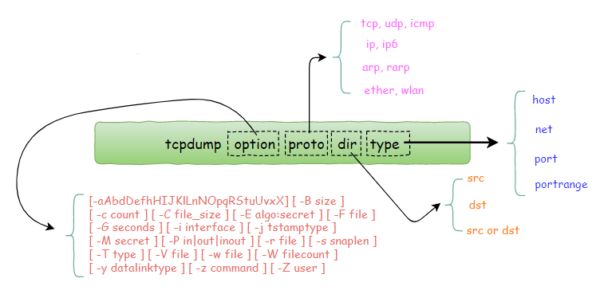

# tcpdump

今天要给大家介绍的一个 Unix 下的一个 **网络数据采集分析工具**，也就是我们常说的抓包工具。

与它功能类似的工具有 wireshark ，不同的是，wireshark 有图形化界面，而 tcpdump 则只有命令行。

​​

1. option 可选参数：将在后边一一解释。
2. proto 类过滤器：根据协议进行过滤，可识别的关键词有： tcp, udp, icmp, ip, ip6, arp, rarp,ether,wlan, fddi, tr, decnet
3. type 类过滤器：可识别的关键词有：host, net, port, portrange，这些词后边需要再接参数。
4. direction 类过滤器：根据数据流向进行过滤，可识别的关键字有：src, dst，同时你可以使用逻辑运算符进行组合，比如 src or dst
