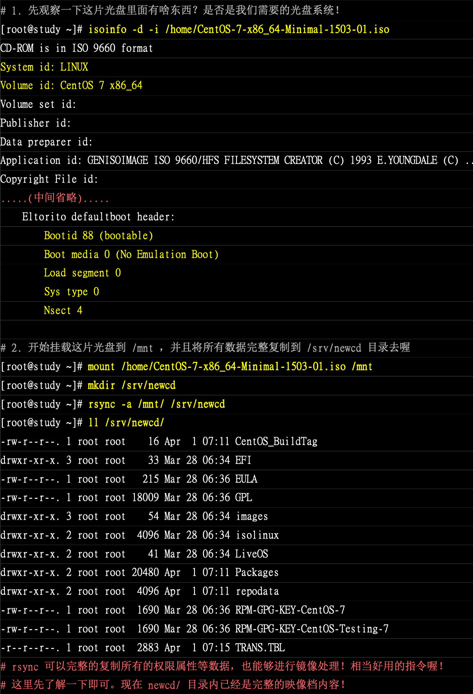
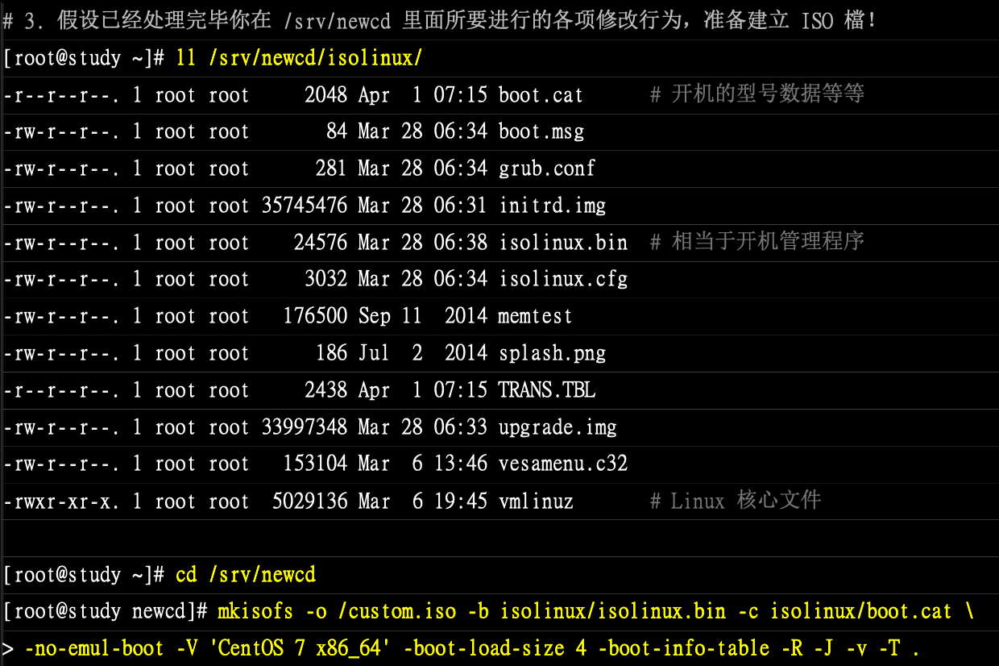

# 光盘刻录

## CD/DVD分类

DVD 可以容纳比任何 CD 更多的数据，已经成为现今视频出版业的标准。

我们称作可记录 DVD 的有五种物理记录格式：

* DVD-R：这是第一种可用的 DVD 可记录格式。 DVD-R 标准由 DVD Forum 定义。 这种格式是**一次可写**的。
* DVD-RW：这是 DVD-R 标准的可覆写版本。 一张 DVD-RW **可以被覆写**大约 1000 次。
* DVD-RAM：这也是一种被 DVD Forum 所支持的可覆写格式。 DVD-RAM 可以被看作一种可移动硬盘。 然而，这种介质和大部分 DVD-ROM 驱动器以及 DVD-Video 播放器不兼容； 只有少数 DVD 刻录机支持 DVD-RAM。
* DVD+RW：这是一种由 DVD+RW Alliance 定义的可覆写格式。一张 DVD+RW 可**以被覆写**大约 1000 次。
* DVD+R：这种格式是 DVD+RW 格式的**一次可写**变种。

一张单层的可记录 DVD 可以存储 4,700,000,000 字节，相当于 4.38 GB 或者说 4485 MB (1 千字节等于 1024 字节)。

光盘是以光信息做为存储的载体并用来存储数据的一种物品。分不可擦写光盘，如CD-ROM、DVD-ROM等；和可擦写光盘，如CD-RW、DVD-RAM等。光盘是利用激光原理进行读、写的设备，是迅速发展的一种辅助存储器，可以存放各种文字、声音、图形、图像和动画等多媒体数字信息。

光盘定义：即高密度光盘（Compact Disc）是近代发展起来不同于完全磁性载体的光学存储介质（例如：磁光盘也是光盘），用聚焦的氢离子激光束处理记录介质的方法存储和再生信息，又称激光光盘。

根据光盘结构，光盘主要分为CD、DVD、蓝光光盘等几种类型，这几种类型的光盘，在结构上有所区别，但主要结构原理是一致的。而只读的CD光盘和可记录的CD光盘在结构上没有区别，它们主要区别在材料的应用和某些制造工序的不同，DVD方面也是同样的道理。

> dvd+r光盘可以多次刻录吗:
>
> 可以，如果盘片未满，可以继续添加数据，但不能删除里面的东西。如果光盘上面写着DVD-R（或+R）的话，只能写入一次，但可以多次刻录(不是覆写刻录，是追加刻录，前面已刻录的文件不能删除)，直到用完整张光盘为止。如果光盘上面写着DVD-RW的话可以重复刻录，即删了前面的文件，重新刻入。

‍

## mkisofs 建立映像文档

刻录可开机与不可开机的光盘，使用方法不太一样

### 制作一般数据光盘映像文件

```bash
mkisofs [-o 映像文档][-Jrv][-V vol][-m file] 待备份文件 -graft-point isodir=systemdir ..

#---------------------------------------------------
-o :后面接生成的镜像文件名。
-J :产生较兼容于windows机器的文件名结构,可增加文件名长度到64个unicode字符
-r :透过Rock Ridge产生支持Unix/Linux的文件数据,可记录较多的信息(如UID/GID等);
-v :显示创建ISO文件的过程
-V vol :建立Volume,有点像Windows在文件总管内看到的CD title；
-m file :-m为排除(exclude)文件的意思,后面的文件不备份到镜像文件中,可使用*通配符；
-graft-point :graft有转嫁或移植的意思,相关资料在下面文章内说明。
```

mkisofs 有非常多好用的选项，只想制作数据光盘时，上述的选项就够用了。光盘格式一般称为 iso9660，这种格式一般仅支持旧版的 DOS 文件名（文件只能以 8.3 即 文件名 8 个字符，扩展名 3 个字符的方式存在）。如果加上 -r 选项后，文件信息能够被记录得比较完整

此外，一般预设的情况下，所有要被加到映像中的文件都会被放置到映像文件的根目录，如此一来可能会造成刻录后的文件分类不易的情况，可以使用 -graft-point 选项

* 映像文件中的目录所在 等于 实际 Linux 文件系统的目录所在
* /movies=/srv/movies（在 Linux 的 /srv/movies 内的文件，加到映像文件中的 /movies/ 目录）
* /linux/etc=/etc（将 Linux 中的 /etc/ 内的所有数据备份到映像文件中的 /liux/etc 目录中

```bash
# 假如想要讲 /root、/home、/etc 等目录内的数据通过刻录起来的话，先要处理下映像
# 先不使用 -graft-point 的选项处理
[root@study ~]# mkisofs -v -o /tmp/system.img /root /home/ /etc/
I: -input-charset not specified, using utf-8 (detected in locale settings)
genisoimage 1.1.11 (Linux)
Scanning /root
... 很多的文件记录输出
Writing:   The File(s)                             Start Block 955
  9.23% done, estimate finish Tue Oct 29 03:55:51 2019
 18.47% done, estimate finish Tue Oct 29 03:55:51 2019
 27.72% done, estimate finish Tue Oct 29 03:55:51 2019
 36.94% done, estimate finish Tue Oct 29 03:55:51 2019
 46.19% done, estimate finish Tue Oct 29 03:55:51 2019
 55.39% done, estimate finish Tue Oct 29 03:55:51 2019
 64.62% done, estimate finish Tue Oct 29 03:55:51 2019
 73.85% done, estimate finish Tue Oct 29 03:55:51 2019
 83.08% done, estimate finish Tue Oct 29 03:55:52 2019
 92.33% done, estimate finish Tue Oct 29 03:55:52 2019
Total translation table size: 0
Total rockridge attributes bytes: 0
Total directory bytes: 1869824
Path table size(bytes): 13350
Done with: The File(s)                             Block(s)    53057
Writing:   Ending Padblock                         Start Block 54012
Done with: Ending Padblock                         Block(s)    150
Max brk space used 378000
54162 extents written (105 MB)
# 笔者这个直接成功了，在树上因为 /etc/crontab 和 /root/crontab 中有相同的文件
# 他们没有被归档的时候，都会出现在映像文档中的根目录，所以报错

[root@study ~]# ll -h /tmp/system.img 
-rw-r--r--. 1 root root 106M 10月 29 03:55 /tmp/system.img

# 查看该映像中的内容
# 可以挂载到某个目录下，再查看
[root@study ~]# mount -o loop /tmp/system.img /mnt/
mount: /dev/loop0 写保护，将以只读方式挂载
[root@study ~]# df -h /mnt/
文件系统        容量  已用  可用 已用% 挂载点
/dev/loop0      106M  106M     0  100% /mnt
# 使用 ll /mnt 指令查看，只发现里面全是没有路径的文件
```

发现所有的数据都放在了映像文件中的根目录，下面使用归档再看看

```bash
# 卸载掉
umount /mnt

[root@study ~]# mkisofs -r -V 'linux_file' -o /tmp/system.img -m /roo/etc --graft-point /root=/root /home/=/home /etc=/etc

[root@study ~]# ll -h /tmp/system.img 
-rw-r--r--. 1 root root 107M 10月 29 04:05 /tmp/system.img
[root@study ~]# mount -o loop /tmp/system.img /mnt/
mount: /dev/loop0 写保护，将以只读方式挂载
[root@study ~]# ll /mnt/
总用量 46
dr-xr-xr-x. 143 root root 38912 10月  4 18:38 etc
dr-xr-xr-x.   4 root root  2048 10月  8 23:01 home
dr-xr-xr-x.   7 root root  4096 10月 29 00:57 root
dr-xr-xr-x.   9 root root  2048 10月 29 04:05 rr_moved
```

### 制作/修改可开机光盘映像文档

要制作一键安装系统的光盘，需要修改原版光盘映像文件，改成可以自动加载某些程序的流程；刻录成光盘后，放入光驱，只要开机利用光盘来开机，就直接安装系统，不再需要询问管理员一些问题，等于是自动化处理，当然这些流程很麻烦，需要了解 kickstart 等相关技术，这里先不谈。本章让你知道如何让光盘内容被修改之后，还可以刻录成可开机的映像文档

笔者刚开始使用 mac，传入虚拟机文档不知道怎么弄，特别慢。就不跟着练习了，直接截图了

```bash
# 查看 iso 的信息
isoinfo -d -i /home/CentOS-7.iso 
# 挂载该 iso 到 /mnt
mount /home/CentOS-7.iso /mnt
mkdir /srv/newcd
# rsync 可以完整复制所有的权限属性等数据，也可以进行镜像处理
# 现在 newcd 总已经是完整映像文档的内容了
rsync -a /mnt /srv/newcd
ll /srv/newcd/
# 这里就可以修改 newcd 里面的内容了，假设已经处理完
ll /srv/newcd/isolinux
cd /srv/newcd
mkisofs -o /custom.iso -b isolinux/isolinux.bin -c isolinux/boot.cat \
> -no-emul-boot -V 'CentOS 7 x86_64' -boot-load-size 4 -boot-info-table -R -J -v -T
# 运行之后，就会存在一个 /custom.img 的文件存在,可以将该文件刻录到光盘上
```

‍

​​

​​

## cdrecord 刻录CD

cdrecord命令用于Linux系统下光盘刻录，它支持CD和DVD格式，linux下一般都带有cdrecord软件；

**选项**

|参数|解析|
| ---------------------| ------------------------------|
|-v|输出尽可能多的校验信息|
|-eject|刻录完毕后弹出光盘|
|speed=8|指定刻录机的速度|
|dev=/dev/cdwriter|刻录设备（详见下面说明）|
|driveropts=burnfree|启动防缓存用光的刻录保护技术|
|test.iso|要刻录的iso文件名|

```bash

cdrecord dev=/dev/cdrom -v -eject /home/sds/test.doc # 刻录文件到光盘
cdrecord -multi dev=/dev/cdrom -data filename.iso #上述命令将filename.iso文件追加到光盘中，其中/dev/cdrom是光驱设备的路径。

#擦写光驱：(适用dvd-rw)
#cdrecord --dev=0,3,0 blank=fast
```

‍

## growisofs刻录DVD

```bash
#刻录光盘语法：growisofs -dvd-compat -speed=<刻录速度> -Z <设备名>=<镜像路径>
#刻录ISO文件
growisofs -dvd-compat -Z /dev/sr1=/path/to/image.iso   # 刻录ISO文件 [dvd-compat刻录完后封盘，一般iso都需要封盘]
growisofs -Z /dev/sr0 -R -J /opt/file1                 # 初次刻录（非ISO文件）
growisofs -M /dev/sr1 -R -J /opt/file2                 # 往已有的DVD盘上添加文件
growisofs -M /dev/sr1=/dev/zero                        # 给DVD盘封口(一般用不着）


su - root # 注意这里必须使用su - 切换到root用户，否则回报错 ：）growisofs is being executed under sudo, aborting!
# 关闭只读保护
hdparm -r0 /dev/sr0
```

‍
