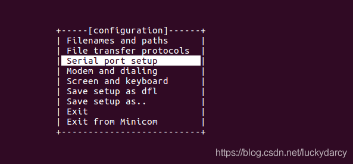
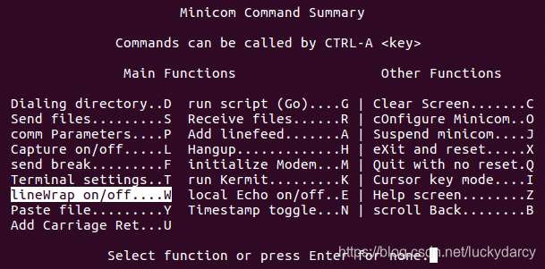
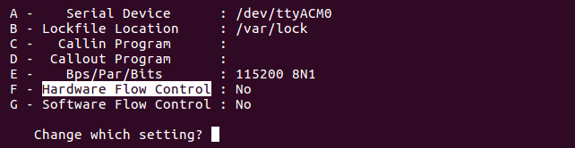

# minicom

Minicom 是 Linux 下一款常用的命令行串口调试工具。其功能与 Windows 下的超级终端相似，可以通过串口控制外部的硬件设备，通常用于对[嵌入式](https://so.csdn.net/so/search?q=%E5%B5%8C%E5%85%A5%E5%BC%8F&spm=1001.2101.3001.7020)设备进行管理。

在 [Ubuntu](https://so.csdn.net/so/search?q=Ubuntu&spm=1001.2101.3001.7020) 环境下，使用如下命令安装：

```shell
sudo apt-get install minicom
```

第一次使用会出现下面的提示：warnning:minicom [configuration](https://so.csdn.net/so/search?q=configuration&spm=1001.2101.3001.7020) file not found, using defaults

为方便使用，建议根据实际使用情况进行配置。

### 配置

使用前需要进行配置，执行 `sudo minicom -s`​，即可打开 minicom 并进入配置模式，使用方向键，选择需要配置的项目。



‍

#### 常用配置

使用 minicom 最常用的配置项是 **Serial port setup** ，回车进入配置，可以看到多个配置项，此时光标在最下方。

```shell
  +-----------------------------------------------------------------------+
  | A -    Serial Device      : /dev/ttyUSB0                              |
  | B - Lockfile Location     : /var/lock                                 |
  | C -   Callin Program      :                                           |
  | D -  Callout Program      :                                           |
  | E -    Bps/Par/Bits       : 115200 8N1                                |
  | F - Hardware Flow Control : No                                        |
  | G - Software Flow Control : No                                        |
  |                                                                       |
  |    Change which setting?                                              |
  +-----------------------------------------------------------------------+
```

需要修改某个配置，则输入对应的字母，光标即会跳转到对应的项，编辑后，回车确认，光标再次回到最下方。

一般而言，需要修改：

- **A 配置项**，指定串口设备。一般 USB 转串口会生成设备 `/dev/ttyUSBx`​，Arduino 和 ST-Link 则是 `/dev/ttyACMx`​，x 是数字序号。可以执行以下命令确认下：

  ```shell
  ls -l /dev/tty*
  ```
- **E 配置项**，根据实际情况，指定波特率等参数。
- **F 配置项**，硬件流控，要看你的设备是否有。如果没有，或者你不确定的话，可以先关掉，将默认的 Yes 切换为 No。

修改好之后，回车退到上一个界面，此时记得往下，选择 **Save setup as dfl** 将刚刚的修改保存为默认配置，避免下次使用还需要再次配置。

注意：选择 **Exit** 会退出配置界面，并使用该配置打开 minicom；选择 **Exit from Minicom** 则会直接退出 minicom。

#### 保存配置

如果针对某些串口设备有特殊的配置，可以选择 **Save setup as…**  将其配置保存下来，然后输入想要保存的名称。比如输入 test，则会在 /etc/minicom 目录下生成一个 minirc.test 文件。以后可以直接执行以下命令：

```shell
sudo minicom test
```

#### 配置权限

minicom 本身不需要 root 权限，但因为要打开串口设备 /dev/tty\* ，所以一般会需要使用 sudo 来启动 minicom。

当然我们可以直接修改下串口设备的权限，比如 `sudo chmod 666 /dev/ttyUSB0`​，这样以后就不用加 sudo 了。但这种方式太生硬了，因此推荐通过配置 udev 规则的方式来达到此目的。

- 修改配置文件，比如

  ```shell
  sudo vim /etc/udev/rules.d/70-ttyusb.rules
  ```
- 增加一行

  ```shell
  KERNEL=="ttyUSB[0-9]*", MODE="0666"
  ```
- 修改后，需要重新插拔设备，以重新生成设备节点。

### 常见问题

#### 1\. minicom 如何操作

minicom 使用前缀按键 Ctrl-A，即执行特殊操作时，都需要先按 Ctrl+A，再按某个按键使用对应的功能。

比如：

- 查看帮助：Ctrl+A，再按 Z 键。
- 退出窗口：Ctrl+A，再按 X 或 Q 键。

#### 2\. 如何换行显示

按 CTRL-A Z 进入设置页，找到 “lineWrap on/off” 项，按 W 键即可打开或关闭换行功能。

​​​​

#### 3\. 串口无法输入

串口有输出，但无法输入，通常是由于开启了硬件流控导致的。

按 CTRL-A Z 进入设置页，按 O 键选择 “cOnfigure Minicom”项，再选择“Serial port setup”项，按 F 键关闭 Hardware Flow Control。

​​​​

#### 4\. 如何打开指定设备

如果日常只用一个设备，设备名固定是 `/dev/ttyUSB0`​，那每次直接打开 minicom 即可。但是如果你需要打开多个串口设备，问题就来了。通常需要先查看下设备名，再用 `-D`​ 选项指定串口设备，例如：

```shell
minicom -D /dev/ttyUSB1
```

#### 5\. 如何保存调试记录

想要保存 minicom 的调试记录，可以使用 -C 参数指定保存 log 文件，例如：

```shell
minicom -C /tmp/minicom.log
```

#### 6\. 如何暂停输出

有时候窗口打印数据较多，我们需要暂停输出，以便于查看。按 Ctrl+A 即可暂停输出。

Ctrl+A 是 mimicom 的特殊功能前缀按键，但还有另一个很实用的作用，就是暂停屏幕输出。

#### 7\. 如何显示时间戳

按 Ctrl+A，再按 N，即可激活时间戳，minicom 将每行 log 前添加当前系统的时间戳。

#### 8\. 如何发送和接收文件

如果设备端支持的话，按下 Ctrl+A，再按 S，即可向设备端发送文件；按 Ctrl+A，再按 R，可接收文件。

#### 9\. 如何打开色彩支持

minicom 支持标准 ANSI 转义序列色彩，但默认关闭，需要使用 `-c on`​ 选项打开。

```shell
minicom -c on
```
