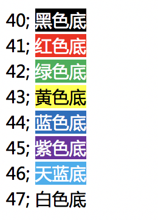

# shell echo

echo命令的功能是在显示器上显示一段文字，一般起到一个提示的作用。 功能说明:显示文字。

## 语法

```bash
echo [-ne][字符串]

#OPTIONS：
-n	不要在最后自动换行
-e	若字符串中出现以下字符，则特别加以处理，而不会将它当成一般文字输出:

-–help	显示帮助
-–version显示版本信息
```

补充说明

1、echo会将输入的字符串送往标准输出。  
2、输出的字符串间以空白字符隔开,并在最后加上换行号。

‍

### 转义字符

```bash
\a	发出警告声;
\b	删除前一个字符;
\t	插入tab;
\n	换行且光标移至行首;

\c	最后不加上换行符号;
\f	换行但光标仍旧停留在原来的位置;
\r	光标移至行首，但不换行;
\v	与\f相同;
\		插入\字符;
\0nnn	打印nnn(八进制)所代表的ASCII字符;  备注：数字0  不要理解成字母o
\xNN  打印NN(十六进制)所代表的ASCII字符;

#你的进制转换过关吗？
[root@zutuanxue ~]# echo -e "\0123"   #ot(123) = 83  对应ascii表的S
S
[root@zutuanxue ~]# echo -e "\x61"   #ox(61) = 97  对应ascii表的a
a
```

## 输出颜色字体

脚本中echo显示内容带颜色显示,echo显示带颜色，**需要使用参数-e**

```bash
echo -e "\033[文字背景颜色;文字颜色m字符串\033[控制选项" 

echo -e "\e[41;36mHello \e[46;35mWorld"
```

* **字背景颜色**​
* **文字颜色**​
* **控制选项**

  ```
  [0m 关闭所有属性 
  [1m 设置高亮度 
  [4m 下划线 
  [5m 闪烁 
  [7m 反显 
  [8m 消隐 
  [30m — \33[37m 设置前景色 
  [40m — \33[47m 设置背景色 
  [nA 光标上移n行 
  [nB 光标下移n行 
  [nC 光标右移n行 
  [nD 光标左移n行 
  [y;xH设置光标位置 
  [2J 清屏 
  [K 清除从光标到行尾的内容 
  [s 保存光标位置 
  [u 恢复光标位置 
  [?25l 隐藏光标 
  [?25h 显示光标
  ```

参考：[https://www.linuxshelltips.com/how-to-change-the-output-color-of-echo-in-linux/](https://www.linuxshelltips.com/how-to-change-the-output-color-of-echo-in-linux/)
