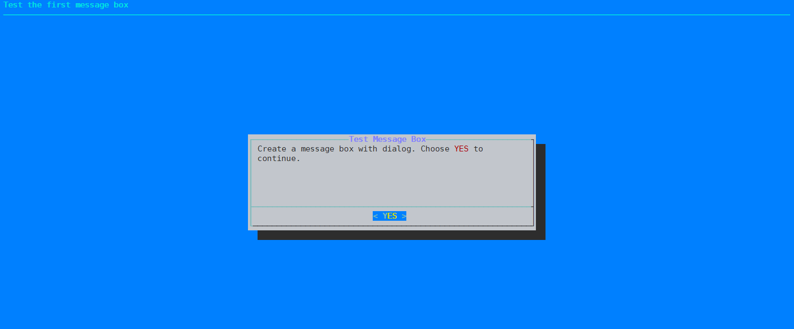
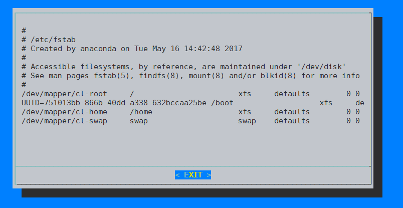
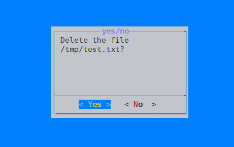
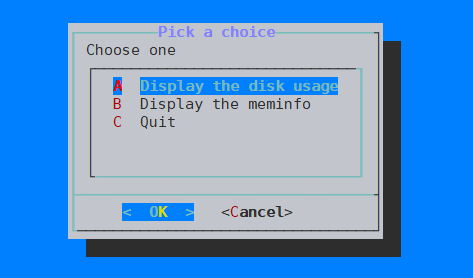
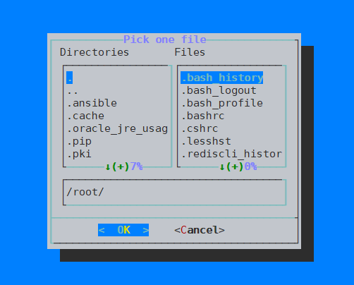
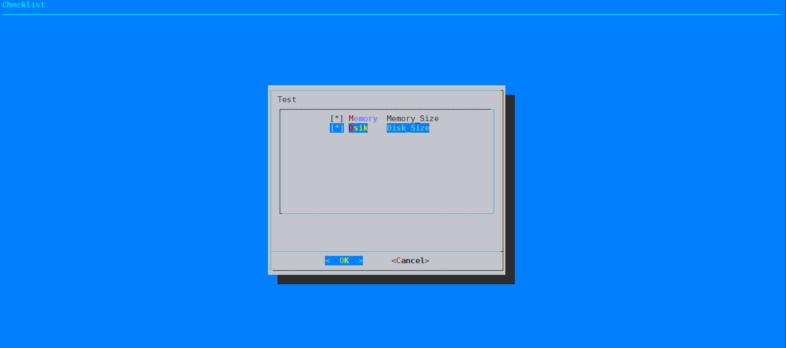
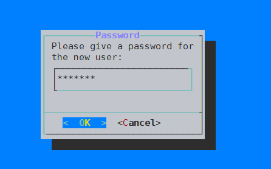
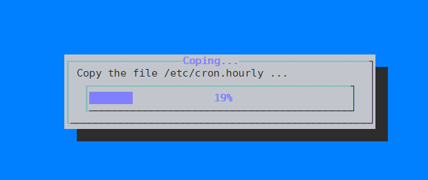

# 使用dialog创建交互式shell对话框 

* ​`dialog`​是一个可以创建对话框的工具，需要手动安装，yum源安装即可。
* 系统默认自带`whiptail`​也可实现对话框的创建
* 每个对话框提供的输出有两种形式：

  * 将所有输出到stderr，不显示到屏幕；
  * 使用退出状态码，OK为0，NO为1，ESC为255。

# 语法说明

```bash
Usage: dialog --common-options --boxType "Text" Height Width --box-specific-option
```

* ​`--common-options`​ 通用选项
* ​`--boxType`​ 窗体类型
* ​`"Text"`​窗体的标题
* ​`Height`​ 窗体的高度（字符个数）
* ​`Width`​ 窗体宽度（字符个数）

# 选项

## 通用选项

　　这个选项用来设置dialog box的背景、颜色和标题等。

* ​`--title <title>`​：窗体的标题
* ​`--backtitle <backtitle>`​：窗体的背景标题
* ​`--colors`​：使用颜色 `\Z`​表示开始，`\Zn`​表示结束。解读嵌入式`\Z`​的对话框中的特殊文本序列，序列由下面的字符0-7, b，B, u, U等组成，恢复正常的设置使用`\Zn`​。
* ​`--no-shadow`​：禁用窗体的阴影效果
* ​`--shadow`​：启用窗体的阴影效果
* ​`--insecure`​：输入部件的密码时，使用星号来代表每个字符。
* ​`--no-cancel`​：设置在输入框、菜单和复选框中不显`cancel`​项。
* ​`--nook`​ 没有ok键
* ​`--clear`​：完成清屏操作，在框体显示结束后，清除框体，这个参数只能单独使用，不能和别的参数联合使用。
* ​`--ok-label <str>`​：覆盖使用OK按钮标签，换做其它字符。
* ​`--cancel-label <str>`​：功能同上。
* ​`--begin <y> <x>`​：指定对话框左上角在屏幕上的坐标。
* ​`--timeout <secs>`​：超时（返回的错误代码），如果用户在指定的时间内没有给出相应动作，就按超时处理。
* ​`--defaultno`​：设定光标在yesno对话框的默认位置为no
* ​`--default-item string`​ ：设定在复选框中的默认值
* ​`--sleep <secs>`​：窗体的超时时间，如果用户没有在超时时间内进行选择，将会退出并返回一个错误码
* ​`--stderr`​：以标准错误方式输出。
* ​`--stdout`​：以标准方式输出。
* ​`--default-item <str>`​：设置在一份清单、表格或菜单中的默认项目，通常在框中的第一项是默认的。

## 窗体类型选项

　　常见的对话框控件选项如下所示：

* ​`--calendar`​：提供了一个日历，让你可以选择日期。
* ​`--checklist`​：允许你显示一个选项列表，每个选项都可以被单独的选择(复选框)。
* ​`--from`​：允许建立一个带标签的文本字段，并要求填写。
* ​`--fselect`​：提供一个路径，让你选择浏览的文件。
* ​`--gauge`​：显示一个表，呈现出完成的百分比，就是显示出进度。
* ​`--infobox`​：显示消息后，（没有等待响应）对话框立刻返回，但不清除屏幕(信息框)。
* ​`--inputbox`​：让用户输入文本(输入框)。
* ​`--inputmenu`​：提供一个可供用户编辑的菜单（可编辑的菜单框）。
* ​`--menu`​：显示一个列表供用户选择(菜单框)。
* ​`--msgbox`​：显示一条消息，并要求用户选择一个确定按钮(消息框)。
* ​`--pause`​：显示一个表格用来显示一个指定的暂停期的状态。
* ​`--passwordbox`​：显示一个输入框，它隐藏文本。
* ​`--passwordfrom`​：显示一个来源于标签并且隐藏的文本字段。
* ​`--radiolist`​：提供一个菜单项目组，只有一个项目，可以选择(单选框)。
* ​`--tailbox`​：在一个滚动窗口文件中使用tail命令来显示文本。
* ​`--tailboxbg`​：跟tailbox类似，但是在background模式下操作。
* ​`--textbox`​：在带有滚动条的文本框中显示文件的内容(文本框)。
* ​`--timebox`​：提供一个窗口，选择小时、分钟、秒。
* ​`--yesno`​：提供一个带有yes和no按钮的简单信息框(是/否框)。

# 使用示例

## 创建消息框

* 语法

  ```bash
  dialog --title "<message box title>" --msgbox "<text to show>" <height> <width>
  ```

* 实例

  ```bash
  dialog --backtitle "Test the first message box" --title "Test Message Box" --colors --ok-label "YES" --msgbox  "Create a message box with dialog. Choose \Z1YES\Zn to continue." 10 60
  ```

* 效果

  ​​

## 创建输入框

* 格式

  ```bash
  dialog --inputbox text height width
  ```

* 示例

  ```bash
  #!/bin/bash
  userName=$(dialog --backtitle "Add a user"  --title "Username" --inputbox "Please input a username" 10 30  --stdout)
  echo "Username is:" $userName
  ```

* 效果

  ​​

## 创建文本信息框

* 格式

  ```bash
  dialog --textbox file height width
  ```

* 示例

  ```bash
  dialog --textbox /etc/fstab 20 80
  ```

* 效果

  ​​

## 创建yesno对话框

* 格式

  ```bash
  dialog --yesno text height width
  ```

* 示例

  ```bash
  dialog --title "yes/no" --no-shadow --yesno "Delete the file /tmp/test.txt?" 10 30
  ```

* 效果

  ​​

## 创建一个菜单栏

* 格式

  ```bash
  dialog --menu text height width menu-height tag1 item1 tag2 item2 …
  ```

* 示例

  ```bash
  dialog --title "Pick a choice" --menu "Choose one" 12 35 5 A "Display the disk usage" B "Display the meminfo" C "Quit"
  # 进入菜单后按A、B、C可定位到某一个条目上，标准输出是tag
  ```

* 效果

  ​​

## 创建文件选框

* 格式

  ```bash
  dialog --fselect filepath height width
  ```

* 示例

  ```bash
  dialog --title "Pick one file" --fselect /root/ 7 40
  ```

* 效果

  ​​

## 创建复选框

* 格式

  ```bash
  dialog --checklist "Test" height width menu-height tag1 item1 tag2 item2 …
  ```

* 示例

  ```bash
  dialog --backtitle "Checklist" --checklist "Test" 20 50 10 Memory Memory_Size 1 Dsik Disk_Size 2
  ```

* 效果

  ​​

## 创建密码框

* 格式

  ```bash
  dialog --passwordbox text height width [init]
  ```

* 示例

  ```bash
  dialog --title "Password" --passwordbox "Please give a password for the new user:" 10 35
  ```

* 效果

  ​​

　　‍

## 创建一个进度框

* 格式

  ```bash
  dialog --gauge text height width  [<percent>]
  ```

* 示例

  ```bash
  #固定进度显示
  dialog --title "installation pro" --gauge "installation" 10 30 10
  #实时显示
  for i in {1..100} ;do echo $i;done | dialog --title "installation pro" --gauge "installation" 10 30
  ```

* ```bash
  # 拷贝100个文件
  #!/bin/bash

  declare -i percent=0
  install -cd /tmp/test

  (
  for file in /etc/*;do
      if [ ${percent} -le 100 ];then
          cp -r ${file} /tmp/test/ 2>/dev/null
          echo XXX
  		#  两个XXX之间的内容替换标题
          echo "Copy the file ${file} ... "
          echo XXX
          echo ${percent}
      fi
      ((percent=percent+1))
      sleep 0.1

  done
      ) | dialog --title "Coping..." --gauge "Starting to copy files ... " 6 50 0
  ```

* 效果

  ​​

　　‍
