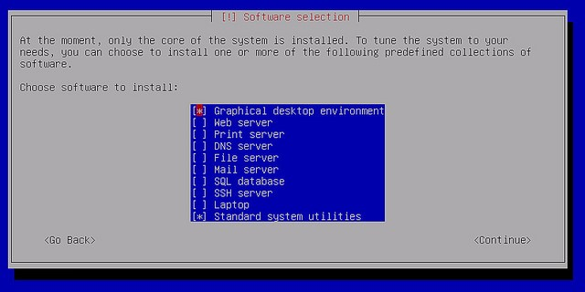
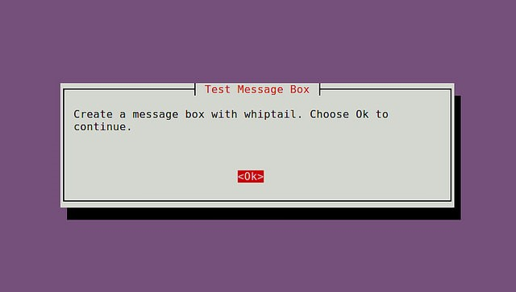
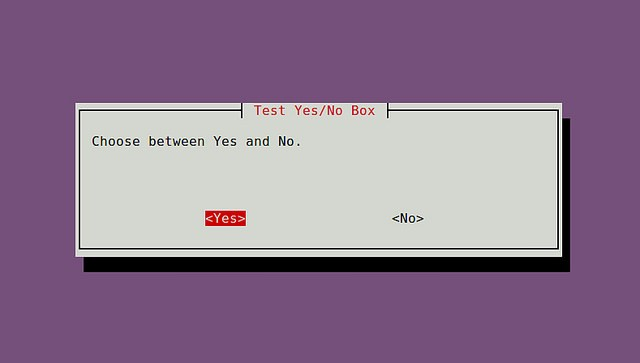
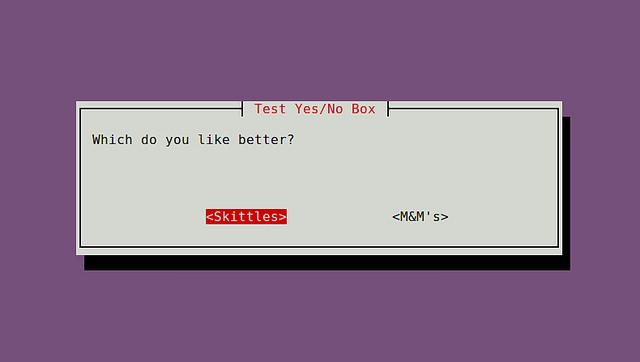
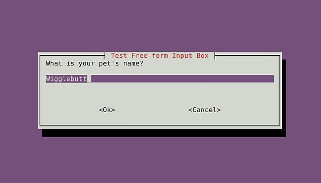
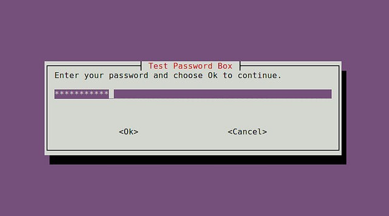
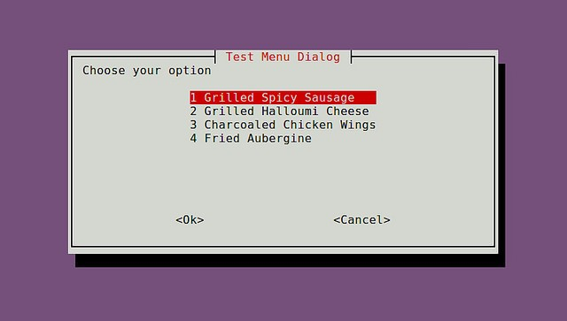
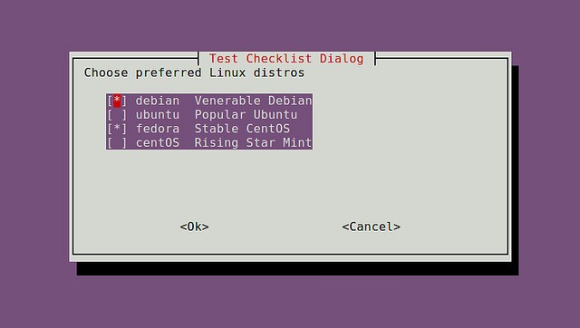
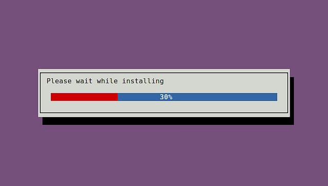

# 使用whiptail创建交互式shell对话框 

在终端环境下安装新的软件时，经常会看到信息对话框弹出，需要你的输入。对话框的类型有密码箱，检查表，菜单，等等。他们可以引导你以一种直观的方式输入必要的信息，使用这样的用户友好的对话框的好处是显而易见的。如下图所示：

​​

* 当你想要写一个交互式shell脚本时，你可以使用这样的对话框来接受用户的输入。whiptail可以在shell脚本中创建基于终端的对话框，消息框的过程，类似于Zenity或xdialog GUI脚本代码。预先安装在所有的Linux发布版本中。
* 相关链接: [https://en.wikibooks.org/wiki/Bash_Shell_Scripting/Whiptail](https://en.wikibooks.org/wiki/Bash_Shell_Scripting/Whiptail)

## 创建消息框

* 语法

  ```bash
  whiptail --title "<message box title>" --msgbox "<text to show>" <height> <width>
  ```

* 示例

  ```bash
  #!/bin/bash
  whiptail --title "Test Message Box" --msgbox "Create a message box with whiptail. Choose Ok to continue." 10 60
  ```

* 效果

  ​​

## 创建yes/no对话框

* 语法

  ```bash
  whiptail --title "<dialog box title>" --yesno "<text to show>" <height> <width>
  ```

* 示例

  ```bash
  if (whiptail --title "Test Yes/No Box" --yesno "Choose between Yes and No." 10 60) then
      echo "You chose Yes. Exit status was $?."
  else
      echo "You chose No. Exit status was $?."
  fi
  ```

* 效果

  ​​

  或者可以是“–yes-button” , “–no-button”选项。

  ```bash
  #!/bin/bash
  if (whiptail --title "Test Yes/No Box" --yes-button "Skittles" --no-button "M&M's"  --yesno "Which do you like better?" 10 60) then
      echo "You chose Skittles Exit status was $?."
  else
      echo "You chose M&M's. Exit status was $?."
  fi
  ```

  ​​

## 创建一个表单输入框

如果你想用户输入任意的文本，您可以使用一个输入框。

* 语法

  ```bash
  whiptail --title "<input box title>" --inputbox "<text to show>" <height> <width> <default-text>
  ```

* 示例

  ```bash
  #!/bin/bash
  PET=$(whiptail --title "Test Free-form Input Box" --inputbox "What is your pet's name?" 10 60 Wigglebutt 3>&1 1>&2 2>&3)
  exitstatus=$?
  if [ $exitstatus = 0 ]; then
      echo "Your pet name is:" $PET
  else
      echo "You chose Cancel."
  fi
  ```

* 效果

  ​​

## 创建一个密码框

当用户需要输入敏感信息时密码框是有用的。

* 语法

  ```bash
  whiptail --title "<password box title>" --passwordbox "<text to show>" <height> <width>
  ```

* 实例

  ```bash
  #!/bin/bash
  PASSWORD=$(whiptail --title "Test Password Box" --passwordbox "Enter your password and choose Ok to continue." 10 60 3>&1 1>&2 2>&3)
  exitstatus=$?
  if [ $exitstatus = 0 ]; then
      echo "Your password is:" $PASSWORD
  else
      echo "You chose Cancel."
  fi
  ```

* 效果

  ​​

## 创建一个菜单栏

当你想让用户选择一个任意数量的选择中，你可以使用菜单框。

* 语法

  ```bash
  whiptail --title "<menu title>" --menu "<text to show>" <height> <width> <menu height> [ <tag> <item> ] . . .
  ```

* 实例

  ```bash
  #!/bin/bash
  OPTION=$(whiptail --title "Test Menu Dialog" --menu "Choose your option" 15 60 4 \
  "1" "Grilled Spicy Sausage" \
  "2" "Grilled Halloumi Cheese" \
  "3" "Charcoaled Chicken Wings" \
  "4" "Fried Aubergine"  3>&1 1>&2 2>&3)
  exitstatus=$?
  if [ $exitstatus = 0 ]; then
      echo "Your chosen option:" $OPTION
  else
      echo "You chose Cancel."
  fi
  ```

* 效果

  ​​

## 创建radiolist单选对话框

* 语法

  ```bash
  whiptail --title "<radiolist title>" --radiolist "<text to show>" <height> <width> <list height> [ <tag> <item> <status> ] . . .
  ```

* 实例

  ```bash
  #!/bin/bash
  DISTROS=$(whiptail --title "Test Checklist Dialog" --radiolist \
  "What is the Linux distro of your choice?" 15 60 4 \
  "debian" "Venerable Debian" ON \
  "ubuntu" "Popular Ubuntu" OFF \
  "centos" "Stable CentOS" OFF \
  "mint" "Rising Star Mint" OFF 3>&1 1>&2 2>&3)
  exitstatus=$?
  if [ $exitstatus = 0 ]; then
      echo "The chosen distro is:" $DISTROS
  else
      echo "You chose Cancel."
  fi
  ```

* 效果

  ​​

## 创建一个表对话框

当你想让用户选择一个列表中选择多个选项的清单对话框是有用的，radiolist对话框，只允许选择一个。

* 语法

  ```bash
  whiptail --title "<checklist title>" --checklist "<text to show>" <height> <width> <list height> [ <tag> <item> <status> ] . . .
  ```

* 实例

  ```bash
  #!/bin/bash
  DISTROS=$(whiptail --title "Test Checklist Dialog" --checklist \
  "Choose preferred Linux distros" 15 60 4 \
  "debian" "Venerable Debian" ON \
  "ubuntu" "Popular Ubuntu" OFF \
  "centos" "Stable CentOS" ON \
  "mint" "Rising Star Mint" OFF 3>&1 1>&2 2>&3)
  exitstatus=$?
  if [ $exitstatus = 0 ]; then
      echo "Your favorite distros are:" $DISTROS
  else
      echo "You chose Cancel."
  fi
  ```

* 效果

  ​​

## 创建一个进度条

进度条是一个用户友好的对话框。whiptail从标准输入读取一个百分数（0～100），显示一个表内相应的计数。

* 语法

  ```bash
  whiptail --gauge "<test to show>" <height> <width> <inital percent>
  ```

* 示例

  ```bash
  #!/bin/bash
  {
      for ((i = 0 ; i <= 100 ; i+=20)); do
          sleep 1
          echo $i
      done
  } | whiptail --gauge "Please wait while installing" 6 60 0
  ```

* 效果

  ​​
