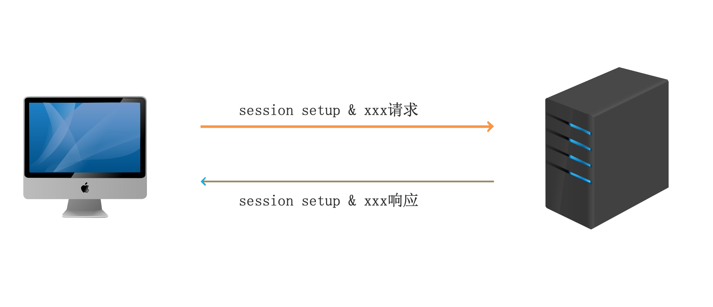
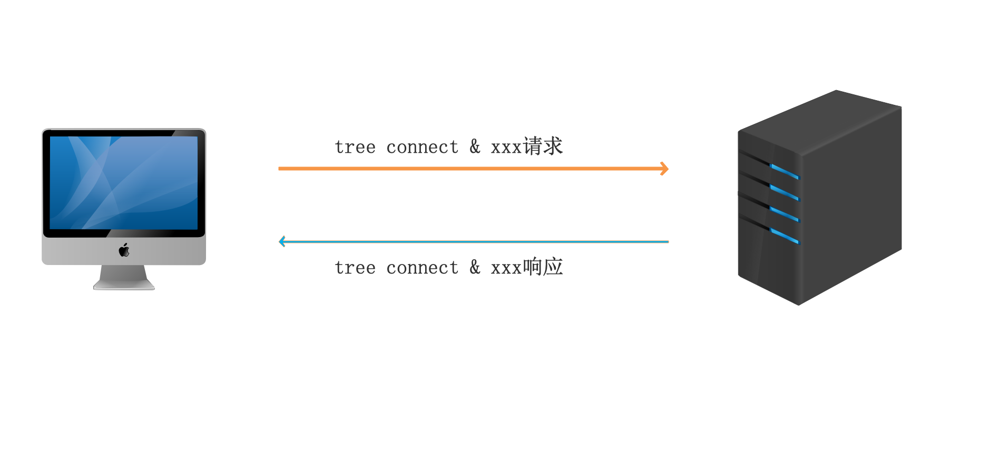
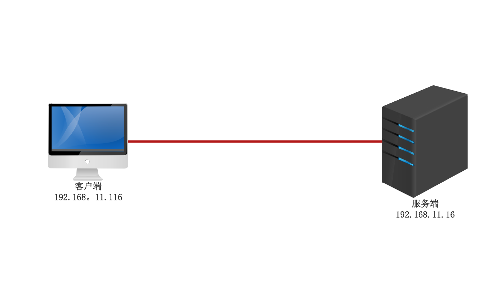
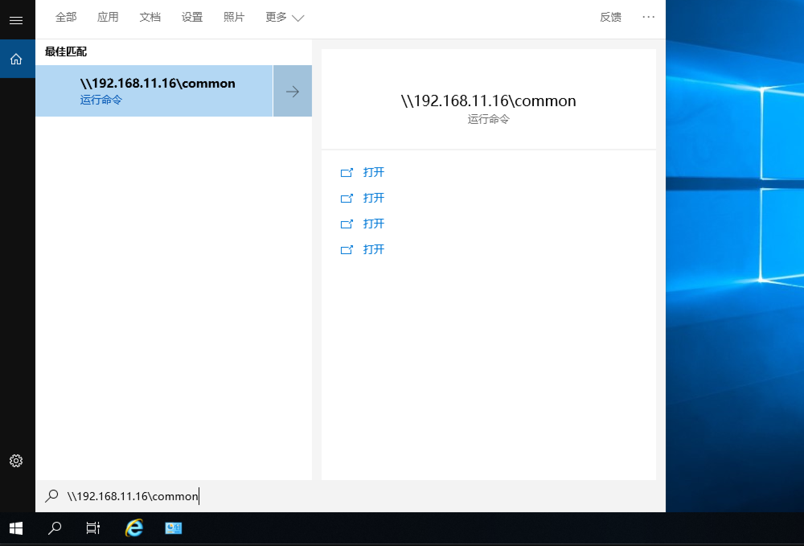
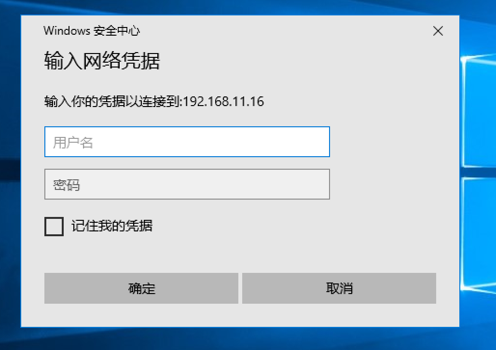
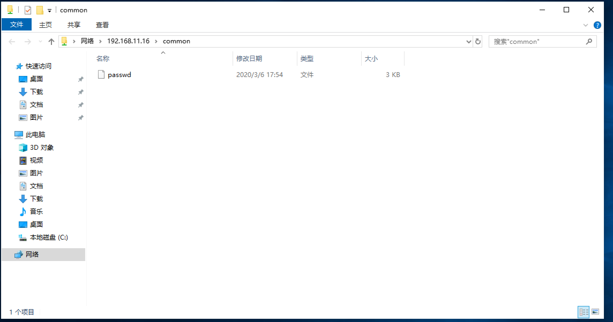

# Samba

## 一、samba介绍

在早期的网络世界当中，不同主机的文件传输大多使用FTP来进行。不过FTP却有个小小的问题， 那就是你无法直接修改主机上面的文件内容！也就是说，你想要更改Linux主机上面的某个文件时，你必须要将该文件下载后才能修改。在日常办公环境中，操作系统除了windows以外，还有linux或者UNIX。windows和linux或UNIX之间共享文件是无法直接完成的，为了解析不同系统之间的文件和打印机等资源的共享，我们今天来介绍一下samba服务。他可以解决不同系统平台之间的共享问题。

Samba是在Linux和UNIX系统上实现SMB协议的一个免费软件，由服务器及客户端程序构成，也是一个C/S软件。

```
 SMB（Server Messages Block，信息服务块）是一种在局域网上共享文件和打印机的一种通信协议，它为局域网内的不同计算机之间提供文件及打印机等资源的共享服务。SMB协议是客户机/服务器型协议，客户机通过该协议可以访问服务器上的共享文件系统、打印机及其他
```

### 应用场景

**文件与打印机共享：** samba的主要功能，samba进程实现资源共享，将文件和打印机甚至是设备（如：CDROM）发布到网络中，以供用户访问

**身份验证和权限验证：** 对用户身份进行验证及权限设置，通过加密的方式保护共享文件和打印机

**名称解析：** 通过nmbd服务实现名称解析，将NetBIOS名称解析为IP地址

**浏览服务：** 在局域中，samba可以成为本地主浏览器，保存可用

资源列表，当用户访问时，会提供浏览列表

### SAMBA与NetBIOS

samba是构建在NetBIOS这个协议之上的，而NetBIOS最早是从IBM诞生的，目的是让局域网内的计算机能够进行网络连接，由于不是针对于大型网络，所以NetBIOS是无法跨路由的。而windows操作系统也支持这个协议，所以在Linux主机上使用SAMBA部署的共享服务是可以使用windows主机访问的。那么SAMBA是不是就不能跨路由提供服务了呢？并不是，我们可以通过一个叫NetBIOS over TCP/IP的技术实现跨路由的SAMBA服务，但是目前SAMBA还是在局域网用的较多

### SAMBA的相关守护进程

**nmbd**：使用UDP的137、138来提供名称解析服务（NetBIOS）

**smbd**：管理共享和数据传输，使用的端为TCP的139、445

### SAMBA的工作流程

1、协议协商


客户端在访问服务器时，发送negprot请求，告知服务器自己所支持的SMB类型，samba服务器根据客户端的情况，选择最优的SMB类型并作出回应

2、建立连接


当SMB类型确认后，客户端会发送session setup指令数据包，提交账号和密码，请求与samba服务器建立连接，如果客户端通过身份验证，服务器会作出回应，并为用户分配一个唯一的UID，在客户端与服务器通信时使用。

3、访问共享资源



当客户端需要访问共享资源时，会发送tree connect数据包，告知服务器需要访问的共享资源的名称，如果设置允许，samba服务器会为每个客户端与共享资源连接分配一个TID(线程标识符)，客户端就可以访问相应的共享资源

4、断开连接


共享使用完毕，客户端向服务器发送tree disconnect报文关闭对共享的访问，与服务器断开连接

### 相关软件包

samba 主程序包，服务端需要

samba-client 客户端工具包

samba-common 通用工具和库文件，客户端服务器端都需要安装

### 相关文件

- /etc/samba/smb.conf 主配置文件
- /etc/samba/smb.conf.example 模板文件
- /var/log/samba/log.nmbd nmbd进程的解析信息
- /var/log/samba/log.smbd 记录用户的访问记录、服务器的问题

## 二、samba安装部署

a、安装软件包

```
[root@node1 ~]# dnf install samba samba-client  -y
```

b、设置服务开机启动

```
[root@node1 ~]# systemctl enable nmb.service smb.service 
Created symlink /etc/systemd/system/multi-user.target.wants/nmb.service → /usr/lib/systemd/system/nmb.service.
Created symlink /etc/systemd/system/multi-user.target.wants/smb.service → /usr/lib/systemd/system/smb.service.
```

c、开启服务

```
[root@node1 ~]# systemctl start nmb smb
```

## 三、samba配置文件详解

主配文件路径: /etc/samba/smb.conf

模板文件：/etc/samba/smb.conf.example

```
[root@baism ~]# cat smb.conf.example 
# This is the main Samba configuration file. For detailed information about the
# options listed here, refer to the smb.conf(5) manual page. Samba has a huge
# number of configurable options, most of which are not shown in this example.
#
# The Samba Wiki contains a lot of step-by-step guides installing, configuring,
# and using Samba:
# https://wiki.samba.org/index.php/User_Documentation
#
# In this file, lines starting with a semicolon (;) or a hash (#) are
# comments and are ignored. This file uses hashes to denote commentary and
# semicolons for parts of the file you may wish to configure.
#
# NOTE: Run the "testparm" command after modifying this file to check for basic
# syntax errors.
#
#---------------
#
SAMBA selinux相关设置，如果你开启了selinux，请注意下面的说明
#
#
#Security-Enhanced Linux (SELinux) Notes:
#
# Turn the samba_domain_controller Boolean on to allow a Samba PDC to use the
# useradd and groupadd family of binaries. Run the following command as the
# root user to turn this Boolean on:
如果你在域环境中使用samba那么请设置下面的bool值
# setsebool -P samba_domain_controller on
#
# Turn the samba_enable_home_dirs Boolean on if you want to share home
# directories via Samba. Run the following command as the root user to turn this
# Boolean on:
#
假如希望通过samba共享用户家目录请设置下面的bool值
# setsebool -P samba_enable_home_dirs on
#
# If you create a new directory, such as a new top-level directory, label it
# with samba_share_t so that SELinux allows Samba to read and write to it. Do
# not label system directories, such as /etc/ and /home/, with samba_share_t, as
# such directories should already have an SELinux label.
#
加入你想将目录通过samba共享，请确认其目录标签为sambe_share_t
# Run the "ls -ldZ /path/to/directory" command to view the current SELinux
# label for a given directory.
#
# Set SELinux labels only on files and directories you have created. Use the
# chcon command to temporarily change a label:
标签设置方法
# chcon -t samba_share_t /path/to/directory
#
# Changes made via chcon are lost when the file system is relabeled or commands
# such as restorecon are run.
#
# Use the samba_export_all_ro or samba_export_all_rw Boolean to share system
# directories. To share such directories and only allow read-only permissions:
对共享目录的权限的bool设置，只读或读写
# setsebool -P samba_export_all_ro on
# To share such directories and allow read and write permissions:
# setsebool -P samba_export_all_rw on
#
# To run scripts (preexec/root prexec/print command/...), copy them to the
# /var/lib/samba/scripts/ directory so that SELinux will allow smbd to run them.
# Note that if you move the scripts to /var/lib/samba/scripts/, they retain
# their existing SELinux labels, which may be labels that SELinux does not allow
# smbd to run. Copying the scripts will result in the correct SELinux labels.
# Run the "restorecon -R -v /var/lib/samba/scripts" command as the root user to
# apply the correct SELinux labels to these files.
#
#--------------
#
#======================= Global Settings =====================================
全局设置，对整个服务都生效
[global]


网络设置
# ----------------------- Network-Related Options -------------------------
#
# workgroup = the Windows NT domain name or workgroup name, for example, MYGROUP.
#
# server string = the equivalent of the Windows NT Description field.
#
# netbios name = used to specify a server name that is not tied to the hostname,
#                maximum is 15 characters.
#
# interfaces = used to configure Samba to listen on multiple network interfaces.
# If you have multiple interfaces, you can use the "interfaces =" option to
# configure which of those interfaces Samba listens on. Never omit the localhost
# interface (lo).
#
# hosts allow = the hosts allowed to connect. This option can also be used on a
# per-share basis.
#
# hosts deny = the hosts not allowed to connect. This option can also be used on
# a per-share basis.
#
定义计算机的工作组,如果希望和windows共享，可以设置为workgroup，这样就可以在windows的网上邻居中找到linux计算机
    workgroup = MYGROUP
对samba服务器的描述信息
    server string = Samba Server Version %v
设置netbios计算机名称
;    netbios name = MYSERVER

samba使用本机的那块网卡
;    interfaces = lo eth0 192.168.12.2/24 192.168.13.2/24
允许那个网段访问samba服务器共享，还可以使用“hosts deny”设置禁止的网段，“hosts allow”的优先级高，表现形式可以是具体的IP地址和域名，还可以是*、？、local、all，也可以使用EXCEPT排除
如：hosts allow = 192.168.0. EXCEPT 192.168.0.100
;    hosts allow = 127. 192.168.12. 192.168.13.

#
日志选项
# --------------------------- Logging Options -----------------------------
#
# log file = specify where log files are written to and how they are split.
#
# max log size = specify the maximum size log files are allowed to reach. Log
# files are rotated when they reach the size specified with "max log size".
#
samba日志文件路径，%m表示客户端的NetBios名称，还有其它的变量，可以使用man smb.conf通过man手册去查看
    # log files split per-machine:
    log file = /var/log/samba/log.%m
日志文件大小，0为不限制，注意不建议这样设置
    # maximum size of 50KB per log file, then rotate:
    max log size = 50

独立服务选项
# ----------------------- Standalone Server Options ------------------------
#
# security = the mode Samba runs in. This can be set to user, share
# (deprecated), or server (deprecated).
#
# passdb backend = the backend used to store user information in. New
# installations should use either tdbsam or ldapsam. No additional configuration
# is required for tdbsam. The "smbpasswd" utility is available for backwards
# compatibility.
#
samba安全级别
share:  不需要账号密码，公开共享
user:   需要提供samba账号密码才能访问共享，私密共享
server：依靠其他Windows NT/2000或Samba Server来验证用户的账号和密码,是一种代理验证。此种安全模式下,系统管理员可以把所有的Windows用户和口令集中到一个NT系统上,>使用Windows NT进行Samba认证, 远程服务器可以自动认证全部用户和口令,如果认证失败,Samba会使用user级别。
domain：如果samba服务器加入到域环境中，验证工作由域控制器完成。
ads：具备domain级别的所有功能，并且具备域控制器功能
auto:安全级别会受“server role”字段的值影响，“server role”字段默认值为auto（用户通过验证后可以使用），其余的参数决定了samba服务器加入到window域环境中的角色是成员还是域控制器


一般情况下我们使用share和user的比较多，除非公司有完整的域环境
    security = user

用户及密码的管理方式，有三种smbpasswd、tdbsam、ldapsam
smbpasswd:使用samba自带的工具smbpasswd命令为用户（真实用户或虚拟用户）设置密码，密码默认存放在/var/lib/samba/private/smbpasswd文件中，也可以使用“
smb passwd file = /etc/samba/smbpasswd"指定密码文件位置
			smbpasswd	-a username	添加一个用户/修改用户密码
			smbpasswd -d username	禁用用户
			smbpasswd -e username	启用用户
			smbpasswd -x username	删除用户
tdbsam：在/var/lib/samba/private建立一个passdb.tdb存放密码，也可以使用“smb passwd file”字段指定存放位置，除了可以使用smbpasswd命令管理用户之外，还可以使用pdbedit命令指定，而且只能是系统用户（真实用户），用户的建立可以使用mksmbpasswd命令建立一个smbpasswd文件，再使用pdbedit将文件里的用户导入数据库
cat /etc/passwd | mksmbpasswd > /etc/samba/smbpasswd
pdbedit -i smbpasswd:/etc/samba/smbpasswd

额外的用法
pdbedit -a username：新建Samba账户。
pdbedit -x username：删除Samba账户。
pdbedit -L：列出Samba用户列表，读取passdb.tdb数据库文件。
pdbedit -Lv：列出Samba用户列表的详细信息。
pdbedit -c “[D]” –u username：禁用该Samba用户的账号。
pdbedit -c “[]” –u username：恢复该Samba用户的账号。


ldapsam：基于LDAP的认证方式，首先要有LDAP服务，并且加入到LDAP中
			
    passdb backend = tdbsam


域成员选项
# ----------------------- Domain Members Options ------------------------
#
# security = must be set to domain or ads.
#
# passdb backend = the backend used to store user information in. New
# installations should use either tdbsam or ldapsam. No additional configuration
# is required for tdbsam. The "smbpasswd" utility is available for backwards
# compatibility.
#
# realm = only use the realm option when the "security = ads" option is set.
# The realm option specifies the Active Directory realm the host is a part of.
#
# password server = only use this option when the "security = server"
# option is set, or if you cannot use DNS to locate a Domain Controller. The
# argument list can include My_PDC_Name, [My_BDC_Name], and [My_Next_BDC_Name]:
#
# password server = My_PDC_Name [My_BDC_Name] [My_Next_BDC_Name]
#
# Use "password server = *" to automatically locate Domain Controllers.
#设置域共享
;    security = domain
;    passdb backend = tdbsam
#定义域名称
;    realm = MY_REALM
#域验证服务器
;    password server = <NT-Server-Name>


#域控选项
# ----------------------- Domain Controller Options ------------------------
#
# security = must be set to user for domain controllers.
#
# passdb backend = the backend used to store user information in. New
# installations should use either tdbsam or ldapsam. No additional configuration
# is required for tdbsam. The "smbpasswd" utility is available for backwards
# compatibility.
#
# domain master = specifies Samba to be the Domain Master Browser, allowing
# Samba to collate browse lists between subnets. Do not use the "domain master"
# option if you already have a Windows NT domain controller performing this task.
#
# domain logons = allows Samba to provide a network logon service for Windows
# workstations.
#
# logon script = specifies a script to run at login time on the client. These
# scripts must be provided in a share named NETLOGON.
#
# logon path = specifies (with a UNC path) where user profiles are stored.
#
#
;    security = user
;    passdb backend = tdbsam

让samba成为域的主浏览器
;    domain master = yes
允许samba为windows提供网络登录服务
;    domain logons = yes


    # the following login script name is determined by the machine name
    # (%m):
定义客户端在登录时要执行的脚本
;    logon script = %m.bat
    # the following login script name is determined by the UNIX user used:
;    logon script = %u.bat
定义记录用户个性化信息的文件存放的位置，空值表示禁用个性化设置
;    logon path = \\%L\Profiles\%u
    # use an empty path to disable profile support:
;    logon path =

    # various scripts can be used on a domain controller or a stand-alone
    # machine to add or delete corresponding UNIX accounts:
定义做为域控时，针对于用户和主机的添加、删除时需要执行的具体操作
;    add user script = /usr/sbin/useradd "%u" -n -g users
;    add group script = /usr/sbin/groupadd "%g"
;    add machine script = /usr/sbin/useradd -n -c "Workstation (%u)" -M -d /nohome -s /bin/false "%u"
;    delete user script = /usr/sbin/userdel "%u"
;    delete user from group script = /usr/sbin/userdel "%u" "%g"
;    delete group script = /usr/sbin/groupdel "%g"


这些设置选项主要用于SMB网络中进行浏览时，设置samba服务器的行为。缺省情况不让 samba服务器参加broswser的推举过程，为了使得samba服务器能成为browser，就需要设定local master =yes。然后samba服务就可以根据os level设置的权重进行推举，缺省的os level为0，这个权重不会赢得推举。但可以取消注释，将os level设置为33，这将在与所有Windows计算机（包括Windows NT）的推举竞赛中获得胜利，因为NT server的权重为32。设置比33更高的权重，只是在不同的samba 服务器之间进行选择时才有意义。
#
preferred master  可以设置自己优先成为浏览服务器候选人
#
# ----------------------- Browser Control Options ----------------------------
#
# local master = when set to no, Samba does not become the master browser on
# your network. When set to yes, normal election rules apply.
#
# os level = determines the precedence the server has in master browser
# elections. The default value should be reasonable.
#
# preferred master = when set to yes, Samba forces a local browser election at
# start up (and gives itself a slightly higher chance of winning the election).
#
;    local master = no
;    os level = 33
;    preferred master = yes

#
#
wins服务，如果网络中配置了wins服务器可以在此设置wins相关项
#----------------------------- Name Resolution -------------------------------
#
# This section details the support for the Windows Internet Name Service (WINS).
#
# Note: Samba can be either a WINS server or a WINS client, but not both.
#
# wins support = when set to yes, the NMBD component of Samba enables its WINS
# server.
#
# wins server = tells the NMBD component of Samba to be a WINS client.
#
# wins proxy = when set to yes, Samba answers name resolution queries on behalf
# of a non WINS capable client. For this to work, there must be at least one
# WINS server on the network. The default is no.
#
# dns proxy = when set to yes, Samba attempts to resolve NetBIOS names via DNS
# nslookups.
设置nmb进程支持wins服务
;    wins support = yes
设置wins服务器ip
;    wins server = w.x.y.z
设置wins代理IP
;    wins proxy = yes
设置Samba服务器是否在无法联系WINS服务器时通过DNS去解析主机的NetBIOS名
;    dns proxy = yes


该部分包括Samba服务器打印机相关设置
# --------------------------- Printing Options -----------------------------
#
# The options in this section allow you to configure a non-default printing
# system.
#
# load printers = when set you yes, the list of printers is automatically
# loaded, rather than setting them up individually.
#
# cups options = allows you to pass options to the CUPS library. Setting this
# option to raw, for example, allows you to use drivers on your Windows clients.
#
# printcap name = used to specify an alternative printcap file.
#
是否启用共享打印机
    load printers = yes
    cups options = raw
打印机配置文件
;    printcap name = /etc/printcap
    # obtain a list of printers automatically on UNIX System V systems:
;    printcap name = lpstat
打印机的系统类型,现在支持的打印系统有：bsd, sysv, plp, lprng, aix, hpux, qnx,cups
;    printing = cups


该部分包括Samba服务器如何保留从Windows客户端复制或移动到Samba服务器共享目录文件的Windows文件属性的相关配置.
# --------------------------- File System Options ---------------------------
#
# The options in this section can be un-commented if the file system supports
# extended attributes, and those attributes are enabled (usually via the
# "user_xattr" mount option). These options allow the administrator to specify
# that DOS attributes are stored in extended attributes and also make sure that
# Samba does not change the permission bits.
#
# Note: These options can be used on a per-share basis. Setting them globally
# (in the [global] section) makes them the default for all shares.

当Windows客户端将文件复制或移动到Samba服务器共享目录时，是否保留文件在Windows中的存档属性。默认no。
;    map archive = no
当Windows客户端将文件复制或移动到Samba服务器共享目录时，是否保留文件在Windows中的隐藏属性。默认no。
;    map hidden = no
当Windows客户端将文件复制或移动到Samba服务器共享目录时，是否保留文件在Windows中的只读属性。默认为no。
;    map read only = no
当Windows客户端将文件复制或移动到Samba服务器共享目录时，是否保留文件在Windows中的系统文件属性。默认为no。
;    map system = no
当Windows客户端将文件复制或移动到Samba服务器共享目录时，是否保留文件在Windows中的相关属性（只读、系统、隐藏、存档属性）。默认为yes。
;    store dos attributes = yes


共享设置
#============================ Share Definitions ==============================
#用户家目录共享
#共享名称
[homes]
描述
    comment = Home Directories
是否为隐藏共享
    browseable = no
是否允许写入
    writable = yes
允许访问该共享资源的smb用户，@组
;    valid users = %S
;    valid users = MYDOMAIN\%S

打印机共享
[printers]
描述
    comment = All Printers
路径
    path = /var/spool/samba
是否可浏览，no类似隐藏共享
    browseable = no
是否支持guest访问，和public指令类似    
    guest ok = no
是否可写
    writable = no
是否允许打印
    printable = yes


# Un-comment the following and create the netlogon directory for Domain Logons:
;    [netlogon]
;    comment = Network Logon Service
;    path = /var/lib/samba/netlogon
;    guest ok = yes
;    writable = no
;    share modes = no

# Un-comment the following to provide a specific roaming profile share.
# The default is to use the user's home directory:
;    [Profiles]
;    path = /var/lib/samba/profiles
;    browseable = no
;    guest ok = yes

# A publicly accessible directory that is read only, except for users in the
# "staff" group (which have write permissions):
;    [public]
;    comment = Public Stuff
;    path = /home/samba
;    public = yes
;    writable = no
;    printable = no
定义允许哪些smb用户写入，+和@表示一个组
;    write list = +staff
```

## 四、samba文件共享案例

拓扑图



环境：两台安装CentOS8的主机，关闭selinux，关闭防火墙

**案例需求:**

1)、新建文件夹/common

2)、在server上配置SMB服务

3)、您的 SMB 服务器必须是 workgroup 工作组的一个成员

4)、共享 /common 目录 共享名必须为 common

5)、只有 192.168.11.0网段内的客户端可以访问 common 共享

6）、common 必须是可以浏览的

7）、用户hello 必须能够读取共享中的内容，如果需要的话，验证的密码是 hello

8）、用户 test 必须能够拥有写权限，如果需要的话，验证的密码是 test

a、创建共享目录

```
[root@node1 ~]# mkdir /common
```

b、设置共享目录权限，因为默认权限是755除了管理员外，其他人只能读不能写，本实验中要求test能写，所以其他人加写权限。在samba中共享目录的权限除了看samba服务的设置之外，还要看系统的权限设置，系统针对于权限不一致的处理方式是取交集。所以各位在建立共享时一定要注意权限方面的问题

```
[root@node1 ~]# chmod 757 /common
[root@node1 ~]# cd /etc/samba/
[root@node1 ~]# vim /etc/samba/smb.conf
# read the smb.conf manpage.
# Run 'testparm' to verify the config is correct after
# you modified it.

[global]
    #设置工作组为workgroup
    workgroup = workgroup
    security = user

    passdb backend = tdbsam

    printing = cups
    printcap name = cups
    load printers = yes
    cups options = raw

[homes]
    comment = Home Directories
    valid users = %S, %D%w%S
    browseable = no
    read only = no
    inherit acls = yes

[printers]
    comment = All Printers
    path = /var/tmp
    printable = yes
    create mask = 0600
    browseable = no

#共享设置，参考配置文件详解理解以下选项
[common]
    comment = samba file share test
    path = /common	#绝对路径
    browseable = yes
    hosts allow  = 192.168.11.0/255.255.255.0
    valid users = hello,test
    writable = no
    write list = test
    public = no 
```

c、重启服务生效

```
[root@node1 ~] systemctl restart smb nmb
```

d、创建samba用户
使用useradd命令创建hello和test用户并设置密码

```
[root@node1 ~]# smbpasswd -a hello
New SMB password:
Retype new SMB password:
[root@node1 ~]# smbpasswd -a test
New SMB password:
Retype new SMB password:
```

**共享指令拓展**

```
valid users 指定能够进入此资源的特定用户和组
invalid users 指定不能够使用该共享资源的用户和组
read list 指定只能读取该共享资源的用户和组。 
write list 指定能读取和写该共享资源的用户和组。 
admin list 指定能管理该共享资源（包括读写和权限赋予等）的用户和组。 
public 指明该共享资源是否能给游客帐号访问，这个开关有时候也叫guest ok，所以有的配置文件中出现guest ok = yes其实和public = yes是一样的。 
hide dot files 指明是不是像unix那样隐藏以“.”号开头的文件。 
create mask 指明新建立的文件的属性，一般是0755。 
directory mode 指明新建立的目录的属性，一般是0755。 
sync always 指明对该共享资源进行写操作后是否进行同步操作。 
preserve case 指明保持大小写。yes/no 
case sensitive 指明是否对大小写敏感，一般选no,不然可能引起错误。 
default case 指明缺省的文件名是全部大写还是小写。upper/lower 
force user 强制把建立文件的属主是谁。如果我有一个目录，让来宾用户可以写，那么来宾用户就可以删除，如果我用 force user=王老师 强制建立文件的属主是 王老师 ，同时限制create mask=0755，这样来宾用户就不能删除了
wide links 指明是否允许共享外符号连接，比如共享资源里面有个连接指向非共享资源里面的文件或者目录，如果设置wide links = no将使该连接不可用。 
max connections = n 设定同时连接数是n。 
delete readonly 指明能否删除共享资源里面已经被定义为只读的文件
```

## 五、共享案例-客户端访问共享

创建好了共享了，如果用户希望访问samba共享，windows用户通过网上邻居或者在运行中输出[\IP\共享名]的方式访问samba共享，也可以通过网络映射的方式将共享挂载的本地。linux或者UNIX用户则可以使用samba提供的客户端smbclient或者通过CIFS协议将共享挂载到本地。

**smbclient 客户端命令**

```
smbclient - 类似FTP操作方式的访问SMB/CIFS服务器资源的客户端
常用命令选项
-L     此选项允许你查看服务器上可以获得的服务资源
-U|--user=username[%password]  这个参数指定程序联接时使用的用户名或者用户名和密码，如果没指定%password，将提示用户输入。
-W|--workgroup=domain   设置用户名的SMB域。这个选项越过了smb.conf配置文件中的默认域。
-N     如果指定了这个选项，就会省略通常的口令提示。当访问无需口令的服务资源时它很有用。
```

**任务需求**
linux下访问samba共享

a、客户端信息

```
[root@slave ~]# ifconfig ens33
ens33: flags=4163<UP,BROADCAST,RUNNING,MULTICAST>  mtu 1500
        inet 192.168.11.116  netmask 255.255.255.0  broadcast 192.168.11.255
        inet6 fe80::20c:29ff:fe8e:ea58  prefixlen 64  scopeid 0x20<link>
        ether 00:0c:29:8e:ea:58  txqueuelen 1000  (Ethernet)
        RX packets 5166  bytes 3736352 (3.5 MiB)
        RX errors 0  dropped 0  overruns 0  frame 0
        TX packets 2311  bytes 297960 (290.9 KiB)
        TX errors 0  dropped 0 overruns 0  carrier 0  collisions 0
```

b、使用smbclient访问共享，验证第四点教学案例设置

```
测试用户 hello
[root@manage01 ~]# smbclient  //192.168.11.16/common -U hello
Enter SAMBA\hello's password: 
或
[root@manage01 ~]# smbclient  //192.168.11.16/common -U hello%hello
Try "help" to get a list of possible commands.
smb: \> ls
smb: \> lcd /etc/
smb: \> put passwd              写入失败
NT_STATUS_ACCESS_DENIED opening remote file \passwd 


测试用户test
[root@manage01 ~]# smbclient //192.168.11.16/common -U test%test 
Try "help" to get a list of possible commands.
smb: \> lcd /etc/
smb: \> put passwd
putting file passwd as \passwd (728.2 kb/s) (average 728.2 kb/s)     可以上传
smb: \> exit


samba命令类似于ftp文本界面命令，参考之前的vsftp使用。
```

c、linux挂载共享

```
[root@manage01 ~]# mkdir /opt/samba_share
[root@manage01 ~]# mount -o username=hello,password=hello -t cifs //192.168.11.16/common /opt/samba_share
[root@manage01 ~]# cd /opt/samba_share/
[root@manage01 ~]# mount
......
//192.168.11.16/common on /opt/samba_share type cifs (rw,relatime,vers=default,cache=strict,username=hello,domain=,uid=0,noforceuid,gid=0,noforcegid,addr=192.168.11.16,file_mode=0755,dir_mode=0755,soft,nounix,serverino,mapposix,rsize=1048576,wsize=1048576,echo_interval=60,actimeo=1)

[root@manage01 ~]# ls /mnt/samba_share/
initial-setup-ks.cfg  passwd
```

d、windows访问共享

打开开始菜单如下输入



回车以后出现下图，输入账号密码



点击确定按钮



## 六、用户账号映射与访问控制

**账号映射**

samba的用户帐号信息是保存在smbpasswd文件中，而 且可以访问samba服务器的帐号也必须对应一个同名的系 统帐号。基于这一点，所以，对于一些hacker来说，只要 知道samba服务器samba帐号，就等于是知道了Linux系 统帐号，只要crack其samba帐号密码加以利用就可以攻 击samba服务器。所以我们要使用用户帐号映射这个功能 来解决这个问题

- 用户帐号映射这个功能需要建立一个帐号映射关系表，里 面记录了samba帐号和虚拟帐号的对应关系，客户端访问 samba服务器时就使用虚拟来登录。
- 编辑主配置文件/etc/samba/smb.conf在global下添加一行字段username map = /etc/samba/smbusers 开启用户帐号映射功能。


编辑/etc/samba/smbusers

smbusers文件保存帐号映射关系，其有固 定格式:

samba帐号 = 虚拟帐号(映射帐号)


重新启动服务

**访问控制**

对于samba服务器的安全性，我们已经说过可以使用valid users字段去实现用户访问控制，但是如果企业庞大，存在大量用户的话，这种方法操作起来就显得比较麻烦比如samba服务器共享出一个目录来访问，但是要禁止某个IP子网或某个域的客户端访问此资源，这样情况使用valid users字段就无法实现客户端访问控制。使用hosts allow和hosts deny两个字段来实现该功能。而用好这两个字段关键在于熟悉和清楚它们的使用方法和作用范围

1）hosts allow 和 hosts deny 字段的使用

```
       hosts allow 字段定义允许访问的客户端 

       hosts deny 字段定义禁止访问的客户端 
```

2）使用IP地址进行限制

比如公司内部samba服务器上共享了一个目录sales，这个目录是存放销售部的共享目录，公司规定192.168.0.0/24这个网段的IP地址禁止访问此sales共享目录，但是其中192.168.0.24这个IP地址可以访问。

```
hosts deny = 192.168.0. 172.16.
hosts allow = 192.168.0.24
hosts deny = 192.168.0. 表示禁止所有来自192.168.0.0/24网段的IP地址访问 
hosts allow = 192.168.0.24 表示允许192.168.0.24这个IP地址访问 
当host deny和hosts allow字段同时出现并定义内容相互冲突时，hosts allow优先。现在设置的意思就是禁止C类地址192.168.0.0/24网段主机访问，但是允许192.168.0.24主机访问。如果后面的内容有多个时，需要用空格隔开，也可以是域名，如：.hello.com
```

如果我们规定所有人不能访问security目录，只允许192.168.0.0网段的IP地址可以访问，但是192.168.0.10及192.168.0.78的主机是要禁止访问。我们可以使用hosts deny禁止所有用户访问，再设置hosts allow允许192.168.0.0网段主机，但当hosts deny和hosts allow同时出现而且冲突的时候，hosts allow生效，如果这样，那么允许192.168.0.0网段的IP地址可以访问，但192.168.0.100及192.168.0.78的主机禁止访问就无法生效了

```
hosts allow = 192.168.0. EXCEPT 192.168.0.100 192.168.0.78 

表示允许192.168.0.0网段IP地址访问，但是192.168.0.100和192.168.0.78除外
```

## 七、SAMBA的排错

**Linux 服务一般排错方法**
1、错误信息

一般仔细看下显示的错误信息，根据错误提示一般就可以判断问题出在 什么地方。

2、配置文件

第2个我们可以查配置文件，有时可能误操作导致配置失误，服务无法正 常运行，我们可以通过检查配置文件来确认问题。现在很多服务的软件 包有自带配置文件检查工具，我们可以通过这些工具对配置文件进行检 查

3、日志文件
如果服务出现问题，我们还可以使用 tail -f命令来动态监控日志文件

**Samba排错**

1、使用testparm命令检查，软件包有自带的配置文件检查工具，我们可以使testparm 命令检测smb.conf文件的语法，如果报错，说明smb.conf文 件设置有错误，这样我们可以根据提示信息来修改主配置文 件和独立配置文件。

```
[root@node1 ~]# testparm /etc/samba/smb.conf
Load smb config files from /etc/samba/smb.conf
rlimit_max: increasing rlimit_max (1024) to minimum Windows limit (16384)
Processing section "[homes]"
Processing section "[printers]"
Processing section "[common]"
Loaded services file OK.
Server role: ROLE_STANDALONE
```

2、使用ping命令测试

samba服务器主配置文件排除错误后重启 smb服务，如果客户端仍然 无法连 接samba服务器，我们在客户端可以使用 ping命令进行测试,这个我们微软的系统中排障一样，根据出现的不同情况可以进行分析。

(1)如果没有收到任何提示，说明客户端 TCP/IP协议安装有问题，需要重 新安装客户端 TCP/IP 协议，然后重新测试。

(2)如果提示“host not found ”则检查客户端DNS或者/etc/hosts文件有没正确设置，确保客户端能够使用名称访问 samba服务器。

(3)无法 ping 通还可能是防火墙设置问题，需要重新设置防火墙的 规则，开启samba 与外界联系的端口。
(4)当然还有一种低级的情况，那就是由于主机名输入错误导致不 能ping 通

3、使用smbclient命令进行测试

如果客户端与samba服务器可以ping通，说明客户端与服务器间的连接没有问题，如果还是不能访问samba共享资源，可以执行smbclient命令进一步测试服务器端的配置。 如果测试samba服务器正常，并且输入了正确的帐号和密码，那么执行smbclient命令就可以获得共享列表。

```
smbclient -L 192.168.0.188 -U joy%123 
```

如果我们看到了错误信息提示“tree connect failed”则说明可以在smb.conf文件中设置了host deny字段拒绝了客户端的IP地址或域 名，我们可以修改smb.conf配置文件允许客户端访问就可以了

如果返回信息是“connection refused ”提示拒绝连接则说明是samba服务器smbd进程可以没有被开启，我们必须确保smbd和 nmbd进程处于开启状态，并使用netstat命令检查netbios所使用的139端口是否处于监听状态。

如果提示“session setup failed ”连接建立失败则说明服务器拒绝了连接请求，这是因为输入的用户名和密码错误引起

有时也会收到比如“Your server software is being unfriendly ”错误信息，提示服务器软 件存在问题，这个故障一般是因为配置 smbd时使用了错误的参数或者启用 smbd时 遇到的类似严重破坏错误，我们可以使用 testparm来检查相应的配置文件并同时检查 相关日志文件。
