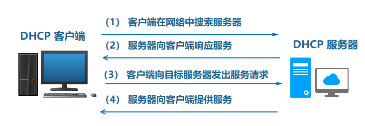
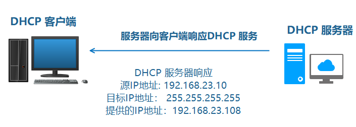
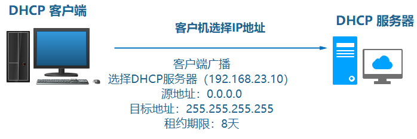
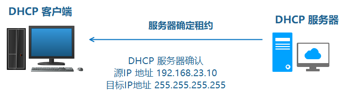
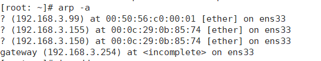
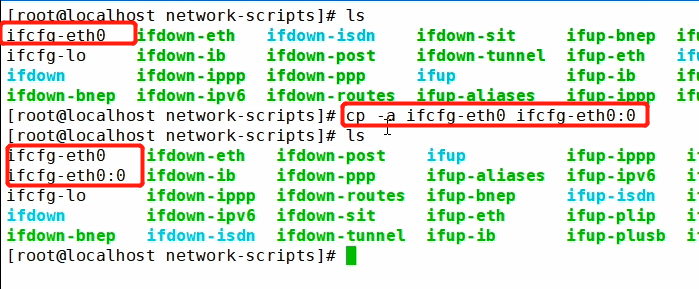
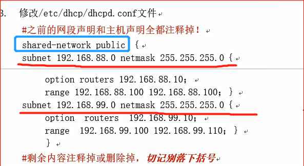

# dhcp

DHCP，动态主机配置协议，前身是BOOTP协议，是一个局域网的网络协议，使用UDP协议工作。DHCP通常被用于局域网环境，**主要作用是集中的管理、分配IP地址，使client动态的获得IP地址、Gateway地址、DNS服务器地址等信息，并能够提升地址的使用率**。

常用的2个端口：67(DHCP server),   68(DHCP client)

# 概念

## DHCP 的分配方式

自动分配：分配到一个IP地址后 永久使用

手动分配：有DHCP服务器管理员专门制定IP地址

动态分配：使用完释放该IP，供其他客户机使用

## DHCP 的租约过程



**1.客户机请求IP地址**

当一个DHCP客户机启动时,客户机还没有IP地址,所以客户机要通过DHCP获取一个合法的地址，此时DHCP客户机以广播方式发送DHCP Discover发现信息来寻找DHCP服务器


**2.服务器响应**

DHCP 服务器接收到来自客户机请求IP地址的信息时，在自己 的IP 地址池中查找是否有合法的IP地址提供给客户机，如果有，DHCP 服务器将此IP 地址做上标记，加入 DHCP Offer 的消息中，然后广播一则DHCP Offer 消息



3**客户机选择IP 地址**

DHCP 客户机从接收到的 第一个 DHCP Offer 消息中提取IP 地址，发出IP地址 的DHCP 服务器将改地址保留，这样该地址就不能再分配给另一个DHCP客户机



5.**服务器确定租约**

DHCP 服务器接收到DHCP Request 消息后，以DHCP ACK 消息的形式向客户机广播成功确认，该消息包含IP地址的有效租约和其他可配置的信息。当客户机收到DHCP ACK 消息 时，配置IP地址，完成TCP /IP 的初始化



# dhcp部署

## 1.实验准备

* 两台机器，网络连接模式设定为自定义VMnet\*模式
* 关闭SELinux和firewalld：

  `systemctl stop firewalld`

  `vim /etc/selinux/config`    `SELINUX=disabled`
* 关闭Vmware虚拟网络编辑器的DHCP功能
* 取消VMware的dhcp,并将dhcp服务器的ip设置为静态。

## 2.手动配置静态IP

```
vim /etc/sysconfig/network-scripts/ifcfg-ens33 
    
TYPE="Ethernet"
PROXY_METHOD="none"
BROWSER_ONLY="no"
BOOTPROTO="no"
DEFROUTE="yes"
IPV4_FAILURE_FATAL="no"
NAME="ens33"
UUID="ab9a36b5-d41e-49a1-bf74-179eaefdb0b2"
DEVICE="ens33"
ONBOOT="yes"
IPV6_PRIVACY="no"
IPADDR=192.168.3.100 
NETMASK=255.255.255.0
GATEWAY=192.168.3.254 

```

## 3.手动配置dns

```powershell
vim /etc/resolv.conf 

# Generated by NetworkManager
nameserver 192.168.3.254  #虚拟机的dns即网关
 
```

## 4.安装dhcp

# 1.安装
yum -y install dhcp
yum -y install dhcp-common
# 2.配置
/etc/dhcp/dhcpd.conf

* 配置文件说明

  ```
  option domain-name "example.org"; # DNS，设置的域名和域名服务器的ip
  option domain-name-servers ns1.example.org, ns2.example.org;

  default-lease-time 600;   # 默认租约时间
  max-lease-time 7200;      # 最大租约时间

  log-facility local7;

  subnet 192.168.3.0 netmask 255.255.255.0 { # 声明要分配的网段和子网掩码
    range 192.168.3.120 192.168.3.130;       # 可用IP地址池
    option domain-name-servers ns1.internal.example.org; # DNS服务器
    option domain-name "internal.example.org"; # DNS域名
    option routers 192.168.3.0; # 默认网关（跟虚拟机设置的一样）
    option broadcast-address 10.5.5.31; # 广播地址
    default-lease-time 600;
    max-lease-time 7200;

  host passacaglia {
    hardware ethernet 0:0:c0:5d:bd:95;
    filename "vmunix.passacaglia";
    server-name "toccata.fugue.com";
  }

  host fantasia {
    hardware ethernet 08:00:07:26:c0:a5;
    fixed-address fantasia.fugue.com;
  }
  # 给某个主机设置固定IP地址

  ```

### 4.1生成配置文件

`cp -a /usr/share/doc/dhcp-4xxxx/dhcpd.conf.example  /etc/dhcp/dhcpd.conf`

### 4.2修改配置文件

```bash
subnet 192.168.3.0 netmask 255.255.255.0 {
  range 192.168.3.150 192.168.3.160;
  default-lease-time 600;
  max-lease-time 7200;
}
```

### 4.3启动dhcpd服务

```bash
systemctl start dhcpd
```

### 4.4用另一台虚拟机进行测试

```
# 1.修改网卡配置文件 # 开启dhcp自动获取ip
vim /etc/sysconfig/network-scripts/ifcfg-ens33

# 2.重启网卡
ifdown ens33 && ifdown ens33  # 关闭网卡ens33 执行成功后 启动网卡ens33

# 3.查看ip
ip addr

# 4.查看dhcp服务器的租约日志
less //var/log/message

```

## 保留地址（固定地址分配）

* **1.获取客户端Mac地址**

  `arp -a`



* **2.修改/etc/dhcp/dhcpd.conf文件**


host  fantasia {
hardware  ethernet  08:00:07:26:c0:a5；
fixed-address  fantasia.  fugue.com；
}

* **3.重启dhcp服务**

  `service dhcpd restart`

## 超级作用域（同一局域网）

**1.什么是超级作用域**

超级作用域是一个或多个作用域的管理组合
作用域只能分配与绑定接口的网络地址相同的 IP 地址
而超级作用域可以分配与绑定接口的网络地址不相同的 IP 地址

**2.实验准备**

1台dhcp服务器;

2台客户机;

**3.步骤**

1.设置DHCP服务器的单臂路由所需子网卡



2.重启网卡 ifup eth0:0

3.查看网卡信息

`ifconfig`

4.开启路由转发

```react
vim /etc/sysctl.conf 
---------------------------
net.ipv4.ip_forward = 1
-------------------------
sysctl -p   # 重新加载
```

5.修改 /etc/dhcp/dhcpd.conf配置文件



6.重启dhcp   `service dhcpd restart`

7.分别重启2台客户端的网卡，查看ip地址

---
