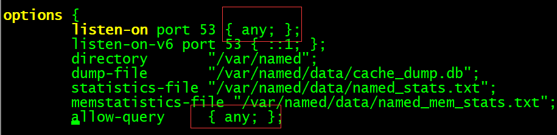
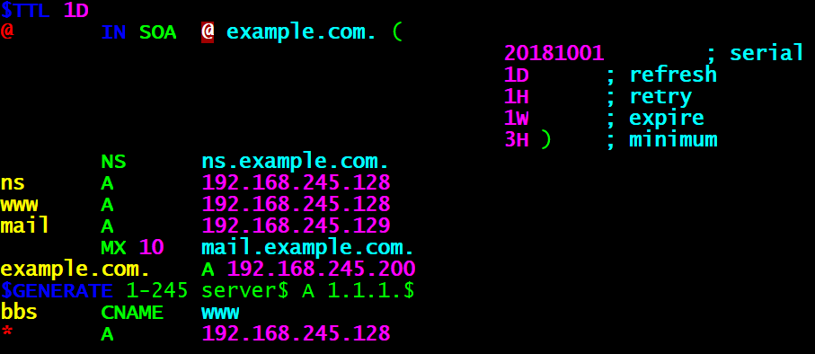
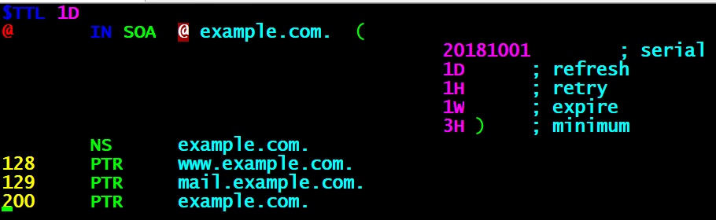
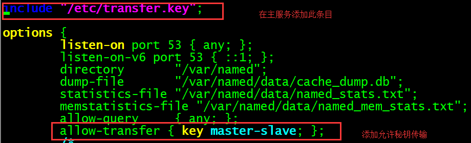

# dns

DNS(Domain Name System–域名系统),是因特网的一项服务。它作为将域名和IP地址相互映射的一个分布式数据库，能够使人更方便地访问互联网。是一个应用层的协议DNS使用TCP和UDP端口53。

DNS是一个分布式数据库,命名系统采用层次的逻辑结构,如同一颗倒置的树,这个逻辑的树形结构称为域名空间,由于DNS划分了域名空间,所以各机构可以使用自己的域名空间创建DNS信息.

> 注:DNS域名空间中,树的最大深度不得超过127层,树中每个节点最长可以存储63个字符.

## DNS名词解释

### 1.  域和域名

DNS树的每个节点代表一个域.通过这些节点,对整个域名空间进行划分,成为一个层次结构.

域名空间的每个域的名字,通过域名进行表示.

域名:通常由一个完全合格域名（FQDN）标识.FQDN能准确表示出其相对于DNS 域树根的位置,也就是节点到DNS 树根的完整表述方式,从节点到树根采用反向书写,并将每个节点用“.”分隔,对于DNS 域google 来说,其完全正式域名（FQDN）为google.com.

**例如：google为com域的子域,其表示方法为google.com，而www为google域中的子域,可以使用[www.google.com表示]

> 注意:通常,FQDN 有严格的命名限制,长度不能超过256 字节,只允许使用字符a-z,0-9,A-Z和减号（-）.点号（.）只允许在域名标志之间（例如“google.com”）或者FQDN 的结尾使用.

域名不区分大小.

由最顶层到下层,可以分成:根域、顶级域、二级域、子域.

Internet 域名空间的最顶层是根域（root）,其记录着Internet 的重要DNS 信息,由**Internet域名注册授权机构管理**,该机构把域名空间各部分的管理责任分配给连接到Internet 的各个组织.

**“.”全球有13个根(root)服务器**

DNS 根域下面是顶级域,也由Internet 域名注册授权机构管理.共有3 种类型的顶级域.

**组织域**:**采用3 个字符的代号**,**表示DNS 域中所包含的组织的主要功能或活动**.比如com 为商业机构组织,edu 为教育机构组织,gov 为政府机构组织,mil 为军事机构组织,net 为网络机构组织,org 为非营利机构组织,int 为国际机构组织.

**地址域**:**采用两个字符的国家或地区代号**.如cn 为中国,kr 为韩国,us 为美国.

**反向域**:**这是个特殊域**,**名字为in-addr.arpa**,**用于将IP 地址映射到名字（反向查询）**.

对于顶级域的下级域,Internet 域名注册授权机构授权给Internet 的各种组织.当一个组织获得了对域名空间某一部分的授权后,该组织就负责命名所分配的域及其子域,包括域中的计算机和其他设备,并管理分配域中主机名与IP 地址的映射信息.

### 2. 区（Zone）

区是DNS 名称空间的一部分,其包含了一组存储在DNS 服务器上的资源记录.

使用区的概念,DNS 服务器回答关于自己区中主机的查询,每个区都有自己的授权服务器.

### 3. 主域名服务器和辅助域名服务器

当区的辅助服务器启动时,它与该区的主控服务器进行连接并启动一次区传输,区辅助服务器定期与区主控服务器通信,查看区数据是否改变.如果改变了,它就启动一次数据更新传输.每个区必须有主服务器,另外每个区至少要有一台辅助服务器,否则如果该区的主服务器崩溃了,就无法解析该区的名称.

辅助服务器的优点:

1. 容错能力

   配置辅助服务器后,在该区主服务器崩溃的情况下,客户机仍能解析该区的名称.一般把区的主服务器和区的辅助服务器安装在不同子网上,这样如果到一个子网的连接中断,DNS 客户机还能直接查询另一个子网上的名称服务器.
2. 减少广域链路的通信量

   如果某个区在远程有大量客户机,用户就可以在远程添加该区的辅助服务器,并把远程的客户机配置成先查询这些服务器,这样就能防止远程客户机通过慢速链路通信来进行DNS 查询.
3. 减轻主服务器的负载

   辅助服务器能回答该区的查询,从而减少该区主服务器必须回答的查询数.

### 4. DNS相关概念

- DNS服务器：

  运行DNS 服务器程序的计算机,储存DNS 数据库信息.DNS 服务器会尝试解析客户机的查询请求.

  在解答查询时,如果DNS 服务器能提供所请求的信息,就直接回应解析结果,如果该DNS 服务器没有相应的域名信息,则为客户机提供另一个能帮助解析查询的服务器地址,如果以上两种方法均失败,则回应客户机没有所请求的信息或请求的信息不存在.
- DNS缓存：

  运行DNS 服务器程序的计算机,储存DNS 数据库信息.DNS 服务器会尝试解析客户机的查询请求.

  在解答查询时,如果DNS 服务器能提供所请求的信息,就直接回应解析结果,如果该DNS 服务器没有相应的域名信息,则为客户机提供另一个能帮助解析查询的服务器地址,如果以上两种方法均失败,则回应客户机没有所请求的信息或请求的信息不存在.

### 5. DNS两种查询方式

1. 递归查询：

   递归查询是一种DNS 服务器的查询模式,在该模式下DNS 服务器接收到客户机请求,必须使用一个准确的查询结果回复客户机.如果DNS 服务器本地没有存储查询DNS 信息,那么该服务器会询问其他服务器,并将返回的查询结果提交给客户机.
2. 迭代查询：

   DNS 服务器另外一种查询方式为迭代查询,当客户机发送查询请求时,DNS 服务器并不直接回复查询结果,而是告诉客户机另一台DNS 服务器地址,客户机再向这台DNS 服务器提交请求,依次循环直到返回查询的结果为止.

### 6. 正向解析和反向解析

- 正向解析：是指域名到IP地址的解析过程。
- 反向解析：是指IP地址到域名的解析过程。

### 7. DNS资源记录

1. **SOA 资源记录(全区唯一)**

   每个区在区的开始处都包含了一个起始授权记录（Start of Authority Record）,简称SOA 记录.

   SOA 定义了域的全局参数,进行整个域的管理设置.一个区域文件只允许存在唯一的SOA 记录.
2. **NS 资源记录:**

   NS（Name Server）记录是域名服务器记录,用来指定该域名由哪个DNS服务器来进行解析.每个区在区根处至少包含一个NS 记录.
3. **A 资源记录**

   地址（A）资源记录把FQDN 映射到IP 地址. 因为有此记录,所以DNS服务器能解析FQDN域名对应的IP 地址.

   A ：是IPv4地址。 AAAA是IPv6主机地址。
4. **PTR 资源记录**

   相对于A 资源记录,指针（PTR）记录把IP地址映射到FQDN. 用于反向查询,通过IP地址,找到域名.
5. **CNAME 资源记录**

   别名记录（CNAME）资源记录创建特定FQDN 的别名.用户可以使用CNAME 记录来隐藏用户网络的实现细节,使连接的客户机无法知道真正的域名.

   例:ping百度时,解析到了百度的别名服务器.百度有个cname=www.a.shifen.com.的别名
6. **MX 资源记录**

   邮件交换（MX）资源记录,为DNS 域名指定邮件交换服务器.

   邮件交换服务器是为DNS 域名处理或转发邮件的主机.处理邮件指把邮件投递到目的地或转交另一不同类型的邮件传送者.转发邮件指把邮件发送到最终目的服务器,用简单邮件传输协议SMTP 把邮件发送给离最终目的地最近的邮件交换服务器,或使邮件经过一定时间的排队.

## DNS工作原理

假设www.abc.com的主机要查询www.xyz.abc.com的服务器ip地址

### 1. 递归查询

第一步：在hosts静态文件、DNS解析器缓存中查找某主机的ip地址

> hosts文件：以静态映射的方式提供IP地址与主机名的对照表，类似ARP表
>
> 域：abc.com是一个域，它可以划分为多个区域，如abc.com和xyz.abc.com

第二步：上一步无法找到，去DNS本地服务器（即域服务器）查找，其本质是去区域服务器、服务器缓存中查找

第三步：本地DNS服务器查不到就根据‘根提示文件’向负责顶级域‘.com’的DNS服务器查询

第四步：‘根DNS服务器’根据查询域名中的‘xyz.com’，再向xyz.com的区域服务器查询

第五步：www.xyz.abc.com的DNS服务器直接解析该域名，将查询到的ip再原路返回给请求查询的主机

### 2. 迭代查询

第一步：在hosts静态文件、DNS解析器缓存中查找某主机的ip地址

第二步：上一步无法找到，在DNS本地服务器（即域服务器）查找所有本层次的区域服务器

第三步：本地DNS服务器查不到就查询上一层次的所有区域服务器，以此类推直至根域名DNS服务器‘.’

第四步：到达根域名服务器后又向下查询，直至查到结果为止。

### 3. 迭代查询与递归查询结合

递归查询需要经过逐层查询才能获得查询结果，当查询具有许多层次的DNS结构时效率很低，所以一般采用两者相结合的查询方式。

第一步：在hosts静态文件、DNS解析器缓存中查找某主机的ip地址

第二步：上一步无法找到，去DNS本地服务器（即域服务器）查找，其本质是去区域服务器、服务器缓存中查找

第三步：本地DNS服务器查不到就根据‘根提示文件’向负责顶级域‘.com’的根DNS服务器查询

第四步：根DNS服务器直接将其区域DNS服务器的ip地址返回给本地服务器，而不用再向xyz.com的区域服务器查询。

第五步：本地DNS服务器将结果返回给请求的主机


## Linux下DNS服务器安装

目前最常用的域名服务软件是**BIND**（**B**erkeley **I**nternet **N**ame **D**omain），最早由一名伯克利大学的学生编写，目前最新的版本是9，由**ISC**（**I**nternet **S**ystems **C**onsortium）负责编写和维护。

### 1. 安装bind服务和启动步骤

```bash
yum -y install bind bind-chroot bind-utils
#安装bind组件  
systemctl start named  
#启动dns服务  
systemctl enable named  
#设置dns服务开机启动  
Created symlink from /etc/systemd/system/multi-user.target.wants/named.service to /usr/lib/systemd/system/named.service.
```

### 2. DNS配置的主要文件组

- **/etc/hosts**　　主机的一个文件列表 　　添加记录如:111.13.100.92 [www.baidu.com](http://www.baidu.com/)

  对于简单的主机名解析（点分表示法），默认在请求DNS或NIS网络域名服务器前，/etc/named.conf 通常会告诉程序先查看此文件。
- **/etc/resolv.conf**　　转换程序配置文件

  在配置程序请求BIND域名查询服务查询主机名时，必须告诉程序使用哪个域名服务器和IP地址来完成这个任务
- **/etc/named.conf**　　BIND主文件

  设置一般的name参数，指向该服务器使用的域数据库的信息源
- **/var/named/named.ca**　　根域名配置服务器指向文件

  指向根域名配置服务器，用于告诉缓存服务器初始化
- **/var/named/localhost.zone**　 localhost区正向域名解析文件

  用于将本地IP地址（127.0.0.1）转换为本地回送IP地址（127.0.0.1）
- **/var/named/name.local**　　localhost区反向域名解析文件

  用于将localhost名字转换为本地回送IP地址（127.0.0.1）
- **/etc/named.rfc1912.zones**　　区块设置文件

**name.conf文件的主要配置信息：**

- **acl**　　       定义ip地址的访问控制清单
- **control**　　定义rndc使用的控制通道
- **include**　　把其他的文件包含到配置文件中
- **key**　　      定义授权的安全密钥
- **logging**　　定义日志内容和位置
- **options**　　定义全局配置选项和默认值
- **server**　　  定义远程服务的特征
- **zone**　　     定义一个区

### DNS的资源记录（Resource Record, RR）格式

```txt
DNS域名数据库有资源记录和区文件指令组成，由SOA（Start Of Authority起始授权机构记录，SOA 记录说明了在众多NS记录里那一台才是主名称服务器。
RR开始，同时包括NS RR；
正向解析文件包括A internet Address，作用，FQDN --> IP） 
MX （Mail eXchanger，邮件交换器）
CNAME（Canonical NAME 别名） 
反向解析文件包括PTR（PTR: PoinTeR，IP --> FQDN）

RR 语法：name　　[TTL]　　IN　　type　　value （字段之间由空格和制表符隔开）

注意： (1) TTL可从全局继承　　(2) @可用于引用当前区域的名字 　　(3) 同一个名字可以通过多条记录定义多个不同的值；此时 DNS服务器会以轮询方式响应 　　(4) 同一个值也可能有多个不同的定义名字；通过多个不同的 名字指向同一个值进行定义；此仅表示通过多个不同的名字 可以找到同一个主机

SOA记录：name: 当前区域的名字，例如“heiye.com.” 　　value: 有多部分组成 (1) 当前区域的主DNS服务器的FQDN，也可以使用当前区域的名字；  

(2) 当前区域管理员的邮箱地址；地址中不能使用@符号，一般用.替换 如linuxedu.heiye.com  (3) 主从服务区域传输相关定义以及否定的答案的统一的TTL 

例如： heiye.com.　　86400 　　IN 　　SOA 　　ns.heiye.com.

　　　 nsadmin.heiye.com. 　　(
　　　 　　　　2015042201 ;
　　　　　　　 序列号 2H ;
　　　　　　　 刷新时间 10M ;
　　　　　　　 重试时间 1W ;
　　　　　　　 过期时间 1D ;
　　　　　　　 否定答案的TTL值
　　　)

NS记录：name: 当前区域的名字 　　value: 当前区域的某DNS服务器的名字，例如 ns.heiye.com. 注意：一个区域可以有多个NS记录

例如：heiye.com. 　　IN 　　NS　　ns1.heiye.com.  

　　　heiye.com. 　　IN 　　NS 　   ns2.heiye.com.

注意： (1) 相邻的两个资源记录的name相同时，后续的可省略 
(2) 对NS记录而言，任何一个ns记录后面的服务器名字 ，都应该在后续有一个A记录

MX记录（Mail eXchanger）：name: 当前区域的名字 　　value: 当前区域的某邮件服务器(smtp服务器)的主机名 ， 一个区域内，MX记录可有多个；

但每个记录的value之前应 该有一个数字(0-99)，表示此服务器的优先级；数字越小优 先级越高  例如：
heiye.com. 　　IN 　　MX 　　10 　　mx1.heiye.com.
       　　　　 IN 　　MX 　　20 　　mx2.heiye.com.

注意： (1) 对MX记录而言，任何一个MX记录后面的服务器名字 ，都应该在后续有一个A记录

A记录（Addrss）:name: 某主机的FQDN，例如www.heiye.com. 　　value: 主机名对应主机的IP地址

例如： www.heiye.com. 　　IN 　　A 　　1.1.1.1 　　
　　　 www.heiye.com.　　 IN 　　A 　　2.2.2.2 　　
　　　 mx1.heiye.com. 　　IN 　　A 　　3.3.3.3
　　　 mx2.heiye.com.    　 IN 　　A 　　4.4.4.4
　　　 *.heiye.com. 　　　  IN 　　A 　　5.5.5.5
　　　 heiye.com. 　　　　IN 　　A 　　 6.6.6.6 　　
避免用户写错名称时给错误答案，可通过泛域名解析进行解 析至某特定地址

其他记录：AAAA: name: FQDN 　　value: IPv6 　　　　

　　　　　PTR: name: IP，有特定格式，把IP地址反过来写，1.2.3.4，要写 作4.3.2.1；而有特定后缀：in-addr.arpa.，所以完整写法为 ：

4.3.2.1.in-addr.arpa. 　　value: FQDN

例如： 4.3.2.1.　　in-addr.arpa. 　　IN 　　PTR 　　www.heiye.com.

如1.2.3为网络地址，可简写成： 4 　　IN 　　PTR 　　www.heiye.com.

注意：网络地址及后缀可省略；主机地址依然需要反着写

别名记录:name: 别名的FQDN 　　value: 真正名字的FQDN

例如： www.heiye.com. 　　IN 　　CNAME 　　websrv.heiye.com.

named字段：

	（1）根域以” . “结束，并且只有一个，没有上级域。而在Internet中，根域一般不需要表现出来。

	（2）@：默认域，文件使用$ORIGIN domain 来说明默认域。

	（3）ttl 全称”Time to Live “，以秒为单位记录该资源记录中存放高速缓存中的时间长度。通常此处设为空，表示采用SOA的最小ttl值。

	（4）IN：将该记录标志为一个Internet DNS资源记录。

type字段:

	(1)A记录：主机名对应的IP地址记录，用户可将该域名下网站服务器指向自己的Web服务器，同时也可设置域名的二级域名。

	(2)MX记录：邮件交换记录可将该域下所有邮件服务器 指向自己的邮件服务器，只需在线填写服务器的IP地址。

	(3)CNAME记录：别名记录，可允许多个名字映射到同一计算机，通常用于同时提供Web和邮件服务器的计算机。

	(4)SOA记录：一个授权区的开始，配置文件的第一个记录必须是SOA的开始。

	(5)PTR记录：用于地址到主机名的映射。

	(6)HINFO记录：由一组描述主机的信息文件组成，通常包括硬件名称和操作系统名称。

value字段：

	（1）A :存放IP地址。

	（2）CNAME：设置主机别名。

	（3）HINFO：通常为两行，分别对应Hareware（计算机硬件名称）和OS-type（操作系统名称）。

	（4）NS：域名服务器的名称。

	（5）PTR:主机真实名称。

测试检查配置文件错误的工具：nslookup、dig、named-checkzone、host、named-checkconf及dlint。
```

## Linux下DNS服务器配置实验

### 1. 配置DNS正向解析

在配置Bind服务时，主要用到以下三个配置文件：

- **主配置文件（/etc/named.conf）**：用来定义bind服务程序的运行。
- **区域配置文件（/etc/named.rfc1912.zones）**：用来保存域名和IP地址对应关系的所在位置。类似于图书的目录，对应着每个域和相应IP地址所在的具体位置，当需要查看或修改时，可根据这个位置找到相关文件。
- **数据配置文件目录（/var/named）**：该目录用来保存域名和IP地址真实对应关系的数据配置文件。

**第一步：修改主配置文件/etc/named.conf**。将监听地址和运行查询的地址都改为 any，分别表示服务器上的所有IP地址均可提供DNS域名解析服务，以及允许所有人对本服务器发送DNS查询请求。



**第二步：修改区域配置文件（/etc/named.rfc1912.zones）**。用来保存域名和IP地址对应关系的所在位置。在这个文件中，定义了域名与IP地址解析规则保存的文件位置以及服务类型等内容，而没有包含具体的域名、IP地址对应关系等信息。服务类型有三种，分别为hint（根区域）、master（主区域）、slave（辅助区域），其中常用的master和slave指的就是主服务器和从服务器。

```bash
zone "example.com" IN {
        type master;
        file "example.com.zone";
```

```bash
DNS默认端口是53的TCP和UPD,UDP是供用户查询的，主从复制用TCP和UDP的53端口都用。

BIND的ACL：bind有四个内置的acl:

none: 没有一个主机
any: 任意主机
localhost: 本机
localnet: 本机的IP同掩码运算后得到的网络地址段

注意：只能先定义，后使用；因此一般定义在配置文件中， 处于options的前面，当然也可自定义如下**

acl lan｛
192.168.25.0/24
			 } ;

访问控制：

访问控制的指令：
allow-query {}： 允许查询的主机；白名单
allow-transfer {}：允许区域传送的主机；（白名单，一般用于主从）
allow-recursion {}: 允许递归的主机,建议全局使用
allow-update {}: 允许更新区域数据库中的内容
```

第三步：编辑数据配置文件。\*\*从/var/named目录中复制一份正向解析的模板文件（named.localhost），然后把域名和IP地址的对应数据填写数据配置文件中并保存。在复制时记得加上-a参数，这可以保留原始文件的所有者、所属组、权限属性等信息，以便让bind服务程序顺利读取文件内容：

```bash
[root@localhost named]# cp -a named.localhost example.com
[root@localhost named]# vim example.com.zone 
$TTL 1D
@       IN SOA  @ example.com.   (
	 #授权信息开始:   #DNS区域的地址,在域地址后面还可以加管理员邮箱，不能加@，用.代替。
              20181001        ; serial  #更新序列号
                      1D      ; refresh #更新时间
                      1H      ; retry   #重试时间
                      1W      ; expire   #失效时间
                      3H )    ; minimum  #无效解析记录的缓存时间
        NS      ns.example.com.  #DNS区域的地址
ns      A       192.168.245.128  #地址记录
www     A       192.168.245.128  #www站点记录
mail    A       192.168.245.129  #地址记录
        MX 10   mail.example.com. #邮箱交换记录
example.com.    A 192.168.245.200
# 即使不写主机名，DNS也能解析到另外一个指定的地址
$GENERATE 1-245 server$ A 1.1.1.$
#如果服务器过多，对应主机名也很多，则可以这样写.例如：
#server1.example.com对应地址为：1.1.1.1
#server100.exmaple.com对应地址为：1.1.1.50
bbs     CNAME   www           #别名记录
*       A       192.168.245.128
#“*”代表所有，即便主机www写错，DNS也能正确解析出来。这就是泛域名解析
```



**第四步：检查配置,重启服务和测试。**

检查和重启服务：

```bash
[root@localhost ~]# named-checkconf   #检查主配置文件语法
[root@localhost ~]# named-checkzone eample.com /var/named/example.com.zone 
#检查区域配置文件语法
/var/named/example.com.zone:13: ignoring out-of-zone data (example.com)
zone eample.com/IN: loaded serial 20181001
[root@localhost ~]# vi /etc/resolv.conf
#进入该配置文件，指定使用的域名解析服务器。
	# Generated by NetworkManager
	nameserver 192.168.245.128
	search 192.168.245.128
[root@localhost ~]# systemctl restart named  #重启服务
```

### 2. 配置DNS反向解析

在DNS域名解析服务中，反向解析的作用是将用户提交的IP地址解析为对应的域名信息，它一般用于对某个IP地址上绑定的所有域名进行整体屏蔽，屏蔽由某些域名发送的垃圾邮件。它也可以针对某个IP地址进行反向解析，大致判断出有多少个网站运行在上面。当购买虚拟主机时，可以使用这一功能验证虚拟主机提供商是否有严重的超售问题。

**第一步：配置区域文件。**

> **反向解析是把IP地址解析成域名格式，因此在定义zone（区域）时应该要把IP地址反写，比如原来是192.168.10.0，反写后应该就是10.168.192，而且只需写出IP地址的网络位即可。**

```bash
[root@localhost ~]# vim /etc/named.rfc1912.zones
#在中添加反向数据文件的记录
zone "245.168.192.in-addr.arpa" IN {
        type master;
        file "245.168.192.arpa";
};
```

**第二步：编辑数据配置文件。**

> **反向解析是把IP地址解析成域名格式，因此在定义zone（区域）时应该要把IP地址反写，比如原来是192.168.10.0，反写后应该就是10.168.192，而且只需写出IP地址的网络位即可。**

```bash
[root@localhost ~]# cp -a /var/named/named.loopback /var/named/245.168.192.arpa 
[root@localhost ~]# vi /var/named/245.168.192.arpa
#编辑反正配置文件即可，和正向解析格式类似
#PTR为指针记录，仅用于反向解析中。
```



**第三步：检查配置文件，重启服务，测试。**

```bash
[root@localhost ~]# named-checkconf 
[root@localhost ~]# named-checkzone 245.168.192 /var/named/245.168.192.arpa 
zone 245.168.192/IN: loaded serial 20181001
OK
[root@localhost ~]# systemctl restart named
```

### 3. 搭建DNS主从服务器：

从而起到备份解析记录与负载均衡的作用，因此通过部署从服务器可以减轻主服务器的负载压力，还可以提升用户的查询效率。

**第一步：**在主服务器的区域配置文件中允许该从服务器的更新请求，即修改allow-update {允许更新区域信息的主机地址;};参数，然后重启主服务器的DNS服务程序。

```bash
[root@localhost ~]# vi /etc/named.rfc191
zone "example.com" IN {
        type master;
        file "example.com.zone";
        allow-update { 192.168.245.129; };
};
zone "245.168.192.in-addr.arpa" IN {
        type master;
        file "245.168.192.arpa";
        allow-update { 192.168.245.129; };
};
[root@localhost ~]# systemctl restart named
```

**第二步：** 在从服务器中填写主服务器的IP地址与要抓取的区域信息，然后重启服务。注意此时的服务类型应该是slave（从），而不再是master（主）。masters参数后面应该为主服务器的IP地址，而且file参数后面定义的是同步数据配置文件后要保存到的位置，稍后可以在该目录内看到同步的文件。

```bash
[root@localhost ~]# vi /etc/named.conf
options {
        listen-on port 53 { any; }; #改为any，
        listen-on-v6 port 53 { ::1; };
        directory       "/var/named";
        dump-file       "/var/named/data/cache_dump.db";
        statistics-file "/var/named/data/named_stats.txt";
        memstatistics-file "/var/named/data/named_mem_stats.txt";
        allow-query     { any; }; #改为any，允许所有主机查询
[root@localhost ~]# vi /etc/named.rfc191
zone "example.com" IN {
        type master;
        file "example.com.zone";
        allow-update { 192.168.245.129; };
};
zone "245.168.192.in-addr.arpa" IN {
        type master;
        file "245.168.192.arpa";
        allow-update { 192.168.245.129; };
};
[root@localhost ~]# vi /etc/named.conf^C
[root@localhost ~]# iptables -F  #关闭防火墙
[root@localhost ~]# setenforce 0
setenforce: SELinux is disabled
[root@localhost ~]# systemctl restart named
[root@localhost ~]# systemctl enable named
```

重启以后，成功的话会在/var/named/slaves/下看见同步的文件。

```bash
[root@localhost named]# ls /var/named/slaves/
245.168.192.arpa  example.com.zone
```

**第三步：测试。**可将从服务的DNS地址改为自己，进行地址解析。

```bash
[root@localhost named]# dig www.example.com

; <<>> DiG 9.9.4-RedHat-9.9.4-37.el7 <<>> www.example.com
;; global options: +cmd
;; Got answer:
;; ->>HEADER<<- opcode: QUERY, status: NOERROR, id: 9870
;; flags: qr aa rd ra; QUERY: 1, ANSWER: 1, AUTHORITY: 1, ADDITIONAL: 2

;; OPT PSEUDOSECTION:
; EDNS: version: 0, flags:; udp: 4096
;; QUESTION SECTION:
;www.example.com.               IN      A

;; ANSWER SECTION:
www.example.com.        86400   IN      A       192.168.245.128

;; AUTHORITY SECTION:
example.com.            86400   IN      NS      ns.example.com.

;; ADDITIONAL SECTION:
ns.example.com.         86400   IN      A       192.168.245.128

;; Query time: 1 msec
;; SERVER: 192.168.245.129#53(192.168.245.129)
;; WHEN: Tue Oct 16 11:19:04 CST 2018
;; MSG SIZE  rcvd: 93
```

这种情况下，证明DNS主从服务器搭建成功。一旦主DNS发生故障，将自动利用DNS从服务器进行解析，实现了某种程度上的容错。

### 4. 配置DNS安全的加密传输：

TSIG主要是利用了密码编码的方式来保护区域信息的传输（Zone Transfer），即TSIG加密机制保证了DNS服务器之间传输域名区域信息的安全性。

**第一步：在主服务上生产密钥**。dnssec-keygen命令用于生成安全的DNS服务密钥，其格式为“dnssec-keygen \[参数\]”，常用的参数以及作用如下：

|参数|作用|
| ----| -----------------------------------------------------------------------|
|\-a|指定加密算法，包括RSAMD5（RSA）、RSASHA1、DSA、NSEC3RSASHA1、NSEC3DSA等|
|\-b|密钥长度（HMAC-MD5的密钥长度在1~512位之间）|
|\-n|密钥的类型（HOST表示与主机相关）|

使用下述命令生成一个主机名称为master-slave的128位HMAC-MD5算法的密钥文件。在执行该命令后默认会在当前目录中生成公钥和私钥文件，在传输配置文件中会用到该秘钥。

```bash
[root@localhost ~]# dnssec-keygen -a HMAC-MD5 -b 128 -n HOST master-slave 
Kmaster-slave.+157+15811
[root@localhost ~]# cat Kmaster-slave.+157+47396.key
master-slave. IN KEY 512 3 157 9+m1PlQOAF7xnMLClzNmXw==
[root@localhost ~]# cat Kmaster-slave.+157+47396.private 
Private-key-format: v1.3
Algorithm: 157 (HMAC_MD5)
Key: 9+m1PlQOAF7xnMLClzNmXw==  
Bits: AAA=
Created: 20181016033058
Publish: 20181016033058
Activate: 20181016033058
```

**第二步：在主服务器中创建验证秘钥文件。**

进入bind服务程序用于保存配置文件的目录，把刚刚生成的密钥名称、加密算法和私钥加密字符串按照下面格式写入到tansfer.key传输配置文件中。为了安全起见，我们需要将文件的所属组修改成named，并将文件权限设置得要小一点，然后把该文件做一个硬链接到/etc目录中。

```bash
[root@localhost ~]# vim /var/named/chroot/etc/transfer.key

key "master-slave" {
algorithm hmac-md5;
secret "9+m1PlQOAF7xnMLClzNmXw==";
};
[root@localhost ~]# chown root:named/var/named/chroot/etc/transfer.key
[root@localhost ~]# ln /var/named/chroot/etc/transfer.key /etc/transfer.key
```

**第三步：开启主服务器密钥验证功能：**

开启并加载Bind服务的密钥验证功能。首先需要在主服务器的主配置文件中加载密钥验证文件，然后进行设置，使得只允许带有master-slave密钥认证的DNS服务器同步数据配置文件：



```bash
include "/etc/transfer.key";             //在主服务器中添加此条
options {
        listen-on port 53 { any; };
        listen-on-v6 port 53 { ::1; };
        directory       "/var/named";
        dump-file       "/var/named/data/cache_dump.db";
        statistics-file "/var/named/data/named_stats.txt";
        memstatistics-file "/var/named/data/named_mem_stats.txt";
        allow-query     { any; };
        allow-transfer  { key master-slave; };
```

至此，DNS主服务器的TSIG密钥加密传输功能就已经配置完成。此时清空DNS从服务器同步目录中所有的数据配置文件，然后再次重启bind服务程序，这时就已经获取不到主服务器的配置文件了。

**第四步：配置从服务器支持秘钥验证：**

```bash
[root@localhost ~]# scp /var/named/chroot/etc/transfer.key root@192.168.245.128:/var/named/chroot/etc/transfer.key
root@192.168.245.128's password: 
transfer.key                    100%   79     0.1KB/s   00:00 
[root@localhost ~]# chown root:named /var/named/chroot/etc/transfer.key
[root@localhost ~]# ln /var/named/chroot/etc/transfer.key /etc/transfer.key
```

**第五步：配置从服务器配置文件：**

```bash
[root@localhost ~]# vi /etc/named.conf 

include "/etc/transfer.key"; #在此添加秘钥文件

options {
        listen-on port 53 { any; };
        listen-on-v6 port 53 { ::1; };
        directory       "/var/named";
        dump-file       "/var/named/data/cache_dump.db";
        statistics-file "/var/named/data/named_stats.txt";
        memstatistics-file "/var/named/data/named_mem_stats.txt";
        allow-query     { any; };

        /* 
           recursion. 
           reduce such attack surface 
        */
        recursion yes;

        dnssec-enable yes;
        dnssec-validation yes;

        /* Path to ISC DLV key */
        bindkeys-file "/etc/named.iscdlv.key";

        managed-keys-directory "/var/named/dynamic";

        pid-file "/run/named/named.pid";
        session-keyfile "/run/named/session.key";
};

#在此添加主服务器地址，位置不能太靠前，否则bind服务程序会因为没有加载完预设参数而报错：
server 192.168.245.128 {
        keys { master-slave; };
};

logging {
        channel default_debug {
                file "data/named.run";
                severity dynamic;
        };
};

zone "." IN {
        type hint;
        file "named.ca";
};

include "/etc/named.rfc1912.zones";
include "/etc/named.root.key";
```

至此，主从服务器配置完成，重启服务后，可在/var/named/slaves/目录下看到同步过来的文件。

```bash
[root@localhost ~]# systemctl restart named
[root@localhost ~]# ls /var/named/slaves/
245.168.192.arpa  example.com.zone
```

### 5. 配置DNS缓存服务器：

DNS缓存服务器（Caching DNS Server）是一种不负责域名数据维护的DNS服务器。简单来说，缓存服务器就是把用户经常使用到的域名与IP地址的解析记录保存在主机本地，从而提升下次解析的效率。DNS缓存服务器一般用于经常访问某些固定站点而且对这些网站的访问速度有较高要求的企业内网中，但实际的应用并不广泛。而且，缓存服务器是否可以成功解析还与指定的上级DNS服务器的允许策略有关。

```bash
[root@localhost ~]# vim /etc/named.conf
options {
 listen-on port 53 { any; };
 listen-on-v6 port 53 { ::1; };
 directory "/var/named";
 dump-file "/var/named/data/cache_dump.db";
 statistics-file "/var/named/data/named_stats.txt";
 memstatistics-file "/var/named/data/named_mem_stats.txt";
 allow-query { any; };
 forwarders { 目标地址; }; #在此处添加转发地址即可
```
