# ftp

# ftp和sftp的区别

sftp和ftp的区别在安全通道，使用的协议，链接方式，安全性等方面都有不同。

* ftp（File Transfer Protocol，文件传输协议） 是 TCP/IP 协议组中的协议之一。使用20，21两个端口，**20是数据链路的端口，21是控制链路的端口**。
* sftp（Secure File Transfer Protocol ，安全文件传送协议）sftp 是ssh服务的一部分，**和ssh一样，使用22端口**。能够为传输文件提供一种安全的加密方法，但是这种安全是以牺牲效率为代价的。

# 主动模式与被动模式

sftp不存在主被动模式，ftp可配置主被动模式

## 主动模式 PORT

FTP客户端使用随机端口N与**FTP服务端的21端口**建立连接，并开始倾听N+1端口，同时通过21端口将N+1端口告诉FTP服务端。FTP服务端获取到客户端告诉它的N+1端口后，使用**数据传输的20端口**与FTP客户端N+1端口建立连接，从而进行数据传输。图示如下：

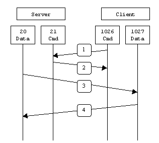

传输数据时，server端主动连接client端，server端开启21端口的“准入”和20端口的“准出”。

**这样的连接有时候会被客户端的防火墙阻止**。

## 被动模式 PASV

client端会开通随机的两个端口N和N+1（N>1023）。其中，N端口与server端21端口建立通讯，并发送PASV命令到server端。server端接收到PASV命令之后，会随机创建一个端口P（P>1023），并将端口P返回给client端。client拿到P端口后，就会通过N+1端口与P端口建立数据传输连接。图示如下：

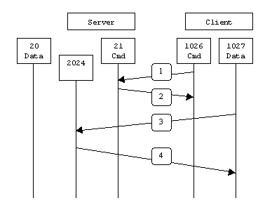

被动模式解决了服务器主动发起到客户端连接会被阻止的问题。

```bash
pasv_min_port=2024       # 在PASV工作模式下，数据连接可以使用的端口范围的最小端口,0表示任意端口。默认值为0。
pasv_max_port=2034       # 在PASV工作模式下，数据连接可以使用的端口范围的最大端口,0表示任意端口。默认值为0。

```

# SFTP（linux）

## 1.新建用户

```bash
# 创建用户组
groupadd ftpuser
# 创建用户
useradd -g ftpuser -s /sbin/nologin ftpuser
# 设置密码
echo "Ninestar123" | passwd stdin ftpuser
```

## 2.修改配置

`vim /etc/ssh/sshd_config`

```bash
# 指定sshd使用内置sshd的SFTP服务器代码，而不是运行另一个进程
Subsystem sftp internal-sftp
# 配置匹配该用户组
Match Group ftpuser
   ChrootDirectory /home/ftpuser  #  表示SFTP所访问的主目录为/home/ftpuser
   X11Forwarding no               #  禁止使用X11转发
   AllowTcpForwarding no          #  用户不能使用端口转发
   ForceCommand internal-sftp     #  强制执行内部sftp,并忽略任何~/.ssh/rc文件中的命令
```

## 3.设定权限

```bash
# 创建SFTP指定的主目录
mkdir -p /home/ftpuser
# 配置可写入的目录
mkdir -p /home/ftpuser/data
# 主目录的属主必须为ROOT用户,属组改为我们上面创建的sftp的用户组
chown root:ftpuser /home/ftpuser
chown ftpuser:ftpuser /home/ftpuser/data
# 设置SFTP主目录权限为755,不可以超过755否则会登入报错
chmod 755 /home/ftpuser
# 重启下SSHD服务
systemctl restart sshd
```

# SFTP（windows）

## 1.安装FreeSSHd

下载地址：[http://www.freesshd.com/?ctt=download](http://www.freesshd.com/?ctt=download "http://www.freesshd.com/?ctt=download")

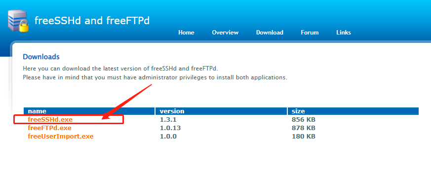

双击安装一直next，

安装后问你是否要生成账户登录的秘钥，**选择是**

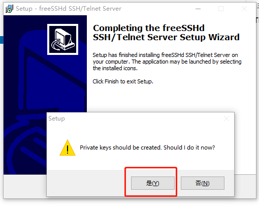

是否作为系统服务，**选择否**

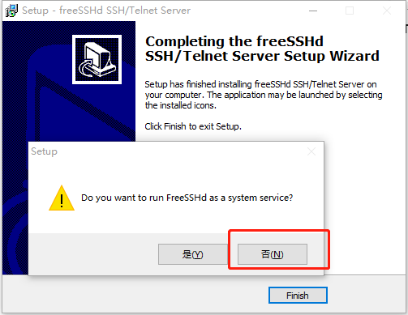

## 2.修改配置

右键桌面图标，以管理员方式运行，然后右键右下角图标，选择settings

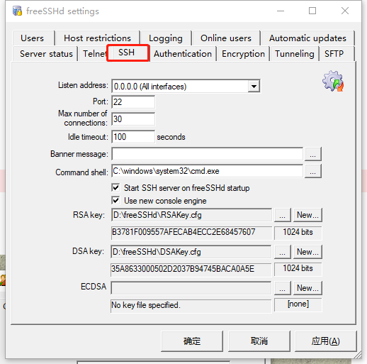

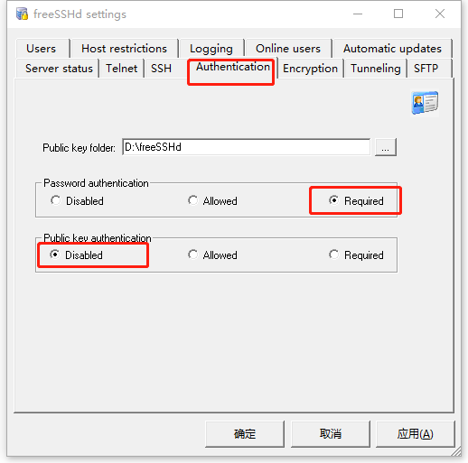

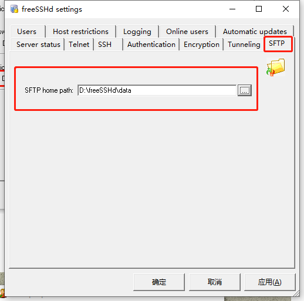

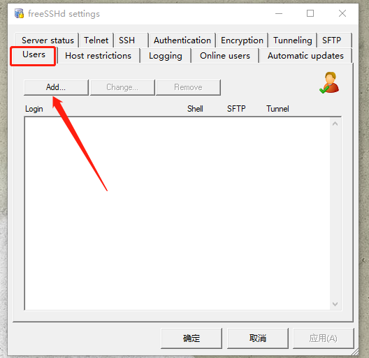

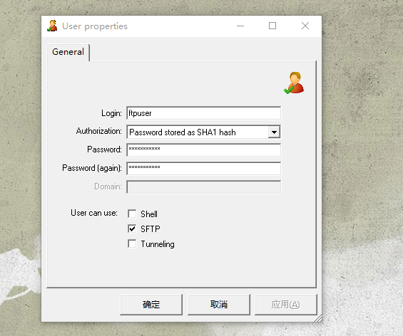

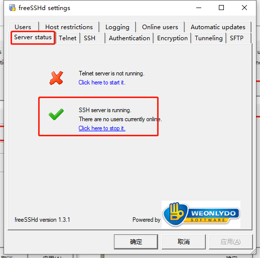

配置完成之后，右键右下角图标，选择Unload，然后右键桌面图标，以管理员方式运行。

# FTP（linux）

## 1.安装vsftpd软件

`yum install vsftpd -y`

## 2.vsftpd的配置

ftp的配置文件主要有三个，位于/etc/vsftpd/目录下，分别是：

ftpusers    # 不受任何配制项的影响，它总是有效，它是一个黑名单！
user_list   # 和vsftpd.conf中的userlist_enable和userlist_deny两个配置项紧密相关的，它可以有效，也可以无效，有效时它可以是一个黑名单，也可以是一个白名单
vsftpd.conf # vsftpd的主配置文件

## 3.vsftpd.conf 配置文件说明

### 匿名用户

```
anon_upload_enable=NO   # 是否允许匿名登录
write_enable=YES        # 是否允许登陆用户有写权限。属于全局设置，默认值为YES
no_anon_password=YES/NO # 使用匿名登入时，不会询问密码
ftp_username=ftp        # 定义匿名登入的使用者名称。默认值为ftp。
anon_root=/var/ftp      # 使用匿名登入时，所登入的目录。默认值为/var/ftp。
anon_upload_enable=YES/NO # 如果设为YES，则允许匿名登入者有上传文件（非目录）的权限，
                          # 只有在write_enable=YES时，此项才有效。
                          # 当然，匿名用户必须要有对上层目录的写入权。默认值为NO
anon_world_readable_only=YES/NO # 如果设为YES，则允许匿名登入者下载，默认值为YES。
anon_mkdir_write_enable=YES/NO  # 则允许匿名登入者有新增目录的权限，只有在write_enable=YES时，此项才有效。
anon_other_write_enable=YES/NO  # 则允许匿名登入者更多于上传或者建立目录之外的权限，譬如删除或者重命名。
chown_uploads=YES/NO   # 设置是否改变匿名用户上传文件（非目录）的属主
anon_umask=077         # 设置匿名登入者新增或上传档案时的umask 值

```

### 本地用户

```bash
local_enable=NO           # 控制是否允许本地用户登入
local_root=/home/username # 当本地用户登入时，将被更换到定义的目录下。默认值为各用户的家目录。
write_enable=YES/NO       # 是否允许登陆用户有写权限。属于全局设置，默认值为YES。
local_umask=022           # 本地用户新增档案时的umask 值。
file_open_mode=0755       # 本地用户上传档案后的档案权限，与chmod 所使用的数值相同。默认值为0666。
dirmessage_enable=YES/NO  # 使用者第一次进入一个目录时，会检查该目录下是否有.message这个档案，
                          # 如果有，则会出现此档案的内容，通常这个档案会放置欢迎话语，或是对该目录的说明。
message_file=.message     # 设置目录消息文件，可将要显示的信息写入该文件。默认值为.message。
banner_file=/etc/vsftpd/banner # 当使用者登入时，会显示此设定所在的档案内容，通常为欢迎话语或是说明。默认值为无。如果欢迎信息较多，则使用该配置项。
ftpd_banner=Welcome to BOB's FTP server # 这里用来定义欢迎话语的字符串，banner_file是档案的形式，而ftpd_banner 则是字符串的形式。
```

### 访问控制设置

```bash
#控制主机访问：
tcp_wrappers=YES/NO  # 设置vsftpd是否与tcp wrapper相结合来进行主机的访问控制。默认值为YES。
# 如果启用，则vsftpd服务器会检查/etc/hosts.allow 和/etc/hosts.deny 中的设置
# 来决定请求连接的主机，是否允许访问该FTP服务器。这两个文件可以起到简易的防火墙功能。

#控制用户访问：
#对于用户的访问控制可以通过/etc目录下的vsftpd.user_list和ftpusers文件来实现
userlist_enable=YES/NO  # 是否启用vsftpd.user_list文件
userlist_file=/etc/vsftpd.user_list # 控制用户访问FTP的文件，里面写着用户名称。一个用户名称一行。
userlist_deny=YES/NO  # 决定vsftpd.user_list文件中的用户是否能够访问FTP服务器。
# 若设置为YES，则vsftpd.user_list文件中的用户不允许访问FTP，
# 若设置为NO，则只有vsftpd.user_list文件中的用户才能访问FTP。


# 控制用户是否允许切换到上级目录
chroot_list_enable=YES/NO    # 是否启动限制用户的名单
chroot_list_file=/etc/vsftpd/chroot_list  # 用于指定用户列表文件
chroot_local_user=YES        # 1.所有用户都被限制在其主目录下 2.使用chroot_list_file指定的用户列表，这些用户作为“例外”，不受限制
chroot_local_user=NO(默认)   # 1.所有用户都不被限制其主目录下 2.使用chroot_list_file指定的用户列表，这些用户作为“例外”，受到限制

# 数据传输模式设置
ascii_upload_enable=YES/NO
ascii_download_enable=YES/NO

# 定义用户配置文件
# 在vsftpd中，可以通过定义用户配置文件来实现不同的用户使用不同的配置。
user_config_dir=/etc/vsftpd/userconf
# 设置用户配置文件所在的目录。当设置了该配置项后，用户登陆服务器后，
# 系统就会到/etc/vsftpd/userconf目录下，读取与当前用户名相同的文件，并根据文件中的配置命令，对当前用户进行更进一步的配置。

```

对于chroot\_local\_user与chroot\_list\_enable的组合效果，可以参考下表：

||chroot\_local\_user=YES|chroot\_local\_user=NO|
| --------------------------------------------------------------------| ------------------------------| --------------------|
|chroot\_list\_enable=YES|1.所有用户都被限制在其主目录下||
|2.使用chroot\_list\_file指定的用户列表，这些用户作为“例外”，不受限制|1.所有用户都不被限制其主目录下||
|2.使用chroot\_list\_file指定的用户列表，这些用户作为“例外”，受到限制|||
|chroot\_list\_enable=NO|1.所有用户都被限制在其主目录下||
|2.不使用chroot\_list\_file指定的用户列表，没有任何“例外”用户|1.所有用户都不被限制其主目录下||
|2.不使用chroot\_list\_file指定的用户列表，没有任何“例外”用户|||

## 4.开始部署

1.安装

`yum install -y vsftpd`

2.修改配置文件

`cp /etc/vsftpd/vsftpd.conf{,.bak} ; vim /etc/vsftpd/vsftpd.conf`

```bash
anonymous_enable=NO                   # 禁用匿名登录和本地用户登录
###################   以下是新增 ######################
#限制ftp用户只能在其主目录下活动（禁止切换到上级目录）
chroot_local_user=YES
chroot_list_enable=NO
#表示让家目录有可写权限
allow_writeable_chroot=YES
#可以通过定义用户配置文件来实现不同的用户使用不同的配置
user_config_dir=/etc/vsftpd/userconf
reverse_lookup_enable=NO
ascii_upload_enable=YES
ascii_download_enable=YES

```

3.创建目录

`mkdir -p /etc/vsftpd/userconf`

4.定义用户配置文件

`vim /etc/vsftpd/userconf/ftp_dzhd ​`  # 文件名要和ftp用名相同

```bash
# 设置ftp_dzhd这个用户的根目录为/data/bps/data/sdq
local_root=/data/bps/data/sdq
```

5.修改pam

`cp /etc/pam.d/vsftpd{,.bak} ; vim /etc/pam.d/vsftpd`

```bash
# 删除或注释该行
# auth       required     pam_shells.so


#  配置项的含义为仅允许用户的shell为 /etc/shells文件内的shell命令时，才能够成功
```

6.创建用户

```bash
groupadd ftpuser
useradd -s /sbin/nologin -G ftpuser ftp_dzhd && echo "Ninestar123" |passwd --stdin ftp_dzhd
# 设置目录权限
mkdir -p /data/bps/data/sdq
chown ftp_dzhd:ftpuser /data/bps/data/sdq

```

7.重启vsftp
`systemctl restart vsftpd`

## 5.被动模式

1.修改配置文件

`vim /etc/vsftpd/vsftpd.conf`

```bash
# 使用被动模式添加以下参数：
pasv_min_port=2024
pasv_max_port=2034
```

2.重启vsftp
`systemctl restart vsftpd`

## 6.启用ssl

1.修改配置文件

`vim /etc/vsftpd/vsftpd.conf`

```bash
#添加如下选项
ssl_enable=yes
ssl_sslv2=yes
ssl_sslv3=yes
ssl_tlsv1=yes
#表示强制用户使用加密登陆和数据传输
force_local_logins_ssl=yes
force_local_data_ssl=yes
rsa_cert_file=/etc/vsftpd/vsftpd.pem
#以添加下面的选项增强 FTP 服务器的安全性
require_ssl_reuse=NO
ssl_ciphers=HIGH

```

2.制作ssl证书

```bash
yum install -y openssl
cd /etc/vsftpd
openssl req -x509 -nodes -days 365 -newkey rsa:1024 -keyout /etc/vsftpd/vsftpd.pem -out /etc/vsftpd/vsftpd.pem
chmod 400 vsftpd.pem
```

3.重启vsftp
`systemctl restart vsftpd`

# FTP（windows）

## 1.下载安装FileZilla Server&#x20;

下载地址：[https://www.filezilla.cn/download](https://www.filezilla.cn/download "https://www.filezilla.cn/download")

双击安装：下一步>下一步>下一步...

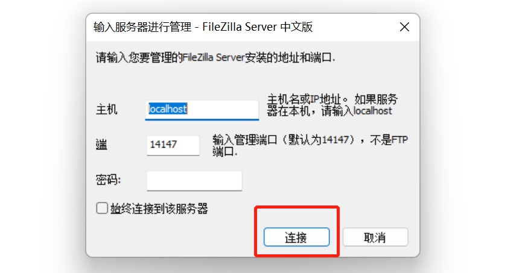

## 2.进行配置

点击编辑,选择用户

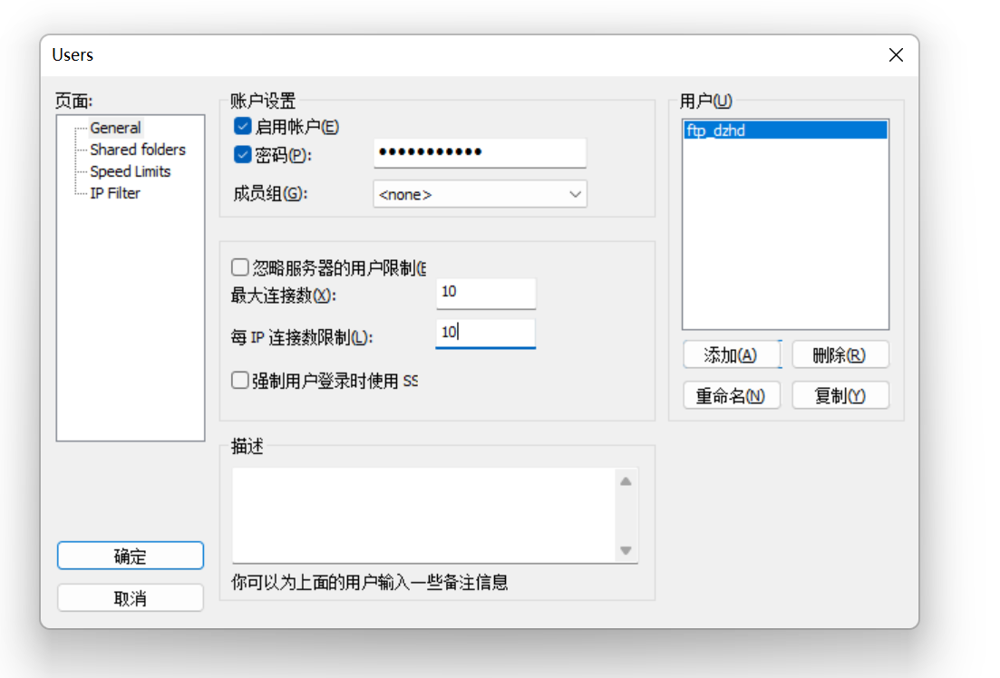

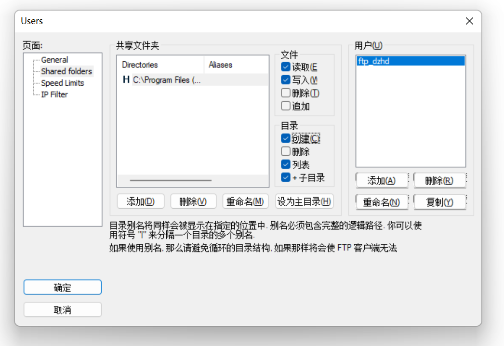

## 3.被动模式

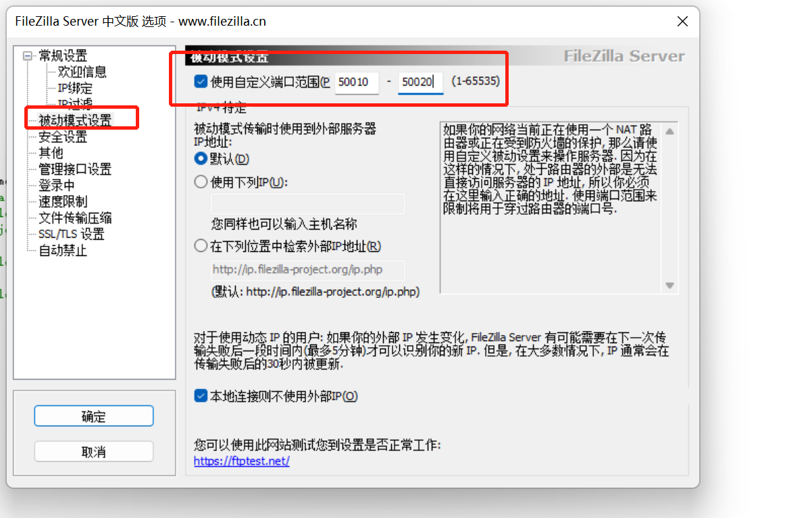

```bash
# 一个细节,在使用FTP命令行打开FTP连接进行通讯的时候，有时候会有这样的响应：

 PORT 192,168,150,80,14,178
 227 Entering Passive Mode (192,168,150,90,195,149)

# 这些响应中，那串数子头4个是IP地址，后两位是表示端口，
# 端口的计算是将第5位数乘以256加上第六位数。如192,168,150,90,195,149，则端口为195*256+149=50069。
```

# ftp常用命令

```bash
# 连接ftp服务器
ftp 192.168.0.100  # 服务器会询问你用户名和密码
ftp username:password@127.0.0.1:21
# 下载文件
get [remote-file] [local-path]
mget [remote-file]  # mget可以使用通配符批量下载到当前目录
# 上传文件
put local-file [remote-file]
mput local-files
# 断开连接
bye


```
