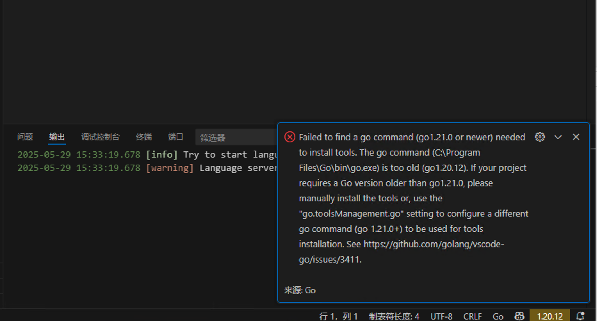

# Windows下配置VSCode的Go开发环境

## 1. 安装Go语言

1. 下载最新版Go安装包：

    - 访问[Go官网下载页面](https://go.dev/dl/)
    - 选择`.msi`​安装包（如`go1.21.0.windows-amd64.msi`​）
2. 运行安装程序：

    - 双击下载的.msi文件
    - 按照向导完成安装（默认安装到`C:\Go`​）
    - 安装程序会自动设置系统环境变量
3. 验证安装：

    - 打开命令提示符（Win+R，输入`cmd`​）
    - 输入以下命令：

      ```
      go version
      ```
    - 应该显示安装的Go版本号

## 2. 配置环境变量

1. 检查环境变量（安装程序通常已自动设置）：

    - ​`GOROOT`​: 指向Go安装目录（如`C:\Go`​）
    - ​`GOPATH`​: 指向工作目录（如`C:\Users\<你的用户名>\go`​）
    - ​`PATH`​: 包含`%GOROOT%\bin`​和`%GOPATH%\bin`​
2. 如需手动设置：

    - 右键"此电脑" → 属性 → 高级系统设置 → 环境变量
    - 在系统变量中添加或修改：

      ```
      GOROOT = C:\Go
      GOPATH = C:\Users\<你的用户名>\go
      ```
    - 编辑`Path`​变量，添加：

      ```
      %GOROOT%\bin
      %GOPATH%\bin
      ```
3. 验证配置：

    ```
    go env GOROOT
    go env GOPATH
    ```

## 3. 安装VSCode

1. 下载安装VSCode：

    - 访问[VSCode官网](https://code.visualstudio.com/)
    - 下载Windows版安装包
    - 运行安装程序，按默认选项安装
2. 启动VSCode

## 4. 配置VSCode的Go开发环境

1. 安装Go扩展：

    - 打开VSCode
    - 点击左侧活动栏的扩展图标（或按Ctrl+Shift+X）
    - 搜索"Go"并安装由Google发布的官方扩展
2. 安装必要的Go工具：

    - 打开任意.go文件（或新建一个），VSCode右下角会提示安装工具，点击"Install All"
    - 或在vscode界面按键盘ctrl+shift+p，输入Go: install/update tools，选择要安装的依赖（这里全选），等待安装完成。
    - 或手动安装（在终端中运行）：

      ```
      go install golang.org/x/tools/gopls@latest
      go install github.com/go-delve/delve/cmd/dlv@latest
      go install honnef.co/go/tools/cmd/staticcheck@latest
      go install golang.org/x/tools/cmd/goimports@latest
      ```
3. 配置VSCode设置：

    - 打开设置（Ctrl+,）
    - 搜索"go"进行相关配置，或直接编辑settings.json：

      ```
      {
        "go.useLanguageServer": true,
        "go.gopath": "C:\\Users\\<你的用户名>\\go",
        "go.goroot": "C:\\Go",
        "go.formatTool": "goimports",
        "go.lintTool": "staticcheck",
        "editor.formatOnSave": true,
        "[go]": {
          "editor.formatOnSave": true,
          "editor.codeActionsOnSave": {
            "source.organizeImports": true
          }
        }
      }
      ```

## 5. 创建测试项目

1. 创建项目目录：

    ```
    mkdir %USERPROFILE%\go\src\hello
    cd %USERPROFILE%\go\src\hello
    ```
2. 在VSCode中：

    - 文件 → 打开文件夹 → 选择刚才创建的hello目录
    - 新建文件`main.go`​
3. 在main.go中输入：

    ```
    package main

    import "fmt"

    func main() {
        fmt.Println("Hello, Go!")
    }
    ```
4. 运行程序：

    - 按F5开始调试
    - 或在终端中运行：

      ```
      go run .
      ```

## 6. 使用Go Modules（推荐）

1. 初始化模块：

    ```
    cd %USERPROFILE%\go\src\hello
    go mod init hello
    ```
2. 这将创建`go.mod`​文件，用于依赖管理

## 7. 常用功能

1. **代码补全**：输入时自动提示
2. **转到定义**：F12
3. **查找引用**：Shift+F12
4. **重命名符号**：F2
5. **调试**：

    - 设置断点（点击行号左侧）
    - 按F5开始调试
6. **测试**：

    - 在测试文件上右键选择"Run Test"
    - 或使用命令：

      ```
      go test -v
      ```

## 8. 常见问题解决

### 安装必要的Go工具时失败

```
# 设置Go代理（国内用户推荐）
go env -w GOPROXY=https://goproxy.cn,direct
go env -w GO111MODULE=auto

# 设置Go代理（国内用户推荐）
go env -w GOPROXY=https://mirrors.aliyun.com/goproxy
go env -w GO111MODULE=on
# 重新安装工具
go install golang.org/x/tools/gopls@latest
```

​

保留系统默认的 Go 1.20.12 用于项目开发，单独安装一个 Go 1.21+ 版本专门用于 VS Code 工具管理（如 gopls、staticcheck 等）。

1. 访问 [Go 官网下载页](https://go.dev/dl/)
2. 下载 **ZIP 格式**的 Go 1.21+（如 `go1.22.3.windows-amd64.zip`​）
3. 解压到任意目录（**不要覆盖现有 Go 1.20.12**），例如：  
    ​`C:\Go1.22`​  
    （目录结构应为 `C:\Go1.22\bin\go.exe`​）
4. 在 VS Code 中打开设置：

    快捷键：`Ctrl + ,`​

    搜索 `go.toolsManagement.go`​

5. 点击  **"在 settings.json 中编辑"** ，添加以下配置：  
    json

```
{
  "go.toolsManagement.go": "C:\\Go1.22\\bin\\go.exe"
}
```

	**注意**：路径需与您解压的新版 Go 位置一致，使用双反斜杠 `\\`​

6. 完全关闭 VS Code 再重新打开
7. 当打开 Go 文件时，扩展会自动使用新版 Go 安装工具
8. 如需手动触发：按 `Ctrl+Shift+P`​ \> 运行命令 `Go: Install/Update Tools`​

‍
