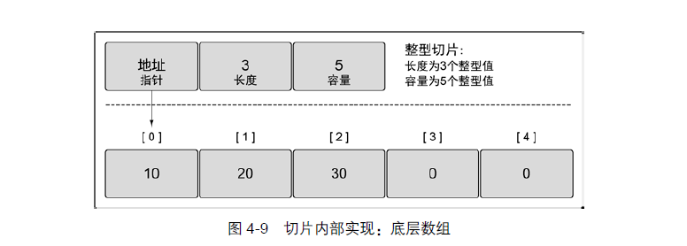
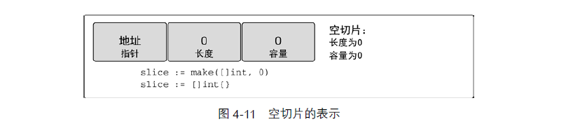
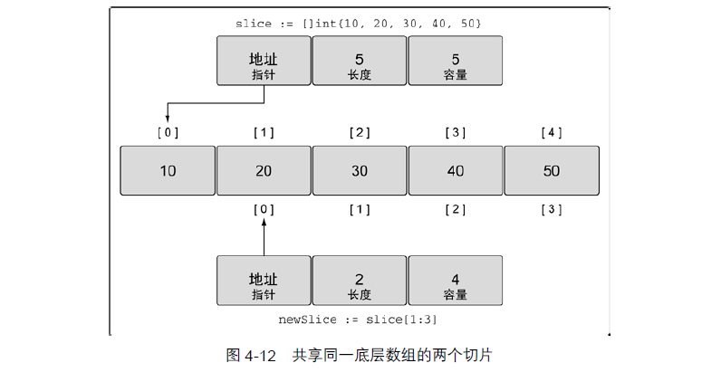

# 10. 切片

　　通过上一篇，我们学习了数组的使用，但是数组有一个致命的缺陷，那就是大小固定，这个特性并不能满足我们平时的开发需求，所以 Go 的切片由此诞生。

　　切片的内存分布是连续的，所以你可以把切片当做一个大小不固定的数组。

　　切片有三个字段的数据结构，这些数据结构包含 Go 语言需要操作底层数组的元数据，这 3 个字段分别是指向底层数组的指针、切片访问的元素的个数（即长度）和切片允许增长到的元素个数（即容量）。后面会进一步讲解长度和容量的区别。
​

#### 创建和初始化切片

　　切片的创建有多种方式，下面我们一一来讲解。

##### 使用 make 创建切片

```go
//创建了一个长度和容量都为5的切片
slice1:=make[[]string,5]
//创建了一个长度5，容量为10的切片
slice2:=make[[]string,5,10]
```

　　需要说明的是，**切片对应的底层数组的大小为指定的容量**，这个一定要谨记，比如对于上面的例子，我们指定了 `slice2`​ 的容量为 10，那么 `slice2`​ 对应的底层数组的大小就是 10。
上面虽然创建的切片对应底层数组的大小为 10，但是你不能访问索引值 5 以后的元素，比如，如果你运行以下代码，你就会发现：

```go
func main() {
    slice := make([]int, 4, 10)
    fmt.Println(slice[2])
    fmt.Println(slice[6])
}
```

　　运行结果如下：

```go
0
panic: runtime error: index out of range

goroutine 1 [running]:
main.main()
    E:/go-source/go-arr/main.go:19 +0x8d

Process finished with exit code 2
```

##### 通过切片字面量来创建切片

```go
func main() {
    slice := []int{1, 2, 4, 4}
}
```

　　**创建数组和创建切片非常相似，如果你在**  **[]**  **指定了值，那么创建的是一个数组，反之就是一个切片**。

　　切面字面量也可以指定切片的大小和容量，如下所示：

```go
func main() {
    slice := []int{99: 100}
}
```

　　上面创建的切片的大小和容量都为 100，并且初始化第 100 个元素的值为 100，只是在这种情况下，容量和长度是相等的。

##### 创建空切片

```go
func main() {
    slice1 := []int{}
    slice2 := make([]int, 0)
}
```

　　空切片在底层数组包含 0 个元素，也没有分配任何存储空间。想表示空集合时空切片很有用。
​

##### 切片的使用

　　切片的使用和数组是一模一样的：

```go
func main() {
    slice1 := []int{1,2,3,4}
    fmt.Println(slice1[1])
}
```

##### 切片创建切片

　　切片之所以称为切片，是因为它只是对应底层数组的一部分，看如下所示代码：

```go
func main() {
    slice := []int{10, 20, 30, 40, 50}
    newSlice := slice[1:3]
}
```

　　为了说明上面的代码，我们看下面的这张图：
​

　　第一个切片 slice 能够看到底层数组全部 5 个元素的容量，不过之后的 newSlice 就看不到。对于 newSlice，底层数组的容量只有 4 个元素。newSlice 无法访问到它所指向的底层数组的第一个元素之前的部分。所以，对 newSlice 来说，之前的那些元素就是不存在的。

　　**需要记住的是，现在两个切片共享同一个底层数组。如果一个切片修改了该底层数组的共享部分，另一个切片也能感知到**，运行下面的代码：

```go
func main() {
    slice := []int{10, 20, 30, 40, 50}
    newSlice := slice[1:3]

    slice[1] = 200
    fmt.Println(newSlice[0])
}
```

　　运行结果如下：

```go
200
```

　　切片只能访问到其长度内的元素。试图访问超出其长度的元素将会导致语言运行时异常，比如对上面的 `newSlice`​，他只能访问索引为 1 和 2 的元素（不包括 3），比如：

```go
func main() {
    slice := []int{10, 20, 30, 40, 50}
    newSlice := slice[1:3]

    fmt.Println(newSlice[3])
}
```

　　运行代码，控制台会报错：

```go
panic: runtime error: index out of range

goroutine 1 [running]:
main.main()
    E:/go-source/go-arr/main.go:20 +0x11
```

##### 子切片的容量

　　我们知道切片可以再生出切片，那么子切片的容量为多大呢？我们来测试一下：

```go
func main() {
    slice := make([]int, 2, 10)
    slice1 := slice[1:2]
    fmt.Println(cap(slice1))
}
```

　　控制台打印结果为：

```go
9
9
```

　　从结果我们可以推测，**子切片的容量为底层数组的长度减去切片在底层数组的开始偏移量**，比如在上面的例子中，slice1 的偏移值为 1，底层数组的大小为 10，所以两者相减，得到结果 9。

##### 向切片中追加元素

　　go 提供了 `append`​ 方法用于向切片中追加元素，如下所示：

```go
func main() {
    slice := make([]int, 2, 10)
    slice1 := slice[1:2]
    slice2 := append(slice1, 1)
    slice2[0] = 10001
    fmt.Println(slice)
    fmt.Println(cap(slice2))
}
```

　　输出结果如下：

```go
[0 10001]
9
```

　　此时 slice，slice1，slice2 共享底层数组，所以只要一个切片改变了某一个索引的值，会影响到所有的切片，还有一点值得注意，就是 slice2 的容量为 9，记住这个值。

　　为了说明问题，我把例子改为如下所示代码：

```go
func main() {
    slice := make([]int, 2, 10)
    slice1 := slice[1:2]
    slice2 := append(slice1, 1)
    slice2 = append(slice2, 1)
    slice2 = append(slice2, 1)
    slice2 = append(slice2, 1)
    slice2 = append(slice2, 1)
    slice2 = append(slice2, 1)
    slice2 = append(slice2, 1)
    slice2 = append(slice2, 1)
    slice2 = append(slice2, 1)
    slice2 = append(slice2, 1)
    slice2 = append(slice2, 1)
    slice2 = append(slice2, 1)
    slice2[0] = 10001
    fmt.Println(slice)
    fmt.Println(slice1)
    fmt.Println(cap(slice2))
}
```

　　此时我们再次打印结果，神奇的事情出现了：

```go
[0 0]
[0]
18
```

　　虽然我们改变 0 位置的值，但是并没有影响到原来的 slice 和 slice1，这是为啥呢？我们知道原始的 slice2 对应的底层数组的容量为 9，经过我们一系列的 append 操作，原始的底层数组已经无法容纳更多的元素了，此时 Go 会分配另外一块内存，把原始切片从位置 1 开始的内存复制到新的内存地址中，也就是说现在的 slice2 切片对应的底层数组和 slice 切片对应的底层数组完全不是在同一个内存地址，所以当你此时更改 slice2 中的元素时，对 slice 已经来说，一点儿关系都没有。

　　另外根据上面的打印结果，你也应该猜到了，当切片容量不足的时候，Go 会以原始切片容量的 2 倍建立新的切片，在我们的例子中 2\*9=18，就是这么粗暴。

##### 如何创建子切片时指定容量

　　在前面的例子中，我们创建子切片的时候，没有指定子切片的容量，所以子切片的容量和我们上面讨论的计算子切片的容量方法相等，那么我们如何手动指定子切片的容量呢？

　　在这里我们借用《Go 实战》中的一个例子：

```go
func main() {
    source := []string{"Apple", "Orange", "Plum", "Banana", "Grape"}
    slice := source[2:3:4]
    fmt.Println(cap(slice))
}
```

　　如果你仔细看的话，上面的子切片的生成方式和普通的切片有所不同，\[\] 里面有三个部分组成，，第一个值表示新切片开始元素的索引位置，这个例子中是 2。第二个值表示开始的索引位置（2）加上希望包括的元素的个数（1），2+1 的结果是 3，所以第二个值就是 3。为了设置容量，从索引位置 2 开始，加上希望容量中包含的元素的个数（2），就得到了第三个值 4。所以这个新的切片 slice 的长度为 1，容量为 2。还有一点大家一定要记住，你指定的容量不能比原先的容量，这里就是 source 的容量大，加入我们这样设置的话：

```go
func main() {
    source := []string{"Apple", "Orange", "Plum", "Banana", "Grape"}
    slice := source[2:3:10]
    fmt.Println(cap(slice))
}
```

　　运行结果如下，报错了，哈哈：

```go
panic: runtime error: slice bounds out of range [::10] with capacity 5

goroutine 1 [running]:
main.main()
    E:/learn-go/slice/main.go:7 +0x1d
```

#### 迭代切片

　　关于如何迭代切片，我们可以使用 range 配置来使用，如下：

```go
func main() {
    slice:=[]int{1,2,4,6}
    for _, value:=range slice{
        fmt.Println(value)
    }
}
```

　　关于迭代切片，**大家有一点需要注意，就以上面的例子为例，value 只是 slice 中元素的副本**，为啥呢？我们来验证这一点：

```go
func main() {
    slice:=[]int{1,2,4,6}
    for index, value:=range slice{
        fmt.Printf("value[%d],indexAddr:[%X],valueAddr:[%X],sliceAddr:[%X]\n",value,&index,&value,&slice[index])
    }
}
```

　　控制台打印结果如下：

```go
value[1],indexAddr:[C00000A0B8],valueAddr:[C00000A0D0],sliceAddr:[C000010380]
value[2],indexAddr:[C00000A0B8],valueAddr:[C00000A0D0],sliceAddr:[C000010388]
value[4],indexAddr:[C00000A0B8],valueAddr:[C00000A0D0],sliceAddr:[C000010390]
value[6],indexAddr:[C00000A0B8],valueAddr:[C00000A0D0],sliceAddr:[C000010398]
```

　　从上面的结果可以看到 index 和 value 的地址始终是不变的，所以它们始终是同一个变量，只是变量引用地址的内容发生了变化，从而验证迭代的时候，只能是切片元素的副本，最后看看 sliceAddr 代表的地址相隔 8 个字节，因为在 64 位系统上，每一个 int 类型的大小为 8 个字节。

#### 函数间传递切片

　　函数间传递切片，也是以值的方式传递的，但是你还记得这篇博文开头给出的切片的布局么？

切片由三个部分组成，包括指向底层数组的指针，当前切片的长度，当前切片的容量，所以切片本身并不大，我们来测试一个切片的大小：

```go
func main() {
    slice:=[]int{1,2,4,6}
    fmt.Println(unsafe.Sizeof(slice))
}
```

　　测试结果为：

```go
24
```

　　也就是这个 slice 切片的大小为 24 字节，所以当切片作为参数传递的时候，几乎没有性能开销，还有很重要的一点，参数生成的副本的地址指针和原始切片的地址指针是一样的，因此，如果你在函数里面修改了切片，那么会影响到原始的切片，我们来验证这点：

```go
func main() {
    slice:=[]int{1,2,4,6}
    handleSlice(slice)
    fmt.Println(slice)
}
```

　　打印结果：

```go
[100 2 4 6]
```
