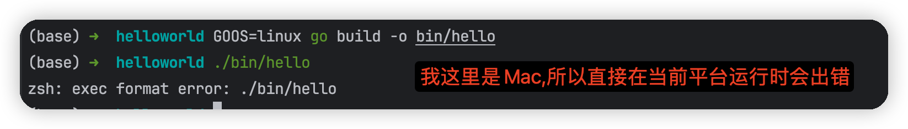
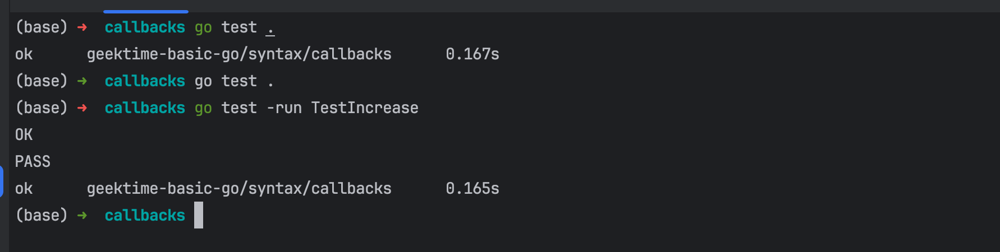
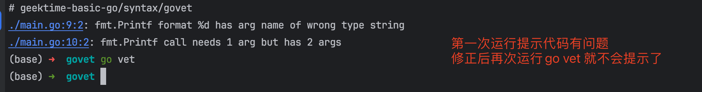

# 4. Go 常用命令

　　以下是一些常用的Go命令，这些命令可以帮助您在Go开发中进行编译、测试、运行和管理依赖项等任务。

|命令|描述|
| -------------| ---------------------------------------------------|
|go bug|启动一个用于报告bug的工具。|
|go build|编译Go程序包及其依赖项。|
|go clean|删除编译生成的对象文件和缓存文件。|
|go doc|显示有关包或符号的文档。|
|go env|打印有关Go环境的信息。|
|go fix|更新包以使用新的API。|
|go fmt|使用gofmt重新格式化Go包的源代码。|
|go generate|通过处理源代码来生成Go文件。|
|go get|将依赖项添加到当前模块并安装它们。|
|go install|编译并安装包及其依赖项。|
|go list|列出包或模块的信息。|
|go mod|用于模块维护,包括初始化模块、添加和更新依赖项等。|
|go work|用于工作区维护,例如查看、清理或打印工作区信息。|
|go run|编译并运行Go程序。|
|go test|运行包的测试。|
|go tool|运行指定的Go工具。|
|go version|打印Go的版本信息。|
|go vet|检查 Go 源码并报告可疑的错误。|

### go build

　　Go 是强类型编译型语言，因此编译时会将所有依赖编译进同一个二进制文件。

　　参数介绍

* ​`-o`​ 指定输出的文件名，可以带上路径，例如 `go build -o a/b/c`​
* ​`-i`​ 安装相应的包，编译+`go install`​
* ​`-a`​ 更新全部已经是最新的包的，但是对标准包不适用
* ​`-n`​ 把需要执行的编译命令打印出来，但是不执行，这样就可以很容易的知道底层是如何运行的
* ​`-p n`​ 指定可以并行可运行的编译数目，默认是CPU数目
* ​`-race`​ 开启编译的时候自动检测数据竞争的情况，目前只支持64位的机器
* ​`-v`​ 打印出来正在编译的包名
* ​`-work`​ 打印出来编译时候的临时文件夹名称，并且如果已经存在的话就不要删除
* ​`-x`​ 打印出来执行的命令，其实就是和`-n`​的结果类似，只是这个会执行
* ​`-ccflags 'arg list'`​ 传递参数给5c, 6c, 8c 调用
* ​`-compiler name`​ 指定相应的编译器，gccgo还是gc
* ​`-gccgoflags 'arg list'`​ 传递参数给gccgo编译连接调用
* ​`-gcflags 'arg list'`​ 传递参数给5g, 6g, 8g 调用
* ​`-installsuffix suffix`​ 为了和默认的安装包区别开来，采用这个前缀来重新安装那些依赖的包，`-race`​的时候默认已经是`-installsuffix race`​,大家可以通过`-n`​命令来验证
* ​`-ldflags 'flag list'`​ 传递参数给5l, 6l, 8l 调用
* ​`-tags 'tag list'`​ 设置在编译的时候可以适配的那些tag，详细的tag限制参考里面的 Build Constraints

　　新建 main.go 的源文件,键入下面这些代码:

```go
package main import "fmt" func main() { fmt.Println("你好, 兰州!") }
```

　　打开终端，通过如下命令来编译和运行这个文件了：

```bash
go build main.go ./main
```

#### 1.1 指定输出目录

* go build –o \[目录\]

```bash
mkdir bin # 创建bin 目录 go build -o bin/hello # 编译hello ./bin/hello # 
```

#### 1.2 常用环境变量设置编译操作系统和 CPU 架构

* 设置编译操作系统

```bash
# 设置 GOOS 环境变量为 "linux"，指定目标操作系统为 Linux # 然后使用 go build 编译当前目录中的 Go 代码，并将输出文件命名为 bin/hello GOOS=linux go build -o bin/hello ./bin/hello
```

​​

* 设置编译CPU架构

```bash
# 设置 GOOS 环境变量为 "linux"，指定目标操作系统为 Linux # 设置 GOARCH 环境变量为 "amd64"，指定目标 CPU 架构为 64 位 x86 # 然后使用 go build 编译当前目录中的 Go 代码，并将输出文件命名为 bin/hello GOOS=linux GOARCH=amd64 go build -o bin/hello
```

#### 1.3 查看支持的操作系统和CPU架构

　　要查看Go支持的所有操作系统和CPU架构的列表，您可以查看Go源代码中的 `syslist.go`​ 文件。这个文件位于 `$GOROOT/src/go/build/syslist.go`​。下面是一个示例命令，用于查看支持列表：

```bash
cat $GOROOT/src/go/build/syslist.go
```

　　这将打印出Go支持的操作系统和CPU架构的完整列表。

　　通过这些示例，您可以了解如何在Go中指定输出目录和设置编译操作系统和CPU架构。这些功能非常有用，特别是在需要交叉编译或控制输出位置时。

　　‍

### god mod

　　go mod 是Golang 1.11 版本引入的官方包（[package](https://so.csdn.net/so/search?q=package&spm=1001.2101.3001.7020)）依赖管理工具，用于解决之前没有地方记录依赖包具体版本的问题，方便依赖包的管理。

```bash
go mod download  # 下载模块到本地缓存，缓存路径是 $GOPATH/pkg/mod/cache
go mod edit      # 是提供了命令版编辑 go.mod 的功能，例如 go mod edit -fmt go.mod 会格式化 go.mod
go mod graph     # 把模块之间的依赖图显示出来
go mod init      # 初始化模块（例如把原本dep管理的依赖关系转换过来）
go mod tidy      # 增加缺失的包，移除没用的包
go mod vendor    # 把依赖拷贝到 vendor/ 目录下
go mod verify    # 确认依赖关系
go mod why       # 解释为什么需要包和模块
```

　　‍

### go test

　　​`go test`​ 命令用于运行Go程序包中的测试。Go的测试是通过在与被测试的代码文件相同目录下的 `_test.go`​ 文件中编写测试函数来完成的。这里介绍几个常用的参数：

* ​`-bench regexp`​ 执行相应的benchmarks，例如 `-bench=.`​
* ​`-cover`​ 开启测试覆盖率
* ​`-run regexp`​ 只运行regexp匹配的函数，例如 `-run=Array`​ 那么就执行包含有Array开头的函数
* ​`-v`​ 显示测试的详细命令

　　以下是使用 `go test`​ 命令的基本用法：

1. 进入包含要测试的Go代码的目录。
2. 确保在该目录下有一个或多个 `_test.go`​ 文件，其中包含测试函数。测试函数的命名必须以 `Test`​ 开头，后跟被测试函数的名称，并接受一个名为 `t *testing.T`​ 的参数。
3. 运行以下命令来执行测试：

```bash
go test
```

　　​`go test`​ 将自动查找并运行当前目录和子目录中的所有测试文件，并输出测试结果。它将显示通过的测试数量、失败的测试数量以及测试覆盖率等信息。

　　如果您想只运行特定的测试文件或测试函数，可以在 `go test`​ 后面提供测试文件或测试函数的名称。例如，要运行名为 `TestMyFunction`​ 的测试函数，可以执行以下命令：

```bash
go test -run TestMyFunction
```

　　​`go test`​ 还支持许多其他标志和选项，用于控制测试的行为，例如覆盖率分析、并行测试等。您可以使用 `go help test`​ 命令查看完整的 `go test`​ 文档以获取更多详细信息。

　　这里简单举个栗子, 新建 main\_test.go 的源文件,键入下面这些代码:

```go
package main import ( "fmt" "testing" ) func add(a, b int) int { return a + b } func TestIncrease(t *testing.T) { t.Log("Start testing") result := add(1, 2) if result == 3 { fmt.Println("OK") } else { fmt.Println("有问题!") } }
```

　　这里我们队add 这个函数进行测试,验证输出结果,运行如下命令进行测试:

```go
# 运行当前目录及其子目录下的所有测试文件中的测试函数 go test . # 运行指定名称的测试函数（例如，TestIncrease） go test -run TestIncrease
```

​​

　　go test ./… 运行测试 go test命令扫描所有\*\_test.go为结尾的文件，**惯例是将测试代码与正式代码放在同目录（同一个包）**， 如 foo.go 的测试代码一般写在 foo\_test.go

　　‍

### go vet

　　​`go vet`​ 是 Go 编程语言的一个静态分析工具，用于检查 Go 代码中可能包含的潜在错误、不规范的代码和常见问题。它的主要目标是帮助开发人员识别和修复可能导致程序运行时错误的问题，以提高代码的质量和可靠性。

* **\-all**: 执行所有可用的 `go vet`​ 检查。默认情况下，`go vet`​ 只运行一些常见的检查，但使用 `-all`​ 标志可以启用所有检查。
* **\-shadow**: 检查代码中的变量阴影问题。这个标志用于检测局部变量覆盖外部变量的情况。
* **\-printfuncs list**: 自定义 `Printf`​ 样式函数的检查。您可以指定一个逗号分隔的函数列表，`go vet`​ 将检查是否正确使用了这些函数来格式化字符串。
* **\-composites**: 检查使用复合文字（composite literals）时的问题。这个标志用于检测复合文字的使用是否符合规范。
* **\-copylocks**: 检查复制锁的问题。这个标志用于检测代码中是否存在复制锁，以及它们是否正确使用。
* **\-lostcancel**: 检查丢失的上下文取消问题。这个标志用于检测代码中是否存在未正确处理的上下文取消。
* **\-methods**: 检查接口方法问题。这个标志用于检测接口是否被正确实现。
* **\-printf**: 检查格式化字符串问题。这个标志用于检测 `Printf`​ 样式的格式化字符串是否正确匹配参数。
* **\-unreachable**: 检查不可达代码问题。这个标志用于检测不会被执行的代码块。
* **\-shadowstrict**: 启用更严格的变量阴影检查。这个标志用于检测更多的变量阴影情况。

　　举个简单例子,比如printf调用中的参数不匹配:

```go
package main import ( "fmt" ) func main() { name := "testing" fmt.Printf("%d\n", name) fmt.Printf("%s\n", name, name) }
```

　　运行命令:

```go
go vet
```

​​

　　‍

### go clean

　　用于清理构建过程中生成的临时文件和构建缓存。它有助于确保项目处于干净的状态，删除构建过程中生成的中间文件，以便重新构建项目时不会受到旧文件的影响。

　　参数介绍

* ​`-i`​ 清除关联的安装的包和可运行文件，也就是通过go install安装的文件
* ​`-n`​ 把需要执行的清除命令打印出来，但是不执行，这样就可以很容易的知道底层是如何运行的
* ​`-r`​ 循环的清除在import中引入的包
* ​`-x`​ 打印出来执行的详细命令，显示 `go clean`​ 执行的每个步骤。
* **`go clean -testcache`​**: 使用 `-testcache`​ 标志来清除测试缓存。这将删除与测试相关的缓存文件。
* **`go clean -modcache`​**: 使用 `-modcache`​ 标志来清除模块缓存。这将删除模块依赖项的缓存文件。

　　‍

### go fmt

　　用于格式化源代码文件，以确保它们符合 Go 语言的编码规范和格式化约定。`go fmt`​ 命令的主要目的是使代码在不同项目和团队中保持一致的风格，提高代码的可读性和可维护性。

　　参数介绍

* ​`-l`​ 显示那些需要格式化的文件
* ​`-w`​ 把改写后的内容直接写入到文件中，而不是作为结果打印到标准输出。
* ​`-r`​ 添加形如“a\[b:len(a)\] -> a\[b:\]”的重写规则，方便做批量替换
* ​`-s`​ 简化文件中的代码
* ​`-d`​ 显示格式化前后的diff而不是写入文件，默认是false
* ​`-e`​ 打印所有的语法错误到标准输出。如果不使用此标记，则只会打印不同行的前10个错误。
* ​`-cpuprofile`​ 支持调试模式，写入相应的cpufile到指定的文件

　　‍

### go get

　　用于下载、安装和更新 Go 语言包（也称为模块）以及它们的依赖项。这个命令通常用于获取外部包。

　　参数介绍：

* ​`-d`​ 只下载不安装
* ​`-f`​ 只有在包含了`-u`​参数的时候才有效，不让`-u`​去验证import中的每一个都已经获取了，这对于本地fork的包特别有用
* ​`-fix`​ 在获取源码之后先运行fix，然后再去做其他的事情
* ​`-t`​ 同时也下载需要为运行测试所需要的包
* ​`-u`​ 强制使用网络去更新包和它的依赖包
* ​`-v`​ 显示执行的命令

　　看一个实际的例子：

　　在本地通过源码安装 Go 的调试器 Delve，可以这么做：

```bash
go get github.com/go-delve/delve/cmd/dlv
```

　　‍

### go install

　　用于编译和安装 Go 包或程序。当你运行 `go install`​ 时，它会编译当前目录中的 Go 代码，并将生成的二进制可执行文件放置在你的 Go 工作空间的 `bin`​ 目录中（通常位于 `GOPATH`​ 中）。

　　参数介绍：

* ​`-i`​:安装到`GOBIN`​环境变量指定的目录,默认为`GOPATH/bin`​。
* ​`-n`​:打印将要执行的命令,但不执行。
* ​`-v`​:显示执行的命令。
* ​`-x`​:打印执行的命令及其参数。
* ​`-work`​:打印临时工作目录的名称,然后退出。
* ​`-pcgo`​:针对cgo enabled的包,调用gcc来编译。
* ​`-pkgdir`​:安装完成后的包文件存放目录。
* ​`-tags`​:构建标签,用于选择性地编译相应的代码。
* ​`-trimpath`​:移除文件名中的GOPATH路径前缀。
* ​`-mod`​:模块下载和解析模式,可设为mod、vendor等。

　　‍

### go tool

　　用于运行各种Go语言工具,主要的参数包括:

* ​`-n`​:打印将要执行的命令,但不执行。
* ​`-x`​:打印执行的命令及其参数。
* ​`-V`​:打印go tool和执行命令的版本信息。
* ​`-e`​:只有在命令执行失败时才打印输出。
* ​`-json`​:以JSON格式输出结果。

　　常见的子命令及其用途:

* ​`cover`​:测试覆盖率分析工具。
* ​`fix`​:代码迁移工具,可以自动更新旧代码到新语法。
* ​`fmt`​:格式化Go代码的工具。
* ​`vet`​:源码检查工具,用于发现代码错误。
* ​`doc`​:显示包的文档。
* ​`pprof`​:分析和查看分析数据。
* ​`trace`​:编译时跟踪工具。
* ​`link`​:链接器工具,查看二进制文件依赖。
* ​`addr2line`​:转换地址为文件/行号。
* ​`api`​:Go API处理工具。

　　‍

### go generate

　　这个命令是从Go1.4开始才设计的，用于在编译前自动化生成某类代码。`go generate`​和`go build`​是完全不一样的命令，通过分析源码中特殊的注释，然后执行相应的命令。这些命令都是很明确的，没有任何的依赖在里面。而且大家在用这个之前心里面一定要有一个理念，这个`go generate`​是给开发者用的，不是给使用这个包的人用的，是方便生成一些代码的。

　　举一个简单的例子，例如经常会使用`yacc`​来生成代码，那么常用这样的命令：

```bash
go tool yacc -o gopher.go -p parser gopher.y
```

　　\-o 指定了输出的文件名， -p指定了package的名称，这是一个单独的命令，如果想让`go generate`​来触发这个命令，那么就可以在当前目录的任意一个`xxx.go`​文件里面的任意位置增加一行如下的注释：

```bash
//go:generate go tool yacc -o gopher.go -p parser gopher.y
```

　　这里注意了，`//go:generate`​是没有任何空格的，这其实就是一个固定的格式，在扫描源码文件的时候就是根据这个来判断的。

　　所以可以通过如下的命令来生成，编译，测试。如果`gopher.y`​文件有修改，那么就重新执行`go generate`​重新生成文件就好。

```bash
$ go generate $ go build $ go test
```

　　‍

### go doc

　　在Go1.2版本之前还支持`go doc`​命令，但是之后全部移到了godoc这个命令下，需要这样安装`go get golang.org/x/tools/cmd/godoc`​

　　很多人说go不需要任何的第三方文档，例如chm手册之类的，因为它内部就有一个很强大的文档工具。

　　如何查看相应package的文档呢？

　　例如builtin包，那么执行`godoc builtin`​

　　如果是http包，那么执行`godoc net/http`​

　　查看某一个包里面的函数，那么执行`godoc fmt Printf`​

　　也可以查看相应的代码，执行`godoc -src fmt Printf`​

　　通过命令在命令行执行 godoc -http=:端口号 比如`godoc -http=:8080`​。然后在浏览器中打开`127.0.0.1:8080`​，将会看到一个golang.org的本地copy版本，通过它可以查询pkg文档等其它内容。如果设置了GOPATH，在pkg分类下，不但会列出标准包的文档，还会列出本地`GOPATH`​中所有项目的相关文档，这对于经常被墙的用户来说是一个不错的选择。

　　‍

### go run

　　用于编译并运行 Go 源代码文件。它是一个方便的工具，可用于在不需要显式构建可执行文件的情况下直接运行 Go 程序。常用的参数包括:

* ​`-n`​:打印执行的命令,但不执行。
* ​`-x`​:打印执行的命令及参数。
* ​`-race`​:启用数据竞争检测。
* ​`-gcflags`​:传递参数给编译器,如优化级别等。
* ​`-buildmode`​:指定编译模式,如共享库或插件等。
* ​`-ldflags`​:传递参数给链接器。
* ​`-trimpath`​:去除输出中的文件路径信息。
* ​`-memprofile`​:写入内存概要文件。
* ​`-cpuprofile`​:写入CPU概要文件。
* ​`-blockprofile`​:写入阻塞概要文件。
* ​`-timeout`​:执行超时时间。
* ​`-args`​:传递参数给程序,放在最后。

　　例如:

```bash
go run -race -ldflags "-s -w" main.go args
```

　　此命令会启用竞争检测和移除调试信息,并传递args参数给main.go执行。
