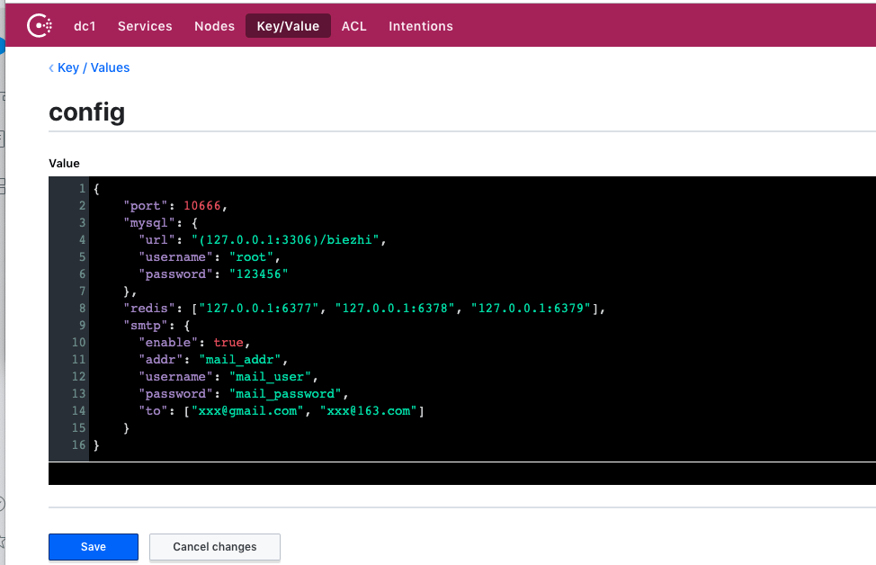

# viper

* go 开发工具，主要是用于处理各种格式的配置文件，简化程序配置的读取问题
* viper 支持：

  * 设置默认配置
  * 支持读取 JSON TOML YAML HCL 和 Java 属性配置文件
  * 监听配置文件变化，实时读取读取配置文件内容
  * 读取环境变量值
  * 读取远程配置系统 (etcd Consul) 和监控配置变化
  * 读取命令 Flag 值
  * 读取 buffer 值
  * 读取确切值

## 安装

```bash
go get github.com/fsnotify/fsnotify 
go get github.com/spf13/viper
```

## viper 的基本用法

### 配置文件

* json 配置文件 (config.json)

  ```json
  {
  "port": 10666,
  "mysql": {
    "url": "(127.0.0.1:3306)/biezhi",
    "username": "root",
    "password": "123456"
  },
  "redis": ["127.0.0.1:6377", "127.0.0.1:6378", "127.0.0.1:6379"],
  "smtp": {
    "enable": true,
    "addr": "mail_addr",
    "username": "mail_user",
    "password": "mail_password",
    "to": ["xxx@gmail.com", "xxx@163.com"]
  }
  }
  ```
* yaml 配置文件 (config1.yaml)

  ```yaml
  port: 10666
  mysql:
  url: "(127.0.0.1:3306)/biezhi"
  username: root
  password: 123456
  redis:
  - 127.0.0.1:6377
  - 127.0.0.1:6378
  - 127.0.0.1:6379
  smtp:
  enable: true
  addr: mail_addr
  username: mail_user
  password: mail_password
  to: 
  - xxx@gmail.com
  - xxx@163.com

  ```

### 本地配置文件读取方式

* 将上述两个配置文件和下面的 main.go 放在统一目录之下，即可实现读取配置文件

```go
package main

import (
    "fmt"
    "log"

    "github.com/spf13/viper"
)

func init() {
    // viper.SetConfigName("config1") // 读取yaml配置文件
    viper.SetConfigName("config") // 读取json配置文件
    //viper.AddConfigPath("/etc/appname/")   //设置配置文件的搜索目录
    //viper.AddConfigPath("$HOME/.appname")  // 设置配置文件的搜索目录
    viper.AddConfigPath(".")      // 设置配置文件和可执行二进制文件在用一个目录
    if err := viper.ReadInConfig(); err != nil {
        if _, ok := err.(viper.ConfigFileNotFoundError); ok {
            // Config file not found; ignore error if desired
            log.Println("no such config file")
        } else {
            // Config file was found but another error was produced
            log.Println("read config error")
        }
        log.Fatal(err) // 读取配置文件失败致命错误
    }
}

func main() {
    fmt.Println("获取配置文件的port", viper.GetInt("port"))
    fmt.Println("获取配置文件的mysql.url", viper.GetString(`mysql.url`))
    fmt.Println("获取配置文件的mysql.username", viper.GetString(`mysql.username`))
    fmt.Println("获取配置文件的mysql.password", viper.GetString(`mysql.password`))
    fmt.Println("获取配置文件的redis", viper.GetStringSlice("redis"))
    fmt.Println("获取配置文件的smtp", viper.GetStringMap("smtp"))
}

```

* 代码详解

  * viper.SetConfigName ("config") 设置配置文件名为 config, 不需要配置文件扩展名，配置文件的类型 viper 会自动根据扩展名自动匹配.
  * viper.AddConfigPath (".") 设置配置文件搜索的目录，. 表示和当前编译好的二进制文件在同一个目录。可以添加多个配置文件目录，如在第一个目录中找到就不不继续到其他目录中查找.
  * viper.ReadInConfig () 加载配置文件内容
  * viper.Get\*\*\* 获取配置文件中配置项的信息

### viper 的一些高级用法

* viper 设置配置项的默认值

```bash
// set default config
viper.SetDefault("ContentDir", "content")
viper.SetDefault("LayoutDir", "layouts")
viper.SetDefault("Taxonomies", map[string]string{"tag": "tags", "category": "categories"})

fmt.Println(viper.GetBool("ContentDir"))
fmt.Println(viper.GetString("LayoutDir"))
fmt.Println(viper.GetStringMapString("Taxonomies"))

```

* 监听和重新读取配置文件

  * import "github.com/fsnotify/fsnotify"

```go
viper.WatchConfig()
viper.OnConfigChange(func(e fsnotify.Event) {
    //viper配置发生变化了 执行响应的操作
    fmt.Println("Config file changed:", e.Name)
})

```

### 从环境变量变量中读取

* 主要用到的是下面三个个方法

```go
// AutomaticEnv has Viper check ENV variables for all.
// keys set in config, default & flags
AutomaticEnv()

// BindEnv binds a Viper key to a ENV variable.
// ENV variables are case sensitive.
// If only a key is provided, it will use the env key matching the key, uppercased.
// EnvPrefix will be used when set when env name is not provided.
BindEnv(string…) : error

// SetEnvPrefix defines a prefix that ENVIRONMENT variables will use.
// E.g. if your prefix is "spf", the env registry will look for env
// variables that start with "SPF_".
SetEnvPrefix(string)

```

* 简单的使用 demo 如下所示

```go
package main 

import (
    "fmt"
    "os"

    "github.com/spf13/viper"
)

func main() {
    prefix := "PROJECTNAME"
    envs := map[string]string{
        "LOG_LEVEL":      "INFO",
        "MODE":           "DEV",
        "MYSQL_USERNAME": "root",
        "MYSQL_PASSWORD": "xxxx",
    }
    for k, v := range envs {
        os.Setenv(fmt.Sprintf("%s_%s", prefix, k), v)
    }

    v := viper.New()
    v.SetEnvPrefix(prefix)
    v.AutomaticEnv()

    for k, _ := range envs {
        fmt.Printf("env `%s` = %s\n", k, v.GetString(k))
    }
}
```

### 获取远程配置

* 使用 github.com/spf13/viper/remote 包 import \_ "github.com/spf13/viper/remote"
* Viper 可以从例如 etcd、Consul 的远程 Key/Value 存储系统的一个路径上，读取一个配置字符串（JSON, TOML, YAML 或 HCL 格式）. 这些值优先于默认值，但会被从磁盘文件、命令行 flag、环境变量的配置所覆盖.
* 本人对 consul 比较熟悉，用它来做例子

  * 首先在本地启动 consul
  * 并在 consul 上设置名为 config 的 json 配置文件

    
  * 代码如下

  ```go
  package main

  import (
      "fmt"
      "log"

      "github.com/spf13/viper"
      _ "github.com/spf13/viper/remote"
  )

  func main() {
      v := viper.New()
      v.AddRemoteProvider("consul", "localhost:8500", "config")
      v.SetConfigType("json") // Need to explicitly set this to json
      if err := v.ReadRemoteConfig(); err != nil {
            log.Println(err)
            return
      }

      fmt.Println("获取配置文件的port", v.GetInt("port"))
      fmt.Println("获取配置文件的mysql.url", v.GetString(`mysql.url`))
      fmt.Println("获取配置文件的mysql.username", v.GetString(`mysql.username`))
      fmt.Println("获取配置文件的mysql.password", v.GetString(`mysql.password`))
      fmt.Println("获取配置文件的redis", v.GetStringSlice("redis"))
      fmt.Println("获取配置文件的smtp", v.GetStringMap("smtp"))
  }

  ```

### 从 io.Reader 中读取配置信息

* 首先给大家来段例子

```go
package main

import (
    "bytes"
    "fmt"

    "github.com/spf13/viper"
)

func main() {
    v := viper.New()
    v.SetConfigType("json") // 设置配置文件的类型

    // 配置文件内容
    var jsonExample = []byte(`
{
  "port": 10666,
  "mysql": {
    "url": "(127.0.0.1:3306)/biezhi",
    "username": "root",
    "password": "123456"
  },
  "redis": ["127.0.0.1:6377", "127.0.0.1:6378", "127.0.0.1:6379"],
  "smtp": {
    "enable": true,
    "addr": "mail_addr",
    "username": "mail_user",
    "password": "mail_password",
    "to": ["xxx@gmail.com", "xxx@163.com"]
  }
}
`)
    //创建io.Reader
    v.ReadConfig(bytes.NewBuffer(jsonExample))

    fmt.Println("获取配置文件的port", v.GetInt("port"))
    fmt.Println("获取配置文件的mysql.url", v.GetString(`mysql.url`))
    fmt.Println("获取配置文件的mysql.username", v.GetString(`mysql.username`))
    fmt.Println("获取配置文件的mysql.password", v.GetString(`mysql.password`))
    fmt.Println("获取配置文件的redis", v.GetStringSlice("redis"))
    fmt.Println("获取配置文件的smtp", v.GetStringMap("smtp"))
}
```

* 这个功能日常的使用情况较少，例如这样的一个情景：

  * 配置文件放在 oss 上或者 github 某个私有仓库上，viper 并没有提供直接的接口去获取，这样我们可以基于第三方托管平台的 sdk 写一套获取配置文件 bytes 的工具，将结果放入 io.Reader 中，再进行配置文件的解析。
* 上述流程感觉好像比较鸡肋，复杂了整个流程：我既然可以通过第三方的 sdk 直接拿到 bytes，为何不自己直接进行解析呢？而要借助 viper 来解析。可能有人会说，配置文件如果格式不同呢？确实，viper 的出现就是为了针对多种格式的配置文件。但是在正式的项目中，配置文件的格式一般不会变，可以自己写一套解析的工具，也就没有使用 viper 的需求了。而且对于某一种特定格式的配置文件（JSON，YAML...），Golang 已经有足够强大的包来进行解析了。
* 但是不得不承认 viper 的实现确实是很流弊的。在一般的快速开发过程中，直接使用 viper 确实可以帮助我们省去很多的麻烦，让我们集中精力针对于业务逻辑的实现。
* 个人觉得可以根据实际需求在 viper 再进行一层封装，接入一些常用的第三方平台的 sdk（github，aliyun oss...）, 这样即可以读取本地配置文件，也可以读取远端的配置文件，可以通过命令行参数来实现 dev 模式和 deploy 模式的切换。
