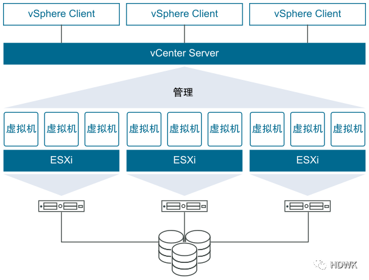
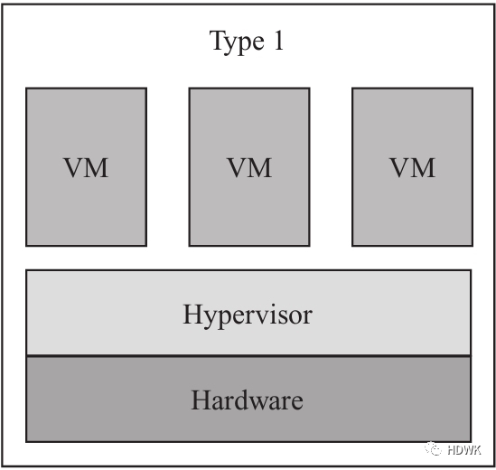
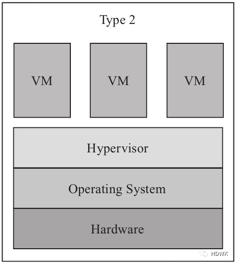
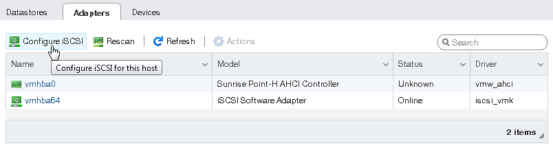
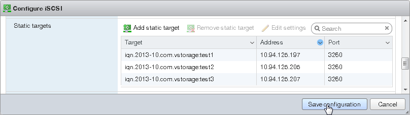
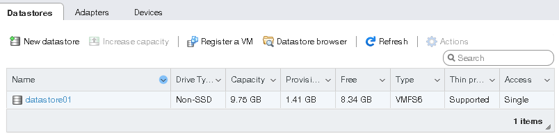

# ESXi

服务器的虚拟化是指将服务器的物理资源抽象成逻辑资源，让一台服务器变成若干台相互隔离的虚拟服务器。【省钱】

**vSphere 的两个核心组件是ESXi和vCenter Server**。

**ESXi** 是用于创建并运行虚拟机和虚拟设备的虚拟化平台。
ESXi 是直接安装在物理机器上的，是采用Linux内核的虚拟化专用操作系统。Esxi主机是物理机器真是存在的一个物理主机（当然也可以是虚拟机），其实就是一个装了系统的电脑。ESXI是一个系统，就跟windows，linux系统一样的一个系统。

**vCenter server** 是一个中心化的管理应用。你可以通过它管理所有的虚拟机和 ESXi 物理机。vSphere client 可以通过访问 vCenter Server 来管理 EXSi 服务器。



# VMware ESXi

VMware ESXi直接安装在物理硬件上将所有的硬件资源虚拟化，然后再在搭建的虚拟化平台上安装多个Windows或Linux等操作系统，这些操作系统通过网络对外业务进行服务，这与我们工程师经常使用的VMware Workstation，Oracle VM VirtualBox，hyper-V截然不同，它们被分类为【寄居架构虚拟机】。

Type1：裸金属架构虚拟机（全虚拟化）  Type2：寄居架构虚拟机（半虚拟化）

## 1. ESXi系统镜像获取

目前最新的VMware ESXi是7.0版本（现在官方的叫法是VMware vSphere 7.0）现有免费授权开放，免费版本高级功能有限制，vCenter Server也有60天体验授权，之后要收费，对于一般的服务器使用免费版ESXi绰绰有余，也可以不用vCenter Server来管理，使用HTML5网页来部署以及管理完全足够。

获取VMware vSphere 7.0（ESXi 7.0）的光盘镜像需要在VMware的官网上注册会员，注册时的邮箱保持真实就ok了 其他随便写

1. 登录  https://www.vmware.com/cn.html  点击免费产品下载，选择vSphere Hypervisor 进入下载页面；
2. 记录许可信息栏的“密钥”然后点击手动下载就能获取ESXi 7.0的安装光盘文件。（同一个密钥允许安装100台服务器）；

## 2. ESXi 7启动盘制作

除特殊需要，一般情况下服务器是不带光驱的，所以建议还是将ESXi 7的系统使用U盘安装。
简单的介绍下rufus 这是用来制作启动盘的工具，大小只有3.5M 作者在Github上进行了开源，官网地址：https://rufus.ie/

1. 右键鼠标使用管理员权限打开rufus，选择要制作启动盘的U盘盘符，选择ESXi 7.0安装光盘文件位置、设置好分区表类型 剩余的选项默认，点击开始即可；
2. 此时会弹出对话框警告会格式化U盘，点击确定即可；

## 3. 开启BIOS CPU虚拟化

ESXi 虚拟化平台需要开启CPU虚拟化技术的支持，我这里服务器是华硕主板+Inter处理器，其他类型请自行百度。

```txt
BIOS：Advanced（高级菜单）内的CPU Configuration（处理器设置），其中就有一项：Intel Virtualization Technology（Intel虚拟化技术），把它改为Enabled（启用）就可以了，保存后即可。
```

## 4. ESXi7.0安装

1. 将刚才制作好的安装U盘插在服务器主机上按下开机键，选择系统从U盘启动；
2. 等待安装文件载入内存之后会出现ESXi的欢迎界面 按下Enter 按键继续安装；
3. 接下来是一个用户协议界面 按下F11 接收用户协议，安装程序进入下个阶段；
4. 安装程序扫描到本地存储设备之后会在这个界面呈现，用光标选中本地磁盘按下Enter键继续安装；
5. 设置root账户密码然后按下Enter继续 （密码复杂度要求：1、大于等于7位字符；2、包含大小写和特殊字符）；
6. 安装结束后会要求重启服务器 按下Enter后服务器会重启（拔掉U盘）；

## 5. ESXi 7设置

1. 在ESXi平台的主界面按下F2按键，键入root账户的密码登录管理员权限；

|设置项目|补充说明|
| ------------------------------| ----------------------------------------------------------------------------------------------------------------------------------------------------|
|Configure Password|配置root密码|
|Configure Lockdown Mode|配置锁定模式。启用锁定模式后，除vpxuser以外的任何用户都没有身份验证权限，也无法直接对ESXi执行操作。锁定模式将强制所有操作都通过vCenterServer执行。|
|Configure Management Network|配置网络|
|Restart Management Network|重启网络|
|Test Management Network|使用Ping命令测试网络|
|Network Restore Options|还原网络配置|
|Configure Keyboard|配置键盘布局|
|Troubleshooting Options|故障排除设置|
|View System Logs|查看系统日志|
|View Support Information|查看支持信息|
|Reset System Configuration|还原系统配置 |

2. 选中 IPv4 Configuration 进行IPv4地址设置；
3. 按照实际需求进入 DNS Configuration 配置DNS 之后按Enter确认；
4. 网络配置完毕之后按ESC键退出网络设置 弹出对话框提示是否保存网络设置,输入“Y”确认变更；
5. 选中 Test Management Network 按下Enter测试网络是否链接；
6. 按下ESC退出root权限拔掉显示器走人，接下来没它啥事了；

## 6. 网络链接

1. 安装完ESXi主机后，系统会默认创建一个虚拟交换机vSwitch，将物理网卡作为虚拟交换机的上行链路端口，并与物理交换机连接对外提供服务；
2. 如果有需要可以在此基础上新建虚拟交换机vSwitch；
3. vSwitch支持VLAN划分功能，可以将业务相关的虚拟机接入同一个VLAN中；

## 7. 开启远程桌面

1. 在搜索栏内输入【远程 或者 Remot】关键字，选择搜索结果中的【远程桌面设置】；
2. 将【启用远程桌面】的选项开关拨到ON，下面的第一个显示设置中的休眠设置要选择永不休眠；
3. 然后打开防火墙进入【允许应用或功能通过Windows Defender防火墙】；
4. 点击左上角的【更改设置】然后将列表拉到最下面勾选【远程桌面】最后点击确定完成设置；

**VMware虚拟机磁盘有厚置备、精简置备两种格式。精简置备磁盘按需增长，厚置备磁盘立刻分配所需空间。**
厚置备磁盘较之精简置备磁盘有较好的性能，但初始置备浪费的空间较多。
如果频繁增加、删除、修改数据，精简置备磁盘实际占用的空间会超过为其分配的空间。例如某个VMware Workstation或VMware ESXi的虚拟机，为虚拟硬盘分配了40GB的空间（精简置备）。如果这台虚拟机反复添加、删除数据，在虚拟机中看到硬盘剩余空间只能还有很多，例如剩余一半，但这个虚拟硬盘所占用的物理空间可能已经超过了40GB，如果是厚置备磁盘则不会存在这个问题。
实际的生产环境中，虚拟机选择厚置备磁盘还是精简置备磁盘，要根据实际情况选择。如果虚拟机强调性能、并且数据量不大，则选择“厚置备立刻置零”，这将获得最好的性能。如果数据量持续增长、但变动不大，只是持续的增加，则可以选择“精简置备”磁盘。

# vCenter Server

部署准备

- 安装 [VMware ESXi](#VMware%20ESXi)
- 在 ESXi 中安装Windows Server 2012虚拟机（分配好固定IP地址，网络能通就行）
- 下载 VMware vCenter Server 安装包[VMware-VCSA-all-7.0.0-15952498.iso]文件

开始安装

1. 用虚拟光驱挂载或者解压运行，运行vcsa-ui-installer/win32/installer.exe；
2. 以管理员身份运行 installer后进入安装程序，这里提一下，右上角能选择安装语言；设置好语言之后，点击第一个“安装”；
3. 选择接受协议；
4. 选择你要创建vCenter所在的主机；
5. 提示证书警告，选择“是”；
6. 填写vCenter的机器名字以及密码，这里的密码是登录vc控制台root的密码；
7. 选择小环境配置；
8. 机器存放的位置以及选择精简模式；
9. 配置网络虚拟机信息；
10. 确认各项信息，并点击完成，开始配置。等待十几分钟；
11. 开始第二阶段的安装工作；
12. 选择与ESXI时间同步，禁用SSH；
13. 配置SSO信息；
14. 确认加入CIEP；
15. 确认配置信息；
16. 开始配置。等待十几分钟
17. 登陆账号(管理员+oss域名)：<administrator@vsphere.local>

‍

‍

# 从 VMware ESXi 访问 iSCSI 目标

1. 在导航器中，转至**存储** > **适配器**选项卡，并单击**配置 iSCSI**。

    ​​
2. 在**配置 iSCSI** 窗口中，在**静态目标**部分中单击**添加静态目标**，填写目标 IQN、IP 地址和端口。单击**保存配置**。

    ​​
3. 继续到**设备**选项卡，并单击**刷新**。新添加的磁盘将显示在设备列表中。

    ​​
4. 选择磁盘并单击**新数据存储**。在显示的向导中，输入数据存储的名称并选择分区选项。单击 **完成** 以对磁盘进行实际的分区。

可以使用的磁盘将显示在数据存储的列表中。现在可以使用数据存储浏览器查看其目录并将其提供给 VM。

​​

‍
