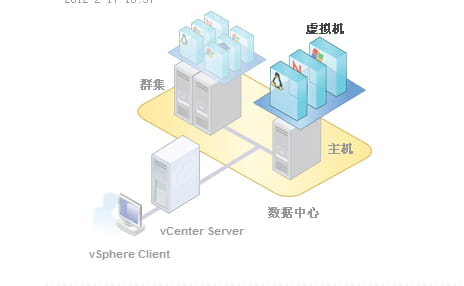

# 1. ESXi 7.0 安装部署

下载地址：

[https://customerconnect.vmware.com/cn/evalcenter?p=free-esxi7](https://customerconnect.vmware.com/cn/evalcenter?p=free-esxi7)   

[https://customerconnect.vmware.com/cn/downloads/info/slug/datacenter_cloud_infrastructure/vmware_vsphere/6_7](https://customerconnect.vmware.com/cn/downloads/info/slug/datacenter_cloud_infrastructure/vmware_vsphere/6_7)

当我还没有深入了解VMware虚拟化的时候，就了解到他下边事实上有不少的子产品，如果没有从中走一遍，还真的很容易绕晕在里边，毕竟有些东西会的人觉得这个太简单，没有说的必要，而不会的人也就终究不会着，百度一下，竟不乏关于这方面的问题，看到一张图，感觉还不错，借鉴过来（事实上这是VCSA安装完成之后首页展示的一张图）。

​​

> ESXI就是单台服务器部署的工具，当类似这样的单台服务器达到一定数量，再通过UI一台一台登陆来管理就有点不太现实了，因此VCSA就应运而生，它可以作为一台虚拟机部署在某个ESXI当中，并把网络中的所有ESXI添加进来进行集中管理，组成虚拟化集群，同理，当这样的VCSA多了以后，为了管理方便，Vsphere就产生了，这些都是有道理的，而且用了之后绝对好用的。

也正如上图中所展示的，最底层由多个主机（ESXI）或者虚拟机组成虚拟机群，通过VCSA来进行管理，而VCSA又是通过Vsphere来管理的。

今天就来先从最小单位的部署起，ESXi-6.5的安装，6.5较之之前的都有非常大的改进，不仅在各个功能上大有丰富，还加入了web UI的管理方式，极大的方便了日常的使用管理 ，虚拟化优选。

由于公司服务器已经在使用当中，因此我这里的试验就在本地的VMware workstation里边来进行了。

‍

## 1. 准备工作

* 获取VMware vSphere 7.0（ESXi 7.0）的光盘镜像需要在VMware的官网上注册会员，注册时的邮箱保持真实就ok了 其他随便写

  1. 登录  [https://customerconnect.vmware.com/cn/evalcenter?p=free-esxi7](https://customerconnect.vmware.com/cn/evalcenter?p=free-esxi7)  点击免费产品下载，选择vSphere Hypervisor 进入下载页面；
  2. 记录许可信息栏的“密钥”然后点击手动下载就能获取ESXi 7.0的安装光盘文件。（同一个密钥允许安装100台服务器）；
* 使用 [rufus ](https://rufus.ie/zh/)制作启动盘
* 开启BIOS CPU虚拟化

  ```bash
  BIOS：Advanced（高级菜单）内的CPU Configuration（处理器设置），其中就有一项：Intel Virtualization Technology（Intel虚拟化技术），把它改为Enabled（启用）就可以了，保存后即可。
  ```

‍

## 2. ESXi7.0 安装

1. 将刚才制作好的安装U盘插在服务器主机上按下开机键，选择系统从U盘启动；
2. 等待安装文件载入内存之后会出现ESXi的欢迎界面 按下Enter 按键继续安装；
3. 接下来是一个用户协议界面 按下F11 接收用户协议，安装程序进入下个阶段；
4. 安装程序扫描到本地存储设备之后会在这个界面呈现，用光标选中本地磁盘按下Enter键继续安装；
5. 设置root账户密码然后按下Enter继续 （密码复杂度要求：1、大于等于7位字符；2、包含大小写和特殊字符）；
6. 安装结束后会要求重启服务器 按下Enter后服务器会重启（拔掉U盘）；

## 3. ESXi7.0 设置

1. 在ESXi平台的主界面按下F2按键，键入root账户的密码登录管理员权限；

|设置项目|补充说明|
| ------------------------------| ----------------------------------------------------------------------------------------------------------------------------------------------------|
|Configure Password|配置root密码|
|Configure Lockdown Mode|配置锁定模式。启用锁定模式后，除vpxuser以外的任何用户都没有身份验证权限，也无法直接对ESXi执行操作。锁定模式将强制所有操作都通过vCenterServer执行。|
|Configure Management Network|配置网络|
|Restart Management Network|重启网络|
|Test Management Network|使用Ping命令测试网络|
|Network Restore Options|还原网络配置|
|Configure Keyboard|配置键盘布局|
|Troubleshooting Options|故障排除设置|
|View System Logs|查看系统日志|
|View Support Information|查看支持信息|
|Reset System Configuration|还原系统配置|

2. 选中 IPv4 Configuration 进行IPv4地址设置；
3. 按照实际需求进入 DNS Configuration 配置DNS 之后按Enter确认；
4. 网络配置完毕之后按ESC键退出网络设置 弹出对话框提示是否保存网络设置,输入“Y”确认变更；
5. 选中 Test Management Network 按下Enter测试网络是否链接；
6. 按下ESC退出root权限拔掉显示器走人，接下来没它啥事了；

## 4. 网络链接

1. 安装完ESXi主机后，系统会默认创建一个虚拟交换机vSwitch，将物理网卡作为虚拟交换机的上行链路端口，并与物理交换机连接对外提供服务；
2. 如果有需要可以在此基础上新建虚拟交换机vSwitch；
3. vSwitch支持VLAN划分功能，可以将业务相关的虚拟机接入同一个VLAN中；

## 5. 开启远程桌面

1. 在搜索栏内输入【远程 或者 Remot】关键字，选择搜索结果中的【远程桌面设置】；
2. 将【启用远程桌面】的选项开关拨到ON，下面的第一个显示设置中的休眠设置要选择永不休眠；
3. 然后打开防火墙进入【允许应用或功能通过Windows Defender防火墙】；
4. 点击左上角的【更改设置】然后将列表拉到最下面勾选【远程桌面】最后点击确定完成设置；

‍

> **VMware虚拟机磁盘有厚置备、精简置备两种格式。精简置备磁盘按需增长，厚置备磁盘立刻分配所需空间。**
>
>   
> 厚置备磁盘较之精简置备磁盘有较好的性能，但初始置备浪费的空间较多。  
> 如果频繁增加、删除、修改数据，精简置备磁盘实际占用的空间会超过为其分配的空间。例如某个VMware Workstation或VMware ESXi的虚拟机，为虚拟硬盘分配了40GB的空间（精简置备）。如果这台虚拟机反复添加、删除数据，在虚拟机中看到硬盘剩余空间只能还有很多，例如剩余一半，但这个虚拟硬盘所占用的物理空间可能已经超过了40GB，如果是厚置备磁盘则不会存在这个问题。  
> 实际的生产环境中，虚拟机选择厚置备磁盘还是精简置备磁盘，要根据实际情况选择。如果虚拟机强调性能、并且数据量不大，则选择“厚置备立刻置零”，这将获得最好的性能。如果数据量持续增长、但变动不大，只是持续的增加，则可以选择“精简置备”磁盘。

‍
