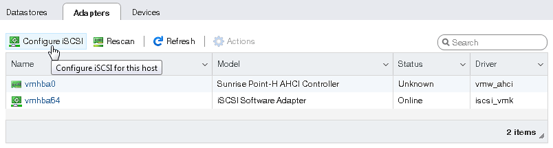

# 2. VCSA 7.0 安装部署

下载地址：  
[https://customerconnect.vmware.com/cn/downloads/get-download?downloadGroup=VC670](https://customerconnect.vmware.com/cn/downloads/get-download?downloadGroup=VC670)  
[https://customerconnect.vmware.com/cn/downloads/get-download?downloadGroup=VC70U3](https://customerconnect.vmware.com/cn/downloads/get-download?downloadGroup=VC70U3)  

VMware vSphere 是 VMware 的虚拟化平台，可将数据中心转换为包括 CPU、存储和网络资源的聚合计算基础架构。vSphere 将这些基础架构作为一个统一的运行环境进行管理，并为您提供工具来管理加入该环境的数据中心。

​​

**vSphere 的两个核心组件是 ESXi和vCenter Server。**ESXi是用于创建并运行虚拟机和虚拟设备的虚拟化平台。vCenter Server是一项服务，用于管理网络中连接的多个主机，并将主机资源池化。

​​

## 1. 部署准备

* 在 ESXi 中安装Windows Server 2012虚拟机（分配好固定IP地址，网络能通就行）
* 下载 VMware vCenter Server 安装包

## 2. 开始安装

1. 用虚拟光驱挂载或者解压运行，运行vcsa-ui-installer/win32/installer.exe；
2. 以管理员身份运行 installer后进入安装程序，这里提一下，右上角能选择安装语言；设置好语言之后，点击第一个“安装”；
3. 选择接受协议；
4. 选择你要创建vCenter所在的主机；
5. 提示证书警告，选择“是”；
6. 填写vCenter的机器名字以及密码，这里的密码是登录vc控制台root的密码；
7. 选择小环境配置；
8. 机器存放的位置以及选择精简模式；
9. 配置网络虚拟机信息；
10. 确认各项信息，并点击完成，开始配置。等待十几分钟；
11. 开始第二阶段的安装工作；
12. 选择与ESXI时间同步，禁用SSH；
13. 配置SSO信息；
14. 确认加入CIEP；
15. 确认配置信息；
16. 开始配置。等待十几分钟
17. 登陆账号(管理员+oss域名)：<administrator@vsphere.local>

‍

## 3. 从 VMware ESXi 访问 iSCSI 目标

1. 在导航器中，转至**存储** > **适配器**选项卡，并单击**配置 iSCSI**。

    ​​
2. 在**配置 iSCSI** 窗口中，在**静态目标**部分中单击**添加静态目标**，填写目标 IQN、IP 地址和端口。单击**保存配置**。

    ​​
3. 继续到**设备**选项卡，并单击**刷新**。新添加的磁盘将显示在设备列表中。

    ​​
4. 选择磁盘并单击**新数据存储**。在显示的向导中，输入数据存储的名称并选择分区选项。单击 **完成** 以对磁盘进行实际的分区。

可以使用的磁盘将显示在数据存储的列表中。现在可以使用数据存储浏览器查看其目录并将其提供给 VM。

​​

‍
