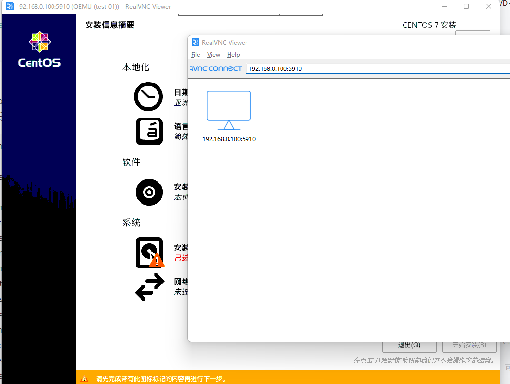

# 1. KVM 部署及应用

KVM（基于内核的虚拟机）是一个开源的全虚拟化解决方案，适用于在 x86 硬件上运行的 Linux 系统，具有虚拟化扩展（Intel VT 或 AMD-V）。您可以使用 KVM 使用虚拟机运行多种操作系统，例如 Windows、*BSD、Linux 发行版。每个虚拟机都有自己的专用磁盘、显卡、网卡等。

**KVM虚拟机的组成**

- 内核虚拟模块(KVM)
- 系统设备仿真(QEMU)
- 虚拟机管理程序(LIBVIRT)

## 一、KVM 部署

在我们安装任何软件之前，确保您的系统是最新的很重要：

```bash
# debian
apt update
apt upgrade
# redhat
yum update
```

在开始安装 KVM 之前，请检查您的 CPU 是否支持硬件虚拟化。现在打开命令终端并运行给定的命令：

```bash
egrep -c '(vmx|svm)' /proc/cpuinfo
grep -E --color '(vmx|svm)' /proc/cpuinfo
```

kvm相关安装包及其作用:

- `qemu-kvm` 主要的KVM程序包
- `python-virtinst` 创建虚拟机所需要的命令行工具和程序库
- `virt-manager` GUI虚拟机管理工具
- `virt-top` 虚拟机统计命令
- `virt-viewer` 连接虚拟机窗口命令
- `libvirt` C语言工具包，提供libvirt服务，核心组件
- `libvirt-client` 为虚拟客户机提供的C语言工具包
- `virt-install` 基于libvirt服务的虚拟机创建命令
- `bridge-utils` 创建和管理桥接设备的工具

```bash
# debian
apt install qemu-kvm libvirt-clients libvirt-daemon-system bridge-utils virtinst libvirt-daemon virt-manager libguestfs-tools
# redhat
yum -y install qemu-kvm python-virtinst libvirt libvirt-python virt-manager libguestfs-tools bridge-utils virt-install

# 重启宿主机，以便加载 kvm 模块 
reboot
# 查看KVM模块是否被正确加载 
lsmod | grep kvm 
# -------------------------------------
kvm_intel 162153 0 
kvm 525259 1 kvm_intel

# 加载内核模块vhost_net,提高网络性能
modprobe vhost_net
# 检查是否加载成功
lsmod | grep vhost
# 开启kvm服务，并且设置其开机自动启动
systemctl start libvirtd
systemctl enable libvirtd

```

接下来，运行`virsh`命令列出 KVM 虚拟机的可用网络：

```bash
root@doshell data $ virsh net-list --all
 Name      State      Autostart   Persistent
----------------------------------------------
 default   inactive   no          yes
```

正如我们在上面的输出中看到的，默认网络处于非活动状态，因此通过运行以下命令使其处于活动状态并在重新启动时自动重新启动：

```bash
virsh net-start default
virsh net-autostart default

root@doshell data $ virsh net-list --all
 Name      State    Autostart   Persistent
--------------------------------------------
 default   active   yes         yes
```

‍

### 1.1 libvirt相关的配置

libvirt相关的配置的配置文件都在 /etc/libvirt/ 目录之中

(1) /etc/libvirt/libvirt.conf

​`libvirt.conf`​文件用于配置**本地默认的**​`URI`​**连接**以及一些**常用**​`libvirt`​**远程连接**的别名：

```bash
#用 virsh 使用这个别名，连接到远程的 libvirt 上查询当前已经启动的客户机状态，然后退出连接，命令行操作如下：
vim /etc/libvirt/libvirt.conf
-----------------------------------------------------------------------------------
uri_aliases = [
  "home=qemu+ssh://root@192.168.2.222/system",
]
--------------------------------------------------------------------------------------

root@OptiPlex-3000:/etc/libvirt# virsh -c home
The authenticity of host '192.168.2.222 (192.168.2.222)' can't be established.
ED25519 key fingerprint is SHA256:xsP3aJuCGXzMcyaWeYL1XMsZHr0afwDImuY9WyV+BiQ.
This key is not known by any other names
Are you sure you want to continue connecting (yes/no/[fingerprint])? yes
root@192.168.2.222's password: 
```

(2) /etc/libvirt/libvirtd.conf

​`libvirtd.conf`​是 libvirt 的**守护进程**​`libvirtd`​**的配置文件**，被修改后需要让 libvirtd **重新加载配置文件**或**重启 libvirtd** 才会生效。

在`libvirtd.conf`​中配置了`libvirtd`​启动时的许多设置，包括**是否建立 TCP、UNIX domain socket 等连接方式**及其**最大连接数**，以及这些连接的**认证机制**，**设置**​`libvirtd`​**的日志级别**等.

```bash
listen_tls = 0     # 关闭 TLS 安全认证的连接（默认是打开的）
listen_tcp = 1     # 打开 TCP 连接（默认是关闭的）
tcp_port = "16666" # 设置 TCP 监听的端口
unix_sock_dir = "/var/run/libvirt" # 设置 UNIX domain socket 的保存目录
auth_tcp = "none"  # TCP 连接不使用认证授权方式
```

要让 TCP、TLS 等连接生效，需要在启动libvirtd时加上--listen参数

(3) /etc/libvirt/qemu.conf

​`qemu.conf`​是 libvirt 对 [QEMU](https://abelsu7.top/2019/05/30/kvm-in-action-2/qemu.org) 的驱动配置文件，包括 **VNC、SPICE** 等，以及连接它们时采用的**权限认证方式**的配置，也包括**内存大页、SELinux、Cgroups** 等相关配置。

(4) /etc/libvirt/qemu 目录

在`qemu`​目录下存放的是使用 QEMU 驱动的**域的配置文件**，查看`qemu`​目录如下：

```bash
root@OptiPlex-3000:/etc/libvirt/qemu# ll
总计 52
drwxr-xr-x 3 root root 4096  7月 24 11:41 ./
drwxr-xr-x 7 root root 4096  7月 25 14:49 ../
drwxr-xr-x 3 root root 4096  6月 11 15:35 networks/  #networks目录则保存了创建一个域时默认使用的网络配置
-rw------- 1 root root 6699  6月 11 21:24 template.xml
-rw------- 1 root root 6696  7月 24 11:30 test_01.xml
-rw------- 1 root root 6696  7月 24 11:31 test_02.xml
-rw------- 1 root root 6696  7月 24 11:41 test_03.xml
-rw------- 1 root root 6848  6月 14 22:06 win10.xml
```

‍

## 二、创建虚拟机

安装前要设置环境语言为英文`LANG="en_US.UTF-8"`，如果是中文的话某些版本可能会报错。`CentOS 7` 在这里修改 `/etc/locale.conf`。

kvm创建虚拟机，特别注意`.iso`镜像文件一定放到`/home` 或者根目录重新创建目录，不然会因为权限报错，无法创建虚拟机。

### 2.1 使用vnc图形界面

```bash
virt-install \
--name=win10 \
--ram 4096 \
--vcpus 2 \
--disk path=/data/virthost/template/windows10.qcow2,size=20,format=qcow2 \
--cdrom /data/virthost/Win10_22H2_Chinese_Simplified_x64v1.iso \
--graphic vnc,listen=0.0.0.0,port=5910 \
--virt-type=kvm \
--hvm \
--network bridge=kvmbr0,model=virtio

```

#### 2.1.1 配置虚拟机

使用VNC客户端

​​

### 2.2 使用conlsole命令行

```bash
virt-install \
--name=template \
 --ram 4096 \
--vcpus 2 \
--disk path=/data/virthost/template/template.qcow2,size=20,format=qcow2 \
--location /data/virthost/CentOS-7-x86_64-DVD-2207-02.iso \
--nographics \
--extra-args='console=tty0 console=ttyS0,115200n8 serial' \
--virt-type=kvm \
--hvm \
--network bridge=br0,model=virtio

# 新开一个窗口查看
virsh list
netstat -tunlp|grep qemu
```

#### 2.2.1 配置虚拟机

​​

### 2.3 参数说明

```bash
--name=NAME      # 虚拟机名称，需全局惟一； 
--ram=MEMORY     # 虚拟机内在大小，单位为MB； 
--vcpus=VCPUS[,maxvcpus=MAX][,sockets=#][,cores=#][,threads=#] # VCPU个数及相关配置；
--cpu=CPU        # CPU模式及特性，如coreduo等；可以使用qemu-kvm -cpu ?来获取支持的CPU模式；
--cdrom=CDROM    # 光盘安装介质；
--location=LOCATION # 安装源URL，支持FTP、HTTP及NFS等，如ftp://172.16.0.1/pub； 

################## 磁盘选项  #######################
--disk=DISKOPTS  # 指定存储设备及其属性；格式为--disk /some/storage/path,opt1=val1，opt2=val2等；
#常用的选项有： 
  # device  设备类型，如cdrom、disk或floppy等，默认为disk； 
  # bus     磁盘总结类型，其值可以为ide、scsi、usb、virtio或xen； 
  # perms   访问权限，如rw、ro或sh（共享的可读写），默认为rw； 
  # size    新建磁盘映像的大小，单位为GB； 
  # cache   缓存模型，其值有none、writethrouth（缓存读）及writeback（缓存读写）； 
  # format  磁盘映像格式，如raw、qcow2、vmdk等； 
  # sparse  磁盘映像使用稀疏格式，即不立即分配指定大小的空间；
--nodisks     # 不使用本地磁盘，在LiveCD模式中常用；
--import      # 导入虚拟磁盘文件

################## 网络选项  #######################
--network=NETWORK,opt1=val1,opt2=val2 # 将虚拟机连入宿主机的网络中，其中NETWORK可以为： 
#bridge=BRIDGE  连接至名为“BRIDEG”的桥设备； 
#network=NAME   连接至名为“NAME”的网络；
--nonetworks    # 虚拟机不使用网络功能；


################## 其他高级选项  #######################
--virt-type   # 使用的hypervisor，如kvm、qemu、xen等；所有可用值可以使用’virsh capabilities’命令获取；
--autostart   # 指定虚拟机是否在物理启动后自动启动；
--print-xml   # 如果虚拟机不需要安装过程(--import、--boot)，则显示生成的XML而不是创建此虚拟机；默认情况下，此选项仍会创建磁盘映像；
--force       # 禁止命令进入交互式模式，如果有需要回答yes或no选项，则自动回答为yes；
--dry-run     # 执行创建虚拟机的整个过程，但不真正创建虚拟机、改变主机上的设备配置信息及将其创建的需求通知给libvirt；
--debug       # 显示debug信息；

--pxe         # 基于PXE完成安装； 
--livecd      # 把光盘当作LiveCD； 
--os-type=DISTRO_TYPE # 操作系统类型，如Linux、unix或windows等； 
--os-variant=DISTRO_VARIANT # 某类型操作系统的变体，如rhel5、fedora8等； 
--boot cdrom,hd,networ  # 指定引导次序；
--hvm        # 当物理机同时支持完全虚拟化和半虚拟化时，指定使用完全虚拟化；
--paravirt   # 指定使用半虚拟化；
--graphics TYPE,opt1=val1,opt2=val2 # 指定图形显示相关的配置，此选项不会配置任何显示硬件（如显卡），而是仅指定虚拟机启动后对其进行访问的接口； 
#TYPE：指定显示类型，可以为vnc、sdl、spice或none等，默认为vnc； #port：TYPE为vnc或spice时其监听的端口； 
#listen：TYPE为vnc或spice时所监听的IP地址，默认为127.0.0.1，可以通过修改/etc/libvirt/qemu.conf定义新的默认值； 
#password：TYPE为vnc或spice时，为远程访问监听的服务进指定认证密码； 
--extra-args='console=tty0 console=ttyS0,115200n8 serial' 
    # - 额外参数，主要是指定`console`，如果没有`console`，那么后面安装会卡住，进不了终端
    # - 注意指定了该参数，前面指定系统镜像时就必须使用`--location`，而不能使用`--cdrom`
--noautoconsole # 禁止自动连接至虚拟机的控制台；

```

‍

## 三、web管理工具

Cockpit是一个开源的的基于web的系统管理工具，可以通过其控制台管理网络、docker容器、系统存储、虚拟机、web命令行终端、甚至可以管理k8s集群等等。cockpit-machines就是其中的一个扩展插件，主要用来创建、管理虚拟机。

基于CentOS7进行安装配置

```bash
# 安装epel源
yum install -y epel-release
# 安装cockpit和cockpit-machines
yum install -y cockpit cockpit-machines
# 启动
systemctl restart cockpit.socket  
systemctl enable cockpit.socket
# 访问控制台
https://ip/:9090
```
