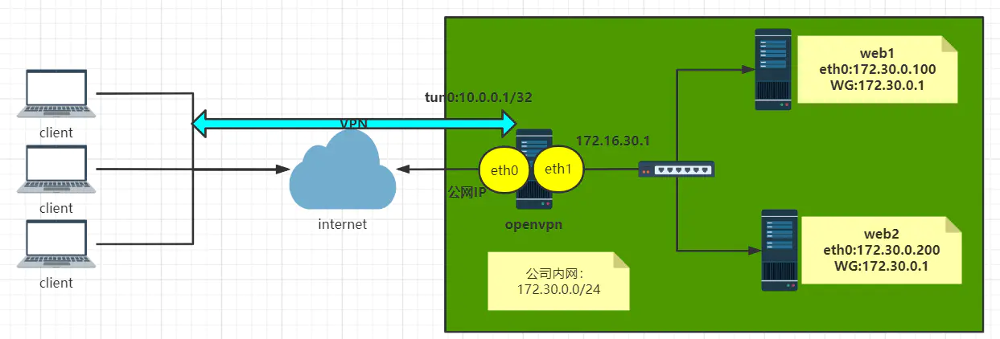

# openVPN

**OpenVPN** 是一个用于创建虚拟私人网络加密通道的软件包，最早由 James Yonan 编写。OpenVPN 允许建立的 VPN 使用公开密钥 、电子证书、或者用户名／密码来进行身份验证。

# 原理

OpenVPN 的技术核心是虚拟网卡，其次是 [SSL](https://zh.m.wikipedia.org/wiki/SSL "SSL") 协议实现。



## 虚拟网卡

在 OpenVPN 中，如果用户访问一个远程的虚拟地址（属于虚拟网卡配用的地址系列，区别于真实地址），则操作系统会通过路由机制将数据包（TUN 模式）或数据帧（TAP 模式）发送到虚拟网卡上，服务程序接收该数据并进行相应的处理后，会通过 SOCKET( "网络套接字")从外网上发送出去。这完成了一个单向传输的过程，反之亦然。当远程服务程序通过 SOCKET 从外网上接收到数据，并进行相应的处理后，又会发送回给虚拟网卡，则该应用软件就可以接收到。

## 加密

OpenVPN 使用 OpenSSL 库来加密数据与控制信息。这意味着，它能够使用任何 OpenSSL 支持的算法。它提供了 HMAC 功能以提高连接的安全性。此外，OpenSSL 的硬件加速也能提高它的性能。2.3.0 以后版本引入 PolarSSL。

openvpn 有两种认证方式：

- 基于证书认证
- 基于用户密码方式认证

演示环境准备：

|服务器名称|ip 地址|部署软件|
| --------------| -------------------------------------| -------------|
|openvpn 服务端|公网：192.168.0.202 ;内网：10.0.0.108|openvpnServer|
|openvpn 客户端|192.168.0.100|openvpnClient|

# 基于证书认证

使用 easy-rsa 工具生成证书
下载地址：https://github.com/OpenVPN/easy-rsa

## 1.配置 EasyRsa

```bash
tar -zxf EasyRSA-3.1.1.tgz
cd EasyRSA-3.1.1
cp vars.example vars
vim vars
---------------------------------------------------------------
set_var EASYRSA_REQ_COUNTRY "CN"
set_var EASYRSA_REQ_PROVINCE    "Beijing"
set_var EASYRSA_REQ_CITY    "Beijing"
set_var EASYRSA_REQ_ORG "doshell"
set_var EASYRSA_REQ_EMAIL   "doshell@qq.com"
set_var EASYRSA_REQ_OU      "My Organizational Unit"
set_var EASYRSA_CERT_EXPIRE "180"      # 证书有效期
```

## 2.制作证书

### 2.1 自建 CA 认证体系

```bash

[root@fmsrvdb EasyRSA-3.1.1]# tree /data/EasyRSA-3.1.1/
/data/EasyRSA-3.1.1/
├── ChangeLog
├── COPYING.md
├── doc
│   ├── EasyRSA-Advanced.md
│   ├── EasyRSA-Contributing.md
│   ├── EasyRSA-Readme.md
│   ├── EasyRSA-Renew-and-Revoke.md
│   ├── EasyRSA-Upgrade-Notes.md
│   ├── Hacking.md
│   └── Intro-To-PKI.md
├── easyrsa
├── gpl-2.0.txt
├── mktemp.txt
├── openssl-easyrsa.cnf
├── README.md
├── README.quickstart.md
├── vars.example
└── x509-types
    ├── ca
    ├── client
    ├── code-signing
    ├── COMMON
    ├── email
    ├── kdc
    ├── server
    └── serverClient

2 directories, 24 files
[root@fmsrvdb EasyRSA-3.1.1]# 

######## 初始化证书管理目录
[root@fmsrvdb EasyRSA-3.1.1]# ./easyrsa init-pki


######## 创建根证书，提示输入Common Name，名称随意，但是不能和服务端证书或客户端证书名称相同
######## 输入PEM密码 PEM pass phrase，输入两次，此密码必须记住，不然以后不能为证书签名，可以使用nopass参数取消 PEM 密码
[root@fmsrvdb EasyRSA-3.1.1]# ./easyrsa build-ca nopass 


############ 生成Diffle Human参数，它能保证密钥在网络中安全传输
[root@fmsrvdb EasyRSA-3.1.1]# ./easyrsa gen-dh


```

### 2.2 服务端证书构建

```bash
##### 创建服务器端证书请求，生成证书请求文件
[root@test EasyRSA-3.1.1]# ./easyrsa gen-req server nopass


##### CA认证颁发服务端证书
[root@test EasyRSA-3.1.1]# ./easyrsa sign server server
```

### 2.3 创建客户端证书

```bash
##### 创建客户端正确请求文件
[root@test EasyRSA-3.1.1]# ./easyrsa gen-req client001 nopass
# ./easyrsa gen-req client001   如果使用密码 则在客户端使用的时候会提示

##### 签约证书
[root@test EasyRSA-3.1.1]# ./easyrsa sign client  client001
```

以上步骤生成的 pki 文件

```bash
[root@test EasyRSA-3.1.1]# tree pki/
pki/
├── ca.crt
├── certs_by_serial
│   ├── 0AC1A72B29143E4DC81FC35152E3CC20.pem
│   └── D8CBEFEA7C76C737F99D694C627642EC.pem
├── dh.pem
├── index.txt
├── index.txt.attr
├── index.txt.attr.old
├── index.txt.old
├── issued
│   ├── client001.crt
│   └── server.crt
├── openssl-easyrsa.cnf
├── private
│   ├── ca.key
│   ├── client001.key
│   └── server.key
├── reqs
│   ├── client001.req
│   └── server.req
├── revoked
│   ├── certs_by_serial
│   ├── private_by_serial
│   └── reqs_by_serial
├── safessl-easyrsa.cnf
├── safessl-easyrsa.cnf.init-tmp
├── serial
├── serial.old
└── vars.example

8 directories, 21 files

mkdir -p /opt/openvpn/{server,client}
cp pki/ca.crt pki/private/server.key pki/issued/server.crt pki/dh.pem /opt/openvpn/server/
cp pki/ca.crt pki/private/client001.key pki/issued/client001.crt /opt/openvpn/client/
```

## 安装 openvpn

官方下载地址：

[https://openvpn.net/community-downloads/](https://openvpn.net/community-downloads/)

```bash
# 安装依赖
yum -y install openssl-devel lzo-devel pam-devel gcc
unzip openvpn-2.5.8.zip 
cd openvpn-2.5.8
mkdir -p /data/openvpn
# 编译
./configure --prefix=/data/openvpn
# 安装
make && make install
# ta.key 放置Dos攻击
# /data/openvpn/sbin/openvpn --genkey --secret pki/ta.key
```

### 1. 服务端配置

#### 创建配置文件

模板文件可在 `~/openvpn-2.5.8/sample/sample-config-files` 找到

`vim /data/openvpn/server.conf`

```bash
port 15443
proto tcp
dev tun
ca /data/openvpn/easy-rsa/ca.crt
cert /data/openvpn/easy-rsa/server.crt
key /data/openvpn/easy-rsa/server.key
dh /data/openvpn/easy-rsa/dh.pem
server 10.0.0.0 255.255.255.0
ifconfig-pool-persist /data/openvpn/ipp.txt
client-to-client
keepalive 10 120
cipher AES-256-CBC
user nobody
group nobody
compress lz4-v2
log-append  /data/openvpn/openvpn.log
verb 3
max-clients 2048
```

#### 内核开启转发

```bash
echo "net.ipv4.ip_forward = 1" >> /etc/sysctl.conf
sysctl -p
```

#### 启动 openvpn

```bash
cat > /usr/lib/systemd/system/openvpn.service << EOF
[Unit]
Description=OpenVPN Robust And Highly Flexible Tunneling Application On %I
After=network.target

[Service]
Type=notify
PrivateTmp=true
ExecStart=/usr/sbin/openvpn --cd /data/openvpn/ --config server.conf

[Install]
WantedBy=multi-user.target

EOF

systemctl daemon-reload
systemctl start   openvpn
systemctl status openvpn
```

### 2. 客户端配置

官方客户端下载地址：

[https://openvpn.net/community-downloads/](https://openvpn.net/community-downloads/)

#### 创建配置文件

模板文件可在 `~/openvpn-2.5.8/sample/sample-config-files` 找到

`vim /data/openvpn/client.conf`

```bash
client
dev tun
proto tcp
remote 192.168.0.202 15443
resolv-retry infinite
nobind
ca ca.crt
cert client001.crt
key client001.key
remote-cert-tls server
cipher AES-256-CBC
verb 3
compress lz4-v2
```

windows 客户端配置文件 命名为 client.ovpn  
证书和配置文件放到 C:\Users\doshe\OpenVPN\config

#### 附：将证书写进客户端配置文件client.ovpn

​`vim client.ovpn`​

```bash
#删除或者注释以下几行内容：
ca ca.crt　         　 改为：#ca ca.crt
cert client.crt　　 改为：#cert client.crt
key client.key　　 改为：#key client.key
tls-auth ta.key 1　改为：#tls-auth ta.key 1

#在最后面添加以下内容：
<ca>
ca.crt 文件内容
</ca>
<cert>
client.crt 文件内容
</cert>
<key>
client.key 文件内容
</key>
key-direction 1
<tls-auth>
ta.key 文件内容
</tls-auth>
```

‍

---

# 基于用户密码方式认证

在上面 基于证书认证 环境基础上修改

1. 修改 `vim /data/openvpn/server.conf` 添加几个参数
   ```bash
   #客户端不进行证书认证，如果不加将实现证书和用户密码双重认证
   client-cert-not-required

   #用户和密码验证脚本
   auth-user-pass-verify /etc/openvpn/checkpsw.sh via-env

   #使用用户名密码登录认证
   username-as-common-name

   #脚本安全级别
   script-security 3
   ```

2. 创建脚本和用户密码文件  
    ​`vim /etc/openvpn/checkpsw.sh`​

    ```bash
    #!/bin/bash
    PASSFILE="/etc/openvpn/psw-file"
    LOG_FILE="/var/log/openvpn-password.log"
    TIME_STAMP=`date "+%Y-%m-%d %T"`

    ###########################################################

    if [ ! -r "${PASSFILE}" ]; then
        echo "${TIME_STAMP}: Could not open password file \"${PASSFILE}\" for reading." >>  ${LOG_FILE}
        exit 1
    fi

    CORRECT_PASSWORD=`awk '!/^;/&&!/^#/&&$1=="'${username}'"{print $2;exit}' ${PASSFILE}`
    if [ "${CORRECT_PASSWORD}" = "" ]; then
        echo "${TIME_STAMP}: User does not exist: username=\"${username}\", password=\"${password}\"." >> ${LOG_FILE}
        exit 1
    fi

    if [ "${password}" = "${CORRECT_PASSWORD}" ]; then
        echo "${TIME_STAMP}: Successful authentication: username=\"${username}\"." >> ${LOG_FILE}
        exit 0
    fi

    echo "${TIME_STAMP}: Incorrect password: username=\"${username}\", password=\"${password}\"." >> ${LOG_FILE}
    exit 1
    ```

    ```bash
    #增加执行权限  (2020-12-17标注：不加权限，连接会用户密码认证失败，因为执行不了脚本)
    chmod +x /etc/openvpn/checkpsw.sh

    #用户密码文件，格式：一行对应一个用户
    vim /etc/openvpn/psw-file
    jinc 123456
    test 456789

    #修改权限
    chmod 400 /etc/openvpn/psw-file

    #重启openvpn服务
    systemctl restart  openvpn
    ```

3. 客户端配置文件修改
   ```bash
   #注释掉
   ;cert client.crt
   ;key client.key

   #添加上
   auth-user-pass
   ```

# 配置文件详解

## 1. 服务端配置

```bash
#server.conf文件中以#或;开头的行都为注释
[root@centos8 ~]#grep -Ev "^#|^$" /etc/openvpn/server.conf
;local a.b.c.d  #本机监听IP,默认为本机所有IP
port 1194       #端口
;proto tcp      #协议,生产推荐使用TCP
proto udp #默认协议
# 指定OpenVPN创建的通信隧道类型，tun用于建立IP隧道，tap用于建立以太网桥，这两种模式我们也称为路由模式和网桥模式。 
#不同于硬件物理网卡，TAP/TUN 是在 Linux 内核 2.4.x 版本之后完全由软件实现的虚拟网络设备，在功能上 TAP/TUN 和物理网卡没有区别，它们同样都是网络设备，都可以设置 IP 地址，而且都属于 Linux 网络设备管理模块，由 Linux 网络设备管理模块统一来管理。
# 如果用tun的话，就是模拟了一个p2p的环境，虽然能够连接到同网段别的ip，但是无法广播，这样就无法实现到某些网段的跳转网关了。
# 如果用tap的话，可以跳转网关，连接到其他网段。
;dev tap
dev tun
;dev-node MyTap  #TAP-Win32适配器。非windows不需要配置
ca ca.crt       #ca证书文件
cert server.crt  #服务器证书文件
key server.key   #服务器私钥文件
dh dh2048.pem    #dh参数文件
;topology subnet
server 10.8.0.0 255.255.255.0  #客户端连接后分配IP的地址池，服务器默认会占用第一个IP10.8.0.1将做为客户端的网关
ifconfig-pool-persist ipp.txt  #服务器自动给客户端分配IP后，客户端下次连接时，仍然采用上次的IP地址(第一次分配的IP保存在ipp.txt中，下一次分配其中保存的IP)。
;server-bridge 10.8.0.4 255.255.255.0 10.8.0.50 10.8.0.100  #配置网桥模式，不需要配置,建议注释
;server-bridge
;push "route 192.168.10.0 255.255.255.0"  #使客户端能访问服务器后面的子网机器
;push "route 192.168.20.0 255.255.255.0"
;client-config-dir ccd #使服务器子网内机器可以访问客户端子网内机器
;route 192.168.40.128 255.255.255.0
;learn-address ./script                #运行外部脚本，创建不同组的iptables规则，无需配置
;push "redirect-gateway def1 bypass-dhcp" #启用后，客户端所有流量都将通过VPN服务器，因此生产一般无需配置此项
;push "dhcp-option DNS 208.67.222.222"   #推送DNS服务器，不需要配置
;push "dhcp-option DNS 208.67.220.220"
;client-to-client                       #允许不同的client直接通信,不安全,生产环境一般无需要配置
;duplicate-cn                           #多个用户共用一个证书，一般用于测试环境，生产环境都是一个用户一个证书,无需开启
keepalive 10 120         #设置服务端检测的间隔和超时时间，默认为每10秒ping一次，如果 120秒没有回应则认为对方已经down
tls-auth ta.key 0 #访止DoS等攻击的安全增强配置,可以使用以下命令来生成：openvpn --
genkey --secret ta.key #服务器和每个客户端都需要拥有该密钥的一个拷贝。第二个参数在服务器端应该为’0’，在客户端应该为’1’
cipher AES-256-CBC  #加密算法
;compress lz4-v2    #启用Openvpn2.4.X新版压缩算法
;push "compress lz4-v2"   #推送客户端使用新版压缩算法,和下面的comp-lzo不要同时使用
;comp-lzo          #旧户端兼容的压缩配置，需要客户端配置开启压缩,openvpn2.4.X等新版可以不用开启
;max-clients 100   #最大客户端数
;user nobody         #运行openvpn服务的用户和组
;group nobody
persist-key          #重启VPN服务时默认会重新读取key文件，开启此配置后保留使用第一次的key文件,生产环境无需开启
persist-tun          #启用此配置后,当重启vpn服务时，一直保持tun或者tap设备是up的，否则会先down然后再up,生产环境无需开启
status openvpn-status.log #openVPN状态记录文件，每分钟会记录一次
;log         openvpn.log   #第一种日志记录方式,并指定日志路径，log会在openvpn启动的时候清空日志文件,不建议使用
;log-append openvpn.log   #第二种日志记录方式,并指定日志路径，重启openvpn后在之前的日志后面追加新的日志,生产环境建议使用
verb 3                   #设置日志级别，0-9，级别越高记录的内容越详细,0 表示静默运行，只记录致命错误,4 表示合理的常规用法,5 和 6 可以帮助调试连接错误。9 表示极度冗余，输出非常详细的日志信息
;mute 20                 #相同类别的信息只有前20条会输出到日志文件中
explicit-exit-notify 1   #通知客户端，在服务端重启后自动重新连接，仅能用于udp模式，tcp模式不需要配置即可实现断开重新连接,且开启此项后tcp配置后将导致openvpn服务无法启动,所以tcp时必须不能开启此项
```

## 2. 客户端配置

```bash
client                      #声明自己是个客户端
dev tun                   #接口类型，必须和服务端保持一致
proto udp               #协议类型，必须和服务端保持一致
remote 192.168.0.202 15443  #server端的ip和端口，可以写域名但是需要可以解析成IP
resolv-retry infinite  #如果是写的server端的域名，那么就始终解析，如果域名发生变化，会重新连接到新的域名对应的IP
nobind                     #本机不绑定监听端口，客户端是随机打开端口连接到服务端的1194
persist-key
persist-tun
ca ca.crt
cert client.crt
key client.key
remote-cert-tls server   #指定采用服务器证书校验方式
tls-auth ta.key 1
cipher AES-256-CBC
verb 3

```
