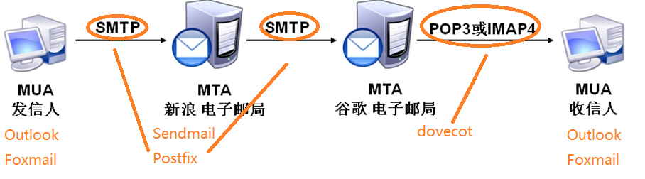
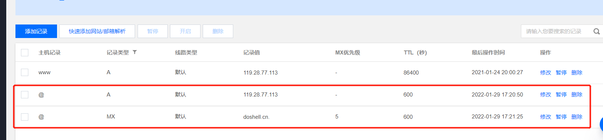

# postfix

电子邮件服务器是处理邮件交换的软硬件设施的总称，包括电子邮件程序、电子邮箱等。为用户提供 基于 E-mail 服务的电子邮件系统，人们通过访问服务器实现邮件的交换。

**邮件应用协议**

- SMTP:简单邮件传输协议（发邮件）TCP 25，加密时使用TCP 465
- POP3:第三版邮局协议（收邮件）TCP 110，加密时使用TCP 995
- IMAP4:第四版互联网邮件访问协议（收邮件）TCP 143，加密时使用TCP 993

**邮件系统角色**

- MTA：一般被称为邮件服务器软件，负责接收客户端软件发送的邮件，并将邮件传输给其他的MTA程序，是电子邮件系统中的核心部分。例如Exchange、 Postfix都属于MTA类软件
- MUA：一般被称为邮件客户端软件，负责为用户提供发送、接收和管理电子邮件的界面。例如Outlook、Outlook Express、Foxmail等
- MDA：负责在服务器中将邮件分发到用户的邮箱目录(默认情况下是/var/spool/mail/user)，它并不直接面向邮件用户，而是在后台默默的工作。有时候MDA的功能可以直接集成在MTA软件中，因此经常被忽略。



# vps搭建公网邮箱

## 环境准备

准备域名：doshell.cn
域名解析：

域名检查：`ping doshell.cn`

## 安装

**Postfix**
Postfix 是一个标准的 MTA「Mail Transfer Agent」服务器，它负责通过 SMTP 协议管理发送到本机的邮件以及由本机发向外界的邮件。

**Dovecot**
Dovecot 是一个优秀的 IMAP/POP 服务器用以接收外界发送到本机的邮件。

`yum -y install postfix dovecot`

## 修改 Postfix 配置文件

`vim /etc/postfix/main.cf`

```bash
myhostname = doshell    # 指定运行postfix邮件系统的主机的主机名
mydomain = doshell.cn   # 指定你的域名
myorigin = $mydomain    # 指明发件人所在的域名
inet_interfaces = all  # 网卡
inet_protocols = all   # ipv4 ipv6 
mydestination = $mydomain  # 指定postfix接收邮件时收件人的域名
mynetworks = 127.0.0.0/8   # 指定你所在的网络的网络地址，postfix系统根据其值来区别用户是远程的还是本地的，如果是本地网络用户则允许其访问
home_mailbox = Maildir/
# sasl身份认证
smtpd_sasl_type = dovecot
smtpd_sasl_path = private/auth
smtpd_sasl_auth_enable = yes
smtpd_sasl_security_options = noanonymous  # 禁止匿名登录
broken_sasl_auth_clients = yes
smtpd_sasl_authenticated_header = yes
smtpd_recipient_restrictions = permit_mynetworks, permit_sasl_authenticated, reject_unauth_destination

```

```bash
systemctl enable postfix.service
systemctl start  postfix.service
```

## 修改 dovecot 配置文件

打开 /etc/dovecot/dovecot.conf 文件，在最下方加入以下配置

```conf
protocols = imap pop3 lmtp
listen = *
mail_location = Maildir:~/Maildir
```

修改 10-master.conf

```conf
# 打开 /etc/dovecot/conf.d/10-master.conf 文件，找到 service auth 部分，
# 将以下行前面的 # 去除：
unix_listener /var/spool/postfix/private/auth {  
       mode = 0666  
}
```

修改 10-auth.conf

```conf
disable_plaintext_auth = no
```

修改 10-ssl.conf

```conf
ssl = no
```

```bash
systemctl enable dovecot.service
systemctl start  dovecot.service
```

## 创建账户

该配置下邮箱账户依赖于系统用户，所以通过添加系统用户的方式创建邮箱账户。
`useradd -s /usr/sbin/nologin email ;echo "Ninestar123" | passwd --stdin email`

## 邮件客户端

你可以将该邮箱账户添加至邮件客户端使用，推荐使用 Foxmail 客户端。
