# linux 用户模式

## Linux用户模式

0：关机

1：单用户模式

2：无网络支持的多用户模式

3：有网络支持的多用户模式

4：保留，未使用

5：有网络支持有X-Window支持的多用户模式（支持X-Windows则可以安装gnome、KDE等桌面环境）

6：重新引导系统，即重启

## 单用户模式

单用户模式（英语：Single user  mode），是在类似在Linux系统上工作时的一种拥有超级用户权限的模式。通常在开机选单给予1或S参数能进入这个模式。这个模式只在面对主机实体时才有机会透过开机选单进入，也因此确保超级权限授予的对象是能接触到主机的超级用户。

*<u>单用户模式可以对系统进行修复，如：修改root密码，修改因配置不正确而导致系统启动失败的配置文件等。</u>*

### CentOS操作系统进入单用户模式

**在重启过程中出现选择启动系统界面时按下键盘**e**键，跳转至启动项配置界面。** 跳转界面如下。

​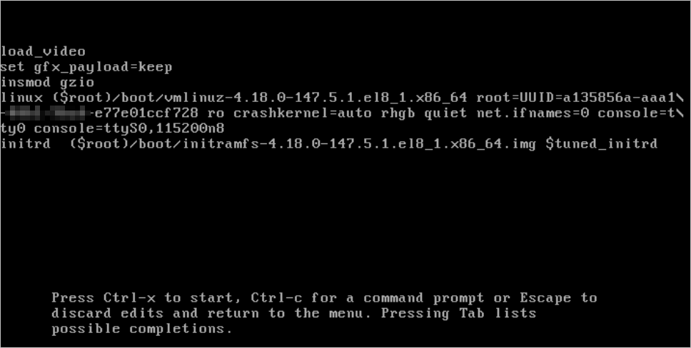​

**使用键盘的方向键，移动光标至**​`linux`​开头的一行，并在本行中将`ro`​至末尾的内容替换为`rw init=/bin/sh crashkernel=auto`​。修改后的信息如图所示。

​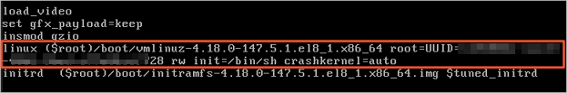​

**按下键盘的**ctrl+x**组合键或按**F10**键。** 系统会直接进入单用户模式。重置系统密码示例如图所示。

​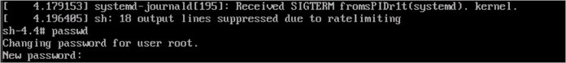​

‍

### Debian操作系统进入单用户模式

**并在重启过程中出现内核项界面时按下键盘**e**键，进入GRUB界面。** GRUB界面如下。

​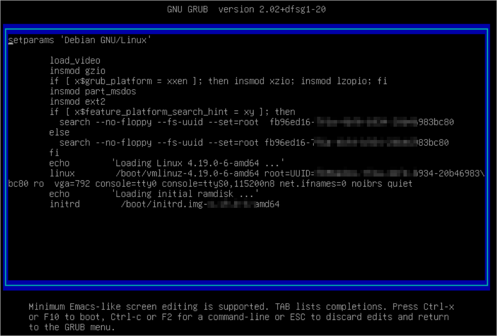​

**使用键盘的方向键，移动光标至**​`linux`​开头的一行，并在本行末尾添加`single`​。修改后的信息如图所示。

​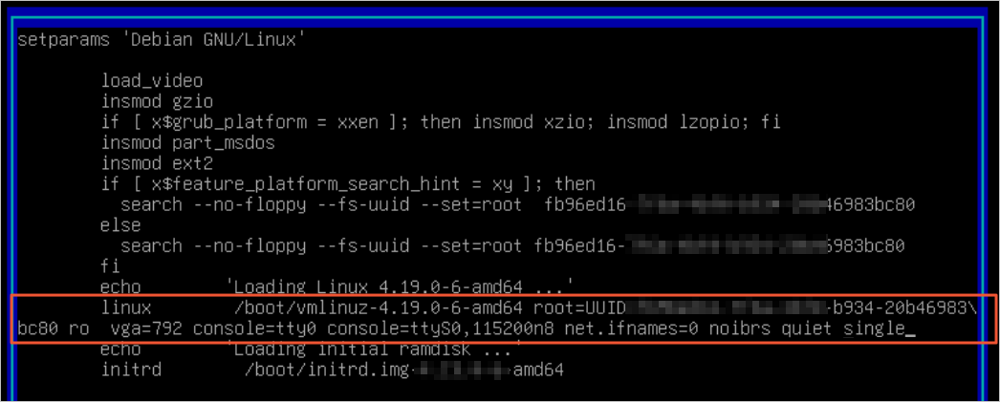​

**按下键盘的**ctrl+x**组合键或按**F10**键启动系统，并输入root用户的密码。** 系统会进入单用户模式。

​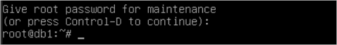​

‍

### SLES操作系统进入单用户模式

**在重启过程中出现内核项界面时按下键盘**e**键，进入GRUB界面。** GRUB界面如下。

​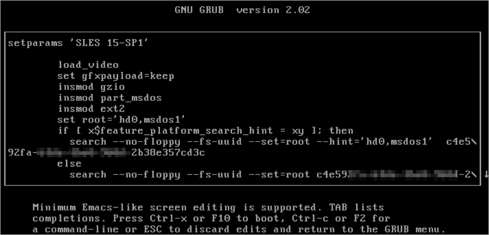​

**使用键盘的方向键，移动光标向下至**​`linux`​开头的一行，并在本行末尾添加`single`​。修改后的信息如图所示。

​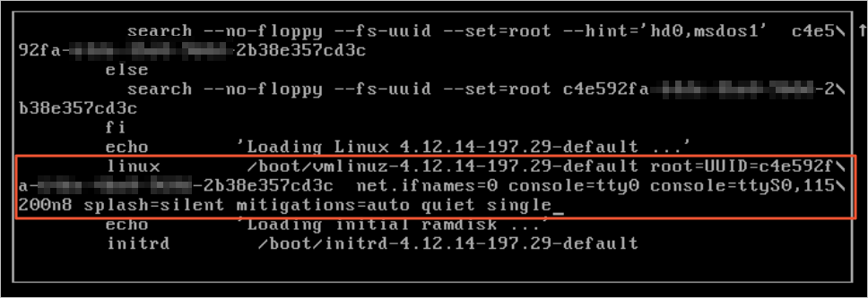​

**按下键盘的**ctrl+x**组合键或按**F10**键启动系统，并输入root用户的密码。** 系统会进入单用户模式。

​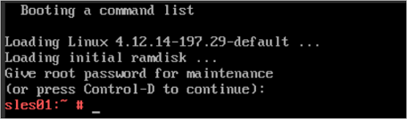​

‍

### Ubuntu操作系统进入单用户模式

**在重启过程中按下键盘**shift**键，进入GRUB界面。** GRUB界面示例如下。

​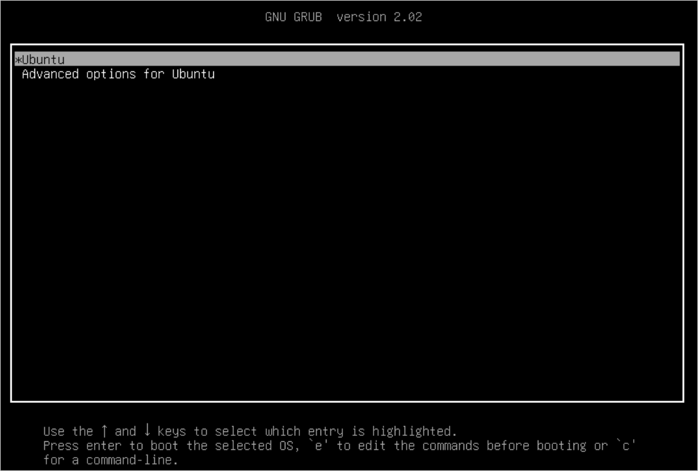​

**选择GRUB页面第二行的高级选项，并按下键盘的**enter**键。**

**在跳转页面选择第二行的恢复模式，并按下键盘的**e**键编辑启动项。**

​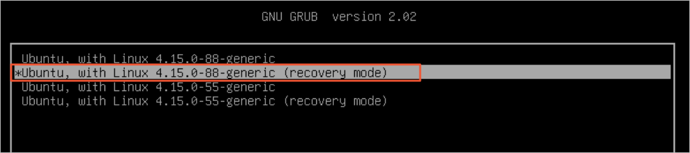​

**在编辑页面，使用键盘的方向键，移动光标向下至**​`linux`​开头的一行，并在本行中将`ro`​至末尾的内容替换为`rw single init=/bin/bash`​。修改结果如下图所示。

​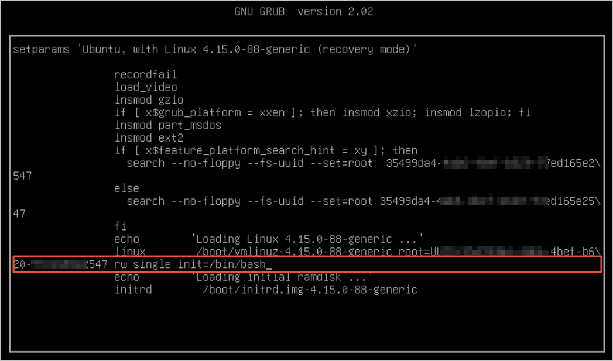​

**按下键盘的**ctrl+x**组合键或按**F10**键。** 系统会直接进入单用户模式。重置系统密码示例如图所示。

​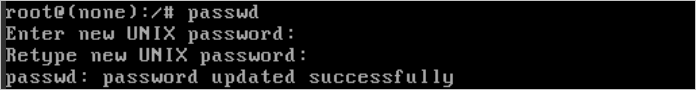​

‍

### 银河麒麟V10 SP1进入单用户模式

**在重启过程中出现内核项界面时按下键盘**e**键，进入GRUB界面。**

选择"Kylin Linux Advances Server (4.19.90-23.6.v2101.ky10.aarch64) V10 (Tercel)"这一行，按"E"进入修改grub启动配置。

​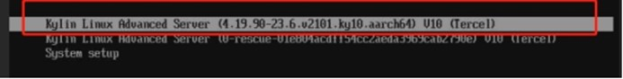

找到开头为"linux"开始该段配置信息，在该段配置信息后添加【init=/bin/bash console=tty0】，添加完后同时按"Ctrl + X"按键进行启动。

​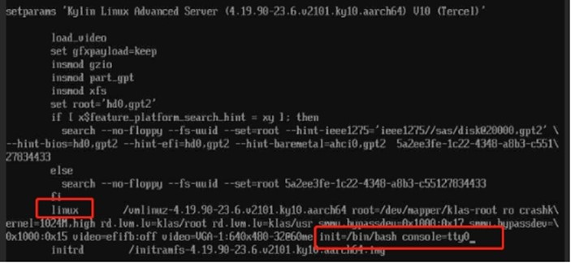​​

进单用户模式前提示输入账号密码，麒麟默认账号密码:"root/Kylin123123"。

​从单用户模式重启服务器须执行【/usr/sbin/reboot -f】​

‍

## 救援模式

救援模式就是从其他介质启动（能够自己选择挂载的分区），从而获得一个runlevel（如果按照流程，会进入level1的单用户模式），因为不需要从硬盘启动并且可以将硬盘中的系统以及文件挂载，可以从安装介质中获取硬盘系统中受损或丢失的文件或者将重要数据拷贝出来。

### CentOS操作系统进入救援模式

插入完整的系统光盘并设置从光盘启动（系统镜像、优盘都可以，只要能进入系统安装界面即可，相同版本，因为所需文件都相同），进入安装系统时的界面选择第三项

​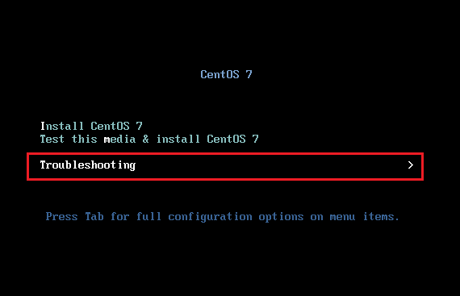​

选择第二项 ‘Rescue a CentOS system’ 进入救援模式

​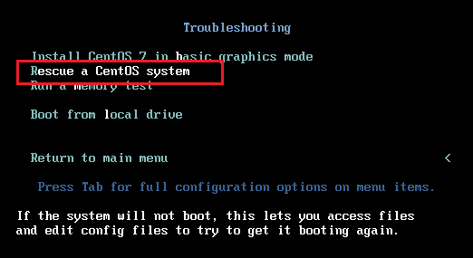​

输入 1 ，回车

​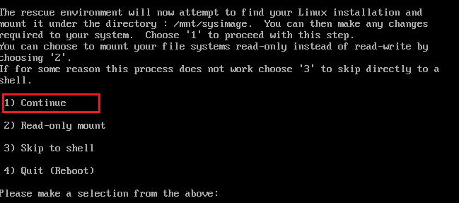​

根据提示，硬盘上的系统已经被挂载到 /mnt/sysimage 目录下，并且需要原系统的root身份请执行chroot /nmt/sysimage

​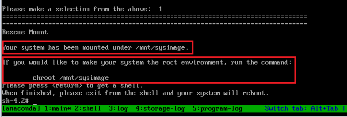​

如果使用 chroot /mnt/sysimage 则会将当前系统切换到硬盘上的系统，如果不使用这个命令，则可以修改这个目录中文文件达到操作硬盘上系统的需求。

未执行 chroot /mnt/sysimage 时的根目录文件即是启动盘上系统的文件，都是初始文件，如果需要可以直接拷贝到硬盘系统的挂载中即可。

例：修改root密码

```bash
切换系统方案：
  进入救援模式后执行 # chroot /mnt/sysimage
  此时系统已经被切换到硬盘上的系统，并且你具有root身份
  直接执行 passwd 或 passwd root 修改root密码
  不切换系统方案：

# vi /mnt/sysimage/etc/passwd     修改硬盘系统上的用户配置文件
  将 root 用户信息中的第二列的 x 删除，保存退出。（第二列的x表示是否设置了密码）
  当再次登陆系统的时候不需要输入root密码即可进入系统，然后执行passwd修改密码即可。
```

如果切换了系统（chroot /mnt/sysimage）则需要执行两次 exit 才能退出并重启。

## **总结**

  (1) 单用户模式主要是在grub2引导时编辑内核引导，以只读或可写的方式挂载系统，一般用于简单的修复系统，例如：修改root密码，修复由于配置不正确导致系统不能启动的配置文件等。

  (2) 救援模式需要通过系统安装介质进入，救援模式是将硬盘系统挂载，并获得一个单用户状态，一般用于修复严重的系统灾难，也可以使用救援模式修复简单的系统问题，因为救援模式也是单用户模式。
