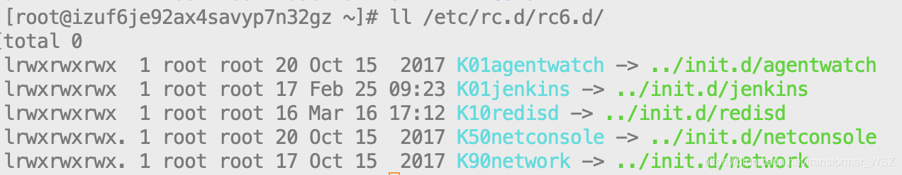
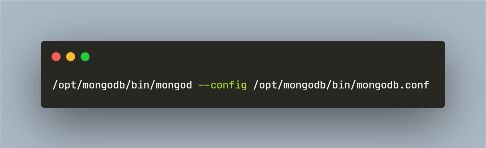
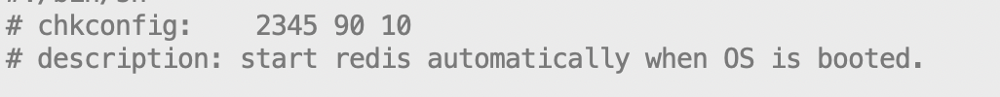

# linux之init.d、rc.d

‍

要想知道/etc/init.d文件夹中放的是什么东西, 最好先了解/etc/init.d和/etc/rc.d/init.d的关系
这两个文件夹其实是同一个东西，/etc/init.d是指向/etc/rc.d/init.d的软链接。并且这个东西只有在fedora下面 有，ubuntu下面没有/etc/rc.d/这个目录，只有/etc/init.d，openSUSE下面有/etc/rc.d，直接链接的/etc /init.d。
并且有时候可以看到rc0.d/这样的目录，查看这些目录里的文件，ls -l，发现都是软链接。
要想搞明白这里面的关系就要搞明白Linux的运行级。打开/etc/inittab，里面应该有注释，

```yaml
# 0 – 停机（千万别把initdefault设置为0，否则系统永远无法启动）
# 1 – 单用户模式
# 2 – 多用户，没有 NFS
# 3 – 完全多用户模式(标准的运行级)<
# 4 – 系统保留的
# 5 – X11 （x window)
# 6 – 重新启动 （千万不要把initdefault 设置为6，否则将一直在重启 ）
```

不同的运行级，开机启动的时候会开启不同的服务，所以当开机以后执行init（pdi为1，是开机后执行的第一个进程，所有其他进程都是这个进程的后代）这个进程，就会根据不同的运行级开启不同的默认服务（fedora下是读取rc.sysinit）。
可以看到rc0.d/这样的目录下的脚本前面都带有S或者K，s就是start，k就是kill。比如说当你从运行级5到3切换的时候，可能就会关掉有些服务，这时候就会执行k开头的脚本。
并且字母后面会接着数字，表示的是脚本执行的先后顺序，数字越小越早执行，很多时候这些执行顺序是很重要的，比如要启动Apache服务，就必须先配置网络接口，不然一个没有IP的机子来启动http服务那岂不是很搞笑…

总结的说，/etc/init.d这个目录是所有服务的脚本，可以通过执行脚本并且加上参数，开启关闭或者重启对应的服务，rc.d/这个目录的放的应该就 是开机就默认开启的服务，并且根据系统不同的运行及划分了不同的rc0.d/这样的目录，ubuntu下面的rc0.d/这样的目录都是直接放在/etc /下面的。
跟以上这些发行版不同的是，archlinux用的是类似BSD的方式，所有的服务脚本放在/etc/rc.d目录下（就没有init.d这个目录了），放在这个目录下并不意味之开机就会默认开启，开机要想默认开启某项服务，要自己把要开启的服务添加到/etc /rc.conf的DAEMONS里面，不过这样的话就没有运行级这个概念了，不管系统是哪个运行级起来的，这些服务默认都会开机启动。

‍

### `/etc/init.d`​

这是指向 `/etc/rc.d/init.d`​​ 的软链接。这个目录存放的是一些脚本，一般是linux以rpm包安装时设定的一些服务的启动脚本。系统在安装时装了很多rpm包，这里面就有很多对应的脚本。执行这些脚本可以用来`start || stop || reload || status || restart`​​ 这些服务。举个例子来说，如果你要重新启动 sendmail 的话，而且你的 sendmail 是以 rpm 来安装的，那么使用 `/etc/rc.d/init.d/sendmail restart`​​ 就可以直接启动 sendmail 了。

### `runlevel`​

​`/etc/rc.d/init.d/`​​ 这个目录下的脚本就类似与windows中的注册表，在系统启动的时候执行。程序运行到这里(init进程读取了运行级别)， 是该运行init.d里的脚本了，但是并不是直接运行，而是有选择的。因为系统并不需要启动所有的服务。系统是如何选择哪些需要启动哪些不要呢？这时 `runlevel`​​ 就起作用了。在RH9和FC7的源码中它都是一开始就 `check_runlevel()`​​ ，知道了运行级别之后，对于每一个运行级别，在 `/etc/rc.d/`​​ 下都有一个子目录分别是 `rc0.d, rc1.d ... rc6.d`​​ 。每个目录下都是到 `/etc/rc.d/init.d/`​​ 目录的一部分脚本一些软链接。每个级别要执行哪些服务就在相对应的目录下，比如级别6要启动的服务就都放在rc6.d下，但是放在这个rc6.d下的都是一些软链接文件，链接到 `/etc/rc.d/init.d/`​​ 中相对应的文件，真正干活的是 `/etc/rc.d/init.d/`​​ 里的脚本。
​

(`/etc/`​ 下的 `rc0.d, rc1.d ... rc6.d`​ 是指向 `/etc/rc.d/`​ 下的 `rc0.d, rc1.d ... rc6.d`​ 的软链接。)

‍

### `KS`​

如上图所示，你会发现许多 `rc#.d`​ 形式存在的目录，这里 `#`​ 代表一个指定的初始化级别，范围是0~6）:

*  **_0_** ：系统停机状态，系统默认运行级别不能设为0，否则不能正常启动
*  **_1_** ：单用户工作状态，root权限，用于系统维护，禁止远程登陆
*  **_2_** ：多用户状态(没有NFS)
*  **_3_** ：完全的多用户状态(有NFS)，登陆后进入控制台命令行模式
*  **_4_** ：系统未使用，保留
*  **_5_** ：X11控制台，登陆后进入图形GUI模式
*  **_6_** ：系统正常关闭并重启，默认运行级别不能设为6，否则不能正常启动

在这些目录之下，包含了许多对进程进行控制的脚本。这些脚本要么以 `K##`​ 开头，要么以 `S##`​ 开头：

*  **_K_** ：kill，系统将终止对应的服务
* **S**：start，系统将启动对应的服务
*  **##** ：同一运行级别下脚本执行的顺序，数值小的先执行，数值大的后执行。很多时候这些执行顺序是很重要的，比如要启动Apache服务，就必须先配置网络接口。

‍

### `/etc/rc.local`​

这是指向 `/etc/rc.d/rc.local`​​ 的软链接。这是使用者自订开机启动程序,把需要开机自动运行的程序写在这个脚本里。也就是说，我有任何想要在开机时就进行的工作时，直接将他写入 `/etc/rc.d/rc.local`​​ ， 那么该工作就会在开机的时候自动被载入。这一点和windows里面的“启动”菜单有点像。该脚本是在系统初始化级别脚本运行之后再执行的，因此可以安全地在里面添加你想在系统启动之后执行的脚本。常见的情况是开机自启动 `mongod`​​ 服务：
​

‍

### 开机自启动

常见的开机自启动有两种方法：

* 通过将 shell script写入到 `/etc/rc.d/rc.local`​
* 通过 `/etc/rc.d/init.d/`​。假设 `/etc/rc.d/init.d/redisd`​ 已存在，文件内容有两行注释如下：

​​

表示 `redisd`​​ 的运行级别是 `2 3 4 5`​​，各级别  **_S(2 3 4 5)_**  分数为90， **_K(0 6)_**  分数为10。`chkconfig redisd on`​​ 即可将 `redisd`​​ 添加到系统服务中。这样我们以后就可以通过 `systemctl start redisd || systemctl stop redisd`​​ 来启动和关闭 `redisd`​​ 服务。同样的，在 `/etc/rc.d/rc(2\3\4\5).d`​​ 文件夹下就会有 `S90redisd`​​ 软链接到 `/etc/rc.d/init.d/redisd`​​ ，在 `/etc/rc.d/rc(0\6).d`​​ 文件夹下就会有 `K10redisd`​​ 软链接到 `/etc/rc.d/init.d/redisd`​​ 。

update-rc.d命令用法  ubuntu\debian\kylin

chkconfig命令用法      redhat\centos

systemctl命令的用法  opensuse\centos

‍
