# linux 启动常见问题

## 一、忘记root密码

日常生活中，我们会接触到很多账号和密码，而这些账号和密码我们不能都很好的记忆，对于linux也是一样的，如果root密码忘记了怎么办？岂不是都无法登陆使用Linux了？现在我就教各位，在不知道root密码的前提下，如何给root设置一个新的密码

step 1 重启你的linux系统，在下图这个界面中按“E”

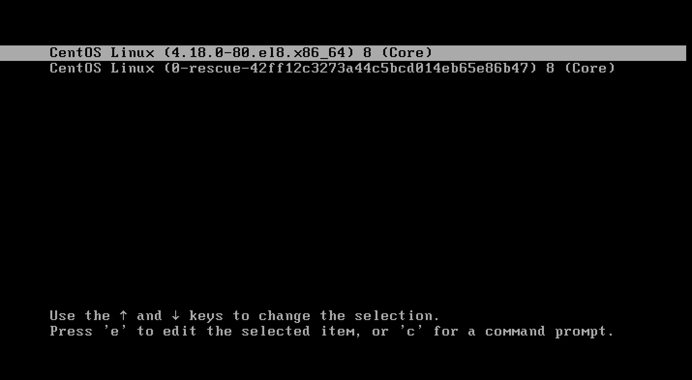

step 2 将光标移动到开头为linux这行的行位，删除rhgb quiet并添加rd.break

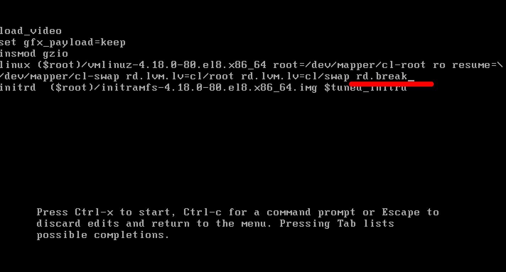

step 3 按键盘上的ctrl+x组合键继续启动linux，等待出现提示符后执行mount命令

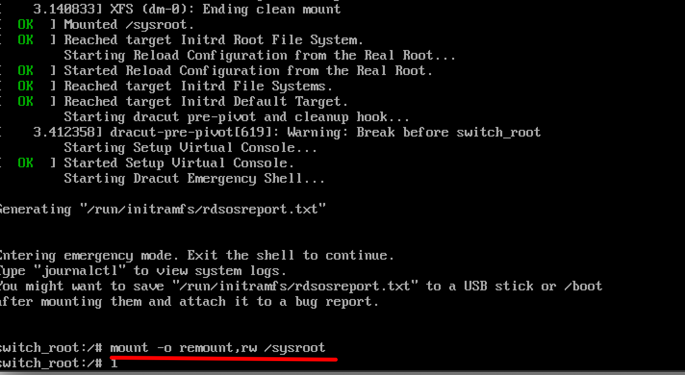

step 4 执行chroot命令将根目录切换为/sysroot(因为硬盘上的数据都存放在/sysroot目录中)

step 5 看到提示符发生变化后执行passwd命令修改root密码

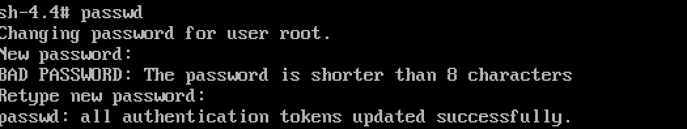

注：由于字符编码问题可能会出现不能正常显示的情况，如：

没有关系，不影响密码的设置

step 6 修改完密码之后，建立autorelabel文件

step 7 输入两次exit退出，系统会继续启动

启动完成之后就可以用我们刚才设置的账号及密码进行登录了

## 二、GRUB2加密

前面我们知道了，如果不知道root密码的话，也是可以以root身份登录系统，那这样岂不是很危险？所以GRUB2又提供了一种保护机制，这种保护机制就是为grub2设置密码，如果用户不知道这个密码，是无法编辑启动时所看到的那个菜单的，这样也就组织了root密码被修改的问题，那么如何为grub2加密呢？

setp 1 以root用户的身份登录系统并打开终端，在终端中输入grub2-setpassword命令，系统就会提示我们设置一个密码，这个密码就是grub2的密码

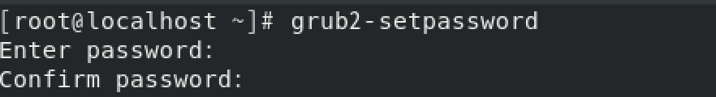

step 2 重启系统，验证是否加密成功

step 3 在启动菜单界面按"E"编辑内容时，系统会提示输入用户名和密码，这个用户名是root，密码就是我们前面设置的grub2密码

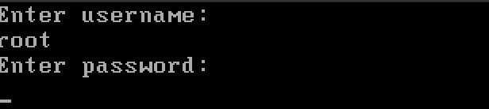

注意：密码在输入的时候是不会显示任何信息的

step 4 如果密码输入错误就会返回启动菜单界面

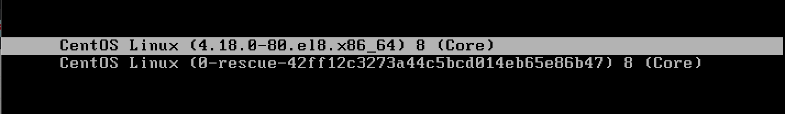

## 三、删除/修改GRUB2密码

前面我们学会了如何为grub2设置密码，这样能有效的避免root用户密码被修改，但是如果我忘记了grub2的密码怎么办呢？

如果忘记了grub2密码，你可以让系统正常启动，然后用root用户登录系统，登录完成后使用grub2-setpassword命令重新设置一个grub2密码，或者删除/boot/grub2/user.cfg文件将密码删除。

但是如果连root密码也不知道呢？这个时候，我们就需要用到修复模式了

step 1 插入系统光盘，选择从光盘启动

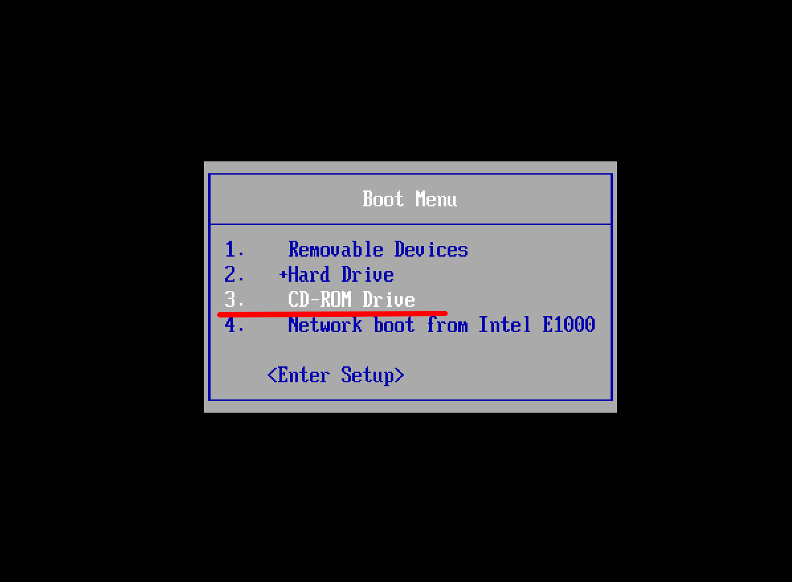

step 2 选择故障排除（troubleshooting）

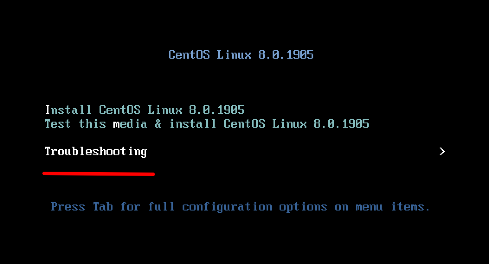

step 3 选择修复系统

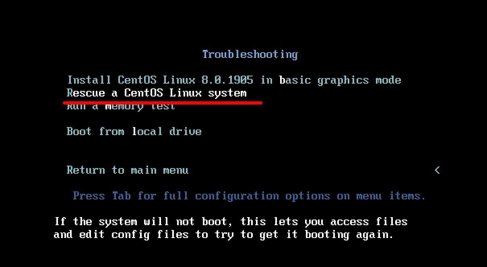

step 4 启动完成后，系统提示我们，修复模式会查找硬盘上是否安装有Linux系统，并将其挂载到/mnt/sysimage目录下，我们希望它如何操作，选择1是以读写的形式挂载，选择2是以只读的形式挂载，选择3是直接获取一个shell，选择4是重启，这里面我们选择1

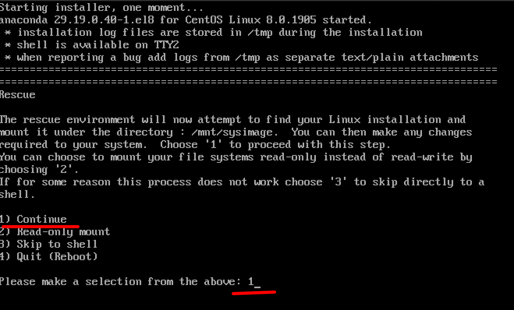

step 5 稍微等一下之后系统会提示我们已经挂载到/mnt/sysimage目录下了，按“enter”会得到一个shell

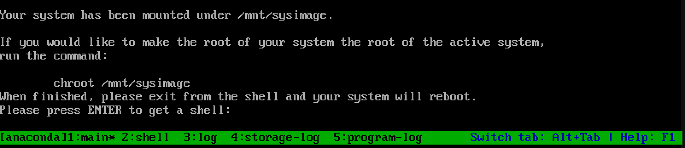

step 6 执行chroot /mnt/sysimage将工作目录切换到硬盘中

step 7 接下来就像没有忘记root密码一样，可以重新设置grub2密码，或者删除user.cfg文件了，然后输入两次exit重启

