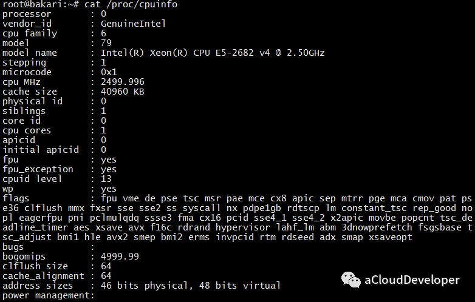
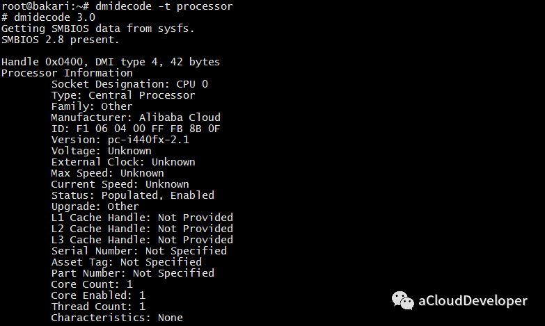
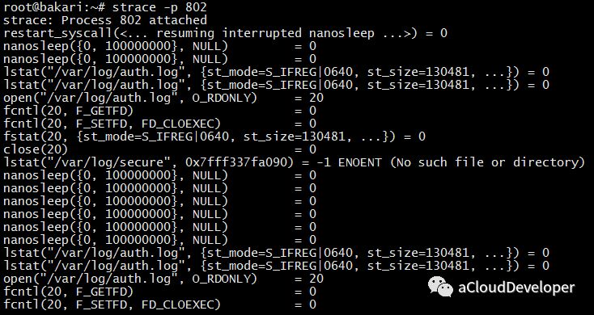

# Linux 性能分析之 CPU

‍

平常工作会涉及到一些 Linux 性能分析的问题，因此决定总结一下常用的一些性能分析手段，仅供参考。

说到性能分析，基本上就是 CPU、内存、磁盘 IO 以及网络这几个部分，本文先来看 CPU 这个部分。

## **CPU 基础信息**

进行性能分析之前，首先得知道 CPU 有哪些信息，可以通过以下方法查看 CPU 配置信息。

### **lscpu**

在 Linux 下，类似 lsxxx 这样的命令都是用来查看基本信息的，如 ls 查看当前目录文件信息，lscpu 就用来查看 CPU 信息，类似还有 lspci 查看 PCI 信息。

​​

可以看到我的机器配置很低，1 核 2.5GHz（在阿里云买的最低配的服务器）。

###  **/proc/cpuinfo**

/proc 目录是内核透传出来给用户态使用的，里面记录着很多信息文件，比如还有内存文件 meminfo 等。可以使用 cat /proc/cpuinfo 查看 CPU 信息。

​​

这里显示的信息可以具体到每个逻辑核上，由于我只有一个核，所以只显示一组信息。

### **dmidecode**

这个命令是用来获取 DMI（Desktop Management Interface）硬件信息的，包括 BIOS、系统、主板、处理器、内存、缓存等等。对于 CPU 信息，可以使用 dmidecode -t processor 来查看。

​​

‍

## **CPU 使用情况分析**

知道了 CPU 的基本信息，我们就可以使用另外的命令来对 CPU 的使用情况分析一通了。

### **top**

相信大家对下面这玩意不陌生，Windows 的任务管理器，top 的作用和它是一样的。

​​

top 显示的效果虽说不像它这么华丽，但已然让人惊呼他俩怎么长得这么像。

​​

我们重点关注这么几个字段：

* load average：三个数字分别表示最近 1 分钟，5 分钟和 15 分钟的负责，数值越大负载越重。一般要求不超过核数，比如对于单核情况要 < 1。如果机器长期处于高于核数的情况，说明机器 CPU 消耗严重了。
* %Cpu(s)：表示当前 CPU 的使用情况，如果要查看所有核（逻辑核）的使用情况，可以**按下数字 “1” 查看**。这里有几个参数，表示如下：

```
- us    用户空间占用 CPU 时间比例- sy    系统占用 CPU 时间比例- ni    用户空间改变过优先级的进程占用 CPU 时间比例- id    CPU 空闲时间比- wa    IO等待时间比（IO等待高时，可能是磁盘性能有问题了）- hi    硬件中断- si    软件中断- st    steal time
```

* 每个进程的使用情况：这里可以罗列每个进程的使用情况，包括内存和 CPU 的，如果要看某个具体的进程，可以使用 top -p pid 查看。

和 top 一样的还有一个改进版的工具：**htop**，功能和 top 一样的，只不过比 top 表现更炫酷，使用更方便，可以看下它的效果。

​​

### **ps**

可能很多人会忽略这个命令，觉得这不是查看进程状态信息的吗，其实非也，这个命令配合它的参数能显示很多功能。比如 ps aux。如果配合 watch，可以达到跟 top 一样的效果，如：watch -n 1 "ps aux"（-n 1 表示每隔 1s 更新一次）

​​

### **vmstat**

这个命令基本能看出当前机器的运行状态和问题，非常强大。可以使用 vmstat n 后面跟一个数字，表示每隔 ns 显示系统的状态，信息包括 CPU、内存和 IO 等。

​​

几个关键的字段：

* r 值：表示在 CPU 运行队列中等待的进程数，如果这个值很大，表示很多进程在排队等待执行，CPU 压力山大。
* in 和 cs 值：表示中断次数和上下文切换次数，这两个值越大，表示系统在进行大量的进程（或线程）切换。切换的开销是非常大的，这时候应该减少系统进程（或线程）数。
* us、sy、id、wa 值：这些值上面也提到过，分别表示用户空间进程，系统进程，空闲和 IO 等待的 CPU 占比，这里只有 id 很高是好的，表示系统比较闲，其他值飚高都不好。

这个工具强大之处在于它不仅可以分析 CPU，还可以分析内存、IO 等信息，犹如瑞士军刀。

### **dstat**

这个命令也很强大，能显示 CPU 使用情况，磁盘 IO 情况，网络发包情况和换页情况，而且输出是彩色的，可读性比较强，相对于 vmstat 更加详细和直观。使用时可以直接输入命令，也可以带相关参数。

​​

‍

## **进程使用 CPU 情况分析**

上面说的是系统级的分析，现在来看单个进程的 CPU 使用情况分析，以便于我们能对占用 CPU 过多的进程进行调试和分析，优化程序性能。

其实前面 top 和 ps 这样的命令就可以看每个进程的 CPU 使用情况，但我们需要更专业的命令。

### **pidstat**

这个命令默认统计系统信息，也包括 CPU、内存和 IO 等，我们常用 pidstat -u -p pid [times] 来显示 CPU 统计信息。如下统计 pid = 802 的 CPU 信息。

​​

### **strace**

这个命令用来分析进程的系统调用情况，可以看进程都调用了哪些库和哪些系统调用，进而可以进一步优化程序。比如我们分析 ls 的系统调用情况，就可以用 strace ls：

​​

可以看到，一个简单的 ls 命令，其实有不少系统调用的操作。

此外，还可以 attach（附着）到一个正在运行的进程上进行分析，比如我 attach 到 802 这个进程显示：

​​

根据这些输出信息，其实就能够很好地帮我们分析问题，从而定位到问题所在了。

OK，以上就是平常比较常用的一些工具，当然除了这些，还有很多很多工具，下面放一张图，来自 Linux 大牛，Netflix 高级性能架构师 **Brendan Gregg**。看完了，你也许会感叹“这世界太疯狂了（just crazy）”。

​​

​​
