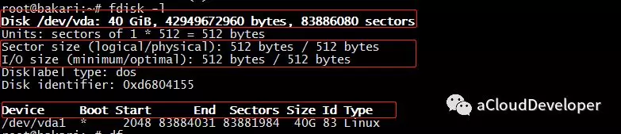
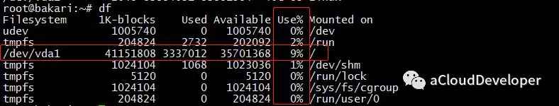
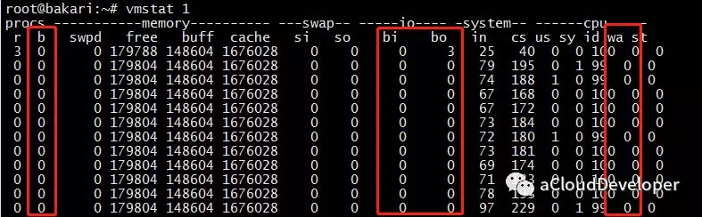
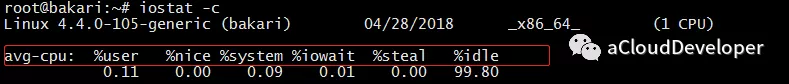
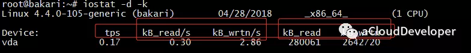
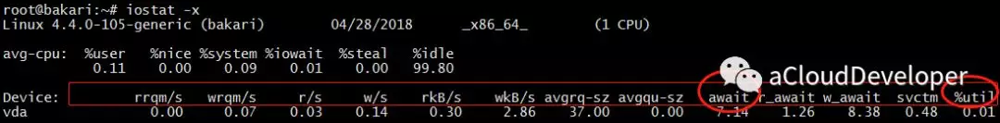
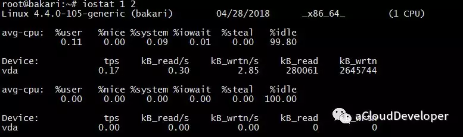
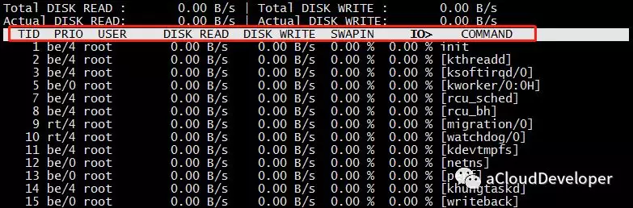

# Linux 性能分析之 IO

‍

## 磁盘基本信息

### fdisk

查看磁盘信息，包括磁盘容量，扇区大小，IO 大小等信息，常用 `fdisk -l`​ 查看：

​​

可以看到 /dev/ 下有一个 40G 的硬盘，一共 8K 多万个扇区，每个扇区 512字节，IO 大小也是 512 字节。

### df

查看磁盘使用情况，通常看磁盘使用率：

​​

## 磁盘性能分析

主要分析磁盘的读写效率（IOPS：每秒读写的次数；吞吐量：每秒读写的数据量），IO 繁忙程度，及 IO 访问对 CPU 的消耗等性能指标。

### vmstat

第一个较为常用的还是这个万能的 vmstat：

​​

对于 IO，我们常关注三个部分：

* b 值：表示因为 IO 阻塞排队的任务数
* bi 和 bo 值：表示每秒读写磁盘的块数，bi（block in）是写磁盘，bo（block out）是读磁盘。
* wa 值：表示因为 IO 等待（wait）而消耗的 CPU 比例。

一般这几个值偏大，都意味着系统 IO 的消耗较大，对于读请求较大的服务器，b、bo、wa 的值偏大，而写请求较大的服务器，b、bi、wa 的值偏大。

### iostat

vmstat 虽然万能，但是它分析的东西有限，iostat 是专业分析 IO 性能的工具，可以方便查看 CPU、网卡、tty 设备、磁盘、CD-ROM 等等设备的信息，非常强大，总结下来，共有以下几种用法：

#### 1）iostat -c 查看部分 CPU 使用情况：

​​

这里显示的是多个 CPU 的平均值，每个字段的含义我就不多解释了，我一般会重点关注 %iowait 和 %idle，分别表示 CPU 等待 IO 完成时间的百分比和 CPU 空闲时间百分比。

如果 %iowait 较高，则表明磁盘存在 IO 瓶颈，如果 %idle 较高，则 CPU 比较空闲，如果两个值都比较高，则有可能 CPU 在等待分配内存，瓶颈在内存，此时应该加大内存，如果 %idle 较低，则此时瓶颈在 CPU，应该增加 CPU 资源。

#### 2）iostat -d 查看磁盘使用情况，主要是显示 IOPS 和吞吐量信息（-k : 以 KB 为单位显示，-m：以 M 为单位显示）：

​​

其中，几个参数分别解释如下：

* tps：设备每秒的传输次数（transfers per second），也就是读写次数。
* kB_read/s：每秒读磁盘的数据量
* kB_wrtn/s：每秒写磁盘的数据量
* kB_read：读取磁盘的数据总量
* kB_wrtn：写入磁盘的数据总量

#### 3）iostat -x 查看磁盘详细信息：

​​

其中，几个参数解释如下；

* rrqm/s 和 wrqm/s：分别每秒进行合并的读操作数和写操作数，这是什么意思呢，合并就是说把多次 IO 请求合并成少量的几次，这样可以减小 IO 开销，buffer 存在的意义就是为了解决这个问题的。
* r/s 和 w/s：每秒磁盘读写的次数。这两个值相加就是 tps。
* rkB/s 和 wkB/s：每秒磁盘读写的数据量，这两个值和上面的 kB_read/s、kB_wrnt/s 是一个意思。
* avgrq-sz：平均每次读写磁盘扇区的大小。
* avgqu-sze：平均 IO 队列长度。队列长度越短越好。
* await：平均每次磁盘读写的等待时间（ms）。
* svctm：平均每次磁盘读写的服务时间（ms）。
* %util：一秒钟有百分之多少的时间用于磁盘读写操作。

以上这些参数太多了，我们并不需要每个都关注，可以重点关注两个：

**1）%util：衡量 IO 的繁忙程度**

这个值越大，说明产生的 IO 请求较多，IO 压力较大，我们可以结合 %idle 参数来看，如果 %idle < 70% 就说明 IO 比较繁忙了。也可以结合 vmstat 的 b 参数（等待 IO 的进程数）和 wa 参数（IO 等待所占 CPU 时间百分比）来看，如果 wa > 30% 也说明 IO 较为繁忙。

**2）await：衡量 IO 的响应速度**

通俗理解，await 就像我们去医院看病排队等待的时间，这个值和医生的服务速度（svctm）和你前面排队的人数（avgqu-size）有关。如果 svctm 和 await 接近，说明磁盘 IO 响应时间较快，排队较少，如果 await 远大于 svctm，说明此时队列太长，响应较慢，这时可以考虑换性能更好的磁盘或升级 CPU。

#### 4）iostat 1 2 默认显示 cpu 和 吞吐量信息，1 定时 1s 显示，2 显示 2 条信息

​​

## 进程 IO 性能分析

有了以上两个命令，基本上能对磁盘 IO 的信息有个全方位的了解了。但如果要确定具体哪个进程的 IO 开销较大，这就得借助另外的工具了。

### iotop

这个命令类似 top，可以显示每个进程的 IO 情况，有了这个命令，就可以定位具体哪个进程的 IO 开销比较大了。

​​

OK，最后还是总结下，`fdisk -l`​ 和 `df`​ 查看磁盘基本信息，`iostat -d`​ 查看磁盘 IOPS 和吞吐量，`iostat -x`​ 结合 vmstat 查看磁盘的繁忙程度和处理效率。
