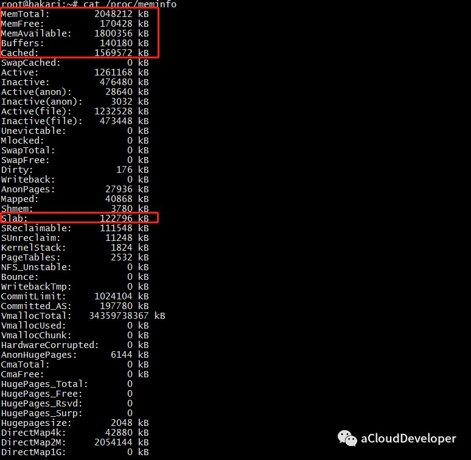
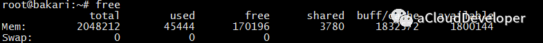
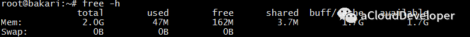
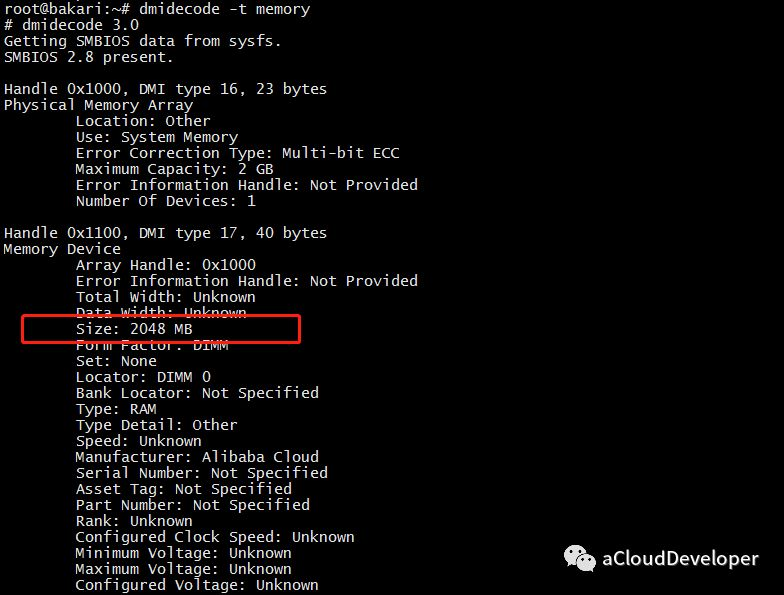
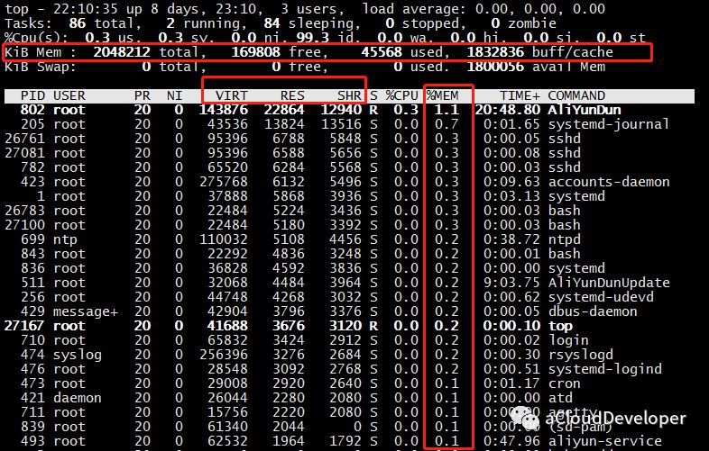
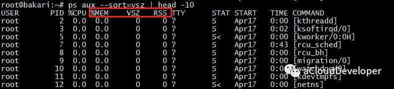
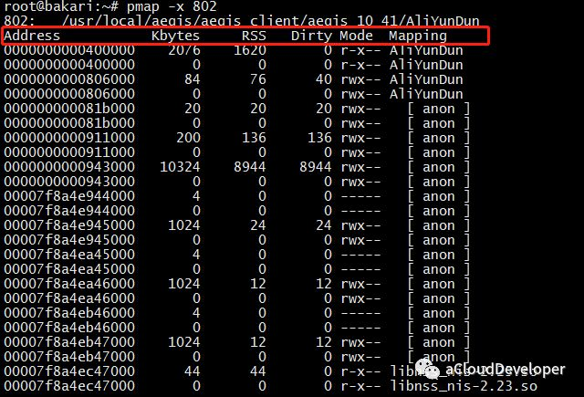
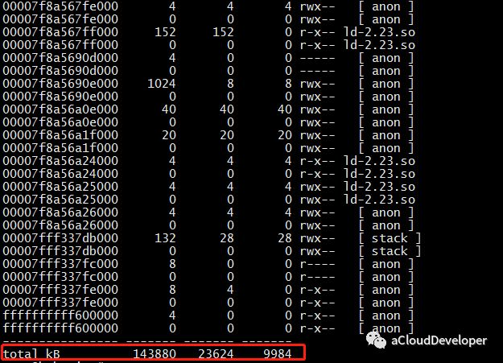

# Linux 性能分析之 内存

‍

## **内存信息**

同样在分析内存之前，我们得知到怎么查看系统内存信息，有以下几种方法。

### **/proc/meminfo**

这个文件记录着比较详细的内存配置信息，使用 cat /proc/meminfo 查看。

​​

我们比较关心的是下面几个字段：

* MemTotal：系统总内存，由于 BIOS、内核等会占用一些内存，所以这里和配置声称的内存会有一些出入，比如我这里配置有 2G，但其实只有 1.95G 可用。
* MemFree：系统空闲内存。
* MemAvailable：应用程序可用内存。有人会比较奇怪和 MemFree 的区别，可以从两个层面来区分，**MemFree 是系统层面的，而 MemAvailable 是应用程序层面的**。系统中有些内存虽然被使用了但是有一部分是可以回收的，比如 Buffers、Cached 及 Slab 这些内存，这部分可以回收的内存加上 MemFree 才是 MemAvailable 的内存值，这是内核通过特定算法算出来的，是一个估算值。
* Buffers：缓冲区内存
* Cached：缓存

上面信息没有 MemUsed 的值，虽然可以用现有的值大致估算出来，但是我们想一步到位，就用下面的 free 命令。

### **free**

这个命令估计用的人就多了（我一般都是用这个命令）。

​​

这里存在一个计算公式：

**MemTotal = used + free + buff/cache（单位 K）**

几个字段和上面 /proc/meminfo 的字段是对应的。还有个 shared 字段，这个是多进程的共享内存空间，不常用。

我们注意到 free 很小，buff/cache 却很大，这是 Linux 的内存设计决定的，Linux 的想法是内存闲着反正也是闲着，不如拿出来做系统缓存和缓冲区，提高数据读写的速率。但是当系统内存不足时，buff/cache 会让出部分来，非常灵活的操作。

要看比较直观的值，可以加 -h 参数：

​​

### **dmidecode**

同样可以使用这个命令，对于内存，可以使用 dmidecode -t memory 查看：

​​

### **vmstat**

这个命令也是非常常用了。但对于内存，显示信息有限。它更多是用于进行系统全局分析和 CPU 分析。详细可以看 [CPU 分析](http://mp.weixin.qq.com/s?__biz=MzI1OTY2MzMxOQ==&mid=2247484103&idx=1&sn=d437fd54bac8ac00522aa4538ca9c7a1&chksm=ea74367fdd03bf699d603f39836bb35c0e6190f6781e0eda104a3710705034293255e85bd6b4&scene=21#wechat_redirect)一文。

​​

## **进程内存使用情况分析**

最常用的两个命令 ps 和 top，虽然很简单的两个命令，但还是有不少学问的。

### **top/htop**

top 命令运行时默认是按照 CPU 利用率进行排序的，如果要按照内存排序，该怎么操作呢？两种方法，一种**直接按 “M”（相应的按 “P” 是 CPU），另外一种是在键入 top 之后，按下 “F”，然后选择要排序的字段，再按下 “s” 确认**即可。

​​

可以看到，我按照 “%MEM” 排序的结果。这个结果**对于查看系统占用内存较多的哪些进程是比较有用的**。

然后这里我们会重点关注几个地方，上面横排区，和前面几个命令一样可以查看系统内存信息，中间标注的横条部分，和内存相关的有三个字段：**VIRT、RES、SHR**。

* VIRT：virtual memory usage，进程占用的虚拟内存大小。
* RES：resident memory usage，进程常驻内存大小，也就是**实际内存占用情况，一般我们看进程占用了多少内存，就是看的这个值**。
* SHR：shared memory，共享内存大小，不常用。

### **ps**

ps 同样可以查看进程占用内存情况，一般**常用来查看 Top n 进程占用内存情况**，如：

ps aux --sort=rss | head -n，表示按 rss 排序，取 Top n。

​​

这里也关注三个字段：

* %MEM：进程使用物理内存所占百分比。
* VSZ：进程使用虚拟内存大小。
* RSS：进程使用物理内存大小，我们会重点关注这个值。

### **pmap**

这个命令用于查看进程的内存映像信息，能够查看进程在哪些地方用了多少内存。常用 pmap -x pid 来查看。

​​

​​

可以看到该进程内存被哪些库、哪些文件所占用，据此我们定位程序对内存的使用。

几个字段介绍一下：

* Address：占用内存的文件的内存起始地址。
* Kbytes：占用内存的字节数。
* RSS：实际占用内存大小。
* Dirty：脏页大小。
* Mapping：占用内存的文件，[anon] 为已分配的内存，[stack] 为程序堆栈
* 最后的 total 为统计的总值。我们可以使用 pmap -x pid | tail -1 这样只显示最后一行，循环显示最后一行，达到监控该进程的目的。使用：

  while true; do pmap -x pid | tail -1; sleep 1; done

OK，以上工具都是 Linux 自带的，当然还有很多高阶的工具，比如 atop、memstat 等等，对于内存泄漏有一个比较常用的检测工具 Valgrind，这些等之后再找时间跟大家分享了。

通过以上手段，我们基本上就能定位内存问题所在了，**究竟是内存太小，还是进程占用内存太多，有哪些进程占用较多，这些进程又究竟有哪些地方占用较多，这些问题通过以上方法都能解决**。

最后简单总结下，以上不少工具可能有人会犯选择困难症了。对于我来说，**查看系统内存用 free -h，分析进程内存占用用 ps 或者 top（首选 ps），深入分析选择 pmap**，就酱。
