# Linux 性能分析之 网络

比较宽泛地讲，网络方向的性能分析既包括主机测的网络配置查看、监控，又包括网络链路上的包转发时延、吞吐量、带宽等指标分析。包括但不限于以下分析工具：

* ping：测试网络连通性
* ifconfig：接口配置
* ip：网络接口统计信息
* netsat：多种网络栈和接口统计信息
* ifstat：接口网络流量监控工具
* netcat：快速构建网络连接
* tcpdump：抓包工具
* sar：统计信息历史
* traceroute：测试网络路由
* pathchar：确定网络路径特征
* dtrace：TCP/IP 栈跟踪
* iperf / netperf / netserver：网络性能测试工具
* perf 性能分析神器

本文先来看前面 7 个。

### ping

ping 发送 ICMP echo 数据包来探测网络的连通性，除了能直观地看出网络的连通状况外，还能获得本次连接的往返时间（RTT 时间），丢包情况，以及访问的域名所对应的 IP 地址（使用 DNS 域名解析），比如：

​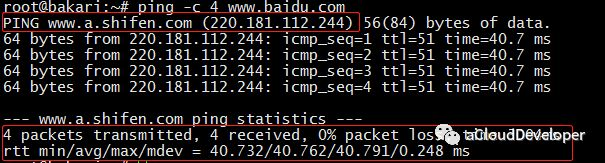​

我们 `ping baidu.com，-c`​ 参数指定发包数。可以看到，解析到了 baidu 的一台服务器 IP 地址为 220.181.112.244。RTT 时间的最小、平均、最大和算术平均差分别是 40.732ms、40.762ms、40.791ms 和 0.248。

### ifconfig

ifconfig 命令被用于配置和显示 Linux 内核中网络接口的统计信息。通过这些统计信息，我们也能够进行一定的网络性能调优。

​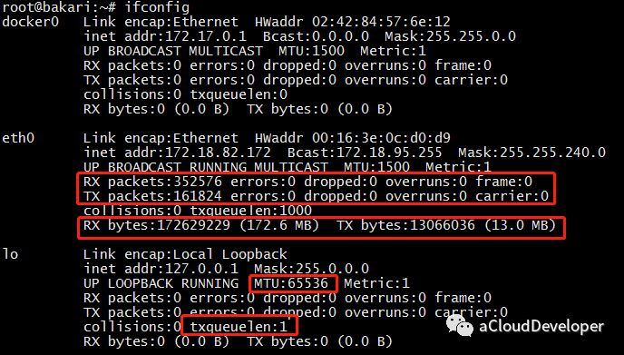​

#### 1）ifconfig 显示网络接口配置信息

其中，RX/TX packets 是对接收/发送数据包的情况统计，包括错误的包，丢掉多少包等。RX/TX bytes 是接收/发送数据字节数统计。其余还有很多参数，就不一一述说了，性能调优时可以重点关注 MTU（最大传输单元） 和 txqueuelen（发送队列长度），比如可以用下面的命令来对这两个参数进行微调：

```
ifconfig eth0 txqueuelen 2000
ifconfig eth0 mtu 1500 
```

#### 2）网络接口地址配置

ifconfig 还常用来配置网口的地址，比如：<br />为网卡配置和删除IPv6地址：

```
ifconfig eth0 add 33ffe:3240:800:1005::2/64    #为网卡eth0配置IPv6地址
ifconfig eth0 del 33ffe:3240:800:1005::2/64    #为网卡eth0删除IPv6地址
```

修改MAC地址：

```
ifconfig eth0 hw ether 00:AA:BB:CC:dd:EE
```

配置IP地址：

```
ifconfig eth0 192.168.2.10
ifconfig eth0 192.168.2.10 netmask 255.255.255.0
ifconfig eth0 192.168.2.10 netmask 255.255.255.0 broadcast 192.168.2.255
```

### IP

ip 命令用来显示或设置 Linux 主机的网络接口、路由、网络设备、策略路由和隧道等信息，是 Linux 下功能强大的网络配置工具，旨在替代 ifconfig 命令，如下显示 IP 命令的强大之处，功能涵盖到 ifconfig、netstat、route 三个命令。

​​

### netstat

netstat 可以查看整个 Linux 系统关于网络的情况，是一个集多钟网络工具于一身的组合工具。<br />常用的选项包括以下几个：

* 默认：列出连接的套接字
* -a：列出所有套接字的信息
* -s：各种网络协议栈统计信息
* -i：网络接口信息
* -r：列出路由表
* -l：仅列出有在 Listen 的服务状态
* -p：显示 PID 和进程名称

各参数组合使用实例如下：

* netstat -at 列出所有 TCP 端口
* netstat -au 列出所有 UDP 端口
* netstat -lt 列出所有监听 TCP 端口的 socket
* netstat -lu 列出所有监听 UDP 端口的 socket
* netstat -lx 列出所有监听 UNIX 端口的 socket
* netstat -ap | grep ssh 找出程序运行的端口
* netstat -an | grep ':80' 找出运行在指定端口的进程

#### 1）netstat 默认显示连接的套接字数据

​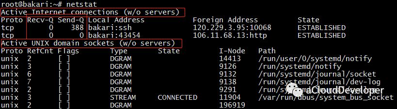​

整体上来看，输出结果包括两个部分：

* Active Internet connections ：有源 TCP 连接，其中 Recv-Q 和 Send-Q 指的是接收队列和发送队列，这些数字一般都是 0，如果不是，说明请求包和回包正在队列中堆积。
* Active UNIX domain sockets：有源 UNIX 域套接口，其中 proto 显示连接使用的协议，RefCnt 表示连接到本套接口上的进程号，Types 是套接口的类型，State 是套接口当前的状态，Path 是连接到套接口的进程使用的路径名。

#### 2）netstat -i 显示网络接口信息

​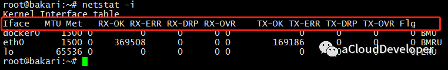​

接口信息包括网络接口名称（Iface）、MTU，以及一系列接收（RX-）和传输（TX-）的指标。其中 OK 表示传输成功的包，ERR 是错误包，DRP 是丢包，OVR 是超限包。

这些参数有助于我们对网络收包情况进行分析，从而判断瓶颈所在。

#### 3）netstat -s 显示所有网络协议栈的信息

​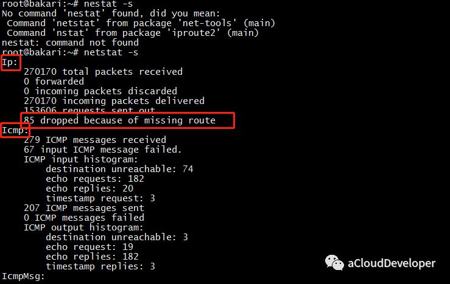​

可以看到，这条命令能够显示每个协议详细的信息，这有助于我们针对协议栈进行更细粒度的分析。

#### 4）netstat -r 显示路由表信息

​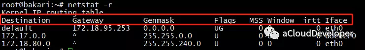​

这条命令能够看到主机路由表的一个情况。当然查路由我们也可以用 ip route 和 route 命令，这个命令显示的信息会更详细一些。

### ifstat

ifstat 主要用来监测主机网口的网络流量，常用的选项包括：

* -a：监测主机所有网口
* -i：指定要监测的网口
* -t：在每行输出信息前加上时间戳
* -b：以 Kbit/s 显示流量数据，而不是默认的 KB/s
* -delay：采样间隔（单位是 s），即每隔 delay 的时间输出一次统计信息
* -count：采样次数，即共输出 count 次统计信息

比如，通过以下命令统计主机所有网口某一段时间内的流量数据：

​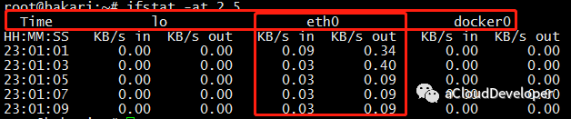​

可以看出，分别统计了三个网口的流量数据，前面输出的时间戳，有助于我们统计一段时间内各网口总的输入、输出流量。

### netcat

netcat，简称 nc，命令简单，但功能强大，在排查网络故障时非常有用，因此它也在众多网络工具中有着“瑞士军刀”的美誉。

它主要被用来构建网络连接。可以以客户端和服务端的方式运行，当以服务端方式运行时，它负责监听某个端口并接受客户端的连接，因此可以用它来调试客户端程序；当以客户端方式运行时，它负责向服务端发起连接并收发数据，因此也可以用它来调试服务端程序，此时它有点像 Telnet 程序。

常用的选项包括以下几种：

* -l：以服务端的方式运行，监听指定的端口。默认是以客户端的方式运行。
* -k：重复接受并处理某个端口上的所有连接，必须与 -l 一起使用。
* -n：使用 IP 地址表示主机，而不是主机名，使用数字表示端口号，而不是服务名称。
* -p：当以客户端运行时，指定端口号。
* -s：设置本地主机发出的数据包的 IP 地址。
* -C：将 CR 和 LF 两个字符作为结束符。
* -U：使用 UNIX 本地域套接字通信。
* -u：使用 UDP 协议通信，默认使用的是 TCP 协议。
* -w：如果 nc 客户端在指定的时间内未检测到任何输入，则退出。
* -X：当 nc 客户端与代理服务器通信时，该选项指定它们之间的通信协议，目前支持的代理协议包括 “4”（SOCKS v.4），“5”（SOCKS v.5）和 “connect” （HTTPs Proxy），默认使用 SOCKS v.5。
* -x：指定目标代理服务器的 IP 地址和端口号。

下面举一个简单的例子，使用 nc 命令发送消息：

首先，启动服务端，用 `nc -l 0.0.0.0 12345`​ 监听端口 12345 上的所有连接。

​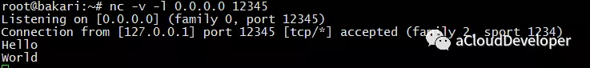​

然后，启动客户端，用 `nc -p 1234 127.0.0.1 12345`​ 使用 1234 端口连接服务器 127.0.0.1::12345。

​​

接着就可以在两端互发数据了。这里只是抛砖引玉，更多例子大家可以多实践。

### tcpdump

最后是 tcpdump，强大的网络抓包工具。虽然有 wireshark 这样更易使用的图形化抓包工具，但 tcpdump 仍然是网络排错的必备利器。

tcpdump 选项很多，我就不一一列举了，大家可以看文章末尾的引用来进一步了解。这里列举几种 tcpdump 常用的用法。

#### 1）捕获某主机的数据包

比如想要捕获主机 200.200.200.100 上所有收到和发出的所有数据包，使用：

```
tcpdump host 200.200.200.100
```

#### 2）捕获多个主机的数据包

比如要捕获主机 200.200.200.1 和主机 200.200.200.2 或 200.200.200.3 的通信，使用：

```
tcpdump host 200.200.200.1 and \(200.200.200.2 or \)
```

同样要捕获主机 200.200.200.1 除了和主机 200.200.200.2 之外所有主机通信的 IP 包。使用：

```
tcpdump ip host 200.200.200.1 and ! 200.200.200.2
```

#### 3）捕获某主机接收或发出的某种协议类型的包

比如要捕获主机 200.200.200.1 接收或发出的 Telnet 包，使用：

```
tcpdump tcp port 23 host 200.200.200.1
```

#### 4）捕获某端口相关的数据包

比如捕获在端口 6666 上通过的包，使用：

```
tcpdump port 6666
```

#### 5）捕获某网口的数据包

比如捕获在网口 eth0 上通过的包，使用：

```
tcpdump -i eth0
```

‍

## sar

sar 是一个系统历史数据统计工具。统计的信息非常全，包括 CPU、内存、磁盘 I/O、网络、进程、系统调用等等信息，是一个集大成的工具，非常强大。在 Linux 系统上 `sar --help`​ 一下，可以看到它的完整用法。

* -A：所有报告的总和
* -u：输出 CPU 使用情况的统计信息
* -v：输出 inode、文件和其他内核表的统计信息
* -d：输出每一个块设备的活动信息
* -r：输出内存和交换空间的统计信息
* -b：显示 I/O和传送速率的统计信息
* -a：文件读写情况
* -c：输出进程统计信息，每秒创建的进程数
* -R：输出内存页面的统计信息
* -y：终端设备活动情况
* -w：输出系统交换活动信息
* -n：输出网络设备统计信息

在平时使用中，我们常常用来分析网络状况，其他几项的通常有更好的工具来分析。所以，本文会重点介绍 sar 在网络方面的分析手法。

Linux 系统用以下几个选项提供网络统计信息：

* -n DEV：网络接口统计信息。
* -n EDEV：网络接口错误。
* -n IP：IP 数据报统计信息。
* -n EIP：IP 错误统计信息。
* -n TCP：TCP 统计信息。
* -n ETCP：TCP 错误统计信息。
* -n SOCK：套接字使用。

我们来看几个示例：

### （1）每秒打印 TCP 的统计信息。

```
sar -n TCP 1
```

​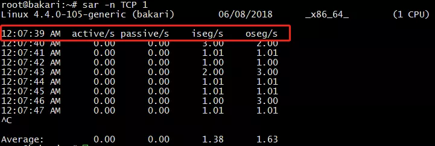​

几个参数了解一下：

* active/s：新的 TCP 主动连接（也就是 socket 中的 connect() 事件），单位是：连接数/s。
* passive/s：新的 TCP 被动连接（也就是 socket 中的 listen() 事件）。
* iseg/s：接收的段（传输层以段为传输单位），单位是：段/s
* oseg/s：发送的段。

通过这几个参数，我们基本可以知道当前系统 TCP 连接的负载情况。

### （2）每秒打印感兴趣的网卡的统计信息

```
sar -n DEV 1 | awk 'NR == 3 || $3 == "eth0"'
```

​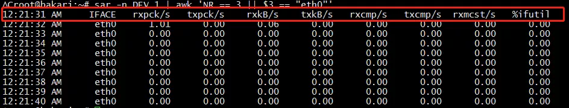​

几个参数了解一下：

* rxpck/s / txpck/s：网卡接收/发送的数据包，单位是：数据包/s。
* rxkB/s / txkB/s：网卡接收/发送的千字节，单位是：千字节/s。
* rxcmp/s / txcmp/s：网卡每秒接受/发送的压缩数据包，单位是：数据包/s。
* rxmcst/s：每秒接收的多播数据包，单位是：数据包/s。
* %ifutil：网络接口的利用率。

这几个参数对于分析网卡接收和发送的网络吞吐量很有帮助。

### （3）错误包和丢包情况分析

```
sar -n EDEV 1
```

​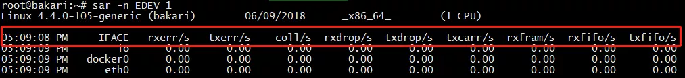​

几个参数了解一下：

* rxerr/s / txerr/s：每秒钟接收/发送的坏数据包
* coll/s：每秒冲突数
* rxdrop/s：因为缓冲充满，每秒钟丢弃的已接收数据包数
* txdrop/s：因为缓冲充满，每秒钟丢弃的已发送数据包数
* txcarr/s：发送数据包时，每秒载波错误数
* rxfram/s：每秒接收数据包的帧对齐错误数
* rxfifo/s / txfifo/s：接收/发送的数据包每秒 FIFO 过速的错误数

当发现接口传输数据包有问题时，查看以上参数能够让我们快速判断具体是出的什么问题。

OK，这个工具就介绍到这里，以上只是抛砖引玉，更多技巧还需要大家动手去探索，只有动手，才能融会贯通。

## traceroute

traceroute 也是一个排查网络问题的好工具，它能显示数据包到达目标主机所经过的路径（路由器或网关的 IP 地址）。如果发现网络不通，我们可以通过这个命令来进一步判断是主机的问题还是网关的问题。

它通过向源主机和目标主机之间的设备发送一系列的探测数据包（UDP 或者 ICMP）来发现设备的存在，实现上利用了递增每一个包的 TTL 时间，来探测最终的目标主机。比如开始 TTL = 1，当到达第一个网关设备的时候，TTL - 1，TTL = 0 导致网关响应一个 ICMP 超时报文，这样，如果没有防火墙拦截的话，源主机就知道网关设备的地址。以此类推，逐步增加 TTL 时间，就可以探测到目标主机之间所经过的路径。

为了防止发送和响应过程出现问题导致丢包，traceroute 默认会发送 3 个探测包，我们可以用 -q x 来改变探测的数量。如果中间设备设置了防火墙限制，会导致源主机收不到响应包，就会显示 * 号。如下是 `traceroute baidu`​ 的结果：

​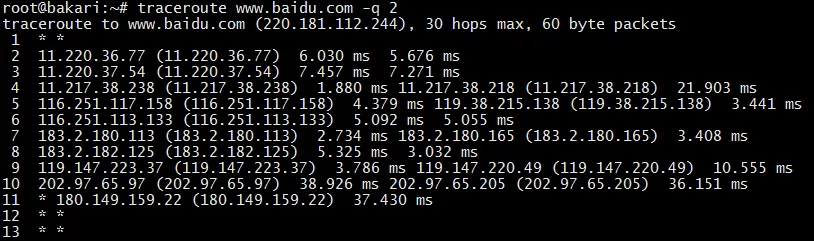​

每一行默认会显示设备名称（IP 地址）和对应的响应时间。发送多少个探测包，就显示多少个。如果只想显示 IP 地址可以用 -n 参数，这个参数可以避免 DNS 域名解析，加快响应时间。

和这个工具类似的还有一个工具叫 **pathchar**，但平时用的不多，我就不介绍了。
