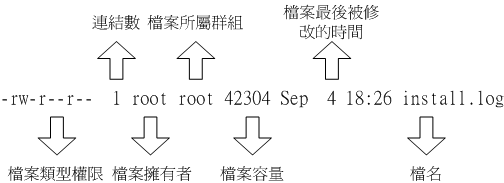
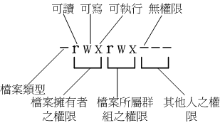

# linux 文件属性及权限

# Linux文件属性

## 文件属性解析

以root的身份登入Linux之后,在命令行中输入『 ls -al 』后可以看到：

```yaml
[root@www ~]# ls -al
total 156
drwxr-x--- 4 root root 4096 Sep 8 14:06 .
drwxr-xr-x 23 root root 4096 Sep 8 14:21 ..
-rw------- 1 root root 1474 Sep 4 18:27 anaconda-ks.cfg
-rw------- 1 root root 199 Sep 8 17:14 .bash_history
-rw-r--r-- 1 root root 24 Jan 6 2007 .bash_logout
-rw-r--r-- 1 root root 191 Jan 6 2007 .bash_profile
-rw-r--r-- 1 root root 176 Jan 6 2007 .bashrc
-rw-r--r-- 1 root root 100 Jan 6 2007 .cshrc
drwx------ 3 root root 4096 Sep 5 10:37 .gconf <=范例说明处
drwx------ 2 root root 4096 Sep 5 14:09 .gconfd
-rw-r--r-- 1 root root 42304 Sep 4 18:26 install.log <=范例说明处
-rw-r--r-- 1 root root 5661 Sep 4 18:25 install.log.syslog
[ 1 ][ 2 ][ 3 ][ 4 ][ 5 ][ 6 ] [ 7 ]
[ 权限 ] [连结][拥有者] [群组] [文件容量] [ 修改日期 ] [ 檔名 ] 
```

以其中install.log为范例说明:

​​

**第一栏: 类型与权限(permission)**

图释:

​​

* 第一个字符代表这个文件的类型(如目录、文件或链接文件等等)：

  1. 当为[ d ]则是目录,例如上表档名为『.gconf』的那一行；
  2. 当为[ - ]则是文件,例如上表档名为『install.log』那一行；
  3. 若是[ l ]则表示为链接档(link file)；
  4. 若是[ b ]则表示为装置文件里面的可供储存的接口设备(可随机存取装置)；
  5. 若是[ c ]则表示为装置文件里面的串行端口设备,例如键盘、鼠标(一次性读取装置)
* 接下来的字符中,以三个为一组,且均为『rwx』 的三个参数的组合  
  < [ r ]代表可读(read)、[ w ]代表可写(write)、[ x ]代表可执行(execute) 要注意的是,这三个权限的位置不会改变,如果没有权限,就会出现减号[ - ]而已>

  1. 第一组为『文件拥有者的权限』,以『install.log』那个文件为例, 该文件的拥有者可以读写,但不可执行；
  2. 第二组为『同群组的权限』；
  3. 第三组为『其他非本群组的权限』.

## ****特殊权限SUID, SGID, SBIT****

```yaml
[root@www ~]# ls -ld /tmp ; ls -l /usr/bin/passwd /usr/bin/locate /var/lib/mlocate/mlocate.db
drwxrwxrwt 7 root root 4096 Sep 27 18:23 /tmp
-rwsr-xr-x 1 root root 22984 Jan 7 2007 /usr/bin/passwd
-rwx--s--x 1 root slocate 23856 Mar 15 2007 /usr/bin/locate
-rw-r----- 1 root slocate 3175776 Sep 28 04:02 /var/lib/mlocate/mlocate.db
```

### **Set UID**

当 s 这个标志出现在文件拥有者的 x 权限上时,如上 /usr/bin/passwd 这个文件的权限状态，此时就被称为 Set UID，简称为 SUID 的特殊权限。基本上SUID有这样的限制与功能：

* SUID 权限仅对二进位程序(binary program)有效(不能够用在 shell script 上面)
* 运行者对於该程序需要具有 x 的可运行权限
* 本权限仅在运行该程序的过程中有效 (run-time)
* 运行者将具有该程序拥有者 (owner) 的权限

**以passwd文件为例:**

vbird 对於 /usr/bin/passwd 这个程序来说是具有 x 权限的，表示 vbird 能运行 passwd；  
passwd 的拥有者是 root 这个帐号；vbird 运行 passwd 的过程中，会『暂时』获得 root 的权限；  
/etc/shadow 就可以被 vbird 所运行的 passwd 所修改。  
但如果 vbird 使用 cat 去读取 /etc/shadow 时，他能够读取吗？因为 cat 不具有 SUID 的权限，所以 vbird 运行 『cat /etc/shadow』 时，是不能读取 /etc/shadow 的。我们用一张示意图来说明如下：  
图4.4.1、SUID程序运行的过程示意图

​​

### **SGID**

 与 SUID 不同的是，SGID 可以针对文件或目录来配置！

如果是对文件来说， SGID 有如下的功能：

* SGID 对二进位程序有用,程序运行者对於该程序来说，需具备 x 的权限
* 运行者在运行的过程中将会获得该程序群组的权限

 如果针对的是目录,SGID 有如下的功能：

* 使用者若对於此目录具有 r 与 x 的权限时，该使用者能够进入此目录；
* 使用者在此目录下的有效群组(effective group)将会变成该目录的群组；

### **Sticky Bit**

这个 Sticky Bit, SBIT 目前只针对目录有效作用是：

* 当使用者对於此目录具有 w, x 权限，亦即具有写入的权限时；
* 当使用者在该目录下创建文件或目录时，仅有自己与 root 才有权力删除该文件

换句话说：当甲这个使用者於 A 目录是具有群组或其他人的身份，并且拥有该目录 w  的权限， 这表示『甲使用者对该目录内任何人创建的目录或文件均可进行 "删除/更名/搬移" 等动作。』 不过，如果将 A 目录加上了 SBIT  的权限项目时， 则甲只能够针对自己创建的文件或目录进行删除/更名/移动等动作，而无法删除他人的文件。

```yaml
[root@www tmp]# chmod 7666 test; ls -l test <==具有空的 SUID/SGID 权限
-rwSrwSrwT 1 root root 0 Sep 29 03:06 test
```

user, group 以及 others 都没有 x 这个可运行的标志( 因为 666 )，所以，这个 S, T 代表的就是『空的』

‍

**第二栏:多少档名连结到此节点(i-node)**

记录有多少不同的档名连结到相同的一个i-node(每个文件都会将他的权限与属性记录到文件系统的i-node中,不过,我们使用的目录树却是使用文件名来记录, 因此每个档名就会连结到一个i-node)

**第三栏:文件(或目录)的拥有者**

**第四栏:文件的所属群组**

在Linux系统下一个账号会附属于一个或多个的群组中(假设某个文件所属的群组为projecta,且该文件的权限如图所示(-rwxrwx---),  则class1, class2, class3三人对于该文件都具有可读、可写、可执行的权限(看群组权限).  但如果是不属于projecta的其他账号,对于此文件就不具有任何权限了)

**第五栏:文件的容量大小(默认单位为bytes)**

**第六栏:文件的建档日期或者是最近的修改日期**

这一栏的内容分别为日期(月/日)及时间.如果这个文件被修改的时间距离现在太久了,那么时间部分会仅显示年份而已. 如下所示：

```yaml
[root@www ~]# ls -l /etc/termcap /root/install.log

-rw-r--r-- 1 root root 807103 Jan 7 2007 /etc/termcap
-rw-r--r-- 1 root root 42304 Sep 4 18:26 /root/install.log
# 如上所示,/etc/termcap 为 2007 年所修改过的文件,离现在太远之故；
# 至于 install.log 是今年 (2009) 所建立的,所以就显示完整的时间了. 
```

**第七栏:文件的全路径及其文件名**

这个字段就是档名了. 比较特殊的是：如果档名之前多一个『 . 』,则代表这个文件为『隐藏档』,在上表中的.gconf那一行,该文件就是隐藏档. 你可以使用『ls』及『ls -a』显示隐藏文档

## 隐藏属性

除了基本r, w,  x权限外,在Linux的Ext2/Ext3文件系统下,我们还可以配置其他的系统隐藏属性. 不过要先强调的是,底下的chattr命令只能在Ext2/Ext3的文件系统上面生效,  其他的文件系统可能就无法支持这个命令了.底下我们就来谈一谈如何配置与检查这些隐藏的属性吧！

### **chattr (配置文件隐藏属性)**

```yaml
[root@www ~]# chattr [+-=][ASacdistu] 文件或目录名称
选项与参数：
+ ：添加某一个特殊参数,其他原本存在参数则不动.
- ：移除某一个特殊参数,其他原本存在参数则不动.
= ：配置一定,且仅有后面接的参数

A ：当配置了 A 这个属性时,若你有存取此文件(或目录)时,他的存取时间 atime将不会被修改,可避免I/O较慢的机器过度的存取磁碟.这对速度较慢的计算机有帮助
S ：一般文件是非同步写入磁碟的(原理请参考第五章sync的说明),如果加上 S 这个属性时,当你进行任何文件的修改,该更动会『同步』写入磁碟中.
a ：当配置 a 之后,这个文件将只能添加数据,而不能删除也不能修改数据,只有root 才能配置这个属性.
c ：这个属性配置之后,将会自动的将此文件『压缩』,在读取的时候将会自动解压缩,但是在储存的时候,将会先进行压缩后再储存(看来对於大文件似乎蛮有用的！)
d ：当 dump 程序被运行的时候,配置 d 属性将可使该文件(或目录)不会被 dump 备份
i ：这个 i 可就很厉害了！他可以让一个文件『不能被删除、改名、配置连结也无法写入或新增数据！』对於系统安全性有相当大的助益！只有 root 能配置此属性
s ：当文件配置了 s 属性时,如果这个文件被删除,他将会被完全的移除出这个硬盘空间,所以如果误删了,完全无法救回来了喔！
u ：与 s 相反的,当使用 u 来配置文件时,如果该文件被删除了,则数据内容其实还存在磁碟中,可以使用来救援该文件喔！
注意：属性配置常见的是 a 与 i 的配置值,而且很多配置值必须要身为 root 才能配置

范例：请尝试到/tmp底下创建文件,并加入 i 的参数,尝试删除看看.
[root@www ~]# cd /tmp
[root@www tmp]# touch attrtest <==创建一个空文件
[root@www tmp]# chattr +i attrtest <==给予 i 的属性
[root@www tmp]# rm attrtest <==尝试删除看看
rm: remove write-protected regular empty file `attrtest'? y
rm: cannot remove `attrtest': Operation not permitted <==操作不许可
# 看到了吗？呼呼！连 root 也没有办法将这个文件删除呢！赶紧解除配置！

范例：请将该文件的 i 属性取消！
[root@www tmp]# chattr -i attrtest
```

这个命令是很重要的,尤其是在系统的数据安全上面！由於这些属性是隐藏的性质,所以需要以  lsattr 才能看到该属性呦！其中,个人认为最重要的当属 +i 与 +a 这个属性了.+i  可以让一个文件无法被更动,对於需要强烈的系统安全的人来说, 真是相当的重要的！里头还有相当多的属性是需要 root 才能配置的呢！

此外,如果是 log file 这种的登录档,就更需要 +a 这个可以添加,但是不能修改旧有的数据与删除的参数了！怎样？很棒吧！ 未来提到登录档 (十九章) 的认知时,我们再来聊一聊如何配置他吧！

### **lsattr (显示文件隐藏属性)**

```yaml
[root@www ~]# lsattr [-adR] 文件或目录

选项与参数：
-a ：将隐藏档的属性也秀出来；
-d ：如果接的是目录,仅列出目录本身的属性而非目录内的档名；
-R ：连同子目录的数据也一并列出来！

[root@www tmp]# chattr +aij attrtest
[root@www tmp]# lsattr attrtest
----ia---j--- attrtest
```

使用 chattr 配置后,可以利用 lsattr 来查阅隐藏的属性.不过,  这两个命令在使用上必须要特别小心,否则会造成很大的困扰.例如：某天你心情好,突然将 /etc/shadow  这个重要的密码记录文件给他配置成为具有 i 的属性,那么过了若干天之后, 你突然要新增使用者,却一直无法新增！别怀疑,赶快去将 i  的属性拿掉吧！

‍

# 修改文件属性

## chgrp ：改变文件所属群组

```yaml
[root@www ~]# chgrp [-R] dirname/filename ...

选项与参数：
- R : 进行递归(recursive)的持续变更，亦即连同次目录下的所有文件、目录
都更新成为这个群组之意。常常用在变更某一目录内所有的文件之情况。

范例：
[root@www ~]# chgrp users install.log
[root@www ~]# ls -l
-rw-r--r-- 1 root users 68495 Jun 25 08:53 install.log
[root@www ~]# chgrp testing install.log
chgrp: invalid group name `testing' <== 发生错误讯息啰～找不到这个群组名～ 
```

## chown ：改变文件拥有者

```yaml
[root@www ~]# chown [-R] 账号名称 文件或目录
[root@www ~]# chown [-R] 账号名称:组名 文件或目录
选项与参数：
- R : 进行递归(recursive)的持续变更，亦即连同次目录下的所有文件都变更

范例：将install.log的拥有者改为bin这个账号：
[root@www ~]# chown bin install.log
[root@www ~]# ls -l
-rw-r--r-- 1 bin users 68495 Jun 25 08:53 install.log

范例：将install.log的拥有者与群组改回为root：
[root@www ~]# chown root:root install.log
[root@www ~]# ls -l
-rw-r--r-- 1 root root 68495 Jun 25 08:53 install.log 

当你复制文件给你之外的其他人时，由于复制行为(cp)会复制执行者的属性与权限，那么别人会无法使用你复制给他的文件所以你要更改这个文件的拥有者与群组
```

## chmod ：改变文件的权限, SUID, SGID, SBIT等等的特性

数字类型改变文件权限 各权限的分数对照表如下：

1. SUID:4
2. SGID:2
3. SBIT:1
4. r:4
5. w:2
6. x:1

每种身份特殊权限(SUID/SGID/SBIT)和(owner/group/others)各自的三个权限(r/w/x)分数是需要累加的

例如当权限为： [-rwxrwx---] 分数则是：  
owner = rwx = 4+2+1 = 7  
group = rwx = 4+2+1 = 7  
others= --- = 0+0+0 = 0

例如当权限为： [-rw**s**r-**s**r-x] 分数则是：

特殊权限 = SUID&&SGID = 4+2 = 6  
owner = rws = 4+2+1 = 7  
group = r-s = 4+1 = 5  
others= r-x = 1 = 5

所以等一下我们设定权限的变更时，该文件的权限数字就是770啦！变更权限的指令chmod的语法是这样的：

```yaml
[root@www ~]# chmod [-R] xyzw 文件或目录

选项与参数：
x : 可有可无,代表的是特殊权限,即 SUID/SGID/SBIT
yzw : 就是刚刚提到的数字类型的权限属性，为 rwx 属性数值的相加
-R : 进行递归(recursive)的持续变更，亦即连同次目录下的所有文件都会变更

[root@www ~]# cd /tmp
[root@www tmp]# touch test <==创建一个测试用空档
[root@www tmp]# chmod 4755 test; ls -l test <==加入具有 SUID 的权限
-rwsr-xr-x 1 root root 0 Sep 29 03:06 test
[root@www tmp]# chmod 6755 test; ls -l test <==加入具有 SUID/SGID 的权限
-rwsr-sr-x 1 root root 0 Sep 29 03:06 test
[root@www tmp]# chmod 1755 test; ls -l test <==加入 SBIT 的功能！
-rwxr-xr-t 1 root root 0 Sep 29 03:06 test
[root@www tmp]# chmod 7666 test; ls -l test <==具有空的 SUID/SGID 权限
-rwSrwSrwT 1 root root 0 Sep 29 03:06 test 
```

符号类型改变文件权限 还有一个改变权限的方法呦！从之前的介绍中我们可以发现，基本上就九个权限分别是(1)user (2)group  (3)others三种身份啦！那么我们就可以藉由u, g, o来代表三种身份的权限！此外， a 则代表 all  亦即全部的身份！那么读写的权限就可以写成r, w, x！SUID 为 u+s ，而 SGID 为 g+s ，SBIT 则是  o+t ！也就是可以使用底下的方式来看：

|chmod|u<br />g<br />o<br />a|+(加入)<br />-(除去)<br />=(设定)|r<br />w<br />x|文件或目录|
| -------| ------------| ---------------------------| ---------| ------------|

## 文件默认权限：umask

umask 就是指定 『目前使用者在创建文件或目录时候的权限默认值』

```yaml
[root@www ~]# umask
0022 <==与一般权限有关的是后面三个数字！
[root@www ~]# umask -S
u=rwx,g=rx,o=rx
[root@www ~]# umask 002 
```

umask 的分数指的是『该默认值需要减掉的权限！』因为 r、w、x 分别是 4、2、1 分

在默认权限的属性上，目录与文件是不一样的。 x 权限对於目录是非常重要的！ 但是一般文件的创建则不应该有运行的权限，默认的情况如下：

* 若使用者创建为『文件』则默认『没有可运行( x )权限』，亦即只有 rw 这两个项目，也就是最大为 666 分
* 若使用者创建为『目录』，则由於 x 与是否可以进入此目录有关，因此默认为所有权限均开放，亦即为 777 分

例题：  
假设你的 umask 为 003 ，请问该 umask 情况下，创建的文件与目录权限为？  
答：  
umask 为 003 ，所以拿掉的权限为 --------wx，因此：  
文件： (-rw-rw-rw-) - (--------wx) = -rw-rw-r--  
目录： (drwxrwxrwx) - (--------wx) = drwxrwxr--

# 目录与文件之权限意义

## 权限对文件的意义

* r (read)：可读取此一文件的实际内容,如读取文本文件的文字内容等；
* w (write)：可以编辑、新增或者是修改该文件的内容(但不含删除该文件)；
* x (execute)：该文件具有可以被系统执行的权限.

  ```
  在Windows底下一个文件是否具有执行的能力是藉由『 扩展名 』来判断的, 例如：.exe, .bat, .com 等等
  在Linux底下,我们的文件是否能被执行,则是藉由是否具有『x』这个权限来决定的！跟档名是没有绝对的关系的
  ```

## 权限对目录的意义

* r (read contents in directory)：  
  　　表示具有读取目录结构列表的权限,所以当你具有读取(r)一个目录的权限时,表示你可以查询该目录下的文件名数据. 所以你就可以利用 ls 这个指令将该目录的内容列表显示出来！
* w (modify contents of directory)：

  1. 建立新的文件与目录；
  2. 删除已经存在的文件与目录(不论该文件的权限为何！)
  3. 将已存在的文件或目录进行更名；
  4. 搬移该目录内的文件、目录位置.
* x (access directory)：  
  　　用户具备进入该目录成为工作目录的权限

由此可以看出,如果一个人要想进入目录必须对目录具有 x 这个权限,但是只具备 x 这个进入目录的权限是没有什么意义的,因为你无法读取目录下的文件.所以你想要让以个人进入该目录并可以读取目录下的文件结构必须具备 x 与 r 这两个权限

---

# Linux文件种类与扩展名

## 文件类型

* **正规文件(regular file)：**就是一般我们在进行存取的类型的文件,在由 ls -al 所显示出来的属性方面,第一个字符为 [ - ],例如 [-rwxrwxrwx ].另外,依照文件的内容,又大略可以分为：

  1. 纯文本档(ASCII)：内容为我们人类可以直接读到的数据,例如数字、字母等等
  2. 二进制文件(binary)：Linux当中的可执行文件(scripts, 文字型批处理文件不算)就是这种格式.
  3. 数据格式文件(data)： 有些程序在运作的过程当中会读取某些特定格式的文件,那些特定格式的文件可以被称为数据文件 (data  file).举例来说,我们的Linux在使用者登入时,都会将登录的数据记录在 /var/log/wtmp那个文件内,该文件是一个data  file,他能够透过last这个指令读出来！ 但是使用cat时,会读出乱码,因为他是属于一种特殊格式的文件.
* **目录(directory)**：
* **连结档(link)**：

  1. **Hard Link (实体链接, 硬式连结或实际连结)**:  
      首先,每个文件都会占用一个 inode ,文件内容由 inode 的记录来指向；想要读取该文件,必须要经过目录记录的文件名来指向到正确的 inode 号码才能读取.  
      也就是说,其实文件名只与目录有关,但是文件内容则与 inode 有关.简单的说：hard link 只是在某个目录下新增一笔档名链接到某 inode 号码的关连记录而已. 实现多个文档名对应到同一个 inode 号码  
      举个例子来说,假设我系统有个 /root/crontab 他是 /etc/crontab 的实体链接,也就是说这两个档名连结到同一个 inode , 自然这两个文件名的所有相关信息都会一模一样(除了文件名之外).实际的情况可以如下所示：

      ```yaml
      [root@www ~]# ln /etc/crontab . <==创建实体链接的命令
      [root@www ~]# ll -i /etc/crontab /root/crontab
      1912701 -rw-r--r-- 2 root root 255 Jan 6 2007 /etc/crontab
      1912701 -rw-r--r-- 2 root root 255 Jan 6 2007 /root/crontab

      ```

      可以发现两个档名都连结到 1912701 这个 inode 号码,因为这两个『档名』其实是一模一样的『文件』！而且你也会发现第二个字段由原本的 1  变成 2 了！ 那个字段称为『连结』,这个字段的意义为：『有多少个档名链接到这个 inode 号码』的意思.  如果将读取到正确数据的方式画成示意图,就类似如下画面：

      ​​

      说明:

      1. 可以透过 1 或 2 的目录之 inode 指定的 block 找到两个不同的档名,而不管使用哪个档名均可以指到 real 那个 inode 去读取到最终数据！
      2. 如果你将任何一个『档名』删除,其实 inode 与 block 都还是存在的！ 此时你可以透过另一个『档名』来读取到正确的文件数据喔！
      3. 不论你使用哪个『档名』来编辑, 最终的结果都会写入到相同的 inode 与 block 中,因此均能进行数据的修改哩！

      要求:

      1. 不能跨 Filesystem
      2. 不能 link 目录.

      ‍

* **Symbolic Link (符号链接,亦即是快捷方式)**相对于 hard link , Symbolic link 可就好理解多了,基本上, Symbolic link  就是在创建一个独立的文件,而这个文件会让数据的读取指向他 link 的那个文件的档名！由于只是利用文件来做为指向的动作,  所以,当来源档被删除之后,symbolic link 的文件会『开不了』, 会一直说『无法开启某文件！』.实际上就是找不到原始『档名』而已！

  举例来说,我们先创建一个符号链接文件链接到 /etc/crontab 去看看：

  ```yaml
  [root@www ~]# ln -s /etc/crontab crontab2
  [root@www ~]# ll -i /etc/crontab /root/crontab2
  1912701 -rw-r--r-- 2 root root 255 Jan 6 2007 /etc/crontab
  654687 lrwxrwxrwx 1 root root 12 Oct 22 13:58 /root/crontab2 -> /etc/crontab
  ```

  由上表的结果我们可以知道两个文件指向不同的 inode 号码,当然就是两个独立的文件存在！  而且连结档的重要内容就是他会写上目标文件的『文件名』, 你可以发现为什么上表中连结档的大小为 12 bytes 呢？  因为箭头(-->)右边的档名『/etc/crontab』总共有 12 个英文,每个英文占用 1 个 byes ,所以文件大小就是  12bytes了！  
  关于上述的说明,我们以如下图示来解释：  

  ​​

  由 1 号 inode 读取到连结档的内容仅有档名,根据档名链接到正确的目录去取得目标文件的 inode ,  最终就能够读取到正确的数据了.你可以发现的是,如果目标文件(/etc/crontab)被删除了,那么整个环节就会无法继续进行下去,  所以就会发生无法透过连结档读取的问题了！

  这里还是得特别留意,这个 Symbolic Link 与 Windows 的快捷方式可以给他划上等号,由 Symbolic link 所创建的文件为一个独立的新的文件,所以会占用掉 inode 与 block 喔！

* **设备与装置文件(device)**：与系统周边及储存等相关的一些文件, 通常都集中在/dev这个目录之下！通常又分为两种：

  1. 区块(block)设备档 ：就是一些储存数据, 以提供系统随机存取的接口设备,举例来说,硬盘与软盘等就是啦！ 你可以随机的在硬盘的不同区块读写,这种装置就是成组设备啰！你可以自行查一下/dev/sda看看, 会发现第一个属性为[ b ]喔！
  2. 字符(character)设备文件：亦即是一些串行端口的接口设备, 例如键盘、鼠标等等！这些设备的特色就是『一次性读取』的,不能够截断输出. 举例来说,你不可能让鼠标『跳到』另一个画面,而是『滑动』到另一个地方啊！第一个属性为 [ c ].
* **数据接口文件(sockets)**：既然被称为数据接口文件,  想当然尔,这种类型的文件通常被用在网络上的数据承接了.我们可以启动一个程序来监听客户端的要求,  而客户端就可以透过这个socket来进行数据的沟通了.第一个属性为 [ s ], 最常在/var/run这个目录中看到这种文件类型了.
* **数据输送文件(FIFO, pipe)**：FIFO也是一种特殊的文件类型,他主要的目的在解决多个程序同时存取一个文件所造成的错误问题. FIFO是first-in-first-out的缩写.第一个属性为[p] .

## Linux文件扩展名

基本上,Linux系统上的文件名真的只是让你了解该文件可能的用途而已, 真正的执行与否仍然需要权限的规范才行！但是能不能执行成功,当然就得要看该文件的内容

虽然如此,不过我们仍然希望可以藉由扩展名来了解该文件是什么东西,所以, 通常我们还是会以适当的扩展名来表示该文件是什么种类的.底下有数种常用的扩展名：

* *.sh ： 脚本或批处理文件 (scripts),因为批处理文件为使用shell写成的,所以扩展名就编成 .sh ；
* *Z, *.tar, *.tar.gz, *.zip, *.tgz： 经过打包的压缩文件.这是因为压缩软件分别为 gunzip, tar 等等的,由于不同的压缩软件,而取其相关的扩展名啰！
* *.html, *.php：网页相关文件,分别代表 HTML 语法与 PHP 语法的网页文件啰！ .html  的文件可使用网页浏览器来直接开启,至于 .php 的文件, 则可以透过 client 端的浏览器来 server  端浏览,以得到运算后的网页结果呢！

## Linux文件长度限制

在Linux底下,使用预设的Ext2/Ext3文件系统时,针对文件的**档名长度限制为**：

* 单一文件或目录的最大容许文件名为 255 个字符；
* 包含完整路径名称及目录 (/) 之完整档名为 4096 个字符.

**Linux文件名的限制**：

由于Linux在文字接口下的一些指令操作关系,一般来说,你在设定Linux底下的文件名时, 最好可以避免一些特殊字符比较好！例如底下这些：

* ? > < ; & ! [ ] | \ ' " ` ( ) { }

因为这些符号在文字接口下,是有特殊意义的！另外,文件名的开头为小数点『.』时, 代表这个文件为『隐藏档』喔！同时,由于指令下达当中,常常会使用到 -option 之类的选项, 所以你最好也避免将文件档名的开头以 - 或 + 来命名啊!
