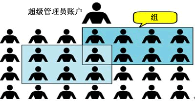
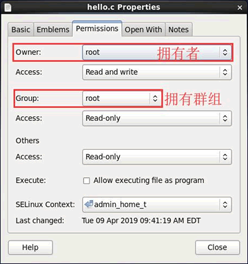

# 1. Linux用户和用户组

Linux 是多用户多任务操作系统，换句话说，Linux 系统支持多个用户在同一时间内登陆，不同用户可以执行不同的任务，并且互不影响。

例如，某台 Linux 服务器上有 4 个用户，分别是 root、www、ftp 和 mysql，在同一时间内，root 用户可能在查看系统日志、管理维护系统；www 用户可能在修改自己的网页程序；ftp 用户可能在上传软件到服务器；mysql 用户可能在执行自己的 SQL 查询，每个用户互不干扰，有条不紊地进行着自己的工作。与此同时，每个用户之间不能越权访问，比如 www 用户不能执行 mysql 用户的 SQL 查询操作，ftp 用户也不能修改 www 用户的网页程序。

不同用户具有不问的权限，毎个用户在权限允许的范围内完成不间的任务，Linux 正是通过这种权限的划分与管理，实现了多用户多任务的运行机制。

因此，如果要使用 Linux 系统的资源，就必须向系统管理员申请一个账户，然后通过这个账户进入系统（账户和用户是一个概念）。通过建立不同属性的用户，一方面可以合理地利用和控制系统资源，另一方面也可以帮助用户组织文件，提供对用户文件的安全性保护。

每个用户都有唯一的用户名和密码。在登录系统时，只有正确输入用户名和密码，才能进入系统和自己的主目录。

用户组是具有相同特征用户的逻辑集合。简单的理解，有时我们需要让多个用户具有相同的权限，比如查看、修改某一个文件的权限，一种方法是分别对多个用户进行文件访问授权，如果有 10 个用户的话，就需要授权 10 次，那如果有 100、1000 甚至更多的用户呢？

显然，这种方法不太合理。最好的方式是建立一个组，让这个组具有查看、修改此文件的权限，然后将所有需要访问此文件的用户放入这个组中。那么，所有用户就具有了和组一样的权限，这就是用户组。

将用户分组是 Linux 系统中对用户进行管理及控制访问权限的一种手段，通过定义用户组，很多程序上简化了对用户的管理工作。

## Linux用户和组的关系

用户和用户组的对应关系有以下 4 种：

1. 一对一：一个用户可以存在一个组中，是组中的唯一成员；
2. 一对多：一个用户可以存在多个用户组中，此用户具有这多个组的共同权限；
3. 多对一：多个用户可以存在一个组中，这些用户具有和组相同的权限；
4. 多对多：多个用户可以存在多个组中，也就是以上 3 种关系的扩展。

用户和组之间的关系可以用图 1 来表示：

​
图 1 Linux 用户和组

# Linux UID和GID

登陆 Linux 系统时，虽然输入的是自己的用户名和密码，但其实 Linux 并不认识你的用户名称，它只认识用户名对应的 ID 号（也就是一串数字）。Linux 系统将所有用户的名称与 ID 的对应关系都存储在 /etc/passwd 文件中。

说白了，用户名并无实际作用，仅是为了方便用户的记忆而已。

要论证 "Linux系统不认识用户名" 也很简单，在前面章节，我们曾经在网络上下载过 ".tar.gz" 或 ".tar.bz2" 格式的文件，在解压缩之后的文件中，你会发现文件拥有者的属性显示的是一串数字，这很正常，就是因为系统只认识代表你身份的 ID，这串数字就是用户的 ID（UID）号。

Linux 系统中，每个用户的 ID 细分为 2 种，分别是用户 ID（User ID，简称 UID）和组 ID（Group ID，简称 GID），这与文件有拥有者和拥有群组两种属性相对应（如图 1 所示）。

​
图 1 文件的拥有者和群组属性

从图 1 中可以看到，该文件的拥有者是超级管理员 root，拥有群组也是 root。读者可能会问，既然 Linux 系统不认识用户名，文件是如何判别它的拥有者名称和群组名称的呢？

每个文件都有自己的拥有者 ID 和群组 ID，当显示文件属性时，系统会根据 /etc/passwd 和 /etc/group 文件中的内容，分别找到 UID 和 GID 对应的用户名和群组名，然后显示出来。

/etc/passwd 文件和 /etc/group 文件，后续文章会做详细讲解，这里只需要知道，在 /etc/passwd 文件中，利用 UID 可以找到对应的用户名；在 /etc/group 文件中，利用 GID 可以找到对应的群组名。

做个小实验，笔者所用的 Linux 系统中，常用的有两个账户，分别为 root 超级管理员账户和 c.biancheng.net 普通账户，我们先使用 root 账号登陆并 Vim /etc/passwd，在该文件中找到 c.biancheng.net 账户并将其 UID 随意改一个数字，这时当你查看普通账户拥有的文件时，你会发现所有文件的拥有者不再是 c.biancheng.net，而是数字。

具体执行过程如下所示：

```bash
#查看系统中是否存在c.biancheng.net这个用户
[root@livecd ~]#grep 'c.biancheng.net' /etc/passwd
c.biancheng.net:x:500:500:c.biancheng.net:/home/centoslive:/bin/bash
[root@livecd ~]#ll -d /home/centoslive
drwx------. 23 c.biancheng.net centoslive 4096 Apr 9 09:37 /home/centoslive
[root@livecd ~]#vim /etc.passwd
#修改c.biancheng.net账户中的UID（第一个 500）为 2000
[root@livecd ~]#ll -d /home/centoslive
drwx------. 23 500 centoslive 4096 Apr 9 09:37 /home/centoslive
#可以看到，之前的 c.biancheng.net 变为了 500，因为修改了UID，导致 500 找不到对应的账号，因此显示数字
#记得最后将其再手动改正过来
[root@livecd ~]#vim /etc.passwd
#修改c.biancheng.net账户中的UID从 2000 改为 500
```

由于 c.biancheng.net 账户的 UID 已经改为 2000，但其 home 目录却记录的是 500，会导致此用户再次登录时无法进入自己的home目录。

注意，本节为了说明 ID 和用户名的对应关系，所以才将 /etc/passwd 文件中用户的 UID 做了更改。此操作很可能会导致某些程序无法进行，因此 /etc/passwd 文件不能随意修改。

# Linux 初始组和附加组

‍

通过学习用户和群组我们知道，群组可以让多个用户具有相同的权限，同时也可以这样理解，一个用户可以所属多个群组，并同时拥有这些群组的权限，这就引出了初始组（有时也称主组）和附加组。

((20231025163950-jnyyqia '3'))一节中，已经对用户所属初始组和附加组的概念进行了简单介绍，本节对初始组和附加组做更详细的介绍。

/etc/passwd 文件中每个用户信息分为 7 个字段，其中第 4 字段（GID）指的就是每个用户所属的初始组，也就是说，当用户一登陆系统，立刻就会拥有这个群组的相关权限。

举个例子，我们新建一个用户 lamp，并将其加入 users 群组中，执行命令如下：

```bash
[root@localhost ~]# useradd lamp  <--添加新用户
[root@localhost ~]# groupadd users  <--添加新群组
[root@localhost ~]# usermod -G users lamp  <--将用户lamp加入 users群组
[root@localhost ~]# grep "lamp" /etc/passwd /etc/group /etc/gshadow
/etc/passwd:lamp:x:501:501::/home/lamp:/bin/bash
/etc/group:users:x:100:lamp
/etc/group:lamp:x:501:
/etc/gshadow:users:::lamp
/etc/gshadow:lamp:!::
```

useradd 和 groupadd 分别是添加用户和群组的命令，后续章节会做详细讲解。

可以看到，在 etc/passwd 文件中，lamp 用户所属的 GID（群组 ID）为 501，通过搜索 /etc/group 文件得知，对应此 GID 的是 lamp 群组，也就是说，lamp 群组是 lamp 用户的初始组。

 lamp 群组是添加 lamp 用户时默认创建的群组，在 root 管理员使用 useradd 命令创建新用户时，若未明确指定该命令所属的初始组，useradd 命令会默认创建一个同用户名相同的群组，作为该用户的初始组。

正因为 lamp 群组是 lamp 用户的初始组，该用户一登陆就会自动获取相应权限，因此不需要在 /etc/group 的第 4 个字段额外标注。

 但是，附加组就不一样了，从例子中可以看到，我们将 lamp 用户加入 users 群组中，由于 users 这个群组并不是 lamp  的初始组，因此必须要在 /etc/group 这个文件中找到 users 那一行，将 lamp 这个用户加入第 4  段中（群组包含的所有用户），这样 lamp 用户才算是真正加入到 users 这个群组中。

在这个例子中，因为 lamp 用户同时属于 lamp 和users 两个群组，所在，在读取\写入\运行文件时，只要是 user 和 lamp 群组拥有的功能，lamp 用户都拥有。

一个用户可以所属多个附加组，但只能有一个初始组。那么，如何知道某用户所属哪些群组呢？使用 groups 命令即可。

例如，我们现在以 lamp 用户的身份登录系统，通过执行如下命令即可知晓当前用户所属的全部群组：

```bash
[root@localhost ~]# groups
lamp users
```

通过以上输出信息可以得知，lamp 用户同时属于 lamp 群组和 users 群组，而且，第一个出现的为用户的初始组，后面的都是附加组，所以 lamp 用户的初始组为 lamp 群组，附加组为 users 群组。

‍

‍

# Linux 用户信息文件/etc/passwd

Linux 系统中的 /etc/passwd 文件，是系统用户配置文件，存储了系统中所有用户的基本信息，并且所有用户都可以对此文件执行读操作。

首先我们来打开这个文件，看看到底包含哪些内容，执行命令如下：

```bash
[root@localhost ~]# vi /etc/passwd
#查看一下文件内容
root:x:0:0:root:/root:/bin/bash
bin:x:1:1:bin:/bin:/sbin/nologin
daemon:x:2:2:daemon:/sbin:/sbin/nologin
adm:x:3:4:adm:/var/adm:/sbin/nologin
...省略部分输出...
```

可以看到，/etc/passwd 文件中的内容非常规律，每行记录对应一个用户。

读者可能会问，Linux 系统中默认怎么会有这么多的用户？这些用户中的绝大多数是系统或服务正常运行所必需的用户，这种用户通常称为系统用户或伪用户。系统用户无法用来登录系统，但也不能删除，因为一旦删除，依赖这些用户运行的服务或程序就不能正常执行，会导致系统问题。

不仅如此，每行用户信息都以 "：" 作为分隔符，划分为 7 个字段，每个字段所表示的含义如下：

用户名：密码：UID（用户ID）：GID（组ID）：描述性信息：主目录：默认Shell

接下来，给大家逐个介绍这些字段。

## 用户名

用户名，就是一串代表用户身份的字符串。

前面讲过，用户名仅是为了方便用户记忆，Linux 系统是通过 UID 来识别用户身份，分配用户权限的。/etc/passwd 文件中就定义了用户名和 UID 之间的对应关系。

## 密码

"x" 表示此用户设有密码，但不是真正的密码，真正的密码保存在 /etc/shadow 文件中（下一节做详细介绍）。

在早期的 UNIX 中，这里保存的就是真正的加密密码串，但由于所有程序都能读取此文件，非常容易造成用户数据被窃取。

虽然密码是加密的，但是采用暴力破解的方式也是能够进行破解的。

因此，现在 Linux 系统把真正的加密密码串放置在 /etc/shadow 文件中，此文件只有 root 用户可以浏览和操作，这样就最大限度地保证了密码的安全。

需要注意的是，虽然 "x" 并不表示真正的密码，但也不能删除，如果删除了 "x"，那么系统会认为这个用户没有密码，从而导致只输入用户名而不用输入密码就可以登陆（只能在使用无密码登录，远程是不可以的），除非特殊情况（如破解用户密码），这当然是不可行的。

## UID

UID，也就是用户 ID。每个用户都有唯一的一个 UID，Linux 系统通过 UID 来识别不同的用户。

实际上，UID 就是一个 0~65535 之间的数，不同范围的数字表示不同的用户身份，具体如表 1 所示。

|UID 范围|用户身份|
| -----------| -----------------------------------------------------------------------------------------------------------------------------------------------------------------------------------------------------------------------------------------------------------|
|0|超级用户。UID 为 0 就代表这个账号是管理员账号。在 Linux 中，如何把普通用户升级成管理员呢？<br />只需把其他用户的 UID 修改为 0 就可以了，这一点和 Windows 是不同的。不过不建议建立多个管理员账号。<br />|
|1-499|系统用户（伪用户）。也就是说，此范围的 UID 保留给系统使用。<br />其中，1-99用于系统自行创建的账号；100-499 分配给有系统账号需求的用户。 <br />其实，除了 0 之外，其他的 UID 并无不同，这里只是默认 500 以下的数字给系统作为保留账户，<br />只是一个公认的习惯而已。<br />|
|500-65535|普通用户。通常这些 UID 已经足够用户使用了。但不够用也没关系，2.6.x 内核之后的 Linux 系统已经可以支持 232 个 UID 了。|

‍

## GID

全称“Group ID”，简称“组ID”，表示用户初始组的组 ID 号。这里需要解释一下初始组和附加组的概念。

初始组，指用户登陆时就拥有这个用户组的相关权限。每个用户的初始组只能有一个，通常就是将和此用户的用户名相同的组名作为该用户的初始组。比如说，我们手工添加用户 lamp，在建立用户 lamp 的同时，就会建立 lamp 组作为 lamp 用户的初始组。

附加组，指用户可以加入多个其他的用户组，并拥有这些组的权限。每个用户只能有一个初始组，除初始组外，用户再加入其他的用户组，这些用户组就是这个用户的附加组。附加组可以有多个，而且用户可以有这些附加组的权限。

举例来说，刚刚的 lamp 用户除属于初始组 lamp 外，我又把它加入了 users 组，那么 lamp 用户同时属于 lamp 组和 users 组，其中 lamp 是初始组，users 是附加组。

当然，初始组和附加组的身份是可以修改的，但是我们在工作中不修改初始组，只修改附加组，因为修改了初始组有时会让管理员逻辑混乱。

需要注意的是，在 /etc/passwd 文件的第四个字段中看到的 ID 是这个用户的初始组。

## 描述性信息

这个字段并没有什么重要的用途，只是用来解释这个用户的意义而已。

## 主目录

也就是用户登录后有操作权限的访问目录，通常称为用户的主目录。

例如，root 超级管理员账户的主目录为 /root，普通用户的主目录为 /home/yourIDname，即在 /home/ 目录下建立和用户名相同的目录作为主目录，如 lamp 用户的主目录就是 /home/lamp/ 目录。

## 默认的Shell

Shell 就是 Linux 的命令解释器，是用户和 Linux 内核之间沟通的桥梁。

我们知道，用户登陆 Linux 系统后，通过使用 Linux 命令完成操作任务，但系统只认识类似 0101 的机器语言，这里就需要使用命令解释器。也就是说，Shell 命令解释器的功能就是将用户输入的命令转换成系统可以识别的机器语言。

通常情况下，Linux 系统默认使用的命令解释器是 bash（/bin/bash），当然还有其他命令解释器，例如 sh、csh 等。

在 /etc/passwd 文件中，大家可以把这个字段理解为用户登录之后所拥有的权限。如果这里使用的是 bash 命令解释器，就代表这个用户拥有权限范围内的所有权限。例如：

```bash
[root@localhost ~]# vi /etc/passwd
lamp:x:502:502::/home/lamp:/bin/bash
```

我手工添加了 lamp 用户，它使用的是 bash 命令解释器，那么这个用户就可以使用普通用户的所有权限。

如果我把 lamp 用户的 Shell 命令解释器修改为 /sbin/nologin，那么，这个用户就不能登录了，例如：

```bash
[root@localhost ~]# vi /etc/passwd
lamp:x:502:502::/home/lamp:/sbin/nologin
```

因为 /sbin/nologin 就是禁止登录的 Shell。同样，如果我在这里放入的系统命令，如 /usr/bin/passwd，例如：

```bash
[root@localhost ~]#vi /etc/passwd
lamp:x:502:502::/home/lamp:/usr/bin/passwd
```

那么这个用户可以登录，但登录之后就只能修改自己的密码。但是，这里不能随便写入和登陆没有关系的命令（如 ls），系统不会识别这些命令，同时也就意味着这个用户不能登录。

# Linux 用户组信息文件/etc/group

/ect/group 文件是用户组配置文件，即用户组的所有信息都存放在此文件中。

 此文件是记录组 ID（GID）和组名相对应的文件。前面讲过，etc/passwd 文件中每行用户信息的第四个字段记录的是用户的初始组 ID，那么，此 GID 的组名到底是什么呢？就要从 /etc/group 文件中查找。

 /etc/group 文件的内容可以通过 Vim 看到：

```bash
[root@localhost ~]#vim /etc/group
root:x:0:
bin:x:1:bin,daemon
daemon:x:2:bin,daemon
…省略部分输出…
lamp:x:502:
```

可以看到，此文件中每一行各代表一个用户组。在前面章节中，我们曾创建 lamp 用户，系统默认生成一个 lamp 用户组，在此可以看到，此用户组的 GID 为 502，目前它仅作为 lamp 用户的初始组。

 各用户组中，还是以 "：" 作为字段之间的分隔符，分为 4 个字段，每个字段对应的含义为：  组名：密码：GID：该用户组中的用户列表

 接下来，分别介绍各个字段具体的含义。

## 组名

 也就是是用户组的名称，有字母或数字构成。同 /etc/passwd 中的用户名一样，组名也不能重复。

## 组密码

 和 /etc/passwd 文件一样，这里的 "x" 仅仅是密码标识，真正加密后的组密码默认保存在 /etc/gshadow 文件中。

 不过，用户设置密码是为了验证用户的身份，那用户组设置密码是用来做什么的呢？用户组密码主要是用来指定组管理员的，由于系统中的账号可能会非常多，root  用户可能没有时间进行用户的组调整，这时可以给用户组指定组管理员，如果有用户需要加入或退出某用户组，可以由该组的组管理员替代 root  进行管理。但是这项功能目前很少使用，我们也很少设置组密码。如果需要赋予某用户调整某个用户组的权限，则可以使用 sudo 命令代替。

## 组ID (GID)

 就是群组的 ID 号，Linux 系统就是通过 GID 来区分用户组的，同用户名一样，组名也只是为了便于管理员记忆。

 这里的组 GID 与 /etc/passwd 文件中第 4 个字段的 GID 相对应，实际上，/etc/passwd 文件中使用 GID 对应的群组名，就是通过此文件对应得到的。

## 组中的用户

 此字段列出每个群组包含的所有用户。需要注意的是，如果该用户组是这个用户的初始组，则该用户不会写入这个字段，可以这么理解，该字段显示的用户都是这个用户组的附加用户。

 举个例子，lamp 组的组信息为 "lamp : x : 502:"，可以看到，第四个字段没有写入 lamp 用户，因为 lamp 组是 lamp  用户的初始组。如果要查询这些用户的初始组，则需要先到 /etc/passwd 文件中查看 GID（第四个字段），然后到 /etc/group  文件中比对组名。

每个用户都可以加入多个附加组，但是只能属于一个初始组。所以我们在实际工作中，如果需要把用户加入其他组，则需要以附加组的形式添加。例如，我们想让 lamp 也加入 root 这个群组，那么只需要在第一行的最后一个字段加入 lamp，即 root : x : 0:lamp 就可以了。

 一般情况下，用户的初始组就是在建立用户的同时建立的和用户名相同的组。

 到此，我们已经学习了/etc/passwd、/etc/shadow、/etc/group，它们之间的关系可以这样理解，即先在  /etc/group 文件中查询用户组的 GID 和组名；然后在 /etc/passwd 文件中查找该 GID  是哪个用户的初始组，同时提取这个用户的用户名和 UID；最后通过 UID 到 /etc/shadow 文件中提取和这个用户相匹配的密码。

‍
