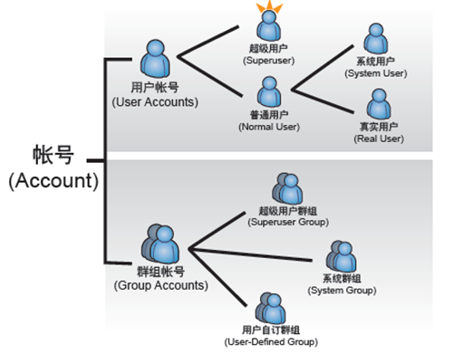

# linux 用户管理

## 用户和组的相关概念

- **账号**：是一种用来记录单个用户或是多个用户的数据。Linux中每一个合法的用户都必须要拥有账号，才能使用 。它不仅可以用来验证用户身份，还决定了一个用户在系统中可以从事什么工作

在Linux 上的账号可以分成两类：

- **用户账号** 用来储存单一用户的数据，你可以使用一个用户账号，来储存某一个用户的数据。
- **群组账号** 用来储存多个用户的信息，每一个群组账号可以用来记录一组用户的数据。

我们可以把 Linux 的所有账号依照下面两种方法进行分类：

- 依照账号的位置。
- 依照账号的功能。

**依照账号存储的位置**

账号数据存放在不同的地方，其可使用的范围就会不太一样，账号的使用范围我们称为视野。依照账号储存的位置与视野不同，我们可以区分本机账号与网域账号两种：

**本机账号:** 账号密码储存于本机硬盘中，我们称为本机账号。
本机账号使用范围只能在账号建立的 Linux 系统上，如果超出范围时，本机账号将无法使用。比如：你在自己电脑上登录用的账号和密码，正常是无法在其它的电脑上使用的。

- 本机账号的优点：是简单易用，你无须作额外的设置，就可以直接建立本机账号；
- 本机账号的缺点：则是无法具备延展性（*Scalability*）。比如：你在一个拥有很多主机的环境中，想拥有一个在每台主机都可以登录的账号时，你就需要在所有的主机上都建立相关的用户

**网域账号：** 你也可以把大量的计算机组织成为一个网域，然后在网域中的某一台 Linux 上建立账号数据，并且通过某些通信协议，将账号数据分享出来。当其他计算机需要取得账号数据时，再通过网络调用这些分享的账号即可。这种账号我们称为网域账号 （*Domain Account*）。

- 网域账号的优点：在于具备延展性。在大规模的环境中，使用网域账号往往能节省管理账号的时间；
- 但网域账号也有缺点，其最大的缺点就是要配置网域账号前，你必须先建立“域”的环境才行。

**依照账号的功能**

不管是本机账号或是网域账号，我们还可以把所有账号依照功能分成下面几类



**用户账号部分：** 包含了超级用户、普通用户；而普通用户中还可细分为系统用户、真实用户两种。

- 超级用户：在Linux 系统上拥有完整的控制能力，常被称为系统管理员，在 系统上拥有完整的控制能力，你可以利用超级用户读取或写入 上任何文件、安装或删除软硬件、启动或停止服务，甚至关机与停止系统的执行。 通常只有在管理系统时才会使用超级用户账号登录，所以超级用户常被称为系统管理员 （*System Administrator*）。由于超级用户的权限不受任何限制，你可以使用该账号来管理 系统；但是，也可能因为操作错误，或者打错命令而造成无法挽救的伤害。
  在此，强烈建议你“除非有必要，否则请不要轻易以超级用户身份使用 Linux”！

  **在 Linux 系统中，默认超级用户的用户为 root，其 UID（用户ID号）一定为 0。**
- 普通用户账号：行为能力会受到限制，只能调用具备权限的文件，如果没有足够的权限，普通用户是完全无法调用的；所以，普通用户账号不太容易危害 Linux 系统。普通用户账号中，我们又可分为两大类：
- 系统账号
  这种类型的账号仅提供给Linux 系统本身使用。在某些软件执行的时候，需要你提供一个普通用户类型的账号。为了满足这些软件而建立的账号，我们称为系统账号 （*System Account*）。
- 真实用户
  系统用户账号是给软件或程序使用的，那么，什么账号是让我们登录Linux 时使用的呢？答案就是真实用户（*Real User*）。真实用户账号是为了让其他人登录系统使用的

**群组账号部分：** 包含了超级用户群组、系统群组以及用户自定义组三大类。

- 超级用户群组：Linux 有一个叫做 root 的群组，因为这个群组的名称与 root 这个超级用户的名称相同，所以，我们习惯把 root 群组叫做超级用户群组。超级用户群组的 GID 为 0。
- 系统群组： 与系统账号一样，系统群组是给 Linux 系统本身，或是某个软件所使用
- 用户自定义组：除了上述的群组外其余的所有群组，皆是由管理者自行定义，因此我们把这些群组称之为用户自定义组

另外，Linux 系统的“用户自定义组“类型中，还有一种名为**用户私有群组** （*UPG, User Private Group*）的群组。什么是 **用户私有群组**呢？用户私有群组（*UPG, User Private Group*）是指 “与用户账号名称相同，且为用户的主要群组”的群组。当你建立新的用户账号时，Linux 会自动建立该用户的私有群组。如，当你建立 test 这个用户账号时，Linux 会自动建立了一个名为 test 的群组，并且让 test群组成为 test 用户账号的主要群组，test 群组即是 test 的私有群组。

了解完账号的基本概念后，我们一起来看下账号到底记录了哪些信息

## 用户账号管理

### **useradd命令**

用户创建命令，创建一个linux用户。

```
useradd(选项)(参数)
-b, --base-dir BASE_DIR  # 如果未指定 -d HOME_DIR，则系统的默认基本目录。如果未指定此选项，useradd 将使用 /etc/default/useradd 中的 HOME 变量指定的基本目录，或默认使用 /home。
-c, --comment COMMENT    # 加上备注文字。任何文本字符串。它通常是对登录名的简短描述，目前用作用户全名的字段。
-d, --home HOME_DIR      # 将使用 HOME_DIR 作为用户登录目录的值来创建新用户。 
-D, --defaults           # 变更预设值。
-e, --expiredate EXPIRE_DATE # 用户帐户将被禁用的日期。 日期以 YYYY-MM-DD 格式指定。
-f, --inactive INACTIVE      # 密码过期后到帐户被永久禁用的天数。
-g, --gid GROUP   # 用户初始登录组的组名或编号。组名必须存在。组号必须引用已经存在的组。
-G, --groups GROUP1[,GROUP2,...[,GROUPN]]] # 用户也是其成员的补充组列表。每个组用逗号隔开，中间没有空格。
-h, --help # 显示帮助信息并退出。
-k, --skel SKEL_DIR # 骨架目录，其中包含要在用户的主目录中复制的文件和目录，当主目录由 useradd 创建时。
-K, --key KEY=VALUE # 覆盖 /etc/login.defs 默认值（UID_MIN、UID_MAX、UMASK、PASS_MAX_DAYS 等）。
-l, --no-log-init   # 不要将用户添加到 lastlog 和 faillog 数据库。
-m, --create-home   # 如果用户的主目录不存在，则创建它。
-M                  # 不要创建用户的主目录，即使 /etc/login.defs (CREATE_HOME) 中的系统范围设置设置为 yes。
-N, --no-user-group # 不要创建与用户同名的组，而是将用户添加到由 -g 选项或 /etc/default/useradd 中的 GROUP 变量指定的组中。
-o, --non-unique    # 允许创建具有重复（非唯一）UID 的用户帐户。 此选项仅在与 -o 选项结合使用时有效。
-p, --password PASSWORD # crypt(3) 返回的加密密码。 默认是禁用密码。
-r, --system        # 创建一个系统帐户。
-s, --shell SHELL   # 用户登录 shell 的名称。
-u, --uid UID       # 用户 ID 的数值。
-U, --user-group    # 创建一个与用户同名的组，并将用户添加到该组。
-Z, --selinux-user SEUSER # 用户登录的 SELinux 用户。 默认情况下将此字段留空，这会导致系统选择默认的 SELinux 用户。

# 更改默认值
# 当仅使用 -D 选项调用时，useradd 将显示当前默认值。 当使用 -D 和其他选项调用时，useradd 将更新指定选项的默认值。 有效的默认更改选项是：
```

**关于linux本机用户**
本机的用户账号数据储存于/etc/passwd文件中。与其他的配置文件一样，passwd 也是一个文本文件，因此，你可以直接使用文字处理程序，例如 cat 或 less 浏览其中的内容。

```
root:x:0:0:root:/root:/bin/bash
bin:x:1:1:bin:/bin:/sbin/nologin
daemon:x:2:2:daemon:/sbin:/sbin/nologin
```

/etc/passwd 权限必须是0644，每一行代表一个用户的账号数据，每一行又使用冒号（:）分隔为几个部分

```
USERNAME:PASSWORD:UID:GID:COMMENT:HOMEDIR:SHELL  

- USERNAME:用户识别名称，也是登录的名称
- PASSWORD：密码位，用于存储用户的密码，为了安全起见，密码放在另一个文件中，这里统一用x
- UID：用户识别号，0表示为管理员，非0为普通用户
- GID：组识别号，用来识别用户组的身份，同样0为管理员组，非0为系统群组或者自定义组
- COMMENT：描述信息
- HOMEDIR：家目录位置
- SHELL：shell类型
```

### **usermod命令**

是用来修改用户相关信息的，和useradd使用的参数很多是相同的，用法也是一样的，除此之外usermod命令还有一些额外的参数

```
usermod(选项)(参数)
-c<备注>：修改用户帐号的备注文字；
-d<登入目录>：修改用户登入时的目录，只是修改/etc/passwd中用户的家目录配置信息，不会自动创建新的家目录，通常和-m一起使用；
-m<移动用户家目录>:移动用户家目录到新的位置，不能单独使用，一般与-d一起使用。
-e<有效期限>：修改帐号的有效期限；
-f<缓冲天数>：修改在密码过期后多少天即关闭该帐号；
-g<群组>：修改用户所属的群组；
-G<群组>；修改用户所属的附加群组；
-l<帐号名称>：修改用户帐号名称；
-L：锁定用户密码，使密码无效；
-s<shell>：修改用户登入后所使用的shell；
-u<uid>：修改用户ID；
-U:解除密码锁定。
```

### **userdel命令**

删除linux用户

```
userdel(选项)(参数)

-f：强制删除用户，即使用户当前已登录；
-r：删除用户的同时，删除与用户相关的所有文件。
```

## 用户查询命令

### **id命令**

**查询用户uid、gid信息**

```
[root@zutuanxue ~]# id hello
uid=1500(hello) gid=1500(hello) 组=1500(hello)

[root@zutuanxue ~]# id -u hello
1500
```

### **whoami命令**

**查询当前登录用户**

```
[root@zutuanxue ~]# whoami
root
```

### **w命令**

**查询linux系统中登陆的所有用户**

```
[root@zutuanxue ~]# w
 18:21:43 up  2:01,  1 user,  load average: 0.00, 0.00, 0.00
USER     TTY      FROM             LOGIN@   IDLE   JCPU   PCPU WHAT
root     pts/0    192.168.1.17    16:16    3.00s  0.08s  0.00s w
```

‍

## 用户提权sudo

**sudo命令** 用来以其他身份来执行命令，预设的身份为root。在`/etc/sudoers`​中设置了可执行sudo指令的用户。若其未经授权的用户企图使用sudo，则会发出警告的邮件给管理员。用户使用sudo时，必须先输入密码，之后有5分钟的有效期限，超过期限则必须重新输入密码。

延长Linux中sudo密码在终端的有效时间

```bash
vim  /etc/sudoers
Defaults env_reset,timestamp_timeout=20
```

* **给用户添加sudo权限**

  根据需要可以选择下面四行中的一行：

  ```bash
  # 允许用户youuser执行sudo命令(需要输入密码).
  youuser ALL=(ALL) ALL 
  # 允许用户组youuser里面的用户执行sudo命令(需要输入密码).
  %youuser ALL=(ALL) ALL 
  # 允许用户youuser执行sudo命令,并且在执行的时候不输入密码.
  youuser ALL=(ALL) NOPASSWD: ALL 
  # 允许用户组youuser里面的用户执行sudo命令,并且在执行的时候不输入密码.
  %youuser ALL=(ALL) NOPASSWD: ALL
  ```

- **Defaults 配置项**

  使用 Defaults 配置，可以改变 sudo 命令的行为，如：

  ```
  # 指定用户尝试输入密码的次数，默认值为3
  Defaults passwd_tries=5

  # 设置密码超时时间，默认为 5 分钟
  Defaults passwd_timeout=2

  # 默认 sudo 询问用户自己的密码，添加 targetpw 或 rootpw 配置可以让 sudo 询问 root 密码
  Defaults targetpw

  # 指定自定义日志文件
  Defaults logfile="/var/log/sudo.log"

  # 要在自定义日志文件中记录主机名和四位数年份，可以加上 log_host 和 log_year 参数
  Defaults log_host, log_year, logfile="/var/log/sudo.log"

  # 保持当前用户的环境变量
  Defaults env_keep += "LANG LC_ADDRESS LC_CTYPE COLORS DISPLAY HOSTNAME EDITOR"
  Defaults env_keep += "ftp_proxy http_proxy https_proxy no_proxy"

  # 安置一个安全的 PATH 环境变量
  Defaults secure_path="/usr/local/sbin:/usr/local/bin:/usr/sbin:/usr/bin:/sbin:/bin"
  ```

* **/etc/sudoers内容详解**

  ```bash
  root         ALL=(ALL:ALL)   ALL
  %wheel  ALL=(ALL)           ALL
  %sudo    ALL=(ALL:ALL)    ALL
  peter      ALL=(ALL) NOPASSWD: ALL

  授权用户/组  主机=[(切换到哪些用户或组)]  [是否需要输入密码验证] 命令1,命令2,...
  ```
  * **&quot;字段1&quot;**不以%号开头的表示"将要授权的用户", 比如例子中的root；以%号开头的表示"将要授权的组", 比如例子中的%wheel组 和 %sudo组。
  * **&quot;字段2&quot;**表示允许登录的主机, ALL表示所有; 如果该字段不为ALL,表示授权用户只能在某些机器上登录本服务器来执行sudo命令.
  * **&quot;字段3&quot;**如果省略, 相当于(root:root)，表示可以通过sudo提权到root;  如果为(ALL)或者(ALL:ALL), 表示能够提权到(任意用户:任意用户组)。请注意，"字段3"如果没省略,必须使用(  )括号包含起来。这样才能区分是省略了"字段3"还是省略了"字段4"。
  * **&quot;字段4&quot;**的可能取值是NOPASSWD:。请注意NOPASSWD后面带有冒号:。表示执行sudo时可以不需要输入密码。

  * **&quot;字段5&quot;**是使用逗号分开一系列命令,这些命令就是授权给用户的操作; ALL表示允许所有操作。
