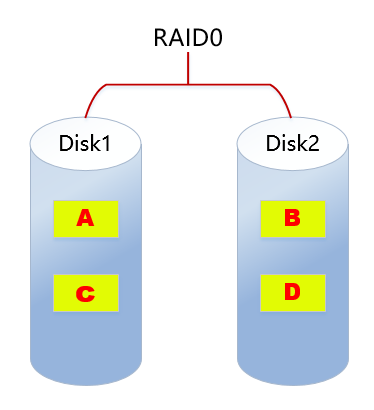
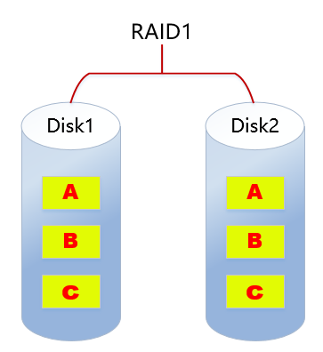
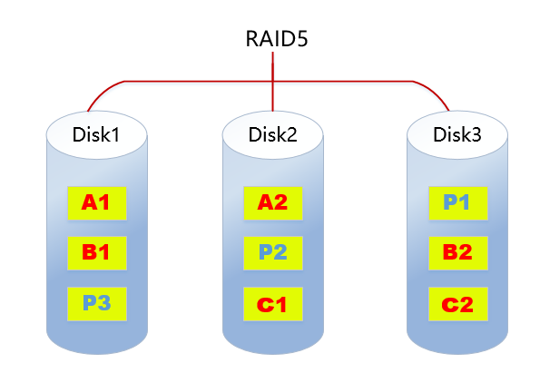

# linux 磁盘管理-RAID

## 一、RAID介绍

RAID(Redundant Array of Independent Disk 独立冗余磁盘阵列)技术是加州大学伯克利分校1987年提出，最初是为了组合小的廉价磁盘来代替大的昂贵磁盘，同时希望磁盘失效时不会使对数据的访问受损失而开发出一定水平的数据保护技术。RAID就是一种由多块廉价磁盘构成的冗余阵列，在操作系统下是作为一个独立的大型存储设备出现。RAID可以充分发挥出多块硬盘的优势，可以提升硬盘速度，增大容量，提供容错功能，能够确保数据安全性，易于管理的优点，在任何一块硬盘出现问题的情况下都可以继续工作，不会 受到损坏硬盘的影响。

## 二、常见的RAID级别

### 2.1、 RAID0



**RAID0特点：**

- 至少需要两块磁盘
- 数据条带化分布到磁盘，高的读写性能，100%高存储空间利用率
- 数据没有冗余策略，一块磁盘故障，数据将无法恢复
- 应用场景：
  - 对性能要求高但对数据安全性和可靠性要求不高的场景，比如音频、视频等的存储。

### 2.2、 RAID1



**RAID1特点：**

- 至少需要2块磁盘
- 数据镜像备份写到磁盘上(工作盘和镜像盘)，可靠性高，磁盘利用率为50%
- 读性能可以，但写性能不佳
- 一块磁盘故障，不会影响数据的读写
- 应用场景：
  - 对数据安全可靠要求较高的场景，比如邮件系统、交易系统等。

### 2.3、 RAID5



**RAID5特点：**

- 至少需要3块磁盘
- 数据条带化存储在磁盘，读写性能好，磁盘利用率为(n-1)/n
- 以奇偶校验(分散)做数据冗余
- 一块磁盘故障，可根据其他数据块和对应的校验数据重构损坏数据（消耗性能）
- 是目前综合性能最佳的数据保护解决方案
- 兼顾了存储性能、数据安全和存储成本等各方面因素（性价比高）
- 适用于大部分的应用场景

### 2.4、 RAID6


**RAID6特点：**

- 至少需要**4**块磁盘
- 数据条带化存储在磁盘，读取性能好，容错能力强
- 采用双重校验方式保证数据的安全性
- 如果2块磁盘同时故障，可以通过两个校验数据来重建两个磁盘的数据
- 成本要比其他等级高，并且更复杂
- 一般用于对数据安全性要求非常高的场合

### 2.5、 RAID10


**RAID10特点：**

- RAID10是raid1+raid0的组合
- 至少需要4块磁盘
- 两块硬盘为一组先做raid1，再将做好raid1的两组做raid0
- 兼顾数据的冗余（raid1镜像）和读写性能（raid0数据条带化）
- 磁盘利用率为50%，成本较高

## 三、RAID总结

|类型|读写性能|可靠性|磁盘利用率|成本|
| ------| ---------------------------------| -----------------| -----------| -----------------|
|RAID0|最好|最低|100%|较低|
|RAID1|读快；写一般|高|50%|高|
|RAID5|读:近似RAID0 写:多了校验|RAID0<RAID5<RAID1|(n-1)/n|RAID0<RAID5<RAID1|
|RAID6|读：近似RAID0 写:多了双重校验|RAID6>RAID5|RAID6<RAID5|RAID6>RAID1|
|RAID10|读：RAID10=RAID0 写：RAID10=RAID1|高|50%|最高|

## 四、RAID分类

### 软RAID

软RAID运行于操作系统底层，将SCSI或者IDE控制器提交上来的物理磁盘，虚拟成虚拟磁盘，再提交给管理程序来进行管理。软RAID有以下特点：

- 节省成本，系统支持就可以使用相应功能
- 占用内存空间
- 占用CPU资源
- 如果程序或者操作系统故障就无法运行

### 硬RAID

通过用硬件来实现RAID功能的就是硬RAID，独立的RAID卡，主板集成的RAID芯片都是硬RAID。RAID卡就是用来实现RAID功能的板卡。硬RAID的特点：

- 硬RAID有独立的运算单元，性能好
- 可能需要单独购买额外的硬件
- 不同RAID卡支持的功能不同，需要根据自己的需求选择

# 五、mdadm

mdadm命令，其功能是用于管理RAID磁盘阵列组。作为Linux系统下软RAID设备的管理神器，mdadm命令可以进行创建、调整、监控、删除等全套管理操作。

**1. 安装**

`yum install -y mdadm`

**2. 分区**

对两块数据盘进行分区，并设置分区类型为raid

```bash
[root@localhost ~]# lsblk
NAME            MAJ:MIN RM  SIZE RO TYPE MOUNTPOINT
sda               8:0    0   30G  0 disk 
├─sda1            8:1    0    1G  0 part /boot
└─sda2            8:2    0   29G  0 part 
  ├─centos-root 253:0    0   26G  0 lvm  /
  └─centos-swap 253:1    0    3G  0 lvm  [SWAP]
sdb               8:16   0   20G  0 disk 
sdc               8:32   0   20G  0 disk 
sr0              11:0    1  9.5G  0 rom

[root@localhost ~]# fdisk /dev/sdb
欢迎使用 fdisk (util-linux 2.23.2)。

更改将停留在内存中，直到您决定将更改写入磁盘。
使用写入命令前请三思。


命令(输入 m 获取帮助)：n
Partition type:
   p   primary (0 primary, 0 extended, 4 free)
   e   extended
Select (default p): p
分区号 (1-4，默认 1)：1
起始 扇区 (2048-41943039，默认为 2048)：
将使用默认值 2048
Last 扇区, +扇区 or +size{K,M,G} (2048-41943039，默认为 41943039)：
将使用默认值 41943039
分区 1 已设置为 Linux 类型，大小设为 20 GiB

命令(输入 m 获取帮助)：t
已选择分区 1
Hex 代码(输入 L 列出所有代码)：fd

已将分区“Linux”的类型更改为“Linux raid autodetect”

命令(输入 m 获取帮助)：w
The partition table has been altered!

Calling ioctl() to re-read partition table.
正在同步磁盘。

[root@localhost ~]# lsblk
NAME            MAJ:MIN RM  SIZE RO TYPE MOUNTPOINT
sda               8:0    0   30G  0 disk 
├─sda1            8:1    0    1G  0 part /boot
└─sda2            8:2    0   29G  0 part 
  ├─centos-root 253:0    0   26G  0 lvm  /
  └─centos-swap 253:1    0    3G  0 lvm  [SWAP]
sdb               8:16   0   20G  0 disk 
└─sdb1            8:17   0   20G  0 part 
sdc               8:32   0   20G  0 disk 
└─sdc1            8:33   0   20G  0 part 
sr0              11:0    1  9.5G  0 rom  
[root@localhost ~]# 

```

**3. 创建raid1**

1.创建raid1阵列

```bash
mdadm -C /dev/md0 -ayes -l1 -n2 /dev/sd[b,c]1
# 命令说明：

-a       # 同意创建设备，如不加此参数时必须先使用mknod 命令来创建一个RAID设备，不过推荐使用-a yes参数一次性创建;
-C       # 创建软raid
-l       # 指定raid级别
-n       # 指定raid中设备个数
/dev/md0 # 阵列的设备名称，如果还有其他阵列组可以以此类推；

```

2.查看阵列状态

```bash
# 使用mdadm -D /dev/md0查看阵列组的状态
mdadm -D /dev/md0
# 使用cat /proc/mdstat查看阵列状态
cat /proc/mdstat

```

**4. 创建md0的配置文件**

mdadm 配置文件并不存在，需要手工建立。我们使用以下命令建立 /etc/mdadm.conf 配置文件

```bash
# #建立/etc/mdadm.conf配置立件，并把组成RAID的分区的设备文件名写入
# #比如组成RAID10，就既要把分区的设备文件名放入此文件中，也要把组成RAID0的RAID1设备文件名放入
echo DEVICE /dev/sd{b,c}1 >> /etc/mdadm.conf
# 查询和扫描RAID信息，并追加进/etc/mdadm.conf文件
mdadm -Ds >> /etc/mdadm.conf
# mdadm -Evs >> /etc/mdadm.conf

```

**5. 格式化与挂载RAID**

RAID1 已经创建，但是要想正常使用，也需要格式化和挂载

```bash
mkfs.xfs /dev/md0
mkdir /raid
mount /dev/md0 /raid/

```

**6. 启动或停止RAID**

RAID 设备生效后，不用手工启动或停止。但是，如果需要卸载 RAID 设备，就必须手工停止 RAID

```bash
# 停止/dev/md0设备
mdadm -S /dev/md0

```

**7. 模拟磁盘损坏**

```bash
 # 选项f是用于模拟磁盘损坏
mdadm /dev/md0 -f /dev/sdb1
# 查看状态
mdadm -D /dev/md0
# 重启
reboot
# 添加磁盘
mdadm /dev/md0 -a /dev/sdb1
mdadm -D /dev/md10

```

## mdadm相关命令

mdadm是multiple devices admin的简称，它是Linux下的一款标准的软件 RAID 管理工具

基本语法 : `mdadm [模式] [RAID设备文件名] [选项]`

mode模块

主要功能

Create

创建一个阵列，每个设备都具有超级块；

Build

创建一个没有超级块的阵列；

Manage

管理阵列，如添加设备和删除损坏设备；

Assemble

加入一个已经存在的阵列；

Misc

允许单独对阵列中的设备进行操作，如停止阵列；

Monitor

监控RAID状态；

Grow

改变RAID的容量或阵列中的数目；

**options:**

```bash
-s,-scan               # 扫描配置文件或/proc/mdstat文件，发现丟失的信息；
-D,-detail             # 查看磁盘阵列详细信息；
-C,-create             # 建立新的磁盘阵列，也就是调用 Create模式；
-a,-auto=yes           # 采用标准格式建立磁阵列
-n,-raicklevices=数字  # 使用几块硬盘或分区组成RAID
-l,-level=级别         # 创建RAID的级别，可以是0,1,5
-x,-spare-devices=数字 # 使用几块硬盘或分区组成备份设备
-a,-add 设备文件名      # 在已经存在的RAID中加入设备
-r,-remove 设备文件名名 # 在已经存在的RAID中移除设备
-f,-fail设备文件名      # 把某个组成RAID的设备设置为错误状态
-S,-stop               # 停止RAID设备
-A,-assemble           # 按照配置文件加载RAID
```
