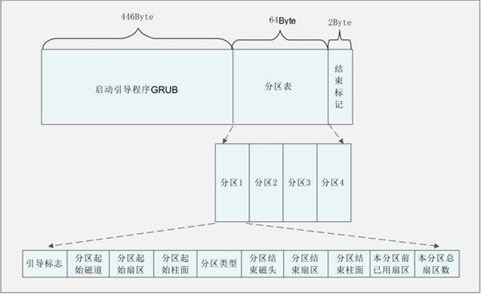

# 3. 主引导目录（MBR）结构及作用详解

MBR 也就是主引导记录，位于硬盘的 0 磁道、0 柱面、1 扇区中，主要记录了启动引导程序和磁盘的分区表。我们通过图 1 来看看 MBR 的结构。

​​

MBR 共占用了一个扇区，也就是 512 Byte。其中 446 Byte 安装了启动引导程序，其后 64 Byte 描述分区表，最后的 2  Byte 是结束标记。我们已经知道，每块硬盘只能划分 4 个主分区，原因就是在 MBR 中描述分区表的空间只有 64  Byte。其中每个分区必须占用 16 Byte，那么 64 Byte 就只能划分 4 个主分区。每个分区的 16 字节的规划如表 2 所示。

|存储字节|数据内容及含义|
| ---------------| ------------------------------------|
|第 1 字节|引导标志|
|第 2 字节|本分区的起始磁道号|
|第 3 字节|本分区的起始扇区号|
|第 4 字节|本分区的起始柱面号|
|第 5 字节|分区类型，可以识别主分区和扩展分区|
|第 6 字节|本分区的结束磁道号|
|第 7 字节|本分区的结束扇区号|
|第 8 字节|本分区的结束柱面号|
|第 9~12 字节|本分区之前已经占用的扇区数|
|第 13~16 字节|本分区的总扇区数|

大家注意到了吧，**MBR 中最主要的功能就是存储启动引导程序。**

## 启动引导程序的作用

BIOS 的作用就是自检，然后从 MBR 中读取出启动引导程序。那么，启动引导程序最主要的作用就是加载操作系统的内核。当然，每种操作系统的启动引导程序都是不同的。

每种操作系统的文件格式不同，因此，每种操作系统的启动引导程序也不一样。不同的操作系统只有使用自己的启动引导程序才能加载自己的内核。如果我的服务器上只安装了一个操作系统，那么这个操作系统的启动引导程序就会安装在  MBR 中。BIOS 调用 MBR 时读取出启动引导程序,就可以加载内核了。

但是在有些时候，我的服务器中安装了多个操作系统，而 MBR 只有一 个，那么在 MBR 中到底安装哪个操作系统的启动引导程序呢？

很明显，一个 MBR 是不够用的。每块硬盘只能有一个 MBR 是不能更改的，所以不可能増加 MBR  的数量。系统只能在每个文件系统（可以看成分区）中单独划分出一个扇区，称作引导扇区（Boot  Sector)。每个分区的引导扇区中也能安装启动引导程序，也就是说，在 MBR  和每个单独分区的引导扇区中都可以安装启动引导程序。这样多个操作系统才能安装在同一台服务器中（每个操作系统要安装在不同的分区中），而且每个操作系统都是可以启动的。

还有一个问题，BIOS 只能找到 MBR 中的启动引导程序，而找不到在分区的引导扇区中的启动引导程序。那么，要想完成多系统启动，我们的方法是増加启动引导程序的功能，让安装到 MBR 中的启动引导程序（GRUB）可以调用在分区的引导扇区中的其他启动引导程序。

因此，启动引导程序拥有以下功能：

1. 加载操作系统的内核。这是启动引导程序最主要的功能。
2. 拥有一个可以让用户选择的菜单，来选择到底启动哪个系统。大家如果在服务器上安装过双 Windows 系统，就应该见过类似的选择菜单，不过这个选择菜单是由 Windows 的启动引导程序提供的，而不是 GRUB。
3. 可以调用其他的启动引导程序，这是多系统启动的关键。不过需要注意的是，Windows 的启动引导程序不能调用 Linux  的启动引导程序，所以我们一般建议先安装 Windows，后安装 Linux，是为了将 Linux 的启动引导程序安装到 MBR 中，覆盖  Windows 的启动引导程序。

当然，这个安装顺序不是绝对的，就算最后安装了 Windows，我们也可以通过手工再安装 GRUB 的方法，来保证 MBR 中安装的还是 Linux 的启动引导程序。

下图为我们展示了启动引导程序的作用。

​​

‍
