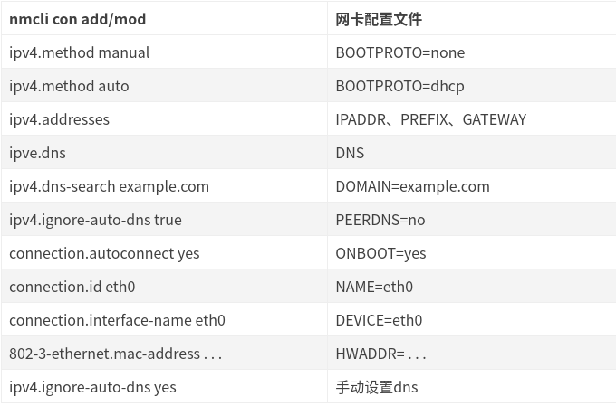

# linux NetworkManager

## NetworkManager 介绍

NetworkManager是一个程序，用于为系统自动提供检测和配置以自动连接到网络。NetworkManager的功能对于无线和有线网络都非常有用。对于无线网络，NetworkManager首选已知的无线网络，并且能够切换到最可靠的网络。支持NetworkManager的应用程序可以从联机和脱机模式切换。与无线连接相比NetworkManager更喜欢有线连接，它支持调制解调器连接和某些类型的VPN。NetworkManager最初是由Red  Hat开发的，现在由GNOME项目托管。

NetworkManager主要管理2个对象： Connection（网卡连接配置） 和 Device（网卡设备），他们之间是多对一的关系，但是同一时刻只能有一个Connection对于Device才生效。

NetworkManager的配置工具有多种形式，如下：

1. nmcli：命令行。这是最常用的工具。
2. nmtui：在shell终端开启文本图形界面。
3. nm-applet:GUI界面配置工具。

NetworkManager的配置在这个目录里面：

```bash
[Unauthorized System] root@Kylin:/# ll /etc/NetworkManager/system-connections/
总用量 12
drwxr-xr-x 2 root root 4096 9月   5 16:52 ./
drwxr-xr-x 8 root root 4096 9月   5 16:40 ../
-rw------- 1 root root  406 9月   5 08:32 有线连接 1

```

## nmcli使用方法

nmcli使用方法非常类似linux ip命令、cisco交换机命令，并且支持tab补全，也可在命令最后通过-h、–help、help查看帮助。在nmcli中有2个命令最为常用：

### nmcli connection

译作`连接`​，可理解为配置文件，相当于ifcfg-ethX。可以简写为nmcli c  
connection有2种状态：  
▷ 活跃（带颜色字体）：表示当前该connection生效  
▷ 非活跃（正常字体）：表示当前该connection不生效

### nmcli device

译作`设备`​，可理解为实际存在的网卡（包括物理网卡和虚拟网卡）。可以简写为nmcli d  
device有4种常见状态：  
▷ connected：已被NM纳管，并且当前有活跃的connection  
▷ disconnected：已被NM纳管，但是当前没有活跃的connection  
▷ unmanaged：未被NM纳管  
▷ unavailable：不可用，NM无法纳管，通常出现于网卡link为down的时候（比如ip link set ethX down）

### 常用命令

```bash
# 查看ip（类似于ifconfig、ip addr）
nmcli
# 启用connection（相当于ifup）
nmcli c up ethX
# 停止connection（相当于ifdown）
nmcli c down
# 删除connection（类似于ifdown并删除ifcfg）
nmcli c delete ethX
# 查看connection列表
nmcli c show
# 查看connection详细信息
nmcli c show ethX
# 重载所有ifcfg或route到connection（不会立即生效）
nmcli c reload
# 重载指定ifcfg或route到connection（不会立即生效）
nmcli c load /etc/sysconfig/network-scripts/ifcfg-ethX
nmcli c load /etc/sysconfig/network-scripts/route-ethX
# 立即生效connection，有3种方法
nmcli c up ethX
nmcli d reapply ethX
nmcli d connect ethX
# 查看device列表
nmcli d
# 查看所有device详细信息
nmcli d show
# 查看指定device的详细信息
nmcli d show ethX
# 激活网卡
nmcli d connect ethX
# 关闭无线网络（NM默认启用无线网络）
nmcli r all off
# 查看NM纳管状态
nmcli n
# 开启NM纳管
nmcli n on
# 关闭NM纳管（谨慎执行）
nmcli n off
# 监听事件
nmcli m

```

## 配置案例

常用参数和网卡配置文件参数的对应关系这个只使用RHEL系列的发行版，不适合Debian系列发行版

​​

### 给网卡配置静态IP地址

弄明白connection和device的关系之后，给网卡配置IP地址就很方便了：创建一个新的_connection_并把它apply到我们的_device_上。

```bash
# 创建connection，配置静态ip（等同于配置ifcfg，其中BOOTPROTO=none，并ifup启动）
nmcli connection add type ethernet con-name eth0-static ifname eth0 ipv4.method manual \
ipv4.addresses "192.168.145.60/20" ipv4.gateway 192.168.144.1 ipv4.dns 114.114.114.114 ,8,8,8,8 connection.autoconnect yes
▪ type ethernet                            # 创建连接时候必须指定类型，类型有很多，可以通过 nmcli c add type-h看到，这里指定为ethernet。
▪ con-name ethX ifname ethX  #第一个ethX表示连接（connection）的名字，这个名字可以任意定义，无需和网卡名相同；第二个ethX表示网卡名，这个ethX必须是在 nmcli d里能看到的。
▪ ipv4.addresses '192.168.1.100/24,192.168.1.101/32'  #配置2个ip地址，分别为192.168.1.100/24和192.168.1.101/32
▪ ipv4.gateway 192.168.1.254   # 网关为192.168.1.254
▪ ipv4.dns '8.8.8.8,4.4.4.4'          # dns为8.8.8.8和4.4.4.4
▪ ipv4.method manual               # 配置静态IP  [ipv4.method auto] 动态DHCP
▪ connection.autoconnect yes  # 开机自动启用
```

一般情况下，连接创建后如果对应设备没有活跃的其他连接，创建的连接会直接生效，如果没生效也比较简单，直接执行：

```
nmcli connection up eth0-static
```

执行完成后连接生效，可以通过`nmcli connection`​和`ip addr`​命令查看结果。

如果要修改一个连接，也很简单，执行`nmcli connection modify XXXX ...`​就行了，语法和add差不多，不过修改一个连接需要注意的是，有些修改不会直接生效，需要执行`nmcli connection down XXXX; nmcli connection up XXXX`​之后修改的属性才能生效。

```bash
nmcli conn modify  ens33  ipv4.method manual ipv4.addresses "10.10.0.53/16" ipv4.gateway 10.10.1.1 ipv4.dns 114.114.114.114 
nmcli connection down ens33  && nmcli connection up ens33 
```

### 创建网桥

```bash
# 接下来创建一个名为br0的网桥：
nmcli con add type bridge ifname br0
# 把主接口桥到br0上，例如我的主接口名是eno1：
nmcli con add type bridge-slave ifname eno1 master br0
# 关闭主接口，这里可以使用你之前查看获得到的UUID来关闭：
nmcli con down 9a25e1e1-63fc-3cf3-a9ea-549f9e5ab431
# 一般情况下，当NetworkManager检测到主接口down掉后，会自动帮你把网桥up起来，如果没有，手动执行下面的命令：
nmcli con up bridge-br0

# 由于我的路由器是开了DHCP服务的，这里br0会自动分配IP，但如果是服务器上面，一般是要配置静态IP的，以下是设置静态IP的方法：
nmcli con modify bridge-br0 ipv4.method manual ipv4.address "192.168.0.251/24" ipv4.gateway "192.168.0.1" ipv4.dns "114.114.114.114"
nmcli con up bridge-br0

# 如果要恢复成使用DHCP自动分配IP：
nmcli con modify bridge-br0 ipv4.method auto
nmcli con up bridge-br0
```

### 给网卡添加vlan tag并配置IP地址

接下来一个例子是给网卡打vlan tag，这个场景也比较常见，特别是在交换机端是trunk口的情况下：

```
[root@localhost ~]# nmcli connection add type vlan con-name eth1-vlan-100 ifname eth1.100 dev eth1 vlan.id 100 ipv4.method manual ipv4.addresses 192.168.100.10/24 ipv4.gateway 192.168.100.1
Connection 'eth1-vlan-100' (c0036d90-1edf-4085-8b9c-691433fc5afd) successfully added.
```

可以发现和上个例子有一点点的不同，因为实际的流量必须通过某个设备出去，所以和之前相比需要多加上dev eth1参数，声明流量的出口。

Connection创建成功后自动激活了:

```
[root@localhost ~]# nmcli connection
NAME           UUID                                  TYPE      DEVICE
eth0-static    3ae60979-d6f1-4dbb-8a25-ff1178e7305c  ethernet  eth0
eth1-vlan-100  c0036d90-1edf-4085-8b9c-691433fc5afd  vlan      eth1.100
eth0           72534820-fb8e-4c5a-8d49-8c013441d390  ethernet  --
[root@localhost ~]# ip addr
1: lo: <LOOPBACK,UP,LOWER_UP> mtu 65536 qdisc noqueue state UNKNOWN group default qlen 1000
    link/loopback 00:00:00:00:00:00 brd 00:00:00:00:00:00
    inet 127.0.0.1/8 scope host lo
       valid_lft forever preferred_lft forever
    inet6 ::1/128 scope host
       valid_lft forever preferred_lft forever
2: eth0: <BROADCAST,MULTICAST,UP,LOWER_UP> mtu 1500 qdisc mq state UP group default qlen 1000
    link/ether 00:15:5d:b3:80:01 brd ff:ff:ff:ff:ff:ff
    inet 192.168.145.59/20 brd 192.168.159.255 scope global noprefixroute eth0
       valid_lft forever preferred_lft forever
    inet6 fe80::a7cf:fd2:7970:4bd4/64 scope link noprefixroute
       valid_lft forever preferred_lft forever
3: eth1: <BROADCAST,MULTICAST,UP,LOWER_UP> mtu 1500 qdisc mq state UP group default qlen 1000
    link/ether 00:15:5d:b3:80:02 brd ff:ff:ff:ff:ff:ff
7: eth1.100@eth1: <BROADCAST,MULTICAST,UP,LOWER_UP> mtu 1500 qdisc noqueue state UP group default qlen 1000
    link/ether 00:15:5d:b3:80:02 brd ff:ff:ff:ff:ff:ff
    inet 192.168.100.10/24 brd 192.168.100.255 scope global noprefixroute eth1.100
       valid_lft forever preferred_lft forever
    inet6 fe80::6c74:c8d8:7448:370a/64 scope link noprefixroute
       valid_lft forever preferred_lft forever
```

可以看到，因为有`eth1-vlan-100`​这个_connection_并且是Active状态，所以NetworkManager创建了一个虚拟的_device_：`eth1.100`​，如果我把这个_connection_给down掉之后:

```
[root@localhost ~]# nmcli connection down eth1-vlan-100
Connection 'eth1-vlan-100' successfully deactivated (D-Bus active path: /org/freedesktop/NetworkManager/ActiveConnection/15)
[root@localhost ~]# ip a
1: lo: <LOOPBACK,UP,LOWER_UP> mtu 65536 qdisc noqueue state UNKNOWN group default qlen 1000
    link/loopback 00:00:00:00:00:00 brd 00:00:00:00:00:00
    inet 127.0.0.1/8 scope host lo
       valid_lft forever preferred_lft forever
    inet6 ::1/128 scope host
       valid_lft forever preferred_lft forever
2: eth0: <BROADCAST,MULTICAST,UP,LOWER_UP> mtu 1500 qdisc mq state UP group default qlen 1000
    link/ether 00:15:5d:b3:80:01 brd ff:ff:ff:ff:ff:ff
    inet 192.168.145.59/20 brd 192.168.159.255 scope global noprefixroute eth0
       valid_lft forever preferred_lft forever
    inet6 fe80::a7cf:fd2:7970:4bd4/64 scope link noprefixroute
       valid_lft forever preferred_lft forever
3: eth1: <BROADCAST,MULTICAST,UP,LOWER_UP> mtu 1500 qdisc mq state UP group default qlen 1000
    link/ether 00:15:5d:b3:80:02 brd ff:ff:ff:ff:ff:ff
```

可以发现`eth1.100`​直接就没了。所以针对这些虚拟的_device_，它的生命周期和_connection_是一致的。

### 配置网卡的Bonding

接下来该轮到bonding了，bonding也是经常遇到的配置了，配置方法也比较简单：

首先先把bonding master给加上，并且配置好bonding的模式和其他参数，另外，由于bonding之后IP地址一般会配置到bond设备上，在添加的时候顺便也把IP这些信息也填上：

```
[root@localhost ~]# nmcli connection add type bond con-name bonding-bond0 ifname bond0 bond.options "mode=balance-xor,miimon=100,xmit_hash_policy=layer3+4,updelay=5000" ipv4.method manual ipv4.addresses 192.168.100.10 ipv4.gateway 192.168.100.1
8.100.10/24 ipv4.gateway 192.168.100.1
Connection 'bonding-bond0' (a81a11b0-547e-4c6b-9518-62ce51d17ab4) successfully added.
```

添加完bonding master，再把两个slave添加到master口上：

```
[root@localhost ~]# nmcli connection add type bond-slave con-name bond0-slave-ens1f0 ifname ens1f0 master bond0
Connection 'bond0-slave-ens1f0' (be6285ae-e07a-468d-a302-342c233d1346) successfully added.
[root@localhost ~]# nmcli connection add type bond-slave con-name bond0-slave-ens1f1 ifname ens1f1 master bond0
Connection 'bond0-slave-ens1f1' (321aa982-5ca0-4379-b822-4200f366cc27) successfully added.
```

再Down/Up一下bond口：

```
[root@localhost ~]# nmcli connection down bonding-bond0;nmcli connection up bonding-bond0
Connection 'bonding-bond0' successfully deactivated (D-Bus active path: /org/freedesktop/NetworkManager/ActiveConnection/251123)
Connection successfully activated (master waiting for slaves) (D-Bus active path: /org/freedesktop/NetworkManager/ActiveConnection/251126)
[root@localhost ~]# nmcli connection
NAME                UUID                                  TYPE      DEVICE
bonding-bond0       a81a11b0-547e-4c6b-9518-62ce51d17ab4  bond      bond0
bond0-slave-ens1f0  be6285ae-e07a-468d-a302-342c233d1346  ethernet  ens1f0
bond0-slave-ens1f1  321aa982-5ca0-4379-b822-4200f366cc27  ethernet  ens1f1
```

### 添加dummy网卡并配置多个IP地址

再举个dummy网卡的例子，因为有其他部门目前在用DR模式的LVS负载均衡，所以需要配置dummy网卡和IP地址，之前也稍微看了看，也比较简单：

```
[root@localhost ~]# nmcli connection add type dummy con-name dummy-dummy0 ifname dummy0 ipv4.method manual ipv4.addresses "1.1.1.1/32,2.2.2.2/32,3.3.3.3/32,4.4.4.4/32"
Connection 'dummy-dummy0' (e02daf93-d1bc-4ec7-a985-7435426129be) successfully added.
[root@localhost ~]# nmcli connection
NAME          UUID                                  TYPE      DEVICE
System eth0   5fb06bd0-0bb0-7ffb-45f1-d6edd65f3e03  ethernet  eth0
dummy-dummy0  e02daf93-d1bc-4ec7-a985-7435426129be  dummy     dummy0
[root@localhost ~]# ip addr
1: lo: <LOOPBACK,UP,LOWER_UP> mtu 65536 qdisc noqueue state UNKNOWN group default qlen 1000
    link/loopback 00:00:00:00:00:00 brd 00:00:00:00:00:00
    inet 127.0.0.1/8 scope host lo
       valid_lft forever preferred_lft forever
    inet6 ::1/128 scope host
       valid_lft forever preferred_lft forever
2: eth0: <BROADCAST,MULTICAST,UP,LOWER_UP> mtu 1500 qdisc mq state UP group default qlen 1000
    link/ether fa:16:3e:a6:14:86 brd ff:ff:ff:ff:ff:ff
    inet 10.185.14.232/24 brd 10.185.14.255 scope global dynamic noprefixroute eth0
       valid_lft 314568640sec preferred_lft 314568640sec
    inet6 fe80::f816:3eff:fea6:1486/64 scope link
       valid_lft forever preferred_lft forever
5: dummy0: <BROADCAST,NOARP,UP,LOWER_UP> mtu 1500 qdisc noqueue state UNKNOWN group default qlen 1000
    link/ether e6:ff:39:ca:c7:91 brd ff:ff:ff:ff:ff:ff
    inet 1.1.1.1/32 scope global noprefixroute dummy0
       valid_lft forever preferred_lft forever
    inet 2.2.2.2/32 scope global noprefixroute dummy0
       valid_lft forever preferred_lft forever
    inet 3.3.3.3/32 scope global noprefixroute dummy0
       valid_lft forever preferred_lft forever
    inet 4.4.4.4/32 scope global noprefixroute dummy0
       valid_lft forever preferred_lft forever
    inet6 fe80::ad93:23f1:7913:b741/64 scope link noprefixroute
       valid_lft forever preferred_lft forever
```

需要注意的是，一个连接是可以配置多个IP地址的，多个IP地址之间用`,`​分割就可以了。

### 配置Bond+Bridge

Bond+Bridge的配置在虚拟化场景比较常见，需要注意的是，有了Bridge之后，IP地址需要配置到Bridige上。

```
[root@localhost ~]# nmcli connection add type bridge con-name bridge-br0 ifname br0 ipv4.method manual ipv4.addresses 192.168.100.10 ipv4.gateway 192.168.100.1
Connection 'bridge-br0' (6052d8ca-ed8f-474b-88dd-9414bf028a2c) successfully added.
```

此时创建了一个网桥br0，但是还没有任何接口连接到这个网桥上，下面需要创建个bond0口，并把bond0加到br0上。

```
[root@localhost ~]# nmcli connection add type bond con-name bonding-bond0 ifname bond0 bond.options "mode=balance-xor,miimon=100,xmit_hash_policy=layer3+4,updelay=5000" connection.master br0 connection.slave-type bridge
Connection 'bonding-bond0' (755f0c93-6638-41c1-a7de-5e932eba6d1f) successfully added.
```

这里配置比较特殊，创建bond口和上面差不多，但是多了点配置`connection.master br0 connection.slave-type bridge`​，这个和普通的bridge-slave口直接指定`master br0`​的方式不太一样，因为bond0也是个虚拟的接口，所以需要将接口的属性`connection.master`​配置成br0，才能实现把bond0这个虚拟接口添加到br0的功能。

后面bond0添加两个slave口还是和之前没有区别：

```
[root@localhost ~]# nmcli connection add type bond-slave con-name bond0-slave-ens1f0 ifname ens1f0 master bond0
Connection 'bond0-slave-ens1f0' (7ec188d0-d2db-4f80-a6f9-b7f93ab873f5) successfully added.
[root@localhost ~]# nmcli connection add type bond-slave con-name bond0-slave-ens1f1 ifname ens1f1 master bond0
Connection 'bond0-slave-ens1f1' (655c2960-0532-482a-8227-8b98eb7f829b) successfully added.
[root@localhost ~]# nmcli connection
NAME                UUID                                  TYPE      DEVICE
bridge-br0          6052d8ca-ed8f-474b-88dd-9414bf028a2c  bridge    br0
bond0-slave-ens1f0  7ec188d0-d2db-4f80-a6f9-b7f93ab873f5  ethernet  ens1f0
bond0-slave-ens1f1  655c2960-0532-482a-8227-8b98eb7f829b  ethernet  ens1f1
bonding-bond0       755f0c93-6638-41c1-a7de-5e932eba6d1f  bond      bond0
```

### 配置Bond+OVS Bridge

好了，地狱级难度的例子来了，想要利用NetworkManager来管理OVS Bridge，这该怎么做？这个场景是我们线上在用的，实验了很多次，总算找到办法解决了。

首先，需要安装`NetworkManager-ovs`​这个包，这个包是NetworkManager支持OVS的插件，所以得安装并重启NetworkManager服务后生效：

```
[root@localhost ~]# yum install -y NetworkManager-ovs && systemctl restart NetworkManager
```

第二步，需要创建一个`ovs-bridge`​，但是呢，这里有个坑，在`man nm-openvswitch`​里也有一些说明：

> * NetworkManager only ever talks to a single OVSDB instance via an UNIX domain socket.
> * The configuration is made up of Bridges, Ports and Interfaces. Interfaces are always enslaved to Ports, and Ports are
>   always enslaved to Bridges.
> * NetworkManager only creates Bridges, Ports and Interfaces you ask it to. Unlike ovs-vsctl, it doesn’t create the local
>   interface nor its port automatically.
> * You can’t enslave Interface directly to a Bridge. You always need a Port, even if it has just one interface.
> * There are no VLANs. The VLAN tagging is enabled by setting a ovs-port.tag property on a Port.
> * There are no bonds either. The bonding is enabled by enslaving multiple Interfaces to a Port and configured by setting
>   properties on a port.

> Bridges
> Bridges are represented by connections of ovs-bridge type. Due to the limitations of OVSDB, “empty” Bridges (with no
> Ports) can’t exist. NetworkManager inserts the records for Bridges into OVSDB when a Port is enslaved.
>
> Ports
> Ports are represented by connections of ovs-port type. Due to the limitations of OVSDB, “empty” Ports (with no Interfaces)
> can’t exist. Ports can also be configured to do VLAN tagging or Bonding. NetworkManager inserts the records for Ports into
> OVSDB when an Interface is enslaved. Ports must be enslaved to a Bridge.
>
> Interfaces
> Interfaces are represented by a connections enslaved to a Port. The system interfaces (that have a corresponding Linux
> link) have a respective connection.type of the link (e.g. “wired”, “bond”, “dummy”, etc.). Other interfaces (“internal” or
> “patch” interfaces) are of ovs-interface type. The OVSDB entries are inserted upon enslavement to a Port.

怎么理解呢，首先NetworkManager之和OVSDB通信，而OVSDB是有些限制的：1. 不允许空Bridge（没有任何Port）存在；2. 不允许空Port（没有任何Interface）存在；3. 不能直接将一个Interface接到Bridge上，必须有对应的Port才行。

不明白也没事，看下面的例子就好，首先我们要创建一个OVS Bridge ovsbr0：

```
[root@localhost ~]# nmcli connection add type ovs-bridge con-name ovs-br0 conn.interface-name ovsbr0
Connection 'ovs-br0' (c409c13a-3bc3-42fc-a6f2-79cb315fd26b) successfully added.
[root@localhost ~]# nmcli connection add  type ovs-port con-name ovs-br0-port0 conn.interface-name br0-port0 master ovsbr0
Connection 'ovs-br0-port0' (32982ce8-41ec-44e9-8010-da80bbefa5d4) successfully added.
[root@localhost ~]# nmcli conn add type ovs-interface slave-type ovs-port conn.interface-name ovsbr0-iface0 master br0-port0 ipv4.method manual ipv4.address 192.168.2.100/24
Connection 'ovs-slave-ovsbr0-iface0' (f8ba0e5e-c136-4287-aede-e4d59031d878) successfully added.
```

请注意，这三个connection必须完整创建好，才能真正的创建ovsbr0，这个和我们平常意识的逻辑很不一样。如果直接用`ovs-vsctl`​命令创建，那只需要执行`ovs-vsctl add-br ovsbr0`​就行了，然而在NetworkManager里，你必须把详细的内部逻辑拆分开：1. 创建个OVS Bridge ovsbr0；2. 在ovsbr0上创建个Port br0-port0；3. 创建个interface ovsbr0-iface0并连接到br0-port0上。

如此看来，ovs-vsctl命令行的操作把很多细节给隐藏掉了。

按照步骤创建上面三个connection之后，可以看到ovsbr0被创建好了：

```
[root@localhost ~]# nmcli connection
NAME                     UUID                                  TYPE           DEVICE
ovs-slave-ovsbr0-iface0  f8ba0e5e-c136-4287-aede-e4d59031d878  ovs-interface  ovsbr0-iface0
ovs-br0                  c409c13a-3bc3-42fc-a6f2-79cb315fd26b  ovs-bridge     ovsbr0
ovs-br0-port0            32982ce8-41ec-44e9-8010-da80bbefa5d4  ovs-port       br0-port0
[root@localhost ~]# ovs-vsctl show
a2ab0cdf-9cf1-41a5-99f4-ae81c58e3fa8
    Bridge ovsbr0
        Port br0-port0
            Interface ovsbr0-iface0
                type: internal
    ovs_version: "2.13.1"
[root@localhost ~]# ip addr
1: lo: <LOOPBACK,UP,LOWER_UP> mtu 65536 qdisc noqueue state UNKNOWN group default qlen 1000
    link/loopback 00:00:00:00:00:00 brd 00:00:00:00:00:00
    inet 127.0.0.1/8 scope host lo
       valid_lft forever preferred_lft forever
10: ovs-system: <BROADCAST,MULTICAST> mtu 1500 qdisc noop state DOWN group default qlen 1000
    link/ether ca:cb:22:a1:a7:fb brd ff:ff:ff:ff:ff:ff
11: ovsbr0-iface0: <BROADCAST,MULTICAST,UP,LOWER_UP> mtu 1500 qdisc noqueue state UNKNOWN group default qlen 1000
    link/ether c2:51:c2:2b:6d:b5 brd ff:ff:ff:ff:ff:ff
    inet 192.168.2.100/24 brd 192.168.2.255 scope global noprefixroute ovsbr0-iface0
       valid_lft forever preferred_lft forever
```

创建好ovsbr0之后，需要把bond0也加进去，如果是ovs-vsctl命令操作的话，直接`ovs-vsctl add-port ovsbr0 bond0`​就行了，ovs-vsctl帮我们隐藏了细节。同样的操作如果用NetworkManager，就需要先创建一个Port，然后再把bond0加到这个Port上了：

```
[root@localhost ~]# nmcli connection add type ovs-port con-name ovs-br0-port-bond0 conn.interface-name br0-bond0 master ovsbr0
Connection 'ovs-br0-port-bond0' (de863ea6-4e1b-4343-93a3-91790895256f) successfully added.
[root@localhost ~]# nmcli connection add type bond con-name bonding-bond0 ifname bond0 bond.options "mode=balance-xor,miimon=100,xmit_hash_policy=layer3+4,updelay=5000" connection.master br0-bond0 connection.slave-type ovs-port
Connection 'bonding-bond0' (8b233d53-65b1-4237-b835-62135bb66ada) successfully added.
[root@localhost ~]# nmcli connection add type bond-slave con-name bond0-slave-ens1f0 ifname ens1f0 master bond0
Connection 'bond0-slave-ens1f0' (6d5febe2-fc65-428a-94f1-9a782cd6b397) successfully added.
[root@localhost ~]# nmcli connection add type bond-slave con-name bond0-slave-ens1f1 ifname ens1f1 master bond0
Connection 'bond0-slave-ens1f1' (55ce8e7f-233d-430f-901d-f0e5f326c8c7) successfully added.
[root@localhost ~]# nmcli connection
NAME                     UUID                                  TYPE           DEVICE
ovs-slave-ovsbr0-iface0  f8ba0e5e-c136-4287-aede-e4d59031d878  ovs-interface  ovsbr0-iface0
bond0-slave-ens1f0       6d5febe2-fc65-428a-94f1-9a782cd6b397  ethernet       ens1f0
bond0-slave-ens1f1       55ce8e7f-233d-430f-901d-f0e5f326c8c7  ethernet       ens1f1
bonding-bond0            8b233d53-65b1-4237-b835-62135bb66ada  bond           bond0
ovs-br0                  c409c13a-3bc3-42fc-a6f2-79cb315fd26b  ovs-bridge     ovsbr0
ovs-br0-port0            32982ce8-41ec-44e9-8010-da80bbefa5d4  ovs-port       br0-port0
ovs-br0-port-bond0       de863ea6-4e1b-4343-93a3-91790895256f  ovs-port       br0-bond0
[root@localhost ~]# ovs-vsctl show
a2ab0cdf-9cf1-41a5-99f4-ae81c58e3fa8
    Bridge ovsbr0
        Port br0-port0
            Interface ovsbr0-iface0
                type: internal
        Port br0-bond0
            Interface bond0
                type: system
    ovs_version: "2.13.1"
[root@localhost ~]# ip addr
1: lo: <LOOPBACK,UP,LOWER_UP> mtu 65536 qdisc noqueue state UNKNOWN group default qlen 1000
    link/loopback 00:00:00:00:00:00 brd 00:00:00:00:00:00
    inet 127.0.0.1/8 scope host lo
       valid_lft forever preferred_lft forever
2: ens1f0: <BROADCAST,MULTICAST,SLAVE,UP,LOWER_UP> mtu 1500 qdisc mq master bond0 state UP group default qlen 1000
    link/ether 0c:42:a1:70:c7:2a brd ff:ff:ff:ff:ff:ff
3: ens1f1: <BROADCAST,MULTICAST,SLAVE,UP,LOWER_UP> mtu 1500 qdisc mq master bond0 state UP group default qlen 1000
    link/ether 0c:42:a1:70:c7:2a brd ff:ff:ff:ff:ff:ff
4: ovs-system: <BROADCAST,MULTICAST> mtu 1500 qdisc noop state DOWN group default qlen 1000
    link/ether ca:cb:22:a1:a7:fb brd ff:ff:ff:ff:ff:ff
5: ovsbr0-iface0: <BROADCAST,MULTICAST,UP,LOWER_UP> mtu 1500 qdisc noqueue state UNKNOWN group default qlen 1000
    link/ether c2:51:c2:2b:6d:b5 brd ff:ff:ff:ff:ff:ff
    inet 192.168.2.100/24 brd 192.168.2.255 scope global noprefixroute ovsbr0-iface0
       valid_lft forever preferred_lft forever
6: bond0: <BROADCAST,MULTICAST,MASTER,UP,LOWER_UP> mtu 1500 qdisc noqueue master ovs-system state UP group default qlen 1000
    link/ether 0c:42:a1:70:c7:2a brd ff:ff:ff:ff:ff:ff
```

可以看到，NetworkManager和直接用ovs-ctl最大的不同，就是把一些细节暴露了出来，本质上把一个接口加到Bridge上不是直接加的，而是加到了Bridge的某个Port上。但是仔细一想也没毛病，对应到现实世界的交换机，你接接线也是接到交换机的某个端口上，如果没有端口，那线往哪插呢？

### 配置持久化

好了，上面举了很多例子实现了一些我们可能会用到的场景，但是一大堆问题又来了，这些配置能持久化么？重启了机器之后还会有么？如果有，那这些配置是保存在哪里的？我能不能不用nmcli这个命令行工具了，使用配置文件，能完成网络的配置么？

这些问题的答案都是肯定的！

首先呢，针对老版本network-scripts，也就是存放在`/etc/sysconfig/network-scripts/`​目录下的那些ifcfg-*开头的配置文件，NetworkManager通过一个ifcfg-rh plugin去识别，这个插件在RHEL里是默认开启的，而且，针对一些配置类型，比如ethernet，bond，vlan，bridge等配置，通过nmcli创建或者修改connections，都会同步到这个目录下对应的配置文件里：

```
[root@localhost ~]# nmcli connection
NAME           UUID                                  TYPE      DEVICE
eth0-static    3ae60979-d6f1-4dbb-8a25-ff1178e7305c  ethernet  eth0
eth1-vlan-100  7bc246cb-140a-4515-8dc1-8efa03b789cb  vlan      eth1.100
bridge-br0     3230425c-505d-4a97-adbe-6f26e27fe53c  bridge    br0
eth0           72534820-fb8e-4c5a-8d49-8c013441d390  ethernet  --
[root@localhost ~]# ls -l /etc/sysconfig/network-scripts/
total 16
-rw-r--r--. 1 root root 372 Feb 20 15:13 ifcfg-bridge-br0
-rw-r--r--. 1 root root 278 Feb 11 22:02 ifcfg-eth0
-rw-r--r--. 1 root root 360 Feb 17 18:34 ifcfg-eth0-static
-rw-r--r--. 1 root root 415 Feb 20 16:11 ifcfg-eth1-vlan-100
[root@localhost ~]# cat /etc/sysconfig/network-scripts/ifcfg-eth0
TYPE=Ethernet
PROXY_METHOD=none
BROWSER_ONLY=no
BOOTPROTO=dhcp
DEFROUTE=yes
IPV4_FAILURE_FATAL=no
IPV6INIT=yes
IPV6_AUTOCONF=yes
IPV6_DEFROUTE=yes
IPV6_FAILURE_FATAL=no
IPV6_ADDR_GEN_MODE=stable-privacy
NAME=eth0
UUID=72534820-fb8e-4c5a-8d49-8c013441d390
DEVICE=eth0
ONBOOT=yes
```

可以看到每个_connection_都对应了一个配置文件。

然后NetworkManager还会读取`/etc/NetworkManager/system-connections/`​目录下的配置文件，同时，通过nmcli创建和修改一些其他类型的connections，比如ovs-bridge， dummy这些，也会同步写入到这个目录下：

```
[root@localhost ~]# nmcli connection
NAME           UUID                                  TYPE      DEVICE
eth0-static    3ae60979-d6f1-4dbb-8a25-ff1178e7305c  ethernet  eth0
dummy-dummy0   190f363b-190b-4b98-b85c-046ec8995453  dummy     dummy0
eth1-vlan-100  7bc246cb-140a-4515-8dc1-8efa03b789cb  vlan      eth1.100
bridge-br0     3230425c-505d-4a97-adbe-6f26e27fe53c  bridge    br0
eth0           72534820-fb8e-4c5a-8d49-8c013441d390  ethernet  --
[root@localhost ~]# ls -l /etc/NetworkManager/system-connections/
total 4
-rw-------. 1 root root 310 Feb 20 16:16 dummy-dummy0.nmconnection
[root@localhost ~]# cat /etc/NetworkManager/system-connections/dummy-dummy0.nmconnection
[connection]
id=dummy-dummy0
uuid=190f363b-190b-4b98-b85c-046ec8995453
type=dummy
interface-name=dummy0
permissions=

[dummy]

[ipv4]
address1=1.1.1.1/32
address2=2.2.2.2/32
address3=3.3.3.3/32
address4=4.4.4.4/32
dns-search=
method=manual

[ipv6]
addr-gen-mode=stable-privacy
dns-search=
method=auto

[proxy]
```

可以看到dummy-dummy0的配置被持久化在`/etc/NetworkManager/system-connections/`​。

所以如果要修改配置，也是可以到这两个对应目录下直接修改对应的配置文件的。但是这里有个小问题，就是修改配置文件后，NetworkManager不会自动重新加载这些配置，需要手动执行`nmcli connection load XXXX`​手动重载单个配置或者执行`nmcli connection reload`​重新加载所有的配置文件。加载完成后，要想配置真正生效，还需要执行`nmcli connection down XXXX; nmcli connection up XXXX`​或者`nmcli device reapply XXX`​来真正让配置生效。

### Leave Me Alone！

说了这么多，还有一件很重要的事还没说：假如我真的不希望NetworkManager帮我管理某些网卡，怎么办？因为默认情况下，NetworkManager会自动得把很多设备的纳入管理，然后自动创建一堆`Wired connection`​，就像这样：

```
[root@localhost ~]# nmcli connection
NAME                UUID                                  TYPE      DEVICE
eth0                72534820-fb8e-4c5a-8d49-8c013441d390  ethernet  eth0
Wired connection 1  3a8d6eb9-9d38-3c38-9519-4918f58ee42c  ethernet  ens1f0_0
Wired connection 2  d0efb693-45d0-4245-8018-6738f7509094  ethernet  ens1f0_1
Wired connection 3  b3ecf462-a0ed-4f08-a203-c4f10b4dde0b  ethernet  ens1f0_2
Wired connection 4  5f0ca36b-2add-4815-a859-ff651238f893  ethernet  ens1f0_3
Wired connection 5  3f010d3e-74ba-405c-a575-eba53641fe4f  ethernet  ens1f0_4
Wired connection 6  88e4d303-fd6b-4f66-9e4e-6743ec47c8b7  ethernet  ens1f0_5
Wired connection 7  2800a439-44e1-4304-9c2c-dedbbba74c40  ethernet  ens1f0_6
Wired connection 8  21ae8892-8a51-4c77-854c-08e9857e32d9  ethernet  ens1f0_7
```

在我们的SR-IOV场景下更是这样，因为开启SR-IOV之后，会创建很多的网卡，然后NetworkManager不分青红皂白，全部给管理上，让人头大。所以需要一个配置能通知NetworkManager哪些网卡不需要纳入管理。

还好NetworkManager提供了这个配置项，可以声明哪些网卡不被管理：在`/etc/NetworkManager/conf.d/`​目录下创建`unmanaged.conf`​

```
[root@localhost ~]# cat /etc/NetworkManager/conf.d/unmanaged.conf
[keyfile]
unmanaged-devices=mac:00:1E:65:30:D1:C4;interface-name:eth1;interface-name:ens1f0_*
```

具体的匹配规则有很多，可以参考`man NetworkManager.conf`​的`Device List Format`​部分，这里就不在赘述了。

重启生效后，瞬间清净了：

```
[root@localhost ~]# nmcli device
DEVICE    TYPE      STATE      CONNECTION
eth0      ethernet  connected  eth0
ens1f0_0  ethernet  unmanaged  --
ens1f0_1  ethernet  unmanaged  --
ens1f0_2  ethernet  unmanaged  --
ens1f0_3  ethernet  unmanaged  --
lo        loopback  unmanaged  --
```
