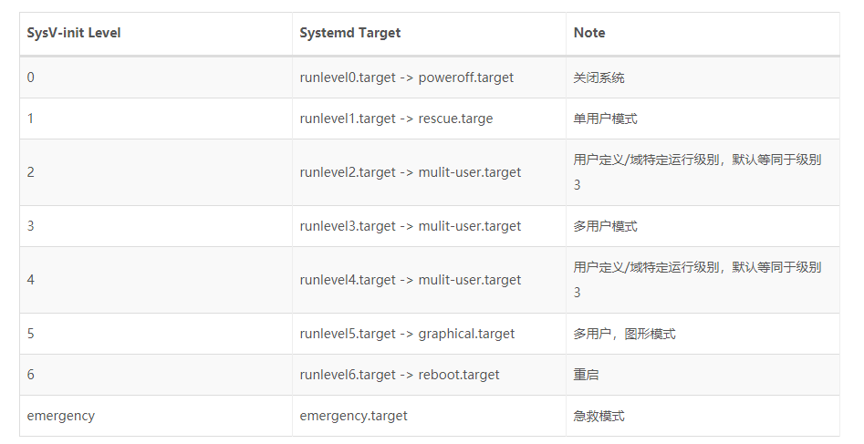

# linux systemd

Systemd 是一系列工具的集合，其作用也远远不仅是启动操作系统，它还接管了后台服务、结束、状态查询，以及日志归档、设备管理、电源管理、定时任务等许多职责，并支持通过特定事件（如插入特定 USB 设备）和特定端口数据触发的 On-demand（按需）任务。

Systemd 的后台服务还有一个特殊的身份——它是系统中 PID 值为 1 的进程。**字母d是守护进程（daemon）的缩写，systemd 这个名字的含义，就是它要守护整个系统.**

1. 更少的进程  
    Systemd 提供了 服务按需启动的能力，使得特定的服务只有在真定被请求时才启动。

2. 允许更多的进程并行启动  
    在 SysV-init 时代，将每个服务项目编号依次执行启动脚本。Ubuntu 的 Upstart 解决了没有直接依赖的启动之间的并行启动。而 Systemd 通过 Socket 缓存、DBus 缓存和建立临时挂载点等方法进一步解决了启动进程之间的依赖，做到了所有系统服务并发启动。对于用户自定义的服务，Systemd 允许配置其启动依赖项目，从而确保服务按必要的顺序运行。

3. 使用 CGroup 跟踪和管理进程的生命周期  
    在 Systemd 之间的主流应用管理服务都是使用 进程树 来跟踪应用的继承关系的，而进程的父子关系很容易通过 两次 fork 的方法脱离。  
    而 Systemd 则提供通过 CGroup 跟踪进程关系，引补了这个缺漏。通过 CGroup 不仅能够实现服务之间访问隔离，限制特定应用程序对系统资源的访问配额，还能更精确地管理服务的生命周期。

4. 统一管理服务日志  
    Systemd 是一系列工具的集合， 包括了一个专用的系统日志管理服务：Journald。 这个服务的设计初衷是克服现有 Syslog 服务的日志内容易伪造和日志格式不统一等缺点，Journald 用 二进制格式 保存所有的日志信息，因而日志内容很难被手工伪造。 Journald 还提供了一个 journalctl 命令来查看日志信息，这样就使得不同服务输出的日志具有相同的排版格式， 便于数据的二次处理。

‍

## **systemd命令简单介绍**

```bash
#systemctl是 Systemd 的主命令，用于管理系统。
systemctl reboot     # 重启系统
systemctl poweroff   # 关闭系统，切断电源
systemctl [ start | stop | restart | status ] sshd # 服务启停


#systemd-analyze命令用于查看启动耗时
systemd-analyze       # 系统启动耗时
systemd-analyze blame # 查看每个服务的启动耗时
systemd-analyze critical-chain # 显示瀑布状的启动过程流
systemd-analyze critical-chain sshd.service # 显示指定服务的启动流
```

## Systemd 架构

### Systemd 的 Unit 文件

Systemd 可以管理所有系统资源，不同的资源统称为 Unit（单位）。

在 Systemd 的生态圈中，Unit 文件统一了过去各种不同系统资源配置格式，例如服务的启/停、定时任务、设备自动挂载、网络配置、虚拟内存配置等。而 Systemd 通过不同的文件后缀来区分这些配置文件。

1. Systemd 支持的 12 种 Unit 文件类型

* .automount：用于控制自动挂载文件系统，相当于 SysV-init 的 autofs 服务
* .device：对于 /dev 目录下的设备，主要用于定义设备之间的依赖关系
* .mount：定义系统结构层次中的一个挂载点，可以替代过去的 /etc/fstab 配置文件
* .path：用于监控指定目录或文件的变化，并触发其它 Unit 运行
* .scope：这种 Unit 文件不是用户创建的，而是 Systemd 运行时产生的，描述一些系统服务的分组信息
* .service：封装守护进程的启动、停止、重启和重载操作，是最常见的一种 Unit 文件
* .slice：用于表示一个 CGroup 的树，通常用户不会自己创建这样的 Unit 文件
* .snapshot：用于表示一个由 systemctl snapshot 命令创建的 Systemd Units 运行状态快照
* .socket：监控来自于系统或网络的数据消息，用于实现基于数据自动触发服务启动
* .swap：定义一个用户做虚拟内存的交换分区
* .target：用于对 Unit 文件进行逻辑分组，引导其它 Unit 的执行。它替代了 SysV-init 运行级别的作用，并提供更灵活的基于特定设备事件的启动方式
* .timer：用于配置在特定时间触发的任务，替代了 Crontab 的功能

‍

2. Systemd 目录

Unit 文件按照 Systemd 约定，应该被放置指定的三个系统目录之一中。这三个目录是有优先级的，如下所示，越靠上的优先级越高。因此，在三个目录中有同名文件的时候，只有优先级最高的目录里的那个文件会被使用。

* /etc/systemd/system：系统或用户自定义的配置文件
* /run/systemd/system：软件运行时生成的配置文件
* /usr/lib/systemd/system：系统或第三方软件安装时添加的配置文件。

  * CentOS 7：Unit 文件指向该目录
  * ubuntu 16：被移到了 /lib/systemd/system

Systemd 默认从目录 /etc/systemd/system/ 读取配置文件。但是，里面存放的大部分文件都是符号链接，指向目录 /usr/lib/systemd/system/，真正的配置文件存放在那个目录。

‍

3. Unit 和 Target

Unit 是 Systemd 管理系统资源的基本单元，可以认为每个系统资源就是一个 Unit，并使用一个 Unit 文件定义。在 Unit 文件中需要包含相应服务的描述、属性以及需要运行的命令。

Target 是 Systemd 中用于指定系统资源启动组的方式，相当于 SysV-init 中的运行级别。

简单说，Target 就是一个 Unit 组，包含许多相关的 Unit 。启动某个 Target 的时候，Systemd 就会启动里面所有的 Unit。从这个意义上说，Target 这个概念类似于”状态点”，启动某个 Target 就好比启动到某种状态。

‍

## Systemd Service Unit

### Unit 文件结构

```bash
[Unit]
Description=Hello World
After=docker.service
Requires=docker.service
[Service]
TimeoutStartSec=0
ExecStartPre=-/usr/bin/docker kill busybox1
ExecStartPre=-/usr/bin/docker rm busybox1
ExecStartPre=/usr/bin/docker pull busybox
ExecStart=/usr/bin/docker run --name busybox1 busybox /bin/ sh -c "while true; do echo Hello World; sleep 1; done"
ExecStop="/usr/bin/docker stop busybox1"
ExecStopPost="/usr/bin/docker rm busybox1"
[Install]
WantedBy=multi-user.target
```

如下所示，Systemd 服务的 Unit 文件可以分为三个配置区段：

* Unit 和 Install 段：所有 Unit 文件通用，用于配置服务（或其它系统资源）的描述、依赖和随系统启动的方式
* Service 段：服务（Service）类型的 Unit 文件（后缀为 .service）特有的，用于定义服务的具体管理和操作方法

#### Unit 段

* Description：描述这个 Unit 文件的信息
* Documentation：指定服务的文档，可以是一个或多个文档的 URL 路径
* Requires：依赖的其它 Unit 列表，列在其中的 Unit 模板会在这个服务启动时的同时被启动。并且，如果其中任意一个服务启动失败，这个服务也会被终止
* Wants：与 Requires 相似，但只是在被配置的这个 Unit 启动时，触发启动列出的每个 Unit 模块，而不去考虑这些模板启动是否成功
* After：与 Requires 相似，但是在后面列出的所有模块全部启动完成以后，才会启动当前的服务
* Before：与 After 相反，在启动指定的任务一个模块之间，都会首先确证当前服务已经运行
* Binds To：与 Requires 相似，失败时失败，成功时成功，但是在这些模板中有任意一个出现意外结束或重启时，这个服务也会跟着终止或重启
* Part Of：一个 Bind To 作用的子集，仅在列出的任务模块失败或重启时，终止或重启当前服务，而不会随列出模板的启动而启动
* OnFailure：当这个模板启动失败时，就会自动启动列出的每个模块
* Conflicts：与这个模块有冲突的模块，如果列出的模块中有已经在运行的，这个服务就不能启动，反之亦然

#### Install 段

这部分配置的目标模块通常是特定运行目标的 .target 文件，用来使得服务在系统启动时自动运行。这个区段可以包含三种启动约束：

* WantedBy：和 Unit 段的 Wants  作用相似，只有后面列出的不是服务所依赖的模块，而是依赖当前服务的模块。它的值是一个或多个 Target，当前 Unit  激活时（enable）符号链接会放入 /etc/systemd/system 目录下面以 <Target 名> + .wants  后缀构成的子目录中，如 “/etc/systemd/system/multi-user.target.wants/

  ```
  # find /etc/systemd/system/* -type d
  /etc/systemd/system/default.target.wants
  /etc/systemd/system/getty.target.wants
  /etc/systemd/system/graphical.target.wants
  /etc/systemd/system/multi-user.target.wants
  /etc/systemd/system/network-online.target.wants
  /etc/systemd/system/paths.target.wants
  /etc/systemd/system/shutdown.target.wants
  /etc/systemd/system/sockets.target.wants
  /etc/systemd/system/sysinit.target.wants
  /etc/systemd/system/timers.target.wants
  ```

* RequiredBy：和 Unit 段的 Wants  作用相似，只有后面列出的不是服务所依赖的模块，而是依赖当前服务的模块。它的值是一个或多个 Target，当前 Unit 激活时，符号链接会放入  /etc/systemd/system 目录下面以 <Target 名> + .required 后缀构成的子目录中
* Also：当前 Unit enable/disable 时，同时 enable/disable 的其他 Unit
* Alias：当前 Unit 可用于启动的别名

SysV-init 运行级别与 Systemd Target 对应的 Unit 文件

​​

通过 systemctl list-units --type=target 命令可以获取当前正在使用的运行目标

```bash
[root@test_01 prometheus]# systemctl list-units --type=target
UNIT                  LOAD   ACTIVE SUB    DESCRIPTION
basic.target          loaded active active Basic System
cryptsetup.target     loaded active active Local Encrypted Volumes
getty.target          loaded active active Login Prompts
local-fs-pre.target   loaded active active Local File Systems (Pre)
local-fs.target       loaded active active Local File Systems
multi-user.target     loaded active active Multi-User System
network-online.target loaded active active Network is Online
network.target        loaded active active Network
paths.target          loaded active active Paths
remote-fs.target      loaded active active Remote File Systems
slices.target         loaded active active Slices
sockets.target        loaded active active Sockets
swap.target           loaded active active Swap
sysinit.target        loaded active active System Initialization
timers.target         loaded active active Timers

LOAD   = Reflects whether the unit definition was properly loaded.
ACTIVE = The high-level unit activation state, i.e. generalization of SUB.
SUB    = The low-level unit activation state, values depend on unit type.

15 loaded units listed. Pass --all to see loaded but inactive units, too.
To show all installed unit files use 'systemctl list-unit-files'.
[root@test_01 prometheus]# 

```

#### service 段

用来 Service 的配置，只有 Service 类型的 Unit 才有这个区块。它的主要字段分为服务生命周期和服务上下文配置两个方面。

1. 服务生命周期控制相关

* Type：定义启动时的进程行为，它有以下几种值：

  * Type=simple：默认值，执行ExecStart指定的命令，启动主进程
  * Type=forking：以 fork 方式从父进程创建子进程，创建后父进程会立即退出
  * Type=oneshot：一次性进程，Systemd 会等当前服务退出，再继续往下执行
  * Type=dbus：当前服务通过D-Bus启动
  * Type=notify：当前服务启动完毕，会通知Systemd，再继续往下执行
  * Type=idle：若有其他任务执行完毕，当前服务才会运行
* RemainAfterExit：值为 true 或 false（默认）。当配置为 true 时，Systemd  只会负责启动服务进程，之后即便服务进程退出了，Systemd  也仍然会认为这个服务还在运行中。这个配置主要是提供给一些并非常驻内存，而是启动注册后立即退出，然后等待消息按需启动的特殊类型服务使用的。
* ExecStart：启动当前服务的命令
* ExecStartPre：启动当前服务之前执行的命令
* ExecStartPos：启动当前服务之后执行的命令
* ExecReload：重启当前服务时执行的命令
* ExecStop：停止当前服务时执行的命令
* ExecStopPost：停止当其服务之后执行的命令
* RestartSec：自动重启当前服务间隔的秒数
* Restart：定义何种情况 Systemd 会自动重启当前服务，可能的值包括 always（总是重启）、on-success、on-failure、on-abnormal、on-abort、on-watchdog
* TimeoutStartSec：启动服务时等待的秒数，这一配置对于使用 Docker 容器而言显得尤为重要，因其第一次运行时可能需要下载镜像，严重延时会容易被 Systemd 误判为启动失败杀死。通常，对于这种服务，将此值指定为 0，从而关闭超时检测
* TimeoutStopSec：停止服务时的等待秒数，如果超过这个时间仍然没有停止，Systemd 会使用 SIGKILL 信号强行杀死服务的进程

2. 服务上下文配置相关

* Environment：为服务指定环境变量
* EnvironmentFile：指定加载一个包含服务所需的环境变量的列表的文件，文件中的每一行都是一个环境变量的定义
* Nice：服务的进程优先级，值越小优先级越高，默认为 0。其中 -20 为最高优先级，19 为最低优先级
* WorkingDirectory：指定服务的工作目录
* RootDirectory：指定服务进程的根目录（/ 目录）。如果配置了这个参数，服务将无法访问指定目录以外的任何文件
* User：指定运行服务的用户
* Group：指定运行服务的用户组
* MountFlags：服务的 Mount Namespace  配置，会影响进程上下文中挂载点的信息，即服务是否会继承主机上已有挂载点，以及如果服务运行执行了挂载或卸载设备的操作，是否会真实地在主机上产生效果。可选值为  shared、slaved 或 private

  * shared：服务与主机共用一个 Mount Namespace，继承主机挂载点，且服务挂载或卸载设备会真实地反映到主机上
  * slave：服务使用独立的 Mount Namespace，它会继承主机挂载点，但服务对挂载点的操作只有在自己的 Namespace 内生效，不会反映到主机上
  * private：服务使用独立的 Mount Namespace，它在启动时没有任何任何挂载点，服务对挂载点的操作也不会反映到主机上
* LimitCPU / LimitSTACK / LimitNOFILE / LimitNPROC 等：限制特定服务的系统资源量，例如 CPU、程序堆栈、文件句柄数量、子进程数量等

> 注意：如果在 ExecStart、ExecStop 等属性中使用了 Linux 命令，则必须要写出完整的绝对路径。对于  ExecStartPre 和 ExecStartPost 辅助命令，若前面有个 “-” 符号，表示忽略这些命令的出错。因为有些 “辅助”  命令本来就不一定成功，比如尝试清空一个文件，但文件可能不存在。

### Unit 文件占位符和模板

#### Unit 文件占位符

在 Unit 文件中，有时会需要使用到一些与运行环境有关的信息，例如节点 ID、运行服务的用户等。这些信息可以使用占位符来表示，然后在实际运行被动态地替换实际的值。

* %n：完整的 Unit 文件名字，包括 .service 后缀名
* %p：Unit 模板文件名中 @ 符号之前的部分，不包括 @ 符号
* %i：Unit 模板文件名中 @ 符号之后的部分，不包括 @ 符号和 .service 后缀名
* %t：存放系统运行文件的目录，通常是 “run”
* %u：运行服务的用户，如果 Unit 文件中没有指定，则默认为 root
* %U：运行服务的用户 ID
* %h：运行服务的用户 Home 目录，即 %{HOME} 环境变量的值
* %s：运行服务的用户默认 Shell 类型，即 %{SHELL} 环境变量的值
* %m：实际运行节点的 Machine ID，对于运行位置每个的服务比较有用
* %b：Boot ID，这是一个随机数，每个节点各不相同，并且每次节点重启时都会改变
* %H：实际运行节点的主机名
* %v：内核版本，即 “uname -r” 命令输出的内容
* %%：在 Unit 模板文件中表示一个普通的百分号

#### Unit 模板

在现实中，往往有一些应用需要被复制多份运行。例如，用于同一个负载均衡器分流的多个服务实例，或者为每个 SSH 连接建立一个独立的 sshd 服务进程。

Unit 模板文件的写法与普通的服务 Unit 文件基本相同，不过 Unit 模板的文件名是以 @ 符号结尾的。通过模板启动服务实例时，需要在其文件名的 @ 字符后面附加一个参数字符串。

示例：apache@.service

```bash
[Unit]
Description=My Advanced Service Template
After=etcd.service docker.service
[Service]
TimeoutStartSec=0
ExecStartPre=-/usr/bin/docker kill apache%i
ExecStartPre=-/usr/bin/docker rm apache%i
ExecStartPre=/usr/bin/docker pull coreos/apache
ExecStart=/usr/bin/docker run --name apache%i -p %i:80 coreos/apache /usr/sbin/apache2ctl -D FOREGROUND
ExecStartPost=/usr/bin/etcdctl set /domains/example.com/%H:%i running
ExecStop=/usr/bin/docker stop apache1
ExecStopPost=/usr/bin/docker rm apache1
ExecStopPost=/usr/bin/etcdctl rm /domains/example.com/%H:%i
[Install]
WantedBy=multi-user.target
```

启动 Unit 模板的服务实例

​`systemctl start apache@8080.service`​

Systemd 在运行服务时，总是会先尝试找到一个完整匹配的 Unit 文件，如果没有找到，才会尝试选择匹配模板。例如上面的命令，System  首先会在约定的目录下寻找名为 apache@8080.service 的文件，如果没有找到，而文件名中包含 @  字符，它就会尝试去掉后缀参数匹配模板文件。对于 apache@8080.service，systemd 会找到 apache@.service  模板文件，并通过这个模板文件将服务实例化。

‍

## Systemd 的资源管理

### Systemctl 命令

```bash
systemctl [OPTIONS...] {COMMAND} ...

Query or send control commands to the systemd manager.

  -h --help           Show this help
     --version        Show package version
     --system         Connect to system manager
  -H --host=[USER@]HOST
                      Operate on remote host
  -M --machine=CONTAINER
                      Operate on local container
  -t --type=TYPE      List units of a particular type
     --state=STATE    List units with particular LOAD or SUB or ACTIV
  -p --property=NAME  Show only properties by this name
  -a --all            Show all loaded units/properties, including dea
                      ones. To list all units installed on the system
                      the 'list-unit-files' command instead.
  -l --full           Don't ellipsize unit names on output
  -r --recursive      Show unit list of host and local containers
     --reverse        Show reverse dependencies with 'list-dependenci
     --job-mode=MODE  Specify how to deal with already queued jobs, w
                      queueing a new job
     --show-types     When showing sockets, explicitly show their typ
  -i --ignore-inhibitors
                      When shutting down or sleeping, ignore inhibito
     --kill-who=WHO   Who to send signal to
  -s --signal=SIGNAL  Which signal to send
     --now            Start or stop unit in addition to enabling or d
  -q --quiet          Suppress output
     --no-block       Do not wait until operation finished
     --no-wall        Don't send wall message before halt/power-off/r
     --no-reload      Don't reload daemon after en-/dis-abling unit f
     --no-legend      Do not print a legend (column headers and hints
     --no-pager       Do not pipe output into a pager
     --no-ask-password
                      Do not ask for system passwords
     --global         Enable/disable unit files globally
     --runtime        Enable unit files only temporarily until next r
  -f --force          When enabling unit files, override existing sym
                      When shutting down, execute action immediately
     --preset-mode=   Apply only enable, only disable, or all presets
     --root=PATH      Enable unit files in the specified root directo
  -n --lines=INTEGER  Number of journal entries to show
  -o --output=STRING  Change journal output mode (short, short-iso,
                              short-precise, short-monotonic, verbose
                              export, json, json-pretty, json-sse, ca
     --plain          Print unit dependencies as a list instead of a 

Unit Commands:
  list-units [PATTERN...]         List loaded units
  list-sockets [PATTERN...]       List loaded sockets ordered by addr
  list-timers [PATTERN...]        List loaded timers ordered by next 
  start NAME...                   Start (activate) one or more units
  stop NAME...                    Stop (deactivate) one or more units
  reload NAME...                  Reload one or more units
  restart NAME...                 Start or restart one or more units
  try-restart NAME...             Restart one or more units if active
  reload-or-restart NAME...       Reload one or more units if possibl
                                  otherwise start or restart
  reload-or-try-restart NAME...   Reload one or more units if possibl
                                  otherwise restart if active
  isolate NAME                    Start one unit and stop all others
  kill NAME...                    Send signal to processes of a unit
  is-active PATTERN...            Check whether units are active
  is-failed PATTERN...            Check whether units are failed
  status [PATTERN...|PID...]      Show runtime status of one or more 
  show [PATTERN...|JOB...]        Show properties of one or more
                                  units/jobs or the manager
  cat PATTERN...                  Show files and drop-ins of one or m
  set-property NAME ASSIGNMENT... Sets one or more properties of a un
  help PATTERN...|PID...          Show manual for one or more units
  reset-failed [PATTERN...]       Reset failed state for all, one, or
                                  units
  list-dependencies [NAME]        Recursively show units which are re
                                  or wanted by this unit or by which 
                                  unit is required or wanted

Unit File Commands:
  list-unit-files [PATTERN...]    List installed unit files
  enable NAME...                  Enable one or more unit files
  disable NAME...                 Disable one or more unit files
  reenable NAME...                Reenable one or more unit files
  preset NAME...                  Enable/disable one or more unit fil
                                  based on preset configuration
  preset-all                      Enable/disable all unit files based
                                  preset configuration
  is-enabled NAME...              Check whether unit files are enable
  mask NAME...                    Mask one or more units
  unmask NAME...                  Unmask one or more units
  link PATH...                    Link one or more units files into
                                  the search path
  add-wants TARGET NAME...        Add 'Wants' dependency for the targ
                                  on specified one or more units
  add-requires TARGET NAME...     Add 'Requires' dependency for the t
                                  on specified one or more units
  edit NAME...                    Edit one or more unit files
  get-default                     Get the name of the default target
  set-default NAME                Set the default target

Machine Commands:
  list-machines [PATTERN...]      List local containers and host

Job Commands:
  list-jobs [PATTERN...]          List jobs
  cancel [JOB...]                 Cancel all, one, or more jobs

Snapshot Commands:
  snapshot [NAME]                 Create a snapshot
  delete NAME...                  Remove one or more snapshots

Environment Commands:
  show-environment                Dump environment
  set-environment NAME=VALUE...   Set one or more environment variabl
  unset-environment NAME...       Unset one or more environment varia
  import-environment [NAME...]    Import all or some environment vari

Manager Lifecycle Commands:
  daemon-reload                   Reload systemd manager configuratio
  daemon-reexec                   Reexecute systemd manager

System Commands:
  is-system-running               Check whether system is fully runni
  default                         Enter system default mode
  rescue                          Enter system rescue mode
  emergency                       Enter system emergency mode
  halt                            Shut down and halt the system
  poweroff                        Shut down and power-off the system
  reboot [ARG]                    Shut down and reboot the system
  kexec                           Shut down and reboot the system wit
  exit                            Request user instance exit
  switch-root ROOT [INIT]         Change to a different root file sys
  suspend                         Suspend the system
  hibernate                       Hibernate the system
  hybrid-sleep                    Hibernate and suspend the system
lines 87-134/134 (END)
  is-enabled NAME...              Check whether unit files are enabled
  mask NAME...                    Mask one or more units
  unmask NAME...                  Unmask one or more units
  link PATH...                    Link one or more units files into
                                  the search path
  add-wants TARGET NAME...        Add 'Wants' dependency for the target
                                  on specified one or more units
  add-requires TARGET NAME...     Add 'Requires' dependency for the target
                                  on specified one or more units
  edit NAME...                    Edit one or more unit files
  get-default                     Get the name of the default target
  set-default NAME                Set the default target

Machine Commands:
  list-machines [PATTERN...]      List local containers and host

Job Commands:
  list-jobs [PATTERN...]          List jobs
  cancel [JOB...]                 Cancel all, one, or more jobs

Snapshot Commands:
  snapshot [NAME]                 Create a snapshot
  delete NAME...                  Remove one or more snapshots

Environment Commands:
  show-environment                Dump environment
  set-environment NAME=VALUE...   Set one or more environment variables
  unset-environment NAME...       Unset one or more environment variables
  import-environment [NAME...]    Import all or some environment variables

Manager Lifecycle Commands:
  daemon-reload                   Reload systemd manager configuration
  daemon-reexec                   Reexecute systemd manager

System Commands:
  is-system-running               Check whether system is fully running
  default                         Enter system default mode
  rescue                          Enter system rescue mode
  emergency                       Enter system emergency mode
  halt                            Shut down and halt the system
  poweroff                        Shut down and power-off the system
  reboot [ARG]                    Shut down and reboot the system
  kexec                           Shut down and reboot the system with kexec
  exit                            Request user instance exit
  switch-root ROOT [INIT]         Change to a different root file system
  suspend                         Suspend the system
  hibernate                       Hibernate the system
  hybrid-sleep                    Hibernate and suspend the system
```

‍

‍

### Unit 管理

1. 查看当前系统的所有 Unit

    ```bash
    # 列出正在运行的 Unit
    systemctl list-units
    # 列出所有Unit，包括没有找到配置文件的或者启动失败的
    systemctl list-units --all
    # 列出所有没有运行的 Unit
    systemctl list-units --all --state=inactive
    # 列出所有加载失败的 Unit
    systemctl list-units --failed
    # 列出所有正在运行的、类型为 service 的 Unit
    systemctl list-units --type=service
    # 查看 Unit 配置文件的内容
    systemctl cat docker.service
    ```

2. 查看 Unit 的状态

* enabled：已建立启动链接
* disabled：没建立启动链接
* static：该配置文件没有 [Install] 部分（无法执行），只能作为其他配置文件的依赖
* masked：该配置文件被禁止建立启动链接

‍

3. Unit 的管理

    ```bash
    # 立即启动一个服务
    sudo systemctl start apache.service
    # 立即停止一个服务
    sudo systemctl stop apache.service
    # 重启一个服务
    sudo systemctl restart apache.service
    # 杀死一个服务的所有子进程
    sudo systemctl kill apache.service
    # 重新加载一个服务的配置文件
    sudo systemctl reload apache.service
    # 重载所有修改过的配置文件
    sudo systemctl daemon-reload
    # 显示某个 Unit 的所有底层参数
    systemctl show httpd.service
    # 显示某个 Unit 的指定属性的值
    systemctl show -p CPUShares httpd.service
    # 设置某个 Unit 的指定属性
    sudo systemctl set-property httpd.service CPUShares=500
    ```

‍

4. 查看 Unit 的依赖关系

    ```bash
    # 列出一个 Unit 的所有依赖，默认不会列出 target 类型
    systemctl list-dependencies nginx.service
    # 列出一个 Unit 的所有依赖，包括 target 类型
    systemctl list-dependencies --all nginx.service
    ```

### 服务的生命周期

当一个新的 Unit 文件被放入 /etc/systemd/system/ 或 /usr/lib/systemd/system/ 目录中时，它是不会被自识识别的。

1. 服务的激活

* systemctl enable：在 /etc/systemd/system/ 建立服务的符号链接，指向 /usr/lib/systemd/system/ 中
* systemctl start：依次启动定义在 Unit 文件中的 ExecStartPre、ExecStart 和 ExecStartPost 命令

2. 服务的启动和停止

* systemctl start：依次启动定义在 Unit 文件中的 ExecStartPre、ExecStart 和 ExecStartPost 命令
* systemctl stop：依次停止定义在 Unit 文件中的 ExecStopPre、ExecStop 和 ExecStopPost 命令
* systemctl restart：重启服务
* systemctl kill：立即杀死服务

3. 服务的开机启动和取消

* systemctl enable：除了激活服务以外，也可以置服务为开机启动
* systemctl disable：取消服务的开机启动

4. 服务的修改和移除

* systemctl daemon-reload：Systemd 会将 Unit 文件的内容写到缓存中，因此当 Unit 文件被更新时，需要告诉 Systemd 重新读取所有的 Unit 文件
* systemctl reset-failed：移除标记为丢失的 Unit 文件。在删除 Unit 文件后，由于缓存的关系，即使通过 daemon-reload 更新了缓存，在 list-units 中依然会显示标记为 not-found 的 Unit。

‍

### Target 管理

Target 就是一个 Unit 组，包含许多相关的 Unit 。启动某个 Target 的时候，Systemd 就会启动里面所有的 Unit。

在传统的 SysV-init 启动模式里面，有 RunLevel 的概念，跟 Target 的作用很类似。不同的是，RunLevel 是互斥的，不可能多个 RunLevel 同时启动，但是多个 Target 可以同时启动。

```bash
# 查看当前系统的所有 Target
systemctl list-unit-files --type=target
# 查看一个 Target 包含的所有 Unit
systemctl list-dependencies multi-user.target
# 查看启动时的默认 Target
systemctl get-default
# 设置启动时的默认 Target
sudo systemctl set-default multi-user.target
# 切换 Target 时，默认不关闭前一个 Target 启动的进程，systemctl isolate 命令改变这种行为，关闭前一个 Target 里面所有不属于后一个 Target 的进程
sudo systemctl isolate multi-user.target
```

1. Target 与 SysV-init 进程的主要区别：

* 默认的 RunLevel（在 /etc/inittab 文件设置）现在被默认的 Target 取代，位置是  /etc/systemd/system/default.target，通常符号链接到graphical.target（图形界面）或者multi-user.target（多用户命令行）。
* 启动脚本的位置，以前是 /etc/init.d 目录，符号链接到不同的 RunLevel 目录 （比如  /etc/rc3.d、/etc/rc5.d 等），现在则存放在 /lib/systemd/system 和  /etc/systemd/system 目录。
* 配置文件的位置，以前 init 进程的配置文件是 /etc/inittab，各种服务的配置文件存放在 /etc/sysconfig  目录。现在的配置文件主要存放在 /lib/systemd 目录，在 /etc/systemd 目录里面的修改可以覆盖原始设置。

‍

### 日志管理

Systemd 通过其标准日志服务 Journald 提供的配套程序 journalctl 将其管理的所有后台进程打印到 std:out（即控制台）的输出重定向到了日志文件。

Systemd 的日志文件是二进制格式的，必须使用 Journald 提供的 journalctl 来查看，默认不带任何参数时会输出系统和所有后台进程的混合日志。

默认日志最大限制为所在文件系统容量的 10%，可以修改 /etc/systemd/journald.conf 中的 SystemMaxUse 来指定该最大限制。

```bash
# 查看所有日志（默认情况下 ，只保存本次启动的日志）
journalctl

# 查看内核日志（不显示应用日志）：--dmesg 或 -k
journalctl -k

# 查看系统本次启动的日志（其中包括了内核日志和各类系统服务的控制台输出）：--system 或 -b
journalctl -b
journalctl -b -0

# 查看上一次启动的日志（需更改设置）
journalctl -b -1

# 查看指定服务的日志：--unit 或 -u
journalctl -u docker.servcie

# 查看指定服务的日志
journalctl /usr/lib/systemd/systemd

# 实时滚动显示最新日志
journalctl -f
journalctl -u prometheus -f

# 查看指定时间的日志
journalctl --since="2012-10-30 18:17:16"
journalctl --since "20 min ago"
journalctl --since yesterday
journalctl --since "2015-01-10" --until "2015-01-11 03:00"
journalctl --since 09:00 --until "1 hour ago"

# 显示尾部的最新 10 行日志：--lines 或 -n
journalctl -n

# 显示尾部指定行数的日志
journalctl -n 20

# 将最新的日志显示在前面
journalctl -r -u docker.service

# 改变输出的格式：--output 或 -o
journalctl -r -u docker.service -o json-pretty

# 查看指定进程的日志
journalctl _PID=1

# 查看某个路径的脚本的日志
journalctl /usr/bin/bash

# 查看指定用户的日志
journalctl _UID=33 --since today

# 查看某个 Unit 的日志
journalctl -u nginx.service
journalctl -u nginx.service --since today

# 实时滚动显示某个 Unit 的最新日志
journalctl -u nginx.service -f

# 合并显示多个 Unit 的日志
journalctl -u nginx.service -u php-fpm.service --since today

# 查看指定优先级（及其以上级别）的日志，共有 8 级
# 0: emerg
# 1: alert
# 2: crit
# 3: err
# 4: warning
# 5: notice
# 6: info
# 7: debug
journalctl -p err -b

# 日志默认分页输出，--no-pager 改为正常的标准输出
journalctl --no-pager

# 以 JSON 格式（单行）输出
journalctl -b -u nginx.service -o json

# 以 JSON 格式（多行）输出，可读性更好
journalctl -b -u nginx.service -o json-pretty

# 显示日志占据的硬盘空间
journalctl --disk-usage

# 指定日志文件占据的最大空间
journalctl --vacuum-size=1G

# 指定日志文件保存多久
journalctl --vacuum-time=1years
```

## Systemd 工具集

* systemctl：用于检查和控制各种系统服务和资源的状态
* bootctl：用于查看和管理系统启动分区
* hostnamectl：用于查看和修改系统的主机名和主机信息

  ```bash
  # 显示当前主机的信息
  $ hostnamectl
  # 设置主机名
  $ sudo hostnamectl set-hostname rhel7
  ```
* journalctl：用于查看系统日志和各类应用服务日志

  ```bash
  # 重启系统
  $ sudo systemctl reboot
  # 关闭系统，切断电源
  $ sudo systemctl poweroff
  # CPU停止工作
  $ sudo systemctl halt
  # 暂停系统
  $ sudo systemctl suspend
  # 让系统进入冬眠状态
  $ sudo systemctl hibernate
  # 让系统进入交互式休眠状态
  $ sudo systemctl hybrid-sleep
  # 启动进入救援状态（单用户状态）
  $ sudo systemctl rescue
  ```
* localectl：用于查看和管理系统的地区信息
* loginctl：用于管理系统已登录用户和 Session 的信息

  ```bash
  # 列出当前 session
  $ loginctl list-sessions

  # 列出当前登录用户
  $ loginctl list-users

  # 列出显示指定用户的信息
  $ loginctl show-user ruanyf
  ```
* machinectl：用于操作 Systemd 容器
* timedatectl：用于查看和管理系统的时间和时区信息

  ```bash
  # 查看当前时区设置
  $ timedatectl

  # 显示所有可用的时区
  $ timedatectl list-timezones

  # 设置当前时区
  $ sudo timedatectl set-timezone America/New_York
  $ sudo timedatectl set-time YYYY-MM-DD
  $ sudo timedatectl set-time HH:MM:SS
  ```
* systemd-analyze 显示此次系统启动时运行每个服务所消耗的时间，可以用于分析系统启动过程中的性能瓶颈

  ```bash
  # 查看启动耗时
  $ systemd-analyze
  # 查看每个服务的启动耗时
  $ systemd-analyze blame
  # 显示瀑布状的启动过程流
  $ systemd-analyze critical-chain
  # 显示指定服务的启动流
  $ systemd-analyze critical-chain atd.service
  ```
* systemd-ask-password：辅助性工具，用星号屏蔽用户的任意输入，然后返回实际输入的内容

  ```bash
  [root@test_01 grafana]# PASSWORD=$(systemd-ask-password "Input Your Passowrd:")
  Input Your Passowrd: ***********
  [root@test_01 grafana]# echo $PASSWORD
  ```
* systemd-cat：用于将其他命令的输出重定向到系统日志
* systemd-cgls：递归地显示指定 CGroup 的继承链
* systemd-cgtop：显示系统当前最耗资源的 CGroup 单元
* systemd-escape：辅助性工具，用于去除指定字符串中不能作为 Unit 文件名的字符
* systemd-hwdb：Systemd 的内部工具，用于更新硬件数据库
* systemd-delta：对比当前系统配置与默认系统配置的差异
* systemd-detect-virt：显示主机的虚拟化类型
* systemd-inhibit：用于强制延迟或禁止系统的关闭、睡眠和待机事件
* systemd-machine-id-setup：Systemd 的内部工具，用于给 Systemd 容器生成 ID
* systemd-notify：Systemd 的内部工具，用于通知服务的状态变化
* systemd-nspawn：用于创建 Systemd 容器
* systemd-path：Systemd 的内部工具，用于显示系统上下文中的各种路径配置
* systemd-run：用于将任意指定的命令包装成一个临时的后台服务运行  

  systemd-run 可以将一个指定的操作变成后台运行的服务。它的效果似乎与直接在命令后加上表示后台运行的 & 符号很相似。然而，它让命令成为服务还意味着，它的生命周期将由 Systemd 控制。具体来说，包括以下好处：

  * 服务的生命击期由 Systemd 接管，不会随着启动它的控制台关闭而结束
  * 可以通过 systemctl 工具管理服务的状态
  * 可以通过 journalctl 工具查看和管理服务的日志信息
  * 可以通过 Systemd 提供的方法限制服务的 CPU、内存、磁盘 IO 等系统资源的使用情况。
* systemd-stdio- bridge：Systemd 的内部 工具，用于将程序的标准输入输出重定向到系统总线
* systemd-tmpfiles：Systemd 的内部工具，用于创建和管理临时文件目录
* systemd-tty-ask-password-agent：用于响应后台服务进程发出的输入密码请求
