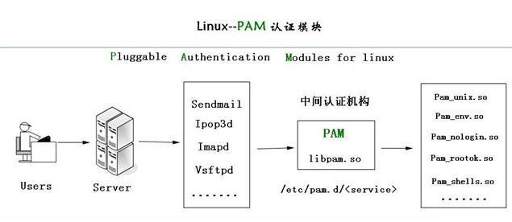

# linux PAM文件

## pam说明

PAM(Pluggable Authentication Modules)即可插拔式认证模块，它是一种高效而且灵活便利的用户级别的认证方式，它也是当前Linux服务器普遍使用的认证方式。
在不同版本的Linux统中部署PAM认证是有所不同的。
它提供了对所有服务进行认证的中央机制，适用于login，远程登录（telnet,rlogin,fsh,ftp,点对点协议（PPP）），su等应用程序中。
系统管理员通过PAM配置文件来制定不同应用程序的不同认证策略；应用程序开发者通过在服务程序中使用PAM API(pam_xxxx( ))来实现对认证方法的调用；而PAM服务模块的开发者则利用PAM SPI来编写模块（主要是引出一些函数pam_sm_xxxx( )供PAM接口库调用），将不同的认证机制加入到系统中；PAM接口库（libpam）则读取配置文件，将应用程序和相应的PAM服务模块联系起来

## PAM工作原理



认证过程讲解

1. 使用者执行/usr/bin/passwd 程序，并输入密码
2. passwd开始调用PAM模块，PAM模块会搜寻passwd程序的PAM相关设置文件，这个设置文件一般是在/etc/pam.d/里边的与程序同名的文件，即PAM会搜寻/etc/pam.d/passwd此设置文件
3. 经由/etc/pam.d/passwd设定文件的数据，取用PAM所提供的相关模块来进行验证
4. 将验证结果回传给passwd这个程序，而passwd这个程序会根据PAM回传的结果决定下一个动作（重新输入密码或者通过验证）

## PAM 配置文件格式说明

通用配置文件/etc/pam.conf格式,此格式不使用

```bash
application type control module-path arguments
```

专用配置文件/etc/pam.d/ 格式

```bash
type control module-path arguments

# application：指服务名，如：telnet、login、ftp等，服务名字“OTHER”代表所有没有在该文件中明确配置的其它服务
# type：指模块类型，即功能
# control ：PAM库该如何处理与该服务相关的PAM模块的成功或失败情况，一个关健词实现
# module-path： 用来指明本模块对应的程序文件的路径名
# Arguments： 用来传递给该模块的参数
```

## 模块类型

```纯文本
[09:37:39 root@rocky8_12 ~]#vim /etc/pam.d/sshd

#type #Control #path

#%PAM-1.0
auth substack password-auth
auth include postlogin
account required pam_sepermit.so
account required pam_nologin.so
account include password-auth
password include password-auth
# pam_selinux.so close should be the first session rule
session required pam_selinux.so close
session required pam_loginuid.so
# pam_selinux.so open should only be followed by sessions to be executed in the user context
session required pam_selinux.so open env_params
session required pam_namespace.so
session optional pam_keyinit.so force revoke
session optional pam_motd.so
session include password-auth
session include postlogin

```

### module-type

- Auth 账号的认证和授权
- Account 帐户的有效性，与账号管理相关的非认证类的功能，如：用来限制/允许用户对某个服务的访问时间，限制用户的位置(例如：root用户只能从控制台登录)
- Password 用户修改密码时密码复杂度检查机制等功能
- Session 用户会话期间的控制，如：最多打开的文件数，最多的进程数等
- type 表示因为缺失而不能加载的模块将不记录到系统日志,对于那些不总是安装在系统上的模块有用

### module-Control

- required ：一票否决，表示本模块必须返回成功才能通过认证，但是如果该模块返回失败，失败结果也不会立即通知用户，而是要等到同一type中的所有模块全部执行完毕，再将失败结果返回给应用程序，即为必要条件
- requisite ：一票否决，该模块必须返回成功才能通过认证，但是一旦该模块返回失败，将不再执行同一type内的任何模块，而是直接将控制权返回给应用程序。是一个必要条件
- sufficient ：一票通过，表明本模块返回成功则通过身份认证的要求，不必再执行同一type内的其它模块，但如果本模块返回失败可忽略，即为充分条件，优先于前面的required和requisite
- optional ：表明本模块是可选的，它的成功与否不会对身份认证起关键作用，其返回值一般被忽略
- include： 调用其他的配置文件中定义的配置信息

### module-path

- 模块文件所在绝对路径：
- 模块文件所在相对路径：/lib64/security目录下的模块可使用相对路径，如：pam_shells.so、pam_limits.so
- 有些模块有自已的专有配置文件，在/etc/security/*.conf目 录下

### Arguments

- debug ：该模块应当用syslog( )将调试信息写入到系统日志文件中
- no_warn ：表明该模块不应把警告信息发送给应用程序
- use_first_pass ：该模块不能提示用户输入密码，只能从前一个模块得到输入密码
- try_first_pass ：该模块首先用前一个模块从用户得到密码，如果该密码验证不通过，再提示用户输入新密码
- use_mapped_pass 该模块不能提示用户输入密码，而是使用映射过的密码
- expose_account 允许该模块显示用户的帐号名等信息，一般只能在安全的环境下使用，因为泄漏用户名会对安全造成一定程度的威胁

## pam的常用模块

* pam\_shell.so
  检查当前shell是否为安全的shell
* pam\_limit.so
  在用户级别实现对其可用资源的限制，例如限制可打开的文件数量，可运行的进程数量，可用内存空间
* pam\_access.so
  根据主机名或者FQDN、IP地址和用户实现全面的访问控制
* pam\_time.so
  在不同时间、日期，终端对特定程序访问时进行验证
* pam\_tally2.so　
  为避免暴力破解，在登录失败若干次后锁定账户
