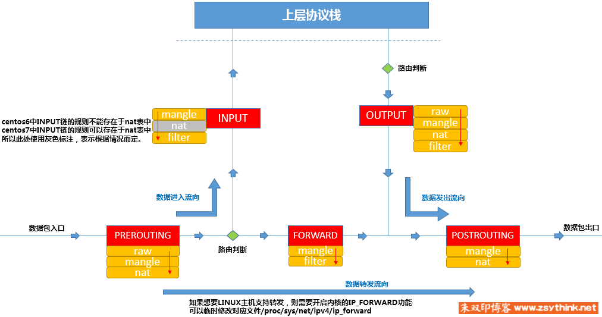
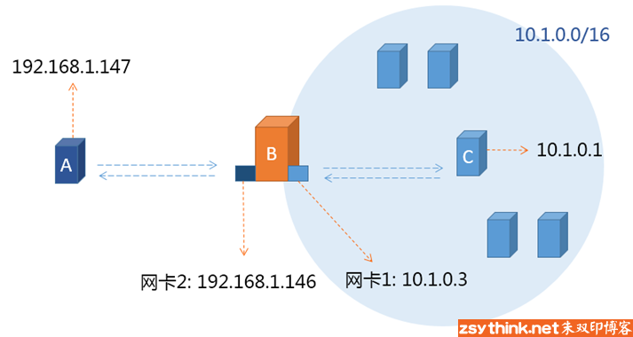

# Iptables

# 四表五链

首先我们来看下面这张图了解一下 iptables 中的表和链的概念。红色部分就是数据经过的链，每个链上都可以定义规则，我们将具有同一种类型的规则组成一个集合，这个集合就叫做表（黄色），按表的顺序执行规则。一个防火墙中通常针对不同的来源设置很多种策略，多个策略形成一个链。



注意每一个链对应的表都是不完全一样的，表和链之间是多对多的对应关系。但是不管一个链对应多少个表，它的表都是按照下面的优先顺序来进行查找匹配的。
**表的处理优先级：raw &gt; mangle &gt; nat &gt; filter**

iptables的四个表iptable_filter，iptable_mangle，iptable_nat，iptable_raw，默认表是filter（没有指定表的时候就是filter表）。

- filter 表：用来对数据包进行过滤，具体的规则要求决定如何处理一个数据包。
- nat 表：网络地址转换，主要用来修改数据包的 IP 地址、端口号信息。
- mangle 表：主要用来修改数据包的服务类型，生存周期，为数据包设置标记，实现流量整形、策略路由等。
- raw 表：主要用来决定是否对数据包进行状态跟踪。

> raw 表只使用在 PREROUTING 链和 OUTPUT 链上,因为优先级最高，从而可以对收到的数据包在系统进行 ip_conntrack（连接跟踪）前进行处理。一但用户使用了 raw 表,在某个链上，raw表处理完后，将跳过NAT表和ip_conntrack 处理，即不再做地址转换和数据包的链接跟踪处理了。RAW 表可以应用在那些不需要做nat的情况下，以提高性能。

iptables 的五个链 PREROUTING，INPUT，FORWARD，OUTPUT，POSTROUTING

- input 链：当收到访问防火墙本机地址的数据包时，将应用此链中的规则；
- output 链：当防火墙本机向外发送数据包时，将应用此链中的规则；
- forward 链：当收到需要通过防火中转发给其他地址的数据包时，将应用此链中的规则，注意如果需要实现 forward 转发需要开启 Linux 内核中的 ip_forward 功能；
- prerouting 链：在对数据包做路由选择之前，将应用此链中的规则；
- postrouting 链：在对数据包做路由选择之后，将应用此链中的规则；

**首先牢记各个链对应的表有那些**

|链名|对应的表名|
| -----------| ------------------------|
|PREROUTING|raw、mangle、nat|
|FORWARD|mangle、filter|
|INPUT|mangle、nat、filter|
|OUTPUT|raw、mangle、Nat、filter|
|POSTROUTING|mangle、nat|

# iptables 配置

在了解清楚iptables的工作原理和每个表以及链的作用之后，我们就可以根据其特点进行针对性的配置。

iptables 的基本语法命令格式

```bash
iptables  [-t 表名]  管理选项  [链名]  [匹配条件]  [-j 控制类型]

-   `表名`、`链名`：指定`iptables`命令所操作的`表`和`链`，未指定表名时将默认使用`filter`表；
-   `管理选项`：表示`iptables`规则的操作方式，比如：`插入`、`增加`、`删除`、`查看`等；
-   `匹配条件`：指定要处理的数据包的特征，不符合指定条件的数据包不处理；
-   `控制类型`：指数据包的处理方式，比如：`允许accept`、`拒绝reject`、`丢弃drop`、`日志LOG`等；
```

## 1. 常用管理选项

```bash
-A    # 在指定链的末尾添加一条新的规则
-D    # 删除指定链中的某一条规则，可删除指定序号或具体内容
-I     # 在指定链中插入一条新规则，未指定序号时默认作为第一条规则
-R    # 修改、替换指定链中的某一条规则，可指定规则序号或具体内容
-L    # 列出指定链中所有的规则，未指定链名，则列出表中的所有链
-F    #  清空指定链中所有的规则，未指定链名，则清空表中的所有链
-P    # 设置指定链的默认策略
-n    # 使用数字形式显示输出结果
-v    # 查看规则列表时显示详细的信息
-h    # 查看命令帮助信息
--line-numbers  # 查看规则列表时，同时显示规则在链中的顺序号
```

## 2. 匹配条件

```sh
-s    # 源地址IP、网段，多个源地址时，用”逗号”隔开即可
-d    # 目标地址IP，当服务器都多个网卡时使用
-p    # 协议类型，tcp, udp, udplite, icmp, icmpv6,esp, ah, sctp, mh ,默认-p all
-i    # 网卡接口名称，用于匹配报文从哪个网卡流入，-i 选项只能用于PREROUTING链、INPUT链、FORWARD链
-o    # 与 -i 选项是相对的，用于匹配报文将从哪个网卡流出，-o 选项只能用于FORWARD链、OUTPUT链、POSTROUTING链
! -xxx # 取反，取反操作与同时指定多个IP的操作不能同时使用

## 扩展匹配条件-tcp扩展模块
-p tcp -m tcp --dport # -m tcp表示使用tcp扩展模块，–dport表示tcp扩展模块中的一个扩展匹配条件，可用于匹配报文的目标端口
-p tcp -m tcp --sport # tcp扩展模块的–sport或者–dport都可以指定一个连续的端口范围，但是无法同时指定多个离散的、不连续的端口
iptables -t filter -I INPUT -s 192.168.10.31 -p tcp -m tcp --dport 28325 -j DROP

## 扩展匹配条件-multiport扩展模块
-p tcp  -m multiport --sports  # 用于匹配报文的源端口，可以指定离散的多个端口号,端口之间用”逗号”隔开
-p udp -m multiport --dports
 `需要明确的一点就是：当一条规则中有多个匹配条件时，这多个匹配条件之间，默认存在”与”的关系。`
```

## 3. 控制类型

```bash
`ACCEPT`     # 允许数据包通过。
`DROP`       # 直接丢弃数据包，不给任何回应信息，这时候客户端会感觉自己的请求泥牛入海了，过了超时时间才会有反应。
`REJECT`     # 拒绝数据包通过，必要时会给数据发送端一个响应的信息，客户端刚请求就会收到拒绝的信息。
`SNAT`       # 源地址转换，解决内网用户用同一个公网地址上网的问题。
`MASQUERADE` # 是SNAT的一种特殊形式，适用于动态的、临时会变的ip上。
`DNAT`       # 目标地址转换。
`REDIRECT`   # 在本机做端口映射。
`LOG`        # 在/var/log/messages文件中记录日志信息，然后将数据包传递给下一条规则，也就是说除了记录以外不对数据包做任何其他操作，仍然让下一条规则去匹配。
```

# 规则管理

**规则的增、删、改、查**
最常用的匹配条件是报文的：s（源地址）、d（目标地址）、sport（源端口）、dport（目标端口） 等；
最常用的动作有：ACCEPT（接受）、DROP（丢弃）、REJECT（拒绝）。

==规则的顺序很重要，排序靠前的先执行==

```bash
`新增规则` 
# 丢弃192.168.0.104 的报文
iptables -t filter -I INPUT -s 192.168.0.104 -j DROP

# -I INPUT 2表示在INPUT链中新增规则，新增的规则的编号为2
iptables -t filter -I INPUT 2 -s 192.168.0.104 -j DROP


`删除规则` 
 # 清空INPUT链中的规则(-t filter)
iptables -F INPUT 

# 根据规则的编号去删除规则
iptables -t filter -D INPUT 1 

# 根据具体的匹配条件与动作删除规则
iptables -D INPUT -s 192.168.0.104 -j DROP


`修改规则` 
# 使用-R选项修改指定的链中的规则，注意：-s选项以及对应的源地址不可省略，否则规则中的源地址会自动变为0.0.0.0/0，那么所有IP的请求都被拒绝了
iptables -t filter -R INPUT 1 -s 192.168.0.104 -j REJECT

# 修改默认策略
iptables -t filter -P FORWARD DROP


`保存规则` 
# 当我们对规则进行了修改以后，如果想要修改永久生效，必须使用保存规则
# centos6中
service iptables save

# centos7
iptables-save >  /etc/sysconfig/iptables-config
`重载规则`
iptables-restore < /etc/sysconfig/iptables-config


`查看规则` 
iptables -L                     # 默认为filter表的规则          
iptables -t filter -L INPUT     # 查看INPUT链上的filter表的规则
iptables --line -t filter -nvxL
iptables -S                     # 以_iptables_-save命令格式显示fliter链上的规则
# -t  指定表
# -n 显示ip地址
# -x 显示精确的报文包的大小
# --line 显示规则的编号

# -v 详情显示说明
#pkts:    对应规则匹配到的报文的个数
#bytes:   对应匹配到的报文包的大小总和
#target:  规则对应的target，往往表示规则对应的”动作”，即规则匹配成功后需要采取的措施
#prot:    表示规则对应的协议，是否只针对某些协议应用此规则
#opt:     表示规则对应的选项
#in:      表示数据包由哪个接口(网卡)流入，即从哪个网卡来
#out:     表示数据包将由哪个接口(网卡)流出，即到哪个网卡去
#source:  表示规则对应的源头地址，可以是一个IP，也可以是一个网段
#destination:表示规则对应的目标地址。可以是一个IP，也可以是一个网段
```

# 自定义链

当默认链中的规则非常多时，不方便我们管理。想象一下，如果INPUT链中存放了200条规则，这200条规则有针对httpd服务的，有针对sshd服务的，有针对私网IP的，有针对公网IP的，假如，我们突然想要修改针对httpd服务的相关规则，难道我们还要从头看一遍这200条规则，找出哪些规则是针对httpd的吗？这显然不合理。所以，iptables中，可以自定义链，通过自定义链即可解决上述问题。

假设，我们自定义一条链，链名叫 IN_NGINX ，将针对Nginx的入站规则放入到IN_NGINX自定义链中，这样，我们就能想改哪里改哪里，再也不同担心找不到规则在哪里了。但是需要注意的是，自定义链并不能直接使用，而是需要被默认链引用才能够使用。

```bash
# 创建一条新链，放到filter表中，主要功能就是过滤
iptables -t filter -N NGINX
# 在自定义链上添加规则
iptables -t filter -I NGINX -s 192.168.0.104 -j REJECT
# 但是目前，这些规则无法匹配到任何报文，因为我们并没有在任何默认链中引用它
# 我们应该用INPUT链去引用它
iptables -t filter -I INPUT -p tcp --dport 22 -j NGINX

# 删除自定义链，首先删除对自定义链的引用，再清空自定义链的规则
iptables -D INPUT 1
iptables -t filter -F NGINX
iptables -t filter -X NGINX

```

# 网络防火墙

主机防火墙：针对于单个主机进行防护。
网络防火墙： 往往处于网络入口或边缘，针对于网络入口进行防护，服务于防火墙背后的本地局域网。
在前面的举例中，iptables都是作为主机防火墙的角色出现的。



```bash
# 配置网关，将内网C主机的网关指向防火墙B主机上的网卡1
----------------------------------------------------
IPADDR=10.1.0.1
PREFIX=24
GATEWAY=10.1.0.3
DNS1=10.1.0.3
---------------------------------------------------
# 为了简化路由，将主机A访问10.1.0网络时的网关指向B主机的网卡2上的IP
route add -net 10.1.0.0/24 gw 192.168.1.146

# 此时我们直接在A主机上向C主机发起ping请求，并没有得到任何回应。
# 但是直接在A主机上向B主机的内部网IP发起ping请求，发现是可以ping通的
# 此时需要开启报文转发,使用如下方法开启核心转发功能，永久生效。
配置/etc/sysctl.conf文件,在配置文件中将 net.ipv4.ip_forward设置为1


#由于iptables此时的角色为"网络防火墙"，所以需要在filter表中的FORWARD链中设置规则。
#可以使用"白名单机制"，先添加一条默认拒绝的规则，然后再为需要放行的报文设置规则。
#配置规则时需要考虑"方向问题"，针对请求报文与回应报文，考虑报文的源地址与目标地址，源端口与目标端口等。

#示例为允许内网主机访问外网主机的web服务与sshd服务。

iptables -A FORWARD -j REJECT

iptables -I FORWARD -s 10.1.0.0/24 -p tcp --dport 80 -j ACCEPT
iptables -I FORWARD -d 10.1.0.0/24 -p tcp --sport 80 -j ACCEPT

iptables -I FORWARD -s 10.1.0.0/24 -p tcp --dport 22 -j ACCEPT
iptables -I FORWARD -d 10.1.0.00/24 -p tcp --sport 22 -j ACCEPT

#可以使用state扩展模块，对上述规则进行优化，使用如下配置可以省略许多"回应报文放行规则"。

iptables -A FORWARD -j REJECT

iptables -I FORWARD -s 10.1.0.0/24 -p tcp --dport 80 -j ACCEPT
iptables -I FORWARD -s 10.1.0.0/24 -p tcp --dport 22 -j ACCEPT
iptables -I FORWARD -m state --state ESTABLISHED,RELATED -j ACCEPT
```

一些注意点：
1、当测试网络防火墙时，默认前提为网络已经正确配置。
2、当测试网络防火墙时，如果出现问题，请先确定主机防火墙规则的配置没有问题。

# 匹配条件-扩展模块

- *tcp 模块*

|参数|说明|示例|
| -----------| ------------------------| ---------------------------------------|
|--dport|tcp扩展模块中的-目标端口|--dport 22；--dport 22:50|
|--sport|扩展模块中的-源端口|--sport 22；--sport 22:50|
|--tcp-flags|匹配TCP报文头标志位|--tcp-flags SYN,ACK,FIN,RST,URG,PSH SYN|

- *multiport 模块*

指定多个不同的不连续(也可以指定连续的)的目标端口

|参数|说明|示例|
| --------| --------------------------------------------------| ------------------------------------------------------------------------------------|
|--dports|同时定义多个不同的不连续的目标端口|iptables -t filter -I INPUT -s 10.0.1.2 -p tcp -m multiport --dport 22,36,80 -j DROP|
|--sports|同时定义多个不同的不连续(也可以指定连续的)的源端口|iptables -t filter -I INPUT -s 10.0.1.2 -p tcp -m multiport --sport 22,80:88 -j DROP|

- *iprange 模块*

指定一个连续的 IP 地址范围

|参数|说明|示例|
| -----------| ----------------------| -----------------------------------------------------------------------------|
|--src-range|指定连续的原地址范围|iptables -t filter -I INPUT -m iprange --src-range 10.1.1.2-10.1.1.10 -j DROP|
|--dst-range|指定连续的目标地址范围|iptables -t filter -I INPUT -m iprange --dst-range 10.1.1.2-10.1.1.10 -j DROP|

在`--src-range`或`--dst-range`这个前面加"!"可以取反

- *stging 模块*

可以指定要匹配的字符串，如果报文中包含对应的字符串，则复合匹配条件。

|参数|说明|示例|
| ------------| ------------------| ----------------------------------------------------------------------|
|--algo bm|指定对应的算法  `bm`、`kmp`|iptables -t filter -I INPUT -m string --algo bm --string "xxx" -j DROP|
|--string xxx|指定要匹配的字符串|iptables -t filter -I INPUT -m string --algo bm --string "xxx" -j DROP|

- *time 模块*

可以根据时间段去匹配报文，如果报文到达的时间在指定的时间范围以内，则符合匹配条件

|参数|说明|示例|
| -----------| ----------------------------------------| ----------------------------------------------------------------------------------------------------------------------------|
|--timestart|开始时间、结束时间|iptables -t filter -I INPUT -m time --timestart 09:00:00 --timestop 10:00:00 -j DROP|
|--weekdays|指定每周的周几，指定多个用逗号分开。|iptables -t filter -I INPUT -p tcp --dport 80 -m time --weekdays 6,7 -j ACCEPT   只允许每周的周6日进行 tcp 80端口访问|
|--monthdays|指定每个月的第几天，指定多天用逗号分开。|iptables -t filter -I INPUT -p tcp --dport 80 -m time --monthdays 20,25 -j ACCEPT  只允许每月的20日和25日进行 tcp 80端口访问|
|--datestart|指定开始、结束日期|iptables -t filter -I OUTPUT -p tcp --dport 80 -m time --datestart 2017-12-24 --datestop 2019-01-27 -j REJECT|

--weekdays和--monthdays联合使用

```sh
# 表示只有在周五是10~16号时拒绝访问
iptables -t filter -I INPUT -p tcp --doprt 80 -m time --weekdays 5 --monthdays 10,11,12,13,14,15,16 -j DREP
# --weekdays`和`--monthdays` 也可以使用"!"取反
```

- *commlimit 模块*

可以限制每个IP 地址同时连接到 server 端的连接数量。  不指定 IP 则表示，是针对每个请求 IP进行限制

|参数|说明|示例|
| -----------------| ----------------------| -------------------------------------------------------------------------------------------------------------------------------------------------------------------------------------------|
|--connlimit-above|限制 IP 的连接数量上限|iptables -f filter -I INPUT -p tcp -dport 22 -m connlimit --connlimit-above 2 -j REJECT  只允许每个 IP 有两个 ssh 连接到服务器|
|--connlimit-mask|限制某类网段的连接数量|iptables -f filter -I INPUT -p tcp -dport 22 -m connlimit --connlimit-above 2 --connlimit-mask 24 -j REJECT  限制 C 类网段的连接次数，24转换就是255.255.255.0, 也就是254个 ip 有2个可以访问|

- *limit 模块*

可以限制单位时间内流入包的数量 ，可以用秒、分、小时、天作为单位进行限制

|参数|说明|示例|
| -------------------| -----------------------------------------------------------------------------------------------------------------------------------------------------------| --------|
|--limit number/type|限制单位时间内流入包的数量  /second;  /minute;  /hour;  /day|下面`--limit`示例|
|--limit-burst|空闲时可放行包的数量，默认5（类似一个连接池，里面默认有5个连接，所以当请求来的时候先去池里面找，如果有就拿去用，当5个都用完时，每过一段时间会再次生成一个。||

--limit示例：

```sh
# 每分钟只允许10次 ping 的规则。也就是每6秒放行一个包
iptables -t filter -I INPUT -p icmp -m limit --limit 10/second -j ACCEPT
```

- *udp 模块*

|参数|说明|示例|
| -------| ----------------------------| -----------------------------------------------------------------|
|--sport|源端口（可以设置连续端口）|iptables -t filter -I INPUT -p udp -m udp --dport 13 -j ACCEPT|
|--dporr|目标端口（可以设置连续端口）|iptables -t filter -I INPUT -p udp -m udp --dport 80:88 -j ACCEPT|

- *state 模块*

报文状态可以为NEW、ESTABLISHED、RELATED、INVALID、UNTRACKED

NEW：连接中的第一个包，状态就是NEW，我们可以理解为新连接的第一个包的状态为NEW。
ESTABLISHED：我们可以把NEW状态包后面的包的状态理解为ESTABLISHED，表示连接已建立。
RELATED：是个比较麻烦的状态。当一 个连接和某个已处于ESTABLISHED状态的连接有关系时，就被认为是RELATED的了。换句话说，一个连接要想是RELATED的， **首先要有一个ESTABLISHED的连接。这个ESTABLISHED连接再产生一个主连接之外的连接** ，这个新的连接就是RELATED的了
INVALID：如果一个包没有办法被识别，或者这个包没有任何状态，那么这个包的状态就是INVALID
UNTRACKED：报文的状态为untracked时，表示报文未被追踪，当报文的状态为Untracked时通常表示无法找到相关的连接。

```bash
iptables -t filter -I INPUT -m state --state RELATED,ESTABLISHED -j ACCEPT
```

- *icmp 模块*

icmp 报文类型：

|类型|类型代码|说明|
| ----| --------| ----------------------------------------------------------------------------------|
|0|0|Echo Reply——回显应答（Ping应答）|
|3|0|Network Unreachable——网络不可达|
|3|1|Host Unreachable——主机不可达|
|3|2|Protocol Unreachable——协议不可达|
|3|3|Port Unreachable——端口不可达|
|3|4|Fragmentation needed but no frag. bit set——需要进行分片但设置不分片比特|
|3|5|Source routing failed——源站选路失败|
|3|6|Destination network unknown——目的网络未知|
|3|7|Destination host unknown——目的主机未知|
|3|8|Source host isolated (obsolete)——源主机被隔离（作废不用）|
|3|9|Destination network administratively prohibited——目的网络被强制禁止|
|3|10|Destination host administratively prohibited——目的主机被强制禁止|
|3|11|Network unreachable for TOS——由于服务类型TOS，网络不可达|
|3|12|Host unreachable for TOS——由于服务类型TOS，主机不可达|
|3|13|Communication administratively prohibited by filtering——由于过滤，通信被强制禁止|
|3|14|Host precedence violation——主机越权|
|3|15|Precedence cutoff in effect——优先中止生效|
|4|0|Source quench——源端被关闭（基本流控制）|
|5|0|Redirect for network——对网络重定向|
|5|1|Redirect for host——对主机重定向|
|5|2|Redirect for TOS and network——对服务类型和网络重定向|
|5|3|Redirect for TOS and host——对服务类型和主机重定向|
|8|0|Echo request——回显请求（Ping请求）|
|9|0|Router advertisement——路由器通告|
|10|0|Route solicitation——路由器请求|
|11|0|TTL equals 0 during transit——传输期间生存时间为0|
|11|1|TTL equals 0 during reassembly——在数据报组装期间生存时间为0|
|12|0|IP header bad (catchall error)——坏的IP首部（包括各种差错）|
|12|1|Required options missing——缺少必需的选项|
|13|0|Timestamp request (obsolete)——时间戳请求（作废不用）|
|14|0|Timestamp reply (obsolete)——时间戳应答（作废不用）|
|15|0|Information request (obsolete)——信息请求（作废不用）|
|16|0|Information reply (obsolete)——信息应答（作废不用）|
|17|0|Address mask request——地址掩码请求|
|18|0|Address mask reply——地址掩码应答|

参数说明：

|参数|说明|示例|
| -----------| ------------------------| ---------------------------------------------------------------------|
|--icmp-type|匹配 icmp 报文的具体类型|iptables -t filter -I INPUT -p icmp -m icmp --icmp-type 8/0 -j REJECT|

# 控制类型-拓展动作
