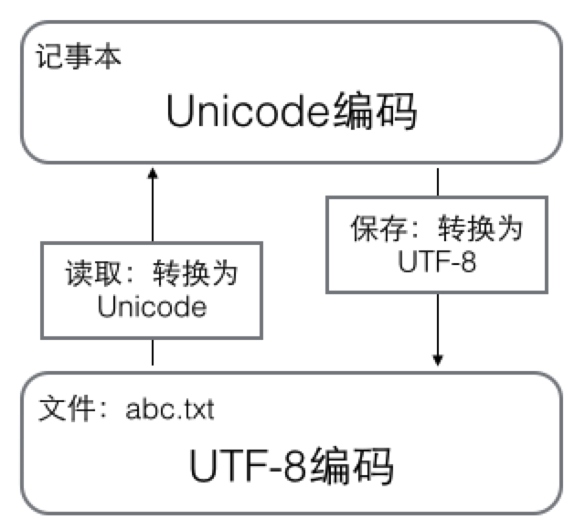
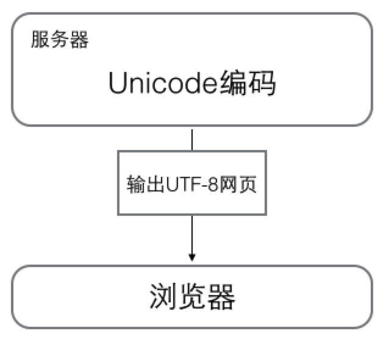
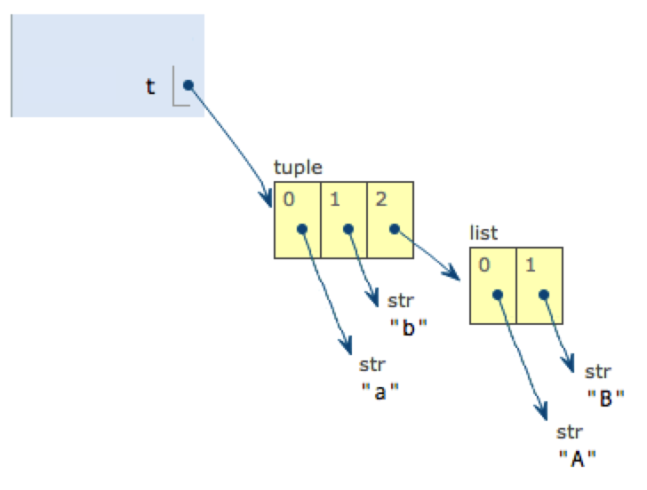
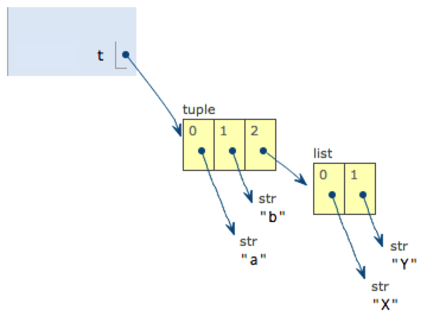

# 1.数据类型

## 1. 数据类型和变量

	Python使用缩进来组织代码块，一般使用4个空格的缩进。使用`#`​来注释一行，其他每一行都是一个语句，当语句以冒号`:`​结尾时，缩进的语句视为代码块。Python对大小写敏感。

### 1.1 整数

	Python可以处理任意大小的整数，包括负整数，写法与数学上写法一致，例如：-100。如果用十六进制表示，则用前缀为`0x`​和`0-9`​，`a-f`​表示，例如：0xff00。

### 1.2 浮点数

	浮点数的表示方法：3.14，-9.01。若是科学技术法表示，则10用e代替，例如：1.23$\times10^9$表示为1.23e9。

	整数和浮点数在计算机内存储的方式不同，整数运算永远是精确的（包括除法运算），浮点数运算可能会存在四舍五入的误差。

### 1.3 字符串

	字符串是**单引号**或**双引号**括起来的文本。

* 如果字符串中包含单引号，则用双引号括起来；
* 如果包含双引号，则用单引号括起来；
* 如果既包含单引号又包含双引号，则使用转义字符`\`​来标识，例如：`'I\'m \"OK\"!'`​表示的是`I'm "OK"!`​。
* python中用`r''`​表示`''`​内部的字符串默认不转义，例如`print(r'\\\t\\')`​即打印`\\\t\\`​。
* python中用`'''...'''`​三引号来输入多行内容，其中`...`​是提示符，表示接着上一行输入，例如：

  ```python
  >>> print('''line1
  ... line2
  ... line3''')
  line1
  line2
  line3
  ```

### 1.4 布尔值

	布尔值只有`True`​和`Flase`​两种（注意大小写，Python对大小写敏感），常用于if的条件判断。

	布尔值运算规则如下：

* ​`and`​运算是与运算，只有所有都为`True`​，`and`​运算结果才是`True`​。
* ​`or`​运算是或运算，只要其中有一个为`True`​，`or`​运算结果就是`True`​。
* ​`not`​运算是非运算，它是一个单目运算符，把`True`​变成`False`​，`False`​变成`True`​。

### 1.5 空值

	空值是Python里一个特殊的值，用`None`​表示。

### 1.6 变量

	Python中变量类型不固定，即动态语言，不需要提前声明。使用`=`​直接赋值，同一个变量可以反复赋值，且可以是不同类型的变量。例如：

```python
a = 123    #a是整数，即a指向整数123
a = "ABC"  #将a赋值成字符串，即a指向字符串"ABC"
b = a      #将b指向a所指向的数据("ABC")
a = "XYZ"  #将a指向字符串"XYZ"
print(b)   #打印b将打印"ABC"而不是"XYZ"
```

	变量`a="ABC"`​赋值中，Python解释器处理了以下事项：

1. 在内存中创建一个`"ABC"`​的字符串；
2. 在内存中创建了一个名为`a`​的变量，并把它指向`"ABC"`​。
3. 把a赋值给b，实际上是将b指向`a所指向的数据`​。

### 1.7 常量

	常量一般用全部大写的变量名表示，例如：`PI=3.14`​。实际上，Python没有机制保证PI的值不会被改变，所以本质仍然是个变量。

	Python的除法：

* ​`/`​的除法计算结果是浮点数，即使是两个整数相除也是浮点数，例如`9 / 3`​结果为`3.0`​。
* ​`//`​除法只取结果的整数部分，例如`10 // 3`​结果是整数部分3。
* ​`%`​表示取余数，例如：`10 % 3`​结果是余数1。

### 1.8 总结

	Python支持多种数据类型，在计算机内部可以把任何数据看成一个”对象”，而变量赋值就是将变量和数据对象关联起来，即变量指向该数据对象。例如`x=y`​，表示把变量x指向y所指向的数据对象，随后对y的赋值并不影响x的指向。

	Python的整数和浮点数没有大小的限制。若超出一定范围就用`inf`​（无限大）表示。

‍

---

## 2. 字符串和编码

### 2.1 字符编码

* ​`ASCII`​编码，早期的编码包含大小写英文字母、数字和一些符号，用一个字节（8位）表示。因编码量少可能会出现乱码问题。
* ​`Unicode`​编码，统一各国语言编码，用两个字节（16位）表示。如果文本全是英文，则会比ASCII编码需要多一倍的存储空间，在存储和传输上不划算。
* ​`UTF-8`​编码，即可变长的Unicode编码，UTF-8编码把一个Unicode字符根据不同的数字大小编码成1-6个字节，常用的英文字母被编码成1个字节，汉字通常是3个字节，只有很生僻的字符才会被编码成4-6个字节。如果你要传输的文本包含大量英文字符，用UTF-8编码能节省空间。

> 编码转换工具：https://tool.chinaz.com/tools/unicode.aspx

### 2.2 字符编码使用场景

* 在计算机内存中，统一使用Unicode编码。
* 当需要保存到硬盘或者需要传输的时候，就转换为UTF-8编码。

  例如：

  用记事本编辑的时候，从文件读取的UTF-8字符被转换为Unicode字符到内存里，编辑完成后，保存的时候再把Unicode转换为UTF-8保存到文件。

  

  浏览网页的时候，服务器会把动态的生成的Unicode内容转换为UTF-8再传输到浏览器，所以很多网页的源码上会有类似`<meta charset="UTF-8" />`​的信息，表示该网页正是用的UTF-8编码。

  

### 2.3 Python的字符串

	Python3的版本中，字符串是Unicode编码，即支持多语言。

	对于单个字符的编码，Python提供`ord()`​函数获取字符的整数表示，`chr()`​函数把编码转换为对应的字符。例如：

```python
>>> ord('A')
65
>>> ord('中')
20013
>>> chr(66)
'B'
>>> chr(25991)
'文'
```

如果知道字符的整数编码，可以用十六进制写`str`​：

```python
>>> '\u4e2d\u6587'
'中文'
```

### 2.4 字符串(编码)转换

	Python的字符串类型是`str`​，在内存中以Unicode表示，一个字符对应若干个字节。如果要在网络上传输，或者保存到磁盘上，就需要把`str`​变为以字节为单位的`bytes`​(UTF-8/ASCII编码)。

	Python对`bytes`​类型的数据用带`b`​前缀的单引号或双引号表示：

```Python
x = b'ABC'
```

#### 2.4.1 encode()[str→bytes]

	以Unicode表示的`str`​通过`encode()`​方法可以编码为指定的`bytes`​，即Unicode编码转换成UTF-8编码或ASCII编码，例如：

```python
>>> 'ABC'.encode('ascii')
b'ABC'
>>> '中文'.encode('utf-8')
b'\xe4\xb8\xad\xe6\x96\x87'
#错误例子
>>> '中文'.encode('ascii')  
Traceback (most recent call last):
  File "<stdin>", line 1, in <module>
UnicodeEncodeError: 'ascii' codec can't encode characters in position 0-1: ordinal not in range(128)
```

#### 2.4.2 decode()[bytes→str]

	要把UTF-8编码或ASCII编码转换成Unicode编码，即bytes类型转换为str类型，可用decode()转换。例如：

```python
>>> b'ABC'.decode('ascii')
'ABC'
>>> b'\xe4\xb8\xad\xe6\x96\x87'.decode('utf-8')
'中文'
#错误例子
>>> b'\xe4\xb8\xad\xff'.decode('utf-8')
Traceback (most recent call last):
  ...
UnicodeDecodeError: 'utf-8' codec can't decode byte 0xff in position 3: invalid start byte
```

	如果`bytes`​中只有一小部分无效的字节，可以传入`errors='ignore'`​忽略错误的字节：

```python
>>> b'\xe4\xb8\xad\xff'.decode('utf-8', errors='ignore')
'中'
```

#### 2.4.3 len()

	对于`str`​类型len()计算的是字符数，对于`bytes`​类型len()计算的是字节数。

```python
#对于str类型
>>> len('ABC')
3
>>> len('中文')
2
#对于bytes类型
>>> len(b'ABC')
3
>>> len(b'\xe4\xb8\xad\xe6\x96\x87')
6
>>> len('中文'.encode('utf-8'))
6
```

	1个中文字符经过UTF-8编码后通常会占用3个字节，而1个英文字符只占用1个字节。

	为了避免中文乱码，一般使用UTF-8编码对`str`​和`bytes`​进行转换，即Unicode→UTF-8。所以一般在Python源文件开头写以下信息：

```python
#!/usr/bin/env python3
# -*- coding: utf-8 -*-
```

第一行注释是为了告诉Linux/OS X系统，这是一个Python可执行程序，Windows系统会忽略这个注释；

第二行注释是为了告诉Python解释器，按照UTF-8编码读取源代码，否则，你在源代码中写的中文输出可能会有乱码。

### 2.5 格式化

#### 2.5.1 %的方式

	使用`%`​来格式化字符串，其中`%s`​永远起作用，可以把任何数据类型转换成字符串，如果字符串中包含`%`​，则使用`%%`​转义表示字符串中的`%`​。常用占位符如下：

|占位符|替换内容|
| --------| --------------|
|%s|字符串|
|%d|整数|
|%f|浮点数|
|%x|十六进制整数|

例如：

```python
>>> 'Hello, %s' % 'world'
'Hello, world'
>>> 'Hi, %s, you have $%d.' % ('Michael', 1000000)
'Hi, Michael, you have $1000000.'
#整数和浮点数
>>> print('%2d-%02d' % (3, 1))
>>> print('%.2f' % 3.1415926)
# %s的通用性
>>> 'Age: %s. Gender: %s' % (25, True)
'Age: 25. Gender: True'
#转义字符串中的%
>>> 'growth rate: %d %%' % 7
'growth rate: 7 %'
```

#### 2.5.2 format()

	可以使用字符串的`format()`​方法，它会用传入的参数依次替换字符串内的占位符`{0}`​、`{1}`​……。但建议直接使用`%`​的方式。

```python
>>> 'Hello, {0}, 成绩提升了 {1:.1f}%'.format('小明', 17.125)
'Hello, 小明, 成绩提升了 17.1%'
```

### 2.6 json 中的中文解析

使用`json.dumps(data, ensure_ascii=False)`​解析json中的中文。

```python
#!/usr/bin/python
# -*- coding: utf8 -*-

import json
import sys

reload(sys)
sys.setdefaultencoding('utf-8')

data = [ { 'a' : '中文' } ]

result = json.dumps(data, ensure_ascii=False)
print result
```

输出结果：

```bash
[{"a": "中文"}]
```

‍

---

## 3. list和tuple类型

### 3.1 list

list表示列表，是**可变**的**有序**列表，即有序的集合，可以随时添加和删除元素。

#### 3.1.1 list的定义

```python
>>> classmates = ['Michael', 'Bob', 'Tracy']
>>> classmates
['Michael', 'Bob', 'Tracy']
```

#### 3.1.2 len()

用`len()`​函数可以获得list元素的个数

```python
>>> len(classmates)
3
```

#### 3.1.3 list的索引

* list元素索引从0开始
* 索引可以引用负数表示倒数序号，例如classmates[-1]表示倒数最后一个元素，索引`-1`​等价于`len(classmates) - 1`​
* 索引越界会报`IndexError`​错误，倒序索引也会越界

#### 3.1.4 list元素增删

##### 3.1.4.1 追加末尾元素

```python
>>> classmates.append('Adam')
>>> classmates
['Michael', 'Bob', 'Tracy', 'Adam']
```

##### 3.1.4.2 指定位置插入元素

```python
>>> classmates.insert(1, 'Jack')
>>> classmates
['Michael', 'Jack', 'Bob', 'Tracy', 'Adam']
```

##### 3.1.4.3 删除末尾元素

```python
>>> classmates.pop()
'Adam'
>>> classmates
['Michael', 'Jack', 'Bob', 'Tracy']
```

##### 3.1.4.4 删除指定位置元素

用pop(i)的方法，i为索引值

```python
>>> classmates.pop(1)
'Jack'
>>> classmates
['Michael', 'Bob', 'Tracy']
```

##### 3.1.4.5 替换元素

即直接给对应索引的元素重新赋值。

```python
>>> classmates[1] = 'Sarah'
>>> classmates
['Michael', 'Sarah', 'Tracy']
```

#### 3.1.5 多维list

	list中元素的数据类型可以不同，如果要实现二维list，即将一维list中的元素定义为list即可，同理可以实现多维list。例如访问二维list可用`s[2][1]`​的方式，表示一维list中的第三个元素list中的第二个元素。

```python
>>> s = ['python', 'java', ['asp', 'php'], 'scheme']
>>> len(s)
4
```

#### 3.1.6 空list

	空list即一个元素也没有，长度为0。

```python
>>> L = []
>>> len(L)
0
```

### 3.2 tuple

#### 3.2.1 tuple的定义

	tuple表示元组，即**不可变**的**有序**元素的集合。即没有修改元素的函数，例如append()，insert()，元素赋值等。

	因为tuple元素不可变，所以代码更安全。当定义tuple时，元素就必须被确定下来。如果tuple中只含一个元素，则在该元素后加逗号。避免与小括号运算产生歧义。

```python
#以下是单元素tuple的定义
>>> t = (1,)
>>> t
(1,)
#以下是小括号运算
>>> t = (1)
>>> t
1
```

#### 3.2.2 特别说明

tuple中的元素不可变表示元素的指向不可变，但该元素如果是list，则该list的内容可变。即list表示的是指向，该list的指向不可变，但是list中元素的指向可变，即list中的元素可变。例如：

```python
>>> t = ('a', 'b', ['A', 'B'])
>>> t[2][0] = 'X'
>>> t[2][1] = 'Y'
>>> t
('a', 'b', ['X', 'Y'])
```

示意图：

list元素修改前：`t = ('a', 'b', ['A', 'B'])`​



list元素修改后：`t = ('a', 'b', ['X', 'Y'])`​



‍

---

## 4. dict和set类型

### 4.1 dict

#### 4.1.1 dict的定义

dict即字典，相当于golang中的`map`​类型，key-value型。具有极快的查找速度。

```python
//dict的赋值
>>> d = {'Michael': 95, 'Bob': 75, 'Tracy': 85}
>>> d['Michael']
95
//dict元素的赋值
>>> d['Adam'] = 67
```

由于dict中**key的值是唯一**的，因此如果多次赋值，最终结果为最后一次的赋值。

#### 4.1.2 dict的查找

如果key不存在会报错，检测key是否存在可以通过`in`​或`get()`​方法。当key不存在时，`in`​的方式返回`False`​，`get()`​方法返回`None`​或指定值。

```python
#key不存在的报错
>>> d['Thomas']
Traceback (most recent call last):
  File "<stdin>", line 1, in <module>
KeyError: 'Thomas'

#in方式检查key是否存在
>>> 'Thomas' in d
False

#get()方法检查key是否存在
>>> d.get('Thomas')
>>> d.get('Thomas', -1)
-1
```

#### 4.1.3 dict的删除

要删除dict中的元素，可以通过用`pop(key)`​方法，删除该key对应的键值对。

```python
>>> d.pop('Bob')
75
>>> d
{'Michael': 95, 'Tracy': 85}
```

#### 4.1.4 特别说明

**dict的特点**：

1. 查找和插入的速度极快，不会随着key的增加而变慢；
2. 需要占用大量的内存，内存浪费多。
3. dict的key必须是**不可变对象**，在Python中，字符串、整数等都是不可变的，而list是可变的，就不能作为key。

**对比list的特点**：

1. 查找和插入的时间随着元素的增加而增加；
2. 占用空间小，浪费内存很少。

### 4.2 set

	set表示无序和无重复元素的集合，与数学意义上的集合类似，也可以看成是只有key没有value的dict。

#### 4.2.1 set的定义

要创建一个set，需要提供一个list作为输入集合，如果list中有重复元素则自动过滤掉。

```python
>>> s = set([1, 2, 3])
>>> s
{1, 2, 3}
#如果有重复元素会自动过滤掉
>>> s = set([1, 1, 2, 2, 3, 3])
>>> s
{1, 2, 3}
```

#### 4.2.2 set的添加和删除

通过`add(key)`​方法可以添加元素到set中，可以重复添加，但无效。

```python
>>> s.add(4)
>>> s
{1, 2, 3, 4}
>>> s.add(4)
>>> s
{1, 2, 3, 4}
```

通过`remove(key)`​方法可以删除元素。

```python
>>> s.remove(4)
>>> s
{1, 2, 3}
```

#### 4.2.3 set的交集和并集

```python
>>> s1 = set([1, 2, 3])
>>> s2 = set([2, 3, 4])
#交集
>>> s1 & s2
{2, 3}
#并集
>>> s1 | s2
{1, 2, 3, 4}
```

### 4.3 不可变对象

	变量表示一个指向，而变量指向的内容表示一个对象。例如`a="abc"`​中`a`​是变量即指向，而`abc`​是字符串对象。

	Python中整数和字符串是不可变对象，而list是可变对象。

```python
>>> a = 'abc'
>>> b = a.replace('a', 'A')
>>> b
'Abc'
>>> a
'abc'
```

	例如上例中，`a`​是变量，`abc`​是字符串对象，当调用a的`replace`​的方法时，实际上是基于原字符串对象重新创建了一个新的字符串对象`Abc`​，而没有改变原字符串对象的内容。

	对于不变对象来说，调用对象自身的任意方法，不会改变该对象自身的内容。而会创建新的对象并返回。

‍
