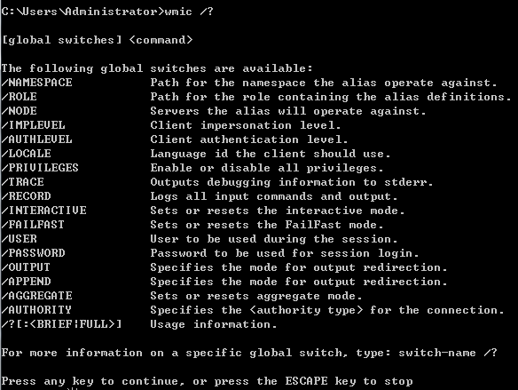

# WMIC

wmic（Windows Management InstrumentationCommand Line） ，提供了从命令行接口和批命令脚本执行系统管理的支持

WMIC可以以两种模式执行：

交互模式(Interactive mode)：命令窗口下输入wimic

eg：

查看进程为QQ.exe进程的信息

```bat
>wmic
wmic:root\cli>process where name="QQ.exe" list brief
HandleCount  Name    Priority  ProcessId  ThreadCount  WorkingSetSize
1320         QQ.exe  8         6172       69           220016640
```

非交互模式(Non-Interactive mode)：wimic+命令参数

帮助文档查看

​`wmic / ?`​



## 使用示例

### 1.显示BIOS信息

```bat
>wmic bios list Brief
Manufacturer              Name                                        SerialNumber            SMBIOS    BIOSVersion  Version
American Megatrends Inc.  BIOS Date: 07/12/12 13:29:34 Ver: 04.06.05  To be filled by O.E.M.  F3        _ASUS_ - 1072009
```

ist决定显示的信息格式与范围，它有

　　full为默认参数，表示显示所有的信息

　　Brief表示只显示摘要信息

　　Instance表示只显示对象实例

　　Status表示显示对象状态

　　Writeable表示只显示该对象的可写入的属性信息等

### 2.cpu信息

```
>wmic cpu list brief
Caption                               DeviceID  Manufacturer  MaxClockSpeed  Name                      SocketDesignation
Intel64 Family 6 Model 58 Stepping 9  CPU0      GenuineIntel  3901           Intel(R) Core(TM) i7-37   70K CPU @ 3.50GHz  Intel(R) Core(TM) i7-3770K CPU @ 3.50GHz
```

cpu型号

```
>wmic cpu get name
Name
Intel(R) Core(TM) i7-3770K CPU @ 3.50GHz
```

cpu当前的速度

```
>wmic cpu get CurrentClockSpeed
CurrentClockSpeed
3901
```

### 3.物理内存

```
>wmic memphysical list brief
MaxCapacity  MemoryDevices  Model  Name
33554432     4                     Physical Memory Array
```

### 4.内存芯片信息

```
>wmic memorychip list brief
Capacity    DeviceLocator   MemoryType  Name             Tag                TotalWidth
8589934592  ChannelA-DIMM0  0           Physical Memory  Physical Memory 0  64
8589934592  ChannelB-DIMM0  0           Physical Memory  Physical Memory 2  64
```

### 5.查看缓存

```
>wmic memcache list brief
BlockSize  CacheSpeed  CacheType  DeviceID        InstalledSize  Level  MaxCacheSize  NumberOfBlocks  Status
1024                   4          Cache Memory 0  256            3      256           256              OK
1024                   5          Cache Memory 1  1024           4      1024          1024             OK
1024                   5          Cache Memory 2  8192           5      8192          8192             OK
```

### 6.本地存储设备管理

获取硬盘系统格式、总大小、可用空间等

```
>wmic logicaldisk list brief
DeviceID  DriveType  FreeSpace     ProviderName  Size          VolumeName
C:        3          27498643456                 210519453696
D:        3          304604254208                401603555328
E:        3          226881138688                387973115904
F:        5
G:        5
```

‍

### 7.声音设备管理

```
>wmic sounddev list brief
Manufacturer  Name                                                 Status  StatusInfo
Realtek       Realtek High Definition Audio                        OK      3
NVIDIA        NVIDIA High Definition Audio                         OK      3
NVIDIA        NVIDIA Virtual Audio Device (Wave Extensible) (WDM)  OK      3
```

### 8.进程管理

列出进程的核心信息

```
>wmic process list brief
HandleCount  Name                       Priority  ProcessId  ThreadCount  WorkingSetSize
0            System Idle Process        0         0          8            24576
1026         System                     8         4          176          2072576
36           smss.exe                   11        416        2            1572864
766          csrss.exe                  13        632        9            5414912
89           wininit.exe                13        688        3            6017024
2079         csrss.exe                  13        708        14           23052288
261          services.exe               9         748        9            11550720
131          winlogon.exe               13        788        3            10358784
……
```

wmic 获取进程名称以及可执行路径

```
>wmic process get name,executablepath
ExecutablePath                   Name 
                                 System Idle Process 
                                 System 
                                 smss.exe 
C:\Windows\system32\csrss.exe    csrss.exe 
C:\Windows\system32\wininit.exe  wininit.exe 
C:\Windows\system32\csrss.exe    csrss.exe 
C:\Windows\system32\services.exe services.exe 
C:\Windows\system32\winlogon.exe winlogon.exe 
……
```

获得某个进程当前占用的内存和最大占用内存的大小

```
>wmic process where caption='QQ.exe' get WorkingSetSize,PeakWorkingSetSize
PeakWorkingSetSize  WorkingSetSize
233476              220094464


>wmic process where caption='chrome.exe' get WorkingSetSize,PeakWorkingSetSize

PeakWorkingSetSize  WorkingSetSize
525904              380080128
21752               21032960
19112               18669568
228752              205066240
35952               36720640
```

‍

### 9.获取正在运行的服务列表

```
>wmic service where "state='running'" get name
Caption                                                 Name                  StartMode
Windows Audio Endpoint Builder                          AudioEndpointBuilder  Auto
Windows Audio                                           AudioSrv              Auto
Base Filtering Engine                                   BFE                   Auto
Background Intelligent Transfer Service                 BITS                  Manual
Computer Browser                                        Browser               Manual
Certificate Propagation                                 CertPropSvc           Manual
Cryptographic Services                                  CryptSvc              Auto
DCOM Server Process Launcher                            DcomLaunch            Auto
DHCP Client                                             Dhcp                  Auto
DNS Client                                              Dnscache              Auto
Diagnostic Policy Service                               DPS                   Auto
Extensible Authentication Protocol                      EapHost               Manual
Windows Event Log                                       eventlog              Auto
COM+ Event System                                       EventSystem           Auto
Windows Font Cache Service                              FontCache             Manual
```
