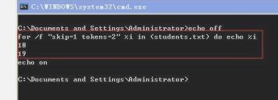
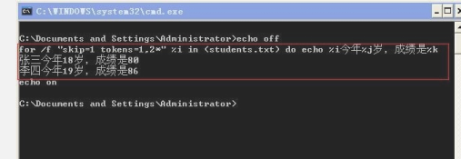
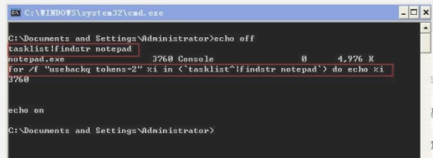

# for

## 1 简介

### 1.1 一般形式​​

```
FOR 参数 %%变量名 IN (相关文件或命令) DO 执行的命令

（1）在cmd窗口中：for %I in (command1) do command2 

（2）在批处理文件中：for %%I in (command1) do command2
```

### 1.2 基本了解

之所以要区分cmd窗口和批处理文件两种环境，是因为在这两种环境下，命令语句表现出来的行为虽然基本一样，但是在细节上还是稍有不同。

最明显的一个差异就是：在cmd窗口中，for之后的形式变量 I 必须使用单百分号引用，即%I；而在批处理文件中，引用形式变量I必须使用双百分号，即%%I。

为了方便起见，若不是特别强调，以下的讲解都以批处理文件环境为例。

我们先来看一下for语句的基本要素都有些什么：

（1）for、in和do是for语句的关键字，它们三个缺一不可；

（2）%%I是for语句中对形式变量的引用，即使变量l在do后的语句中没有参与语句的执行，也是必须出现的；变量可以是 a<sub>z,A</sub>Z，区分大小写。

（3）in之后，do之前的括号不能省略；

（4）command1表示字符串或变量，command2表示字符串、变量或命令语句；

下面来看一个Windows bat脚本的demo(记为demo1)：

```powershell
@echo off
for  %%I in (ABC) do echo %%I
pause
```

保存为.bat文件(批处理文件)并执行，将会在弹出的批处理窗口中看到这样的信息：


对批处理文件的for循环就是这样简单，下面来看看for语句的注意事项，并运行更复杂的for循环实例。

	for语句的形式变量I，可以换成26个字母中的任意一个，这些字母会区分大小写，也就是说，%%I和%%i会被认为不是同一个变量；

	形式变量I还可以换成其他的字符，但是，为了不与批处理中的%0～%9这10个形式变量发生冲突，请不要随意把%%I替换为%%0～%%9中的任意一个；

	in和do之间的command1表示的字符串或变量可以是一个，也可以是多个，每一个字符串或变量，我们称之为一个元素，每个元素之间，用空格键、跳格键、逗号、分号或等号分隔；

for语句依次提取command1中的每一个元素，把它的值赋予形式变量I，带到do后的command2中参与命令的执行；

并且每次只提取一个元素，然后执行一次do后的命令语句，而无论这个元素是否被带到command2中参与了command2的运行；

当执行完一次do后的语句之后，再提取command1中的下一个元素，再执行一次command2，如此循环，直到command1中的所有元素都已经被提取完毕，该for语句才宣告执行结束。

有了以上的基础，我们再来看下面这个例子，这个例子修改了demo1中的部分内容(记为demo2)，结果将大不一样：

```powershell
@echo off
for  %%I in (A,B,C) do echo %%I
pause
```

运行结果如下：


如果把 bbs.bathome.cn 这个字符串中的点号换为空格、跳格或等号，执行结果将和demo2的执行结果别无二致。

现在，来分析一下demo2代码中for语句的执行过程：

1. for语句以逗号为分隔符，把 A,B,C 这个字符串切分成三个元素：A、B和C，由此决定了do后的语句将会被执行3次；

2. 第一次执行过程是这样的：先把 bbs 这个字符串作为形式变量I的值，带入do后的语句中加以执行，也就是执行 echo %%I 语句，此时的I值为A，因此，第一次执行的结果，将会在屏幕上显示A这个字符串；第二次执行和第一次执行的过程是一样的，只不过此时I的值已经被替换为command1中的第二个元素了，也就是 B 这个字符串；如此循环，当第三次echo执行完毕之后，整条for语句才算执行完毕，此时，将执行下一条语句，也就是pause命令。

 高级用法：

1)搜索当前目录下有哪些文件？

```
@echo off
for %%i in (*.*) do echo "%%i"
pause
```

2)搜索当前目录下所有的文本文件？

```powershell
@echo off
for %%i in (*.txt) do echo "%%i"
pause
```

### 1.3 核心参数 /d /l /r /f

```
/d /l /r /f
/d：仅查看目录
/r：递归查看
/f：查看文件内容 
/l：迭代数值范围：如 for %%l in (1,2,5)，则等价于 for %%l in (1,3,5)..即（#start,#step,#end），开始位置、步长、结束位置
```

## 2 最佳实践

### 2.1 获取文件每行内容

```powershell
@echo off
for /f "delims=" %%i in (config.txt) do (echo "%%i")
timeout /t 100
```

### 2.2 在for中执行多条命令

```
一般形式：

　　for %%i in (set) do (命令a&命令b&命令c)

案例：

　　@echo off
for /f "delims=" %%i in (Config.txt) do (set /p="%date% %time%:  " <nul >>1.txt & curl.exe "%%i">>1.txt & echo >>1.txt )
timeout /t 100
```

更佳

```
for %%i in (resource1 ^
            resource2 ^
            resource3 ^
            resource4) ^
do (
    echo %%i
    XCOPY /Y /S /q %%i %OFFICE_DIR%
)
```

### 2.3 for的常用遍历

```powershell
#文件：遍历当前目录下所有的txt文件（包含当前目录下所有子目录下的txt文件）

@echo offfor /R %%s in (*.txt) do ( 
echo %%s 
)

#目录：遍历当前目录的子目录（第一层）

@echo offfor /D %%s in (*) do ( 
echo %%s 
)

#目录：遍历当前目录下的dir目录，获取dir当前目录下下一层目录

@echo offfor /D %%s in (dir\*) do ( 
echo %%s 
)

#目录：遍历当前目录下的dir的子目录，获取dir目录下的所有层级目录

@echo offfor /D /R %%s in (dir\*) do (
echo %%s
)

 

#目录：遍历当前目录下的所有目录信息

@echo offfor /D /R %%s in (*) do (
echo %%s
)
```

## 2.4 for死循环，for 1-10000

```
for /l %%a in (1,1,10000) do
for /l %%b in (1,1,10000) do (
)
```

## 3 for查看文件与目录

### 3.1 目录结构

```
D:\test
---A Folder 1
|-----A file 1.txt

|-----A file 2.txt
|-----A file 3.txt
---B Folder 2
|-----B file 1.txt
|-----B file 2.txt
|-----B file 3.txt
|---B Folder 3
|-----B sub file 1.txt
|-----B sub file 2.txt
|-----B sub file 3.txt
```

### 3.2 获取该目录下所有层级目录和文件

```
@echo off
set work_path=D:\test
D:
cd %work_path%
for /R %%s in (.,*) do (
echo %%s
)
pause
```

结果：

```
D:\test\.
D:\test\A Folder 1\.
D:\test\A Folder 1\A file 1.txt
D:\test\A Folder 1\A file 2.txt
D:\test\A Folder 1\A file 3.txt
D:\test\B Folder 2\.
D:\test\B Folder 2\B file 1.txt
D:\test\B Folder 2\B file 2.txt
D:\test\B Folder 2\B file 3.txt
D:\test\B Folder 2\B Folder 3\.
D:\test\B Folder 2\B Folder 3\B sub file 1.txt
D:\test\B Folder 2\B Folder 3\B sub file 2.txt
D:\test\B Folder 2\B Folder 3\B sub file 3.txt
```

我们可以看到， in （）中的参数有好几个

**如果没有写cd %work_path% 路径的情况下，它们就以bat文件所在位置为当前目录**

- in (.,\*)  表示目录和文件
- in (.) 表示只有目录
- 那么很明显 in(\*)表示只有文件

### 3.3 获取某个路径下递归的所有文件

```
@echo off
for /R "D:\test" %%s in (*) do (
echo %%s
)
```

结果：​​

```
D:\test\A Folder 1\A file 1.txt
D:\test\A Folder 1\A file 2.txt
D:\test\A Folder 1\A file 3.txt
D:\test\B Folder 2\B file 1.txt
D:\test\B Folder 2\B file 2.txt
D:\test\B Folder 2\B file 3.txt
D:\test\B Folder 2\B Folder 3\B sub file 1.txt
D:\test\B Folder 2\B Folder 3\B sub file 2.txt
D:\test\B Folder 2\B Folder 3\B sub file 3.txt
```

### 3.4 获取某个路径下递归的所有目录

```
@echo off
for /R "D:\test" %%s in (.) do (
echo %%s
)

```

## 4 for对文件的操作

### 4.1 获取文件中指定的行、列

如文件students.txt内容如下：

```
姓名    年龄   成绩
张三    18    80
李四    19    86

```

要取得所有人的年龄，可以用命令：

```
for /f "skip=1 tokens=2" %i in (students.txt) do echo %i

　　“skip=1 ”表示跳过第一行，从第二行开始读取文件

　　“tokens=2”表示提取第二个字段值

没有指定“delims”分隔符的值，使用默认分隔符——“空格和TAB键”作为各字段的分隔符。
```



如需指定“，”作为分隔符，只需如下输入：

for /f "skip=1 tokens=2 delims＝," %i in (students.txt) do echo %i

### 4.2 读取文件中的多列，拼接信息​​

```
如需读取记录并将每条记录按后面的格式生成一句话：XXX今年XX岁，成绩是XX。可以用命令：

for /f "skip=1 tokens=1,2*" %i in (students.txt) do echo %i今年%j岁，成绩是%k

“tokens=1,2*”表示提取第一、二字段，并将第二字段后的所有内容做为第三字段的值输出。

%i,%j,%k分别对应第一、二、三字段的值
```



### 4.3 for 实现 awk 获取命令中的某一列

for命令还可以从命令输出的结果中提出字段值，如从进程列表中查找记事本notepad进程并获取PID的命令可如下：

```
for /f "usebackq tokens=2" %i in (`tasklist^|findstr notepad`) do echo %i
```

如需使用命令，必须使用“usebackq”参数，并且命令要用反引号符“\`”（键盘上tab键上方的键）引起来。命令中如有特殊字符，需在前面加“^”字符进行字符转义。



### 4.4 获取IP地址

```
ECHO off 
@hostname>>"D:\1.txt" 
for /f "tokens=16" %%i in ('ipconfig ^|find /i "ipv4"') do set ip=%%i 
echo %ip%>>"D:\1.txt"
exit
```

```powershell
rem ================= check VirtualIP ================= 截取首选ip
:checkVIP
for /f "tokens=16" %%i in ('ipconfig ^|find /i "ipv4"') do ( 
set ip=%%i
goto :break
)
:break
:end
```

‍

## 实践案例

### 1 遍历目录下所有文件，删除含指定字符串的文件

```
@echo off
for /R "D:\test" %%s in (*) do (
echo %%s|findstr "^abc" >nul
if %errorlevel% equ 0 (
del %%s
) else (
continue
)
)
```

‍
