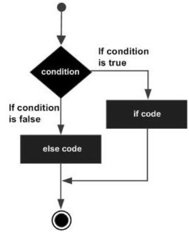

# if

下一个决策陈述是`if/else`​语句。 以下是本声明的一般形式。

```bat
if (condition) (do_something) ELSE (do_something_else)
Bat
```

上述语句首先在`“if”`​语句中评估一个条件。 如果条件为真，则执行后面的语句，并在`else`​条件之前停止并退出循环。 如果条件为`false`​，则执行`else`​语句块中的语句，然后退出循环。 下图显示了`'if'`​语句的流程。  
​

### **检查变量**

就像批处理脚本中的`“if”`​语句一样，`if-else`​也可以用于检查在批处理脚本中设置的变量。 字符串和数字都可以对`“if”`​语句进行评估。

### **检查整型变量**

以下示例显示如何将`“if”`​语句用于数字。

```bat
@echo off 
SET /A a=5 
SET /A b=10
SET /A c=%a% + %b% 
if %c%==15 (echo "The value of variable c is 15") else (echo "Unknown value") 
if %c%==10 (echo "The value of variable c is 10") else (echo "Unknown value")
Bat
```

关于上述程序，有几点需要说明 -

- 每个`“if else”`​代码放在括号`()`​中。 如果括号不是用于分隔`"if"`​和`"else"`​代码的代码，那么如果`else`​语句不成立，那么这些语句就不会有效。
- 在第一个`“if else”`​语句中，`if`​条件将评估为`true`​。
- 在第二个`“if else”`​语句中，`else`​条件将被执行，因为条件将被评估为`false`​。

以上命令产生以下输出 -

```shell
"The value of variable c is 15" 
"Unknown value"
Shell
```

### **检查字符串变量**

对于字符串可以重复相同的示例。 以下示例显示如何将`“if else”`​语句用于字符串。

```bat
@echo off 
SET str1=String1 
SET str2=String2 

if %str1%==String1 (echo "The value of variable String1") else (echo "Unknown value") 

if %str2%==String3 (echo "The value of variable c is String3") else (echo "Unknown value")
Bat
```

关于上述有几点需要注意 -

- 第一个`“if”`​语句检查变量`str1`​的值是否包含字符串`“String1”`​。 如果是这样，那么它会在命令提示符下回显一个字符串。
- 由于第二个`“if”`​语句的条件评估为`false`​，所以语句的`echo`​部分将不会被执行。

以上命令产生以下输出 -

```bat
"The value of variable String1" 
"Unknown value"
Bat
```

### **检查命令行参数**

​`'if else'`​语句也可以用于检查命令行参数。 以下示例显示如何使用`“if”`​语句来检查命令行参数的值。

```bat
@echo off 
echo %1 
echo %2 
echo %3 
if %1%==1 (echo "The value is 1") else (echo "Unknown value") 
if %2%==2 (echo "The value is 2") else (echo "Unknown value") 
if %3%==3 (echo "The value is 3") else (echo "Unknown value")
Bat
```

如果上面的代码被保存在一个名为`test.bat`​的文件中，则程序被执行为 -

```shell
test.bat 1 2 4
Shell
```

以下将是上述代码的输出 -

```bat
1 
2 
4 
"The value is 1" 
"The value is 2" 
"Unknown value"
Bat
```

### **if defined**

​`“if”`​语句的一个特例是`“if defined”`​，用于测试变量是否存在。 以下是声明的一般语法。

```bat
if defined somevariable somecommand
Bat
```

以下是如何使用`“if defined”`​语句的示例。

```bat
@echo off 
SET str1=String1 
SET str2=String2 
if defined str1 echo "Variable str1 is defined"

if defined str3 (echo "Variable str3 is defined") else (echo "Variable str3 is not defined")
Bat
```

以下将是上述代码的输出 -

```bat
"Variable str1 is defined" 
"Variable str3 is not defined"
Bat
```

### **if exists**

​`“if”`​语句的另一个特例是`“if exists”`​，用于测试文件是否存在。 以下是声明的一般语法。

```bat
If exist somefile.ext do_something
Bat
```

以下是如何使用`“if exists”`​语句的示例。

```bat
@echo off 
if exist C:\set2.txt echo "File exists" 
if exist C:\set3.txt (echo "File exists") else (echo "File does not exist")
Bat
```

假设在C驱动器中有一个名为`set2.txt`​的文件，并且没有名为`set3.txt`​的文件。 那么，以下将是上述代码的输出。

```shell
"File exists"
"File does not exist"
Shell
```
