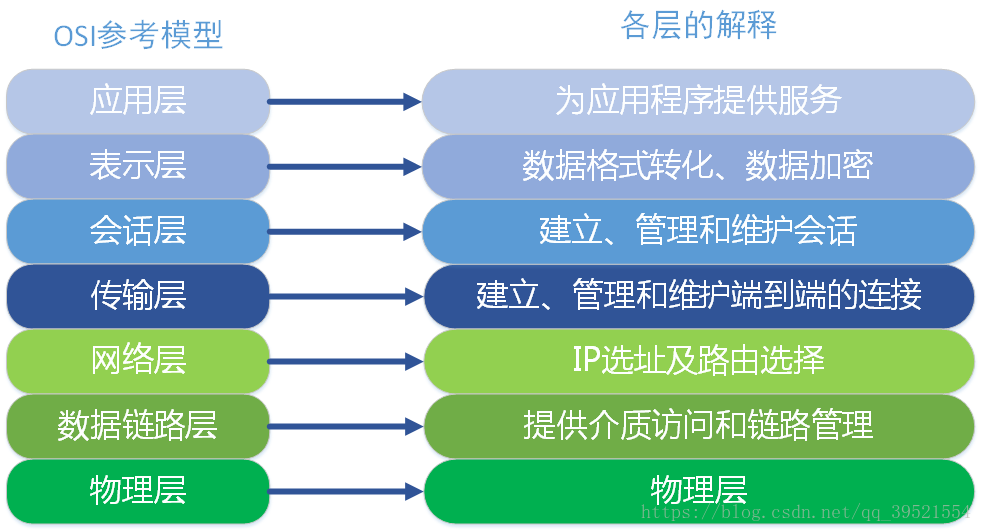
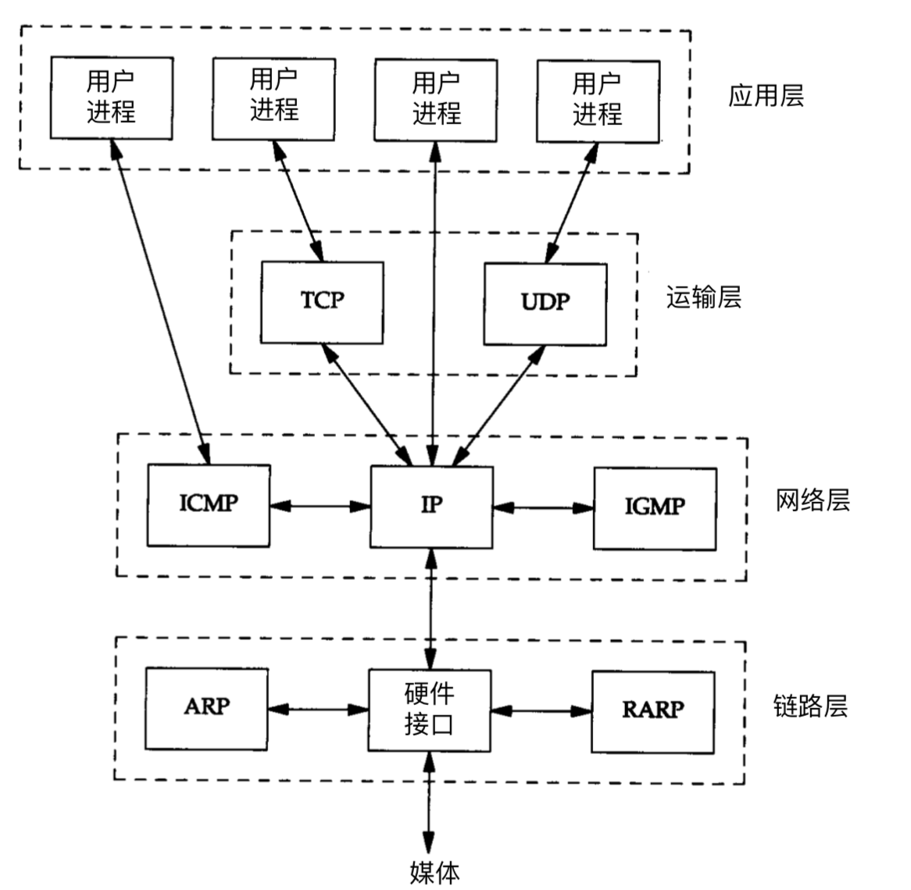
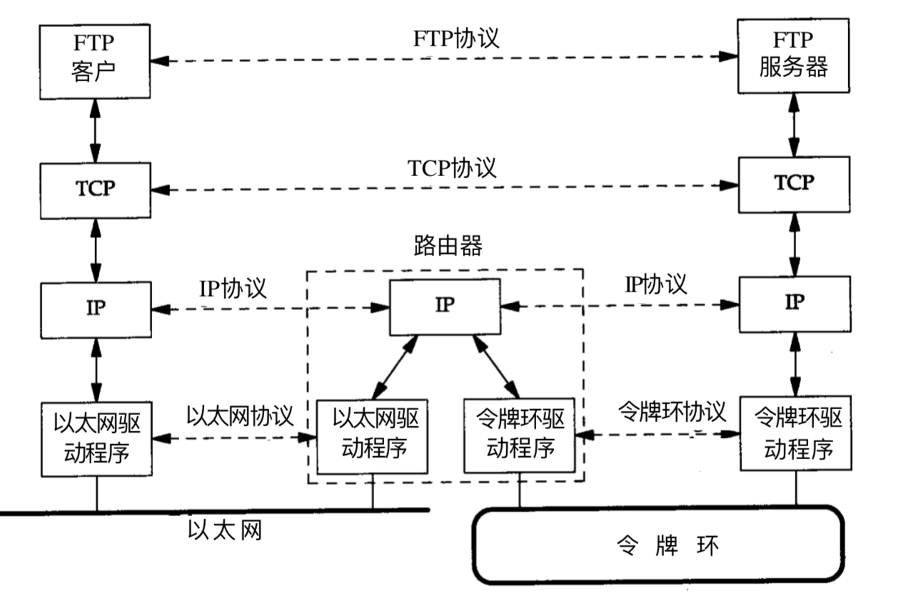

# TCP-IP四层与OSI七层网络模型

OSI（Open System Interconnect），即开放式系统互联。  一般都叫OSI参考模型，是ISO（国际标准化组织）组织在1985年研究的网络互连模型。ISO为了更好的使网络应用更为普及，推出了OSI参考模型。其含义就是推荐所有公司使用这个规范来控制网络。这样所有公司都有相同的规范，就能互联了。

‍

## TCP/IP四层与OSI七层模型

​​​

​​​

|OSI七层网络模型|TCP/IP四层概念模型|对应网络协议|
| -------------------------| -----------------------------------------------| -----------------------------------------|
|应用层（Application）|应用层 |HTTP、TFTP,FTP, NFS, WAIS、SMTP|
|表示层（Presentation）||Telnet, Rlogin, SNMP, Gopher|
|会话层（Session）||SMTP, DNS|
|传输层（Transport）|传输层（报文段）|TCP, UDP|
|网络层（Network）|网络层（数据包）|IP, ICMP, ARP, RARP, AKP, UUCP|
|数据链路层（Data Link）|数据链路层（帧） |FDDI, Ethernet, Arpanet, PDN, SLIP, PPP|
|物理层（Physical）||IEEE 802.1A, IEEE 802.2到IEEE 802.11|

## **OSI七层和TCP/IP四层的关系**

OSI引入了服务、接口、协议、分层的概念，TCP/IP 借鉴了OSI 的这些概念建立 TCP/IP模型。

OSI先有模型，后有协议，先有标准，后进行实践；而 TCP/IP 则相反，先有协议和应用再提出了模型，且是参照的 OSI模型。

### TCP/IP协议簇

​​

### 一次C/S通信

​​

**附一张经典图：**

​​
