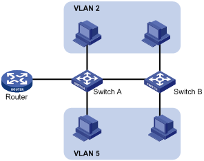
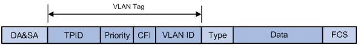
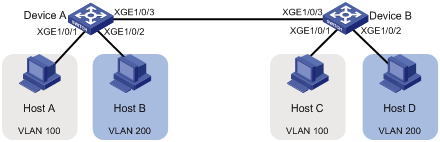

# VLAN

## 1.1  VLAN简介

### 1.1.1  VLAN概述

以太网是一种基于CSMA/CD（Carrier Sense Multiple Access/Collision Detect，带冲突检测的载波侦听多路访问）技术的共享通讯介质。采用以太网技术构建的局域网，既是一个冲突域，又是一个广播域，当网络中主机数目较多时会导致冲突严重，广播泛滥、性能显著下降，甚至网络不可用等问题。通过在以太网中部署网桥或二层交换机，可以解决冲突严重的问题，但仍然不能隔离广播报文。在这种情况下出现了VLAN（Virtual Local Area Network，虚拟局域网）技术，这种技术可以把一个物理LAN划分成多个逻辑的LAN——VLAN。处于同一VLAN的主机能直接互通，而处于不同VLAN的主机则不能直接互通。这样，广播报文被限制在同一个VLAN内，即每个VLAN是一个广播域。如[图1-1](https://www.h3c.com/cn/d_201305/785675_30005_0.htm#_Ref140746364)所示，VLAN 2内的主机可以互通，但与VLAN 5内的主机不能互通。

图1-1 VLAN示意图

​​

VLAN的划分不受物理位置的限制：物理位置不在同一范围的主机可以属于同一个VLAN；一个VLAN包含的主机可以连接在同一个交换机上，也可以跨越交换机，甚至可以跨越路由器。

VLAN根据划分方式不同可以分为不同类型。基于端口划分VLAN是其中最简单、最有效的VLAN划分方式。它按照设备端口来定义VLAN成员，将指定端口加入到指定VLAN中之后，端口就可以转发该VLAN的报文。本章将介绍基于端口的VLAN。

VLAN的优点如下：

l   限制广播域。广播域被限制在一个VLAN内，节省了带宽，提高了网络处理能力。

l   增强局域网的安全性。VLAN间的二层报文是相互隔离的，即一个VLAN内的主机不能和其他VLAN内的主机直接通信，如果不同VLAN要进行通信，则需通过路由器或三层交换机等三层设备。

l   灵活构建虚拟工作组。通过VLAN可以将不同的主机划分到不同的工作组，同一工作组的主机可以位于不同的物理位置，网络构建和维护更方便灵活。

### 1.1.2  VLAN报文封装

要使网络设备能够分辨不同VLAN的报文，需要在报文中添加标识VLAN的字段。IEEE 802.1Q协议规定，在以太网报文的目的MAC地址和源MAC地址字段之后、协议类型字段之前加入4个字节的VLAN Tag，用以标识VLAN的相关信息。

图1-2 VLAN Tag的组成字段

​​

如图1-2所示，VLAN Tag包含四个字段，分别是TPID（Tag Protocol Identifier，标签协议标识符）、Priority、CFI（Canonical Format Indicator，标准格式指示位）和VLAN ID。

* TPID：用来表示报文是否带有VLAN Tag，长度为16比特，缺省情况下，TPID取值为0x8100，但各设备厂商可以自定义该字段的值。当邻居设备将TPID值配置为非0x8100时，为了能够识别这样的报文，实现互通，必须在本设备上修改TPID值，确保和邻居设备的TPID值配置一致。如果报文的TPID值为配置值或0x8100，则该报文被认为带有VLAN Tag。配置TPID值的相关命令请参见“二层技术-以太网交换命令参考”中的“QinQ”。

* Priority：用来表示报文的802.1p优先级，长度为3比特，相关内容请参见“ACL和QoS配置指导/QoS”中的“附录”。

* CFI：用来表示MAC地址在不同的传输介质中是否以标准格式进行封装，长度为1比特。取值为0表示MAC地址以标准格式进行封装，为1表示以非标准格式封装。在以太网中，CFI取值为0。

* VLAN ID：用来表示该报文所属VLAN的编号，长度为12比特。由于0和4095为协议保留取值，所以VLAN ID的取值范围为1～4094。

网络设备根据报文是否携带VLAN Tag以及携带的VLAN Tag信息，来对报文进行处理，利用VLAN ID来识别报文所属的VLAN。详细的处理方式请参见“1.4.1  基于端口的VLAN简介”。

* 以太网支持Ethernet II、802.3/802.2 LLC、802.3/802.2 SNAP和802.3 raw封装格式，本文以Ethernet II型封装为例。802.3/802.2 LLC、802.3/802.2 SNAP和802.3 raw封装格式添加VLAN Tag字段的方式请参见相关协议规范。

* 对于带有多层VLAN Tag的报文，设备会根据其最外层VLAN Tag进行处理，而内层VLAN Tag会被视为报文的普通数据部分。

### 1.1.3  协议规范

与VLAN相关的协议规范有：

l   IEEE 802.1Q：IEEE Standard for Local and Metropolitan Area Networks-Virtual Bridged Local Area Networks

## 1.2  配置VLAN基本属性

|配置|命令|说明|
| ----------------------------------------------------| ------| ---------------------------------------------------------------------------------------------------|
|进入系统视图|**system-view**|-|
|（可选）创建一个VLAN并进入VLAN视图，或批量创建VLAN|**vlan**{*vlan-id1 * [ ** to**​ * vlan-id2 * ]*|***all**}|
|进入VLAN视图|**vlan** *vlan-id*|批量创建VLAN时，为必选；否则，无需执行本命令|
|指定当前VLAN的名称|**name **​*text*|缺省情况下，VLAN的名称为“VLAN*vlan-id*”，其中*vlan-id*为该VLAN的编号。例如，VLAN 100的名称为“VLAN 0100”|
|配置当前VLAN的描述信息|**description**​ * text*|缺省情况下，VLAN的描述信息为“VLAN*vlan-id*”，其中*vlan-id*为该VLAN的编号。例如，VLAN 100的描述信息为“VLAN 0100”|

说明：

1. VLAN 1为系统缺省VLAN，用户不能手工创建和删除。
2. 动态学习到的VLAN、配置有QoS策略的VLAN、被其他应用锁定不让删除的VLAN，都不能使用**undo vlan**命令直接删除。只有将相关配置删除之后，才能删除相应的VLAN。

## 1.3  配置VLAN接口基本属性

不同VLAN间的主机不能直接通信，通过在设备上配置VLAN接口，可以实现VLAN间的三层互通。

VLAN接口是一种三层的虚拟接口，它不作为物理实体存在于设备上。每个VLAN对应一个VLAN接口，在为VLAN接口配置了IP地址后，该IP地址即可作为本VLAN内网络设备的网关地址，对需要跨网段的报文进行基于IP地址的三层转发。

在创建VLAN接口之前，对应的VLAN必须已经存在，否则将不能创建指定的VLAN接口。

|配置|命令|说明|
| ------------------------------------| ----------| --------------------------------------------------------------------------------------------------------------------------------------------------------------------------------------------------------------------------|
|进入系统视图|**system-view**|-|
|创建VLAN接口并进入VLAN接口视图|**interface vlan-interface  **​*vlan-interface-id*|如果该VLAN接口已经存在，则直接进入该VLAN接口视图|
|配置VLAN接口的IP地址|**ip** **address** *ip-address*{*mask|mask-length *} [**sub**]|
|配置当前VLAN接口的描述信息|**description**​ * text*|缺省情况下，VLAN接口的描述信息为该VLAN接口的接口名，如“Vlan-interface1 Interface”|
|配置VLAN接口的MTU值|**mtu** *size*|缺省情况下，VLAN接口的MTU值为1500字节|
|（可选）恢复当前VLAN接口的缺省配置|**default**|-|
|（可选）取消手工关闭VLAN接口|**undo shutdown**|缺省情况下，未手工关闭VLAN接口。此时VLAN接口状态受VLAN中端口状态的影响，即：当VLAN中所有以太网端口状态均为down时，VLAN接口为down状态，即关闭状态；当VLAN中有一个或一个以上的以太网端口处于up状态时，则VLAN接口处于up状态|

## 1.4  配置基于端口的VLAN

### 1.4.1  基于端口的VLAN简介

基于端口划分VLAN是最简单、最有效的VLAN划分方法。它按照设备端口来定义VLAN成员，将指定端口加入到指定VLAN中之后，端口就可以转发该VLAN的报文。

#### 1. 端口的链路类型

根据端口在转发报文时对VLAN Tag的不同处理方式，可将端口的链路类型分为三种：

* Access连接：端口发出去的报文不带VLAN Tag。一般用于和不能识别VLAN Tag的终端设备相连，或者不需要区分不同VLAN成员时使用。
* Trunk连接：端口发出去的报文，端口缺省VLAN内的报文不带Tag，其他VLAN内的报文都必须带Tag。通常用于网络传输设备之间的互连。
* Hybrid连接：端口发出去的报文可根据需要配置某些VLAN内的报文带Tag，某些VLAN内的报文不带Tag。Hybrid类型端口既可以用于网络传输设备之间的互连，又可以直接连接终端设备。

#### 2. 端口缺省VLAN

除了可以设置端口允许通过的VLAN外，还可以设置端口的缺省VLAN，即端口VLAN ID（Port VLAN ID，PVID）。在缺省情况下，所有端口的缺省VLAN均为VLAN 1，但用户可以根据需要进行配置。

* Access端口的缺省VLAN就是它所在的VLAN。
* Trunk端口和Hybrid端口可以允许多个VLAN通过，能够配置缺省VLAN。
* 当执行**undo vlan**命令删除的VLAN是某个端口的缺省VLAN时，对Access端口，端口的缺省VLAN会恢复到VLAN 1；对Trunk或Hybrid端口，端口的缺省VLAN配置不会改变，即它们可以使用已经不存在的VLAN作为缺省VLAN。

说明：

1. 建议本端设备端口的缺省VLAN ID和相连的对端设备端口的缺省VLAN ID保持一致。
2. 建议保证端口的缺省VLAN为端口允许通过的VLAN。如果端口不允许某VLAN通过，但是端口的缺省VLAN为该VLAN，则端口会丢弃收到的该VLAN的报文或者不带VLAN Tag的报文。

#### 3. 端口对报文的处理方式

在配置了端口链路类型和缺省VLAN后，端口对报文的接收和发送的处理有几种不同情况

|端口类型|对接收报文的处理|对发送报文的处理|
|当接收到的报文不带Tag时|当接收到的报文带有Tag时||
| ------------| ------------------------------------------------------------------------------------------------------------------------------------------------------------------| -----------------------------------------------------------------------------------------------------------------------------|
|Access端口|为报文添加端口缺省VLAN的Tag|l 当报文的VLAN ID与端口的缺省VLAN ID相同时，接收该报文 l 当报文的VLAN ID与端口的缺省VLAN ID不同时，丢弃该报文|
|Trunk端口|l 当端口的缺省VLAN ID在端口允许通过的VLAN ID列表里时，接收该报文，给报文添加端口缺省VLAN的Tag l 当端口的缺省VLAN ID不在端口允许通过的VLAN ID列表里时，丢弃该报文|l 当报文的VLAN ID在端口允许通过的VLAN ID列表里时，接收该报文 l 当报文的VLAN ID不在端口允许通过的VLAN ID列表里时，丢弃该报文|
|Hybrid端口|当报文的VLAN ID是端口允许通过的VLAN ID时，发送该报文，并可以通过**port hybrid vlan**命令配置端口在发送该VLAN（包括缺省VLAN）的报文时是否携带Tag||

‍

### 1.4.2  配置基于Access端口的VLAN

配置基于Access端口的VLAN有两种方法：一种是在VLAN视图下进行配置，另一种是在接口视图下进行配置。

配置基于Access端口的VLAN（在VLAN视图下）：

|配置|命令|说明|
| --------------------------------------| ------| ------------------------------------------|
|进入系统视图|**system-view**|-|
|进入VLAN视图|**vlan** *vlan-id*|-|
|向当前VLAN中添加一个或一组Access端口|**port **​*interface-list*|缺省情况下，系统将所有端口都加入到VLAN 1|

配置基于Access端口的VLAN（在接口视图下）：

|操作|命令|说明|
| --------------------------------| --------------------| ---------------------------------------------------------------------------------------------|
|进入系统视图|**system-view**|-|
|进入相应视图|二层以太网接口视图|**interface **​*interface-type* *interface-number*|
|二层聚合接口视图|**interface bridge-aggregation** *interface-number*||
|S通道接口视图|**interface s-channel** *interface-number.channel-id*||
|配置端口的链路类型为Access类型|**port link-type access**|缺省情况下，端口的链路类型为Access|
|将当前Access端口加入到指定VLAN|**port access vlan** *vlan-id*|缺省情况下，所有Access端口都属于VLAN 1 在将Access端口加入到指定VLAN之前，该VLAN必须已经存在|

### 1.4.3  配置基于Trunk端口的VLAN

Trunk端口可以允许多个VLAN通过，只能在接口视图下进行配置。

配置基于Trunk端口的VLAN时，需要注意：

* Trunk端口和Hybrid端口之间不能直接切换，只能先设为Access端口，再设置为其他类型端口。
* 配置缺省VLAN后，必须使用**port trunk permit vlan**命令配置允许缺省VLAN的报文通过，出接口才能转发缺省VLAN的报文。

|操作|命令|说明|
| ---------------------------------| --------------------| -----------------------------------------|
|进入系统视图|**system-view**|-|
|进入相应视图|二层以太网接口视图|**interface**​ * interface-type interface-number*|
|二层聚合接口视图|**interface bridge-aggregation **​*interface-number*||
|S通道接口视图|**interface s-channel** *interface-number.channel-id*||
|配置端口的链路类型为Trunk类型|**port link-type** **trunk**|缺省情况下，端口的链路类型为Access类型|
|允许指定的VLAN通过当前Trunk端口|**port trunk permit vlan**{*vlan-id-list*|**all**}|
|（可选）设置Trunk端口的缺省VLAN|**port trunk pvid vlan** *vlan-id*|缺省情况下，Trunk端口的缺省VLAN为VLAN 1|

### [1.4.4  配置基于Hybrid]()端口的VLAN

Hybrid端口可以允许多个VLAN通过，只能在接口视图下进行配置。

配置基于Hybrid端口的VLAN时，需要注意：

l   Hybrid端口和Trunk端口之间不能直接切换，只能先设为Access端口，再设置为其他类型端口。

l   在设置允许指定的VLAN通过Hybrid端口之前，允许通过的VLAN必须已经存在。

l   配置缺省VLAN后，必须使用**port hybridvlan**命令配置允许缺省VLAN的报文通过，出接口才能转发缺省VLAN的报文。

表1-7 配置基于Hybrid端口的VLAN

|操作|命令|说明|
| ----------------------------------| --------------------| ------------------------------------------|
|进入系统视图|**system-view**|-|
|进入相应视图|二层以太网接口视图|**interface**​ * interface-type interface-number*|
|二层聚合接口视图|**interface bridge-aggregation  **​*interface-number*||
|S通道接口视图|**interface s-channel** *interface-number.channel-id*||
|配置端口的链路类型为Hybrid类型|**port link-type** **hybrid**|缺省情况下，端口的链路类型为Access类型|
|允许指定的VLAN通过当前Hybrid端口|**port hybrid** **vlan** *vlan-list * {**tagged**|**untagged**}|
|（可选）设置Hybrid端口的缺省VLAN|**port hybrid pvid vlan** *vlan-id*|缺省情况下，Hybrid端口的缺省VLAN为VLAN 1|

[ ]()

## 1.5  VLAN显示和维护

在完成上述配置后，在任意视图下执行**display**命令可以显示配置后VLAN的运行情况，通过查看显示信息验证配置的效果。

|操作|命令|
| ---------------------------------------| -----------|
|显示VLAN相关信息|**display** **vlan**[*vlan-id1*[**to** *vlan-id2*]|
|显示VLAN接口相关信息|**display** **interface vlan-interface ** [*vlan-interface-id * ] [**brief**[**description**] ]|
|显示设备上当前存在的Hybrid或Trunk端口|**display port**{ ** hybrid **|

## 1.6  基于端口的VLAN典型配置举例

#### 1. 组网需求

* Host A和Host C属于部门A，但是通过不同的设备接入公司网络；Host B和Host D属于部门B，也通过不同的设备接入公司网络。
* 为了通信的安全性，也为了避免广播报文泛滥，公司网络中使用VLAN技术来隔离部门间的二层流量。其中部门A使用VLAN 100，部门B使用VLAN 200。
* 现要求不管是否使用相同的设备接入公司网络，同一VLAN内的主机能够互通，即Host A和Host C能够互通，Host B和Host D能够互通。

#### 2. 组网图

​​

#### 3. 配置步骤

1. 配置Device A

    ```
    # 创建VLAN 100，并将Ten-GigabitEthernet1/0/1加入VLAN 100。
    <DeviceA> system-view
    [DeviceA] vlan 100
    [DeviceA-vlan100] port ten-gigabitethernet 1/0/1
    [DeviceA-vlan100] quit

    # 创建VLAN 200，并将Ten-GigabitEthernet1/0/2加入VLAN 200。
    [DeviceA] vlan 200
    [DeviceA-vlan200] port ten-gigabitethernet 1/0/2
    [DeviceA-vlan200] quit

    # 为了使Device A上VLAN 100和VLAN 200的报文能发送给Device B，将Ten-GigabitEthernet1/0/3的链路类型配置为Trunk，并允许VLAN 100和VLAN 200的报文通过。
    [DeviceA] interface ten-gigabitethernet 1/0/3
    [DeviceA-Ten-GigabitEthernet1/0/3] port link-type trunk
    [DeviceA-Ten-GigabitEthernet1/0/3] port trunk permit vlan 100 200
    ```

2. Device B上的配置与Device A上的配置相同，不再赘述。

3. 将Host A和Host C配置在一个网段，比如192.168.100.0/24；将Host B和Host D配置在一个网段，比如192.168.200.0/24。

#### 4. 验证配置

1. Host A和Host C能够互相ping通，但是均不能ping通Host B。Host B和Host D能够互相ping通，但是均不能ping通Host A。
2. 通过查看显示信息验证配置是否成功。

    ```
    # 查看Device A上VLAN 100和VLAN 200的配置信息，验证以上配置是否生效。
    [DeviceA-Ten-GigabitEthernet1/0/3] display vlan 100
    VLAN ID: 100
     VLAN type: Static
     Route interface: Not configured
     Description: VLAN 0100
     Name: VLAN 0100
     Tagged ports:
        Ten-GigabitEthernet1/0/3
     Untagged ports:
        Ten-GigabitEthernet1/0/1

    [DeviceA-Ten-GigabitEthernet1/0/3] display vlan 200
    VLAN ID: 200
     VLAN type: Static
     Route interface: Not configured
     Description: VLAN 0200
     Name: VLAN 0200
     Tagged ports:
        Ten-GigabitEthernet1/0/3
     Untagged ports:
        Ten-GigabitEthernet1/0/2
    ```

‍
