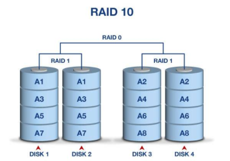
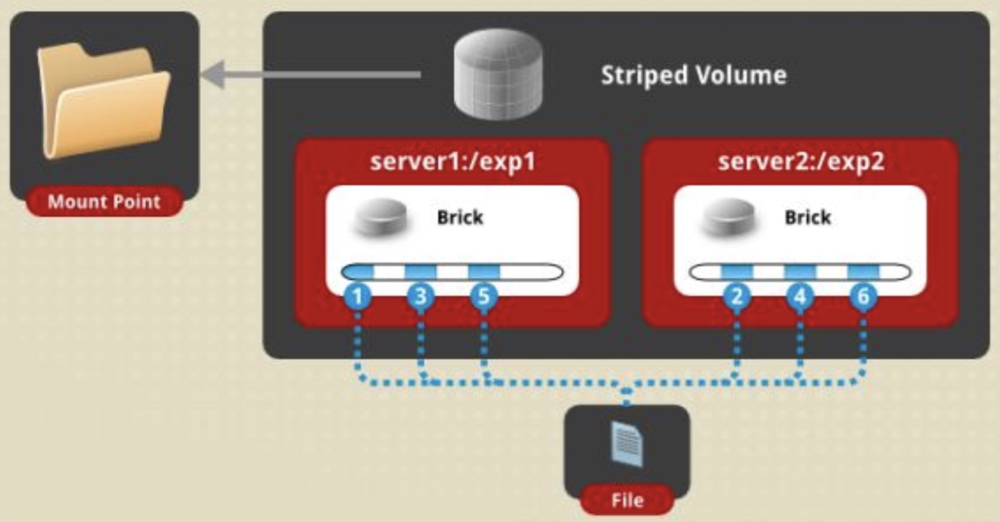
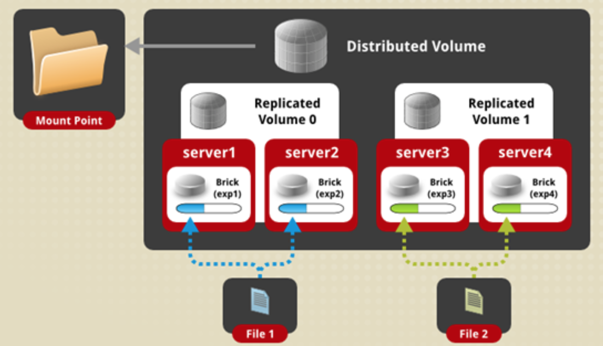
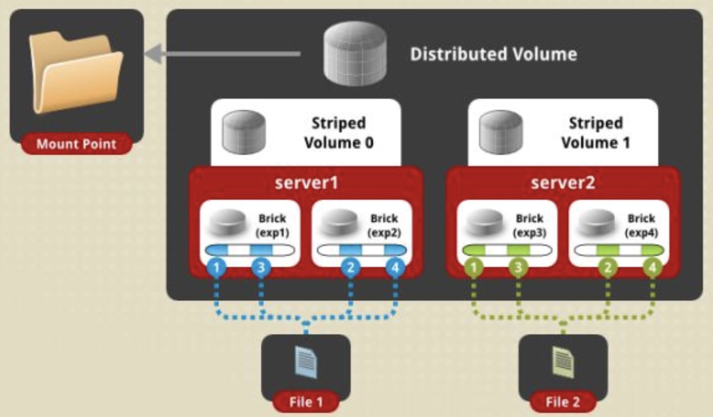
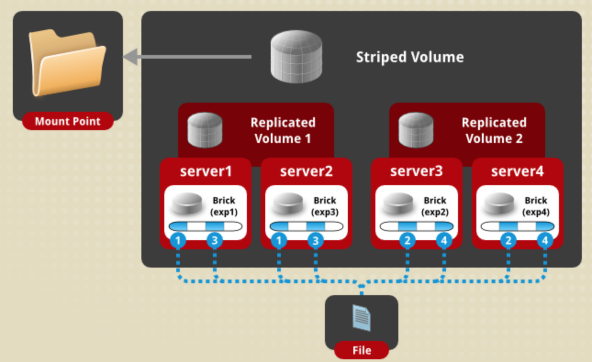

# GlusterFS

## 一、分布式存储介绍

我们知道NAS是远程通过网络共享目录, SAN是远程通过网络共享块设备。那么分布式存储你可以看作拥有多台存储服务器连接起来的存储输出端。把这多台存储服务器的存储合起来做成一个整体再通过网络进行远程共享,共享的方式有目录(文件存储),块设备(块存储),对象网关或者说一个程序接口(对象存储)。

常见的分布式存储开源软件有:GlusterFS,Ceph,HDFS,MooseFS,FastDFS等。

分布式存储一般都有以下几个优点:

1. 扩容方便，轻松达到PB级别或以上
2. 提升读写性能或数据高可用
3. 避免单个节点故障导致整个架构问题
4. 价格相对便宜，大量的廉价设备就可以组成，比光纤SAN这种便宜很多

## 二、GlusterFS介绍

glusterfs是一个免费,开源的分布式文件系统（它属于**文件存储类型**）。主要由 Z RESEARCH 公司负责开发。GlusterFS 具有强大的横向扩展能力，通过扩展能够支持数PB存储容量和处理数千客户端。GlusterFS 可以将物理分布的存储资源聚集在一起，使用单一全局命名空间来管理数据，可为各种不同的数据负载提供优异的性能。

GlusterFS 主要由存储服务器（Brick Server）、客户端以及 NFS/Samba 存储网关组成。在GlusterFS 架构中没有元数据服务器组件，这是其最大的设计这点，对于提升整个系统的性能、可靠性和稳定性都有着决定性的意义。

GlusterFS 支持 TCP/IP 和 高速网络互联。客户端可通过原生 GlusterFS 协议访问数据，其他没有运行 GlusterFS 客户端的终端可通过 NFS/CIFS 标准协议通过存储网关访问数据。存储服务器主要提供基本的数据存储功能，客户端弥补了没有元数据服务器的问题，承担了更多的功能，包括数据卷管理、I/O 调度、文件定位、数据缓存等功能，利用 FUSE（File system in User Space）模块将 GlusterFS 挂载到本地文件系统之上，来访问系统数据。

## 三、raid级别回顾

raid级别有很多种，下面主要介绍常用的几种:

**raid0** 读写性能佳，坏了其中一块，数据挂掉，可靠性低（stripe条带化），磁盘利用率100％


**raid1** 镜像备份（mirror)，同一份数据完整的保存在多个磁盘上，写的性能不佳，可靠性高，读的性能还行，磁盘利用率50%


**raid10** 先做raid 1 再做raid 0



**raid5** 由多块磁盘做raid 5，磁盘利用率为n-1/n, 其中一块放校验数据，允许坏一块盘，数据可以利用校验值来恢复


**raid6** 在raid5的基础上再加一块校验盘，进一步提高数据可靠性


```
注意：生产环境中最常用的为raid5和raid10
```

## GlusterFS名词解释

- Brick: 最基本的存储单元，表示为trusted storage pool中输出的目录，供客户端挂载用，一般表示方式为“主机名:目录名”
- Volume: 一个卷。在逻辑上由N个bricks组成.
- FUSE: Unix-like OS上的可动态加载的模块，允许用户不用修改内核即可创建自己的文件系统。

## 四、GlusterFS卷类型

**基本卷**

**distribute volume分布式卷 默认：**


说明：根据hash算法，将文件随机存储在一个的brick上，文件不能拆分。此时volume的容量是所有brick的和；方便扩展空间，但无冗余保护；由于使用本地文件系统进行存储（brick server 的本地文件系统），存取效率不高；受限于本地文件系统对单文件容量的限制，支持超大型文件系统有问题。

**stripe volume 条带卷：**



说明：每个文件被分片数据块，然后以round robin的方式将每个chunk存储到1个brick，相当于raid0；比如，对于一个文件，奇数行存储在第一个brick上，偶数行存储在第二个brick。单一超大容量文件可被分片，不受brick server本地文件系统的限制；分布式读写性能较高，但分片随机读写可能会导致硬盘iops较高；无冗余，1个server节点故障会导致所有数据丢失。

**replica volume 复制卷(类似Raid 1)：**


说明：每个文件同步复制镜像到多个brick，相当于文件级raid1，一个是存储一个是备份；读性能提升，写性能下降；提升数据可靠性，但磁盘利用率低；如果两台存储服务器不同，就会出现木桶效应

**复合卷**

**distribute replica volume 分布式复制卷：**



说明：是分布式卷与复制卷的组合，兼具两者的功能，若干brick组成1个复制卷，另外若干brick组成其他复制卷；单个文件在复制卷内数据保持副本，不同文件在不同复制卷之间进行哈希分布

**distribute stripe volume分布式条带卷：**



说明：分布式卷与条带卷的组合，兼具两者的功能，若干brick组成1个条带卷，另外若干brick组成其他条带卷；单个文件在条带卷内数据以条带的形式存储，不同文件在不同条带卷之间进行哈希分布；

**striped replicated volume条带镜像卷：**



说明：条带与复制卷的组合，兼具两者的功能，若干brick组成1个复制卷，另外若干brick组成其他复制卷；单个文件以条带的形式存储在2个或多个复制集（replicated sets ），复制集内文件分片以副本的形式保存；

**distribute stripe replica volume 混合卷：** 三种基本卷的复合卷，分布式卷，条带与复制卷的组合，兼具三者的功能

**dispersed volume：** 分散式（冗余式），例如，数据保存在10个brick中，每个brick有1T，10个brick中有3个是作为冗余brick，作为数据校验，不做存储。此时volume只有7T，volume中允许有3个brick损坏

## 五、glusterfs集群

目前为止stripe（条带）类型已经用的越来越少，我们以一个案例说明distribute（分布式），replica（复制），distribute replica（分布式复制），dispersed（冗余）四种常用的类型如何使用

### 学习案例

**案例需求:** 部署一个glusterfs存储集群

**集群部署:** 案例步骤

1. 部署集群
2. 创建卷并启动
3. 客户端连接挂载

#### 实验拓扑图


|计算机名称|IP地址|角色|
| :--------: | :------------: | :----------: |
|manage01|192.168.98.200|client|
|node1|192.168.98.201|storage_node|
|node2|192.168.98.202|storage_node|
|node3|192.168.98.203|storage_node|
|node4|192.168.98.204|storage_node|
|node5|192.168.98.205|storage_node|

#### 实验环境

- CentOS8系统
- 关闭防火墙
- 关闭selinux
- 网络连通
- 时间同步

#### 实验步骤

**时间同步**

```
[root@manage01 ~]# vim /etc/chrony.conf
server 192.168.98.200 iburst
driftfile /var/lib/chrony/drift
makestep 1.0 3
rtcsync
allow 192.168.98.0/24
local stratum 10
leapsectz right/UTC
logdir /var/log/chrony
bindaddress 192.168.98.200
[root@manage01 ~]# systemctl restart chrony
server 192.168.98.200 iburst
[root@node1 ~]# systemctl restart chronyd.service 
```

**gluster集群部署**

1、安装软件[ 安装软件、启动服务]

2、部署集群

**存储端设置**

a、所有存储机器,设置Yum源，安装gluster

```
#官方源地址https://download.gluster.org/pub/gluster/glusterfs/LATEST/CentOS/glusterfs-rhel8.repo
[root@node2 ~]#vim /etc/yum.repos.d/glusterfs.repo 
# Place this file in your /etc/yum.repos.d/ directory
[glusterfs-rhel8]
name=GlusterFS is a clustered file-system capable of scaling to several petabytes.
baseurl=https://download.gluster.org/pub/gluster/glusterfs/7/LATEST/RHEL/el-$releasever/$basearch/
enabled=1
skip_if_unavailable=1
gpgcheck=1
gpgkey=https://download.gluster.org/pub/gluster/glusterfs/7/rsa.pub

[glusterfs-noarch-rhel8]
name=GlusterFS is a clustered file-system capable of scaling to several petabytes.
baseurl=https://download.gluster.org/pub/gluster/glusterfs/7/LATEST/RHEL/el-$releasever/noarch
enabled=1
skip_if_unavailable=1
gpgcheck=1
gpgkey=https://download.gluster.org/pub/gluster/glusterfs/7/rsa.pub

[glusterfs-source-rhel8]
name=GlusterFS is a clustered file-system capable of scaling to several petabytes. - Source
baseurl=https://download.gluster.org/pub/gluster/glusterfs/7/LATEST/RHEL/el-$releasever/SRPMS
enabled=0
skip_if_unavailable=1
gpgcheck=1
gpgkey=https://download.gluster.org/pub/gluster/glusterfs/7/rsa.pub
[root@node1 yum.repos.d]# vim /etc/yum.repos.d/CentOS-PowerTools.repo 
[PowerTools]
name=CentOS-$releasever - PowerTools
mirrorlist=http://mirrorlist.centos.org/?release=$releasever&arch=$basearch&repo=PowerTools&infra=$infra
#baseurl=http://mirror.centos.org/$contentdir/$releasever/PowerTools/$basearch/os/
gpgcheck=1
enabled=1
gpgkey=file:///etc/pki/rpm-gpg/RPM-GPG-KEY-centosofficial
```

b、安装glusterfs软件包，并启动服务

```
[root@node2 ~]# dnf install glusterfs-server
[root@node2 ~]# systemctl enable glusterd
[root@node2 ~]# systemctl start glusterd
```

**glusterfs集群组成**

brick端：manager/node

client端：挂载存储业务机器

```
[root@node2 ~]# gluster peer help

#将node节点加入集群
[root@node2 ~]# gluster peer probe node1
peer probe: success. 

#从集群中删除node
[root@node2 ~]# gluster peer detach node4
All clients mounted through the peer which is getting detached need to be remounted using one of the other active peers in the trusted storage pool to ensure client gets notification on any changes done on the gluster configuration and if the same has been done do you want to proceed? (y/n) y
peer detach: success

#查看集群信息
[root@node2 ~]# gluster peer status
[root@node2 ~]# gluster pool list


[root@node2 ~]# gluster peer status
Number of Peers: 2

Hostname: node1
Uuid: 809111f4-8a0e-40fb-af53-d2d8a56cd41e
State: Peer in Cluster (Connected)

Hostname: 192.168.98.203
Uuid: 7396a19d-a2a7-4b27-86d3-12c89ac4df39
State: Peer in Cluster (Connected)

或者


[root@node2 ~]# gluster pool list
UUID					Hostname      	State
809111f4-8a0e-40fb-af53-d2d8a56cd41e	node1         	Connected 
7396a19d-a2a7-4b27-86d3-12c89ac4df39	192.168.98.203	Connected 
0ace00a1-0612-4395-ac9b-f1516207ead1	localhost     	Connected 
```

##### 

c、所有storage服务器建立连接，成为一个集群

```
4个storage服务器建立连接不用两两连接，只需要找其中1个,连接另外3个各一次就OK了

##集群管理
#将node节点加入集群
[root@node2 ~]# gluster peer probe node1
peer probe: success. 
[root@node2 ~]# gluster peer probe node4
peer probe: success. 
[root@node2 ~]# gluster peer probe node3  --这里使用ip,主机名,主机名别名都可以

然后在所有存储上都可以使用下面命令来验证检查

[root@node2 ~]# gluster peer status
Number of Peers: 3

Hostname: node1
Uuid: 809111f4-8a0e-40fb-af53-d2d8a56cd41e
State: Peer in Cluster (Connected)

Hostname: 192.168.98.203
Uuid: 7396a19d-a2a7-4b27-86d3-12c89ac4df39
State: Peer in Cluster (Connected)

Hostname: node4
Uuid: b2ea8b19-658c-40ec-84b4-6568c627eefd
State: Peer in Cluster (Connected)
```

**注意**:

如果这一步建立连接有问题（一般问题会出现在网络连接,防火墙,selinux,主机名绑定等);

如果想重做这一步，可以使用gluster peer detach xxxxx [force] 来断开连接，重新做

**存储收集**

必须是一个文件夹

1）一块磁盘[分区 格式化 挂载到节点上的指定目录]

1. 一个磁盘文件[分区 格式化 挂载到节点上的指定目录]

3）分区上的一个文件夹

d、所有storage服务器准备存储目录

```
[root@node2 ~]# mkdir /opt/data{1..5}
```

e、创建存储卷,创建存储卷(在任意一个storage服务器上做)

```
glusterfs支持多种卷
Distribut卷  分布卷
Replica卷    复制卷
Disperse卷   冗余卷

注意：从6.0版本开始之前和Striped卷相关的卷类型就全部废弃了。
https://docs.gluster.org/en/latest/Administrator%20Guide/Setting%20Up%20Volumes/
```

**Replica卷**

文件同步复制到多个brick上，文件级RAID 1，具有容错能力，写性能下降，读性能提升。缺点是磁盘利用率低。

```
#创建一个replica卷(raid1) 数据会在每个brick上存储一份
#复制卷类似raid1 所有一般会选择两台来完成,文件保存两份，如果希望保存多个机器，可以用多台机器，这里用两台。

[root@node2 ~]# gluster volume create gv1-replica replica 2 node{1..2}:/opt/data force
volume create: gv1-replica: success: please start the volume to access data
replica 代表创建的是镜像卷  2 代表2个台机器   由于使用的是根分区 所以要加上强制 force


#查看卷创建情况
[root@node2 ~]# gluster volume info gv1-replica
 
Volume Name: gv1-replica
Type: Replicate
Volume ID: f93a83dc-9ed6-43fe-99e4-5346d5d1d702
Status: Created
Snapshot Count: 0
Number of Bricks: 1 x 2 = 2
Transport-type: tcp
Bricks:
Brick1: node1:/opt/data
Brick2: node2:/opt/data
Options Reconfigured:
transport.address-family: inet
nfs.disable: on
performance.client-io-threads: off
```

**Distribut卷—数据随机存储在某个brick**

文件通过hash算法分布到所有brick server上，这种卷是glusterfs的基础和最大特点。优点是容量大，缺点是没冗余。

```
#如果不指定创建卷的类型，则默认是Distribute卷，可以是多个机器。
#分布卷数据随机存储在某个brick,一般是应用在不需要冗余的环境。

[root@node2 ~]# gluster volume create gv2-distribute node{1..3}:/opt/data2 force
volume create: gv2-distribute: success: please start the volume to access data


#查看卷
[root@node2 ~]# gluster volume info gv2-distribute
 
Volume Name: gv2-distribute
Type: Distribute
Volume ID: 079a2f5c-23ac-43f8-9f54-f6a454a53706
Status: Created
Snapshot Count: 0
Number of Bricks: 3
Transport-type: tcp
Bricks:
Brick1: node1:/opt/data2
Brick2: node2:/opt/data2
Brick3: node3:/opt/data2
Options Reconfigured:
transport.address-family: inet
nfs.disable: on
```

**Disperse 卷( 冗余卷)**

disperse卷是v3.6版本后发布的一种卷模式，类似于raid5/6,分布式分散卷 disperse必须大于2,大于4才可以有一块redundancy盘 大于5块可有redundancy盘两块

文件分片存储在各个硬盘上，但有部分硬盘用于冗余用途，数量可以指定。比如一共10块硬盘，2块盘用于冗余，那么就可以承受同时损坏两块硬盘，总容量是8块盘。

优点是在冗余和性能之间取得平衡

```
#创建卷(raid5 raid6) 
#建议不少于4个机器
[root@node2 ~]# gluster volume create gv3-disperse disperse 4 node{1..4}:/opt/data3 force
There isn't an optimal redundancy value for this configuration. Do you want to create the volume with redundancy 1 ? (y/n) y   指定一个磁盘为校验磁盘
volume create: gv3-disperse: success: please start the volume to access data

#查看卷信息
[root@node2 ~]# gluster volume info gv3-disperse
 
Volume Name: gv3-disperse
Type: Disperse
Volume ID: 754523b3-7e8e-4133-bb77-60c2247711d9
Status: Created
Snapshot Count: 0
Number of Bricks: 1 x (3 + 1) = 4
Transport-type: tcp
Bricks:
Brick1: node1:/opt/data3
Brick2: node2:/opt/data3
Brick3: node3:/opt/data3
Brick4: node4:/opt/data3
Options Reconfigured:
transport.address-family: inet
nfs.disable: on
```

**distribute replica 分布复制卷**

```
#创建分布复制卷，机器为偶数
#每两个分布卷组成一个复制卷,创建两个复制卷 
[root@node2 ~]# gluster volume create gv2-distribute-replica replica 2  node{1..4}:/opt/data4 force
volume create: gv2-distribute-replica: success: please start the volume to access data

#查看磁盘信息
[root@node2 ~]# gluster volume info gv2-distribute-replica
 
Volume Name: gv2-distribute-replica
Type: Distributed-Replicate
Volume ID: 90d70fef-54a9-4555-98ad-0d1a342f6763
Status: Created
Snapshot Count: 0
Number of Bricks: 2 x 2 = 4
Transport-type: tcp
Bricks:
Brick1: node1:/opt/data4
Brick2: node2:/opt/data4
Brick3: node3:/opt/data4
Brick4: node4:/opt/data4
Options Reconfigured:
transport.address-family: inet
nfs.disable: on
performance.client-io-threads: off
```

f、启动卷

gluster volume star 卷名称

```
#查看卷
[root@node2 ~]# gluster volume list
gv1-replica
gv2-distribute
gv2-distribute-replica
gv3-disperse

#启动卷
[root@node2 ~]# gluster volume start gv1-replica
volume start: gv1-replica: success
[root@node2 ~]# gluster volume start gv2-distribute
volume start: gv2-distribute: success
[root@node2 ~]# gluster volume start gv2-distribute-replica
volume start: gv2-distribute-replica: success
[root@node2 ~]# gluster volume start gv3-disperse
volume start: gv3-disperse: success
```

**存储卷管理-卷的增删改查**

```
#
[root@node2 ~]# gluster volume help  打印帮助信息

#卷的创建 gluster volume create
[root@node2 ~]# gluster volume create <NEW-VOLNAME> [stripe <COUNT>] [replica <COUNT> [arbiter <COUNT>]] [disperse [<COUNT>]] [disperse-data <COUNT>] [redundancy <COUNT>] [transport <tcp|rdma|tcp,rdma>] <NEW-BRICK>... [force]

<NEW-VOLNAME>  卷名
[stripe <COUNT>] [replica <COUNT> [arbiter <COUNT>]] [disperse [<COUNT>]] [disperse-data <COUNT>]  卷类型
	stripe 条带
	replica 复制
	什么都不加  默认分布
	disperse  冗余
	redundancy 校验磁盘
	transport 传输方式   tcp   rdma内存
	force 强制，如果存储在根分区

#卷删除
[root@node2 ~]# gluster volume delete <VOLNAME>

#卷查看
[root@node2 ~]# gluster volume list    #卷列表

[root@node2 ~]# gluster volume info [<VOLNAME> | all] #卷详细信息

[root@node2 ~]# gluster volume status [<VOLNAME> | all] #卷启动或关闭的状态信息

#扩容卷
[root@node2 ~]# gluster volume add-brick <VOLNAME> [<stripe|replica> <COUNT> [arbiter <COUNT>]] <NEW-BRICK> ... [force]

#缩减卷
[root@node2 ~]# gluster volume remove-brick 

#卷启动
[root@node2 ~]# gluster volume start <VOLNAME>

#卷关闭
[root@node2 ~]# gluster volume stop <VOLNAME>

#卷替换
[root@node2 ~]# gluster volume replace-brick
```

**客户端设置挂载分布式卷**

客户端安装软件

```
[root@manage01 ~]# dnf install glusterfs glusterfs-fuse -y
#客户端在安装软件的时候注意版本，如果服务端与客户端使用的版本不一致，会导致挂载失败
```

客户端挂载，验证上述卷数据存储方式

```
#建立挂载点并挂载
[root@manage01 ~]# mkdir /opt/gluster_disk{1..4}
[root@manage01 ~]# mount -t glusterfs node1:/gv1-replica /opt/gluster_disk1/
[root@manage01 ~]# mount -t glusterfs node1:/gv2-distribute /opt/gluster_disk2
[root@manage01 ~]# mount -t glusterfs node1:/gv2-distribute-replica /opt/gluster_disk3
[root@manage01 ~]# mount -t glusterfs node1:/gv3-disperse /opt/gluster_disk4

#查看挂载
[root@manage01 ~]# mount |grep "gluster"
node1:/gv1-replica on /opt/gluster_disk1 type fuse.glusterfs (rw,relatime,user_id=0,group_id=0,default_permissions,allow_other,max_read=131072)
node1:/gv2-distribute on /opt/gluster_disk2 type fuse.glusterfs (rw,relatime,user_id=0,group_id=0,default_permissions,allow_other,max_read=131072)
node1:/gv2-distribute-replica on /opt/gluster_disk3 type fuse.glusterfs (rw,relatime,user_id=0,group_id=0,default_permissions,allow_other,max_read=131072)
node1:/gv3-disperse on /opt/gluster_disk4 type fuse.glusterfs (rw,relatime,user_id=0,group_id=0,default_permissions,allow_other,max_read=131072)


#分别存储数据
[root@manage01 ~]# dd if=/dev/zero of=/opt/gluster_disk1/file bs=1M count=100
记录了100+0 的读入
记录了100+0 的写出
104857600字节(105 MB)已复制，1.281 秒，81.9 MB/秒
[root@manage01 ~]# dd if=/dev/zero of=/opt/gluster_disk2/file bs=1M count=100
记录了100+0 的读入
记录了100+0 的写出
104857600字节(105 MB)已复制，0.974837 秒，108 MB/秒
[root@manage01 ~]# dd if=/dev/zero of=/opt/gluster_disk3/file bs=1M count=100
记录了100+0 的读入
记录了100+0 的写出
104857600字节(105 MB)已复制，1.53898 秒，68.1 MB/秒
[root@manage01 ~]# dd if=/dev/zero of=/opt/gluster_disk4/file bs=1M count=100
记录了100+0 的读入
记录了100+0 的写出
104857600字节(105 MB)已复制，1.80071 秒，58.2 MB/秒


#验证
#复制卷   数据每个节点都存储了一份
[root@node1 ~]# ls /opt/data -lh
总用量 100M
-rw-r--r-- 2 root root 100M 7月   7 08:51 file
[root@node2 ~]# ls /opt/data -lh
总用量 100M
-rw-r--r-- 2 root root 100M 7月   7 08:51 file

#分布卷  数据存在了node1
[root@node1 ~]# ls /opt/data2 -lh
总用量 100M
-rw-r--r-- 2 root root 100M 7月   7 08:51 file
[root@node2 ~]# ls /opt/data2 -lh
总用量 0
[root@node3 ~]# ls /opt/data2 -lh
总用量 0

#冗余卷  发现数据平均分布在每个存储节点
[root@node1 ~]# ls /opt/data3 -lh
总用量 34M
-rw-r--r-- 2 root root 34M 7月   7 08:52 file

[root@node2 ~]# ls /opt/data3 -lh
总用量 34M
-rw-r--r-- 2 root root 34M 7月   7 08:52 file

[root@node3 ~]# ls /opt/data3 -lh
总用量 34M
-rw-r--r-- 2 root root 34M 7月   7 08:52 file

[root@node4 ~]# ls /opt/data3/ -lh
总用量 34M
-rw-r--r-- 2 root root 34M 7月   7 08:52 file


#分布复制卷  发现数据存在了node3  node4  这对复制卷上，
[root@node1 ~]# ls /opt/data4 -lh
总用量 0
[root@node2 ~]# ls /opt/data4 -lh
总用量 0
[root@node3 ~]# ls /opt/data4 -lh
总用量 100M
-rw-r--r-- 2 root root 100M 7月   7 08:51 file
[root@node4 ~]# ls /opt/data4/ -lh
总用量 100M
-rw-r--r-- 2 root root 100M 7月   7 08:51 file
```

**删除卷**

1. 删除卷中数据
2. 客户端卸载
3. 在任意一个节点执行删除
4. 验证删除

**实践练习**

删除卷中数据

```
[root@manage01 ~]# rm -rf /opt/gluster_disk1/*
```

客户端卸载

```
[root@manage01 ~]# umount /opt/gluster_disk1/
```

卷删除

```
#3.在任意一个节点删除
[root@node1 ~]# gluster volume stop gv1-replica 
[root@node1 ~]# gluster volume delete gv1-replica
Deleting volume will erase all information about the volume. Do you want to continue? (y/n) y
volume delete: gv1-replica: failed: Volume vg0 does not exist
```

验证删除

```
[root@node1 ~]# gluster volume info gv1-replica
Volume gv1-replica does not exist
```

**在线裁减与在线扩容**

在线裁减要看是哪一种模式的卷，比如stripe模式就不允许在线裁减。下面我以distributed卷来做裁减与扩容

**在线扩容**

```
#查看卷
[root@node2 ~]# gluster volume info gv2-distribute
 
Volume Name: gv2-distribute
Type: Distribute
Volume ID: 079a2f5c-23ac-43f8-9f54-f6a454a53706
Status: Started
Snapshot Count: 0
Number of Bricks: 3
Transport-type: tcp
Bricks:
Brick1: node1:/opt/data2
Brick2: node2:/opt/data2
Brick3: node3:/opt/data2
Options Reconfigured:
transport.address-family: inet
nfs.disable: on

#扩容
[root@node2 ~]# gluster volume add-brick gv2-distribute node4:/opt/data2 force
volume add-brick: success

#验证
[root@node2 ~]# gluster volume info gv2-distribute
 
Volume Name: gv2-distribute
Type: Distribute
Volume ID: 079a2f5c-23ac-43f8-9f54-f6a454a53706
Status: Started
Snapshot Count: 0
Number of Bricks: 4
Transport-type: tcp
Bricks:
Brick1: node1:/opt/data2
Brick2: node2:/opt/data2
Brick3: node3:/opt/data2
Brick4: node4:/opt/data2
Options Reconfigured:
transport.address-family: inet
nfs.disable: on
```

**在线裁减**(注意要remove没有数据的brick)

```
#裁剪卷.
[root@node2 ~]# gluster volume remove-brick gv2-distribute node4:/opt/data2 force
Remove-brick force will not migrate files from the removed bricks, so they will no longer be available on the volume.
Do you want to continue? (y/n) y
volume remove-brick commit force: success

#查看验证
[root@node2 ~]# gluster volume info gv2-distribute
 
Volume Name: gv2-distribute
Type: Distribute
Volume ID: 079a2f5c-23ac-43f8-9f54-f6a454a53706
Status: Started
Snapshot Count: 0
Number of Bricks: 3
Transport-type: tcp
Bricks:
Brick1: node1:/opt/data2
Brick2: node2:/opt/data2
Brick3: node3:/opt/data2
Options Reconfigured:
performance.client-io-threads: on
transport.address-family: inet
nfs.disable: on


关于裁剪卷,线上几乎不会裁剪，基本上都是扩容，而且裁剪只能裁剪没有数据的，否则可能数据丢失。所以，有些卷是不支持裁剪的。
```

**在线替换卷**

```
[root@node2 ~]# gluster volume list
gv1-replica
gv2-distribute
gv2-distribute-replica
gv3-disperse
[root@node2 ~]# gluster volume info gv1-replica
 
#查看源信息 
Volume Name: gv1-replica
Type: Replicate
Volume ID: f93a83dc-9ed6-43fe-99e4-5346d5d1d702
Status: Started
Snapshot Count: 0
Number of Bricks: 1 x 2 = 2
Transport-type: tcp
Bricks:
Brick1: node1:/opt/data
Brick2: node2:/opt/data
Options Reconfigured:
transport.address-family: inet
nfs.disable: on
performance.client-io-threads: off

#卷替换
[root@node2 ~]# gluster volume replace-brick gv1-replica node2:/opt/data node4:/opt/data commit force
volume replace-brick: success: replace-brick commit force operation successful


#验证替换
[root@node2 ~]# gluster volume info gv1-replica
 
Volume Name: gv1-replica
Type: Replicate
Volume ID: f93a83dc-9ed6-43fe-99e4-5346d5d1d702
Status: Started
Snapshot Count: 0
Number of Bricks: 1 x 2 = 2
Transport-type: tcp
Bricks:
Brick1: node1:/opt/data
Brick2: node4:/opt/data
Options Reconfigured:
transport.address-family: inet
nfs.disable: on
performance.client-io-threads: off
```

拓展:4个存储想扩容为5个存储怎么做?

```
答案: 第5个存储服务器安装服务器软件包，启动服务，然后gluster peer probe storage5加入集群


#加入集群
[root@node2 ~]# gluster peer probe node5
peer probe: success. 
[root@node2 ~]# gluster peer status
Number of Peers: 4

Hostname: node1
Uuid: 809111f4-8a0e-40fb-af53-d2d8a56cd41e
State: Peer in Cluster (Connected)

Hostname: 192.168.98.203
Uuid: 7396a19d-a2a7-4b27-86d3-12c89ac4df39
State: Peer in Cluster (Connected)

Hostname: node4
Uuid: b2ea8b19-658c-40ec-84b4-6568c627eefd
State: Peer in Cluster (Connected)

Hostname: node5
Uuid: 82f424cb-1c7d-4057-8f40-f236015f8940
State: Peer in Cluster (Connected)
```
