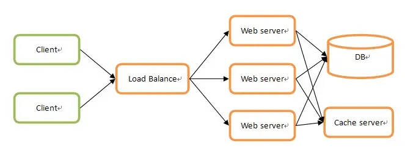

# 008 高可用方案

* 📄 Corosync
* 📄 HAProxy
* 📑 LVS

  * 📄 LVS
  * 📄 部署LVS DR集群
  * 📄 部署LVS NAT集群
  * 📄 部署LVS TUN集群
* 📄 RoseHA
* 📄 heartbeat
* 📄 keepalived

# 分布式与集群

目前的项目很少会采用单机架构了，一是因为单机性能有限，二是因为单机服务一旦故障整个系统就无法继续提供服务了。所以目前集群和分布式的架构使用得很广泛，主要就是为了解决上述两个问题，一个性能问题，一个故障问题，**通过分布式架构解决性能（高并发）问题，通过集群架构解决故障服务（高可用）问题。**

## 分布式架构

> 分布式：一个业务分拆多个子业务，部署在不同的服务器上

网上很多文章把分布式架构说得很复杂，但都没有切中关键，其实理解起来很简单，所有的计算机系统都是为业务服务的，将同一个业务拆分成多个子业务，各个子业务部署在不同的服务器上，这就是分布式架构，通过将业务拆细，为不同的子业务配置不同性能的服务器，提高整个系统的性能。*我个人认为目前很火的微服务概念其实本质上就是分布式。*

按照类型大致可以分为两种：==分布式计算和分布式存储==

分布式计算很好理解，就是**将大量计算任务分配到多个计算单元上**以提高总计算性能。例如暴力破解某个密码需要遍历某个字符组合10万次，假设一台计算机需要10分钟，那么10台计算机同时遍历，每台遍历1万次，最后将结果汇总，那么就只需要1分钟。这10台计算机组合起来就是一个分布式计算系统，这里的业务就是计算。

同理，分布式储存也很好理解，就是**将大量数据分配到多个储存单元上**以提高总存储量。例如100ZB的数据一个储存单元放不下，那就拆成100份，每个储存单元存1份，那么这100个存储单元组合起来就是一个分布式储存系统，这里的业务就是存储。目前主流的关系型数据库都有比较成熟的分布式存储方案，如 MySQL 的 MySQL Fabric、MyCat 等，Oracle Database 有Oracle Sharding 等。Redis 作为流行的非关系型数据库，由于是内存数据库，理论上一般不会在 Redis 中存放太多的数据，但是在某些特殊情况下还是会有储存空间不够的情况，或者需要预防储存空间不够的情况发生，这个时候就需要 Redis 分布式架构了。

例如某集团下有很多的子公司，每个子公司都有多套 IT 系统，其中很多 IT 系统都是需要使用 Redis 的，集团为了统一管理，搭建了一套中央 Redis 系统，要求所有子公司下的 IT 系统统一使用集团的中央 Redis 库，这个时候即使当前储存容量够用，但是为了应对后期发展就必须使用到分布式储存，因为**分布式架构理论上都支持无限水平拓展**。

## 集群架构

> 集群：同一个业务，部署在多个服务器上

集群同样也非常好理解，就是在多个服务器上部署同一个业务，这样可以起到两个作用：

1. 分散每台服务器的压力
2. 任意一台或者几台服务器宕机也不会影响整个系统

例如一个典型的 Web 集群服务架构图如下：

​​

这里三个 Web Server 服务器实际上都是运行着同一套业务，但是三台服务器就可以显著分散单台服务器压力，并且任意一台宕机也不会导致无法提供服务。

## 分布式与集群的关系

分布式和集群区别很好理解，用下面一张图表示：

需要注意的是分布式不一定能用上，但是集群一般都是需要的。因为不是所有系统都需要应对高并发场景，但高可用是一个系统能够长期稳定运行基本保障。因此用到分布式架构的系统基本上都会用到集群，而用集群架构的系统却不一定会用到分布式。
