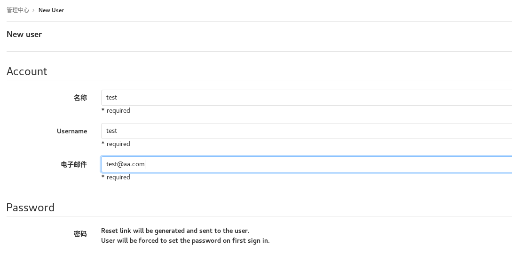
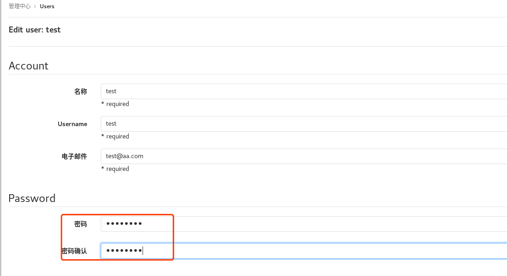
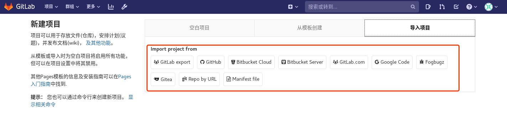
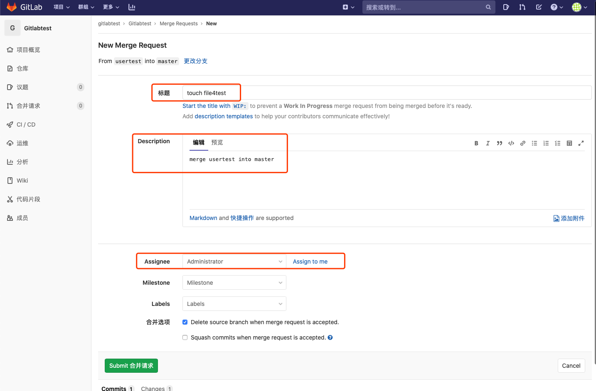

# gitlab

‍

GitLab 是一个用于仓库管理系统的开源项目，使用Git作为代码管理工具，并在此基础上搭建起来的Web服务，可通过Web界面进行访问公开的或者私人项目。它拥有与Github类似的功能，能够浏览源代码，管理缺陷和注释。

gitlab下载地址[https://packages.gitlab.com/gitlab/gitlab-ce](https://packages.gitlab.com/gitlab/gitlab-ce "https://packages.gitlab.com/gitlab/gitlab-ce")

```bash

# 关闭selinux
setenforce 0
sed -i '/^SELINUX=/cSELINUX=disabled' /etc/selinux/config

# 关闭firewalld
systemctl stop firewalld ; systemctl disable firewalld

# 添加gitlab仓库
curl https://packages.gitlab.com/install/repositories/gitlab/gitlab-ee/script.rpm.sh | sudo bash
# 安装gitlab
yum install -y gitlab-ce   # 默认安装到/opt目录
# 修改 gitlab 配置文件并初始化 gitlab
vim /etc/gitlab/gitlab.rb 
--------------------------------------------------------
vim /etc/gitlab/gitlab.rb
# 修改ip
external_url 'http://192.168.10.150:8001'

#GitLab默认会占用80、8080和9090端口，如果服务器上还有tomcat、Jenkins等其他服务，可能会遇到端口冲突,如果想修改端口的话可以
#external_url 'http://192.168.2.100:自定义端口'
#unicorn['port'] = xxx
#prometheus['listen_address'] = 'localhost:xxx'
#将xxx更换成自己需要使用的端口

---------------------------------------------------------
# 修改完配置文件要执行此操作初始化gitlab
gitlab-ctl reconfigure 


```

## 命令和目录

```bash
/opt/gitlab                           # gitlab的程序安装目录
/var/opt/gitlab                    # gitlab数据目录
/var/opt/gitlab/git‐data  # 存放仓库数据
```

‍

|命令|function|
| :--------------| :---------------------------|
|start|启动所有服务|
|stop|关闭所有服务|
|restart|重启所有服务|
|status|查看所有服务状态|
|tail|查看日志信息|
|service-list|查看所有启动服务|
|graceful-kill|平稳停止一个服务|
|help|帮助|
|reconfigure|修改配置文件之后，重新加载|
|show-config|查看所有服务配置文件信息|
|uninstall|卸载这个软件|
|cleanse|清空gitlab数据|

```
[root@zutuanxue ~]# gitlab-ctl start
ok: run: alertmanager: (pid 1564) 3804s
ok: run: gitaly: (pid 1550) 3804s
[root@zutuanxue ~]# gitlab-ctl start nginx
ok: run: nginx: (pid 1531) 3823s

#这些操作指令，如果不指定名称的话，默认会操作所有
```

***Gitlab的服务构成***

```bash
gitlab-ctl service-list
# gitaly                             # git RPC服务，用于处理gitlab发出的git调用
# gitlab-workhorse        # 轻量级的反向代理服务器
# logrotate                      # 日志文件管理工具
# nginx                             # 静态web服务
# postgresql                    # 数据库
# redis                              # 缓存数据库
# sidekiq                          # 用于在后台执行队列任务
# unicorn                         # 用Ruby编写的web server，GitLab Rails应用是托管在这个服务器上面
# alertmanager*，gitlab-exporter*，grafana*，node-exporter*，postgres-exporter*，# prometheus*，redis-exporter*	# 与监控相关的插件
```

‍

‍

## gitlab备份

由于gitlab中存放的都是开发人员的工作成果，所以为了保证数据安全，我们会定期对数据进行备份，对gitlab进行备份将会创建一个包含所有库和附件的归档文件。对备份的恢复只能恢复到与备份时的gitlab相同的版本。将gitlab迁移到另一台服务器上的最佳方法就是通过备份和还原。gitlab提供了一个简单的命令行来备份整个gitlab ，并且能灵活的满足需求。

### 备份

备份文件将保存在配置文件中定义的backup_path中 ，文件名为TIMESTAMP_gitlab_backup.tar,TIMESTAMP为备份时的时间戳。TIMESTAMP的格式为 ：EPOCH_YYYY_MM_DD_Gitlab‐version。

**备份配置：**

```
[root@zutuanxue git_data]# vim /etc/gitlab/gitlab.rb 
gitlab_rails['backup_path'] = "/opt/backups"
#备份路径
gitlab_rails['backup_keep_time'] = 604800
#备份周期-秒（7x24x3600）
[root@zutuanxue git_data]# gitlab-ctl reconfigure
```

**手动备份：**

```
[root@zutuanxue git_data]# gitlab-backup create
或者
[root@zutuanxue git_data]# gitlab-rake gitlab:backup:create
[root@zutuanxue git_data]# ls /opt/backups/
```

**定时备份：**

在定时任务里添加：

```
0 2 * * * /opt/gitlab/bin/gitlab-rake gitlab:backup:create
或
0 2 * * * /opt/gitlab/bin/gitlab-backup create
```

### 还原

只能还原到与备份文件相同的gitlab版本。执行恢复操作时，需要gitlab处于运行状态，备份文件位于gitlab_rails[‘backup_path’]。需要先停掉两个服务，停止连接到数据库的进程（也就是停止数据写入服务，如果是空主机，没有任何操作的话，可以不停止服务，停止相应服务的目的是为了保证数据移植），但是保持GitLab是运行的。

在web中删除项目

```
[root@zutuanxue backups]# gitlab-ctl stop unicorn
[root@zutuanxue backups]# gitlab-ctl stop sidekiq
```

指定时间戳你要从那个备份恢复：

```
[root@zutuanxue git_data]# cd /opt/backups/
[root@zutuanxue backups]# gitlab-ctl stop unicorn
ok: down: unicorn: 0s, normally up
[root@zutuanxue backups]# gitlab-ctl stop sidekiq
ok: down: sidekiq: 1s, normally up
[root@zutuanxue backups]# gitlab-rake gitlab:backup:restore BACKUP=1586328114_2020_04_08_12.9.2
（有的版本执行gitlab-rake gitlab:backup:restore BACKUP=1586328114即可）
Unpacking backup ... done
Before restoring the database, we will remove all existing
tables to avoid future upgrade problems. Be aware that if you have
custom tables in the GitLab database these tables and all data will be
removed.
Do you want to continue (yes/no)? yes
#提示移除所有存在的表
.
.
.
This task will now rebuild the authorized_keys file.
You will lose any data stored in the authorized_keys file.
Do you want to continue (yes/no)? yes
#提示移除所有验证秘钥
[root@zutuanxue backups]# gitlab-ctl restart#重启gitlab

注意：也可使用gitlab-rake gitlab:check SANITIZE=true验证下gitlab服务
```

浏览器重新打开gitlab页面，重新登录后查看到被还原的项目内容

‍

## gitlab使用教程

在浏览器中访问本机，就可以打开登录界面，初次登录必须修改密码（不能少于8位），更改完成后可以使用管理员账号登录，用户名为root

访问gitlab:http://192.168.10.150:8001

默认用户名：root  密码：`cat /etc/gitlab/initial_root_password`​

‍

### 1. 外观

​​

设置完成后保存，返回登录页面查看

​​

关于注册，有些公司是不允许打开的，，有些人数非常多的公司就需要打开注册的功能，让人员自己注册，我们来给他特定的权限就可以，毕竟人非常多的时候还由我们来给她们注册就非常不现实了，工作量会很大

### 2. 自动注册

​​

​​

### 3. 组&用户&项目

**创建组**

​​

**设置组名称、描述等创建群组**

​​

**创建用户**

​​

​​

**设置密码**

​​

​​

**把用户添加到组里面**

​​

​​

```
Guest：可以创建issue、发表评论，不能读写版本库
Reporter：可以克隆代码，不能提交，QA、PM可以赋予这个权限
Developer：可以克隆代码、开发、提交、push，RD可以赋予这个权限
Maintainer：可以创建项目、添加tag、保护分支、添加项目成员、编辑项目，核心RD负责人可以赋予这个权限
Owner：可以设置项目访问权限 - Visibility Level、删除项目、迁移项目、管理组成员，开发组leader可以赋予这个权限
Gitlab中的组和项目有三种访问权限：Private、Internal、Public

Private：只有组成员才能看到
Internal：只要登录的用户就能看到
Public：所有人都能看到
```

**创建仓库**

管理区域-创建仓库

​​

​​

也可以导入项目

​​

创建仓库以后，网页下面有操作步骤的提醒

​​

### 4. 登陆用户测试

是否能看到空的gitlabtest仓库，修改完密码后再次登录

​​

### 5. 添加ssh‐keys

注 ：一个服务器的key只能添加到一个gitlab服务器上 ，一个用户可以添加多个key，切换到管理员用户

ssh‐keygen ‐t rsa

​​

​​

### 6. 添加、推送到远程仓库

默认master是不允许developer权限的成员执行推送操作的

```
[root@zutuanxue git_data]# git remote rm origin
或者
[root@zutuanxue git_data]# git remote rename origin old‐origin  也可以重命名
[root@zutuanxue git_data]# git remote add origin git@192.168.2.100:gitlabtest/gitlabtest.git
[root@zutuanxue git_data]# git push -u origin --all
```

### 7. 克隆

切换到另外一台主机

```
[root@zutuanxue ~]# dnf install git -y
[root@zutuanxue work]# ssh-keygen -t rsa
[root@zutuanxue work]# cat /root/.ssh/id_rsa.pub
```

使用test用户登录gitlab并添加ssh秘钥

```
[root@zutuanxue work]# git clone git@192.168.2.100:gitlabtest/gitlabtest.git
正克隆到 'gitlabtest'...
The authenticity of host '192.168.2.100 (192.168.2.100)' can't be established.
ECDSA key fingerprint is SHA256:CDlvaoOre2O1oLbKC4umHcPZ/AfHk37sEZGZakepDd0.
Are you sure you want to continue connecting (yes/no)? yes
Warning: Permanently added '192.168.2.100' (ECDSA) to the list of known hosts.
remote: Enumerating objects: 3, done.
remote: Counting objects: 100% (3/3), done.
remote: Compressing objects: 100% (2/2), done.
remote: Total 3 (delta 0), reused 0 (delta 0), pack-reused 0
接收对象中: 100% (3/3), 完成.
[root@zutuanxue ~]# cd gitlabtest/
[root@zutuanxue gitlabtest]# ls
a  b  c
[root@zutuanxue gitlabtest]# git config --global user.name test
[root@zutuanxue gitlabtest]# git config --global user.email "test@aa.com"
[root@zutuanxue gitlabtest]# git branch usertest
[root@zutuanxue gitlabtest]# git checkout usertest
切换到分支 'usertest'
[root@zutuanxue gitlabtest]# touch file4test
[root@zutuanxue gitlabtest]# ls
a  b  c  file4test
[root@zutuanxue gitlabtest]# git add .
[root@zutuanxue gitlabtest]# git commit -m "touch file4test"
[root@zutuanxue gitlabtest]# git push -u origin usertest
```

创建合并请求

​​

​​

切换到管理员账号，处理请求

​​

​​

切换到test用户或者直接使用管理员查看，内容已合并，之前的usertest分支已经被删除

​​

**设置保护主分支**

​​

​​

​​

默认情况下为了保证master分支的稳定是被保护的，只有维护者可以执行push的操作，所以，当一个开发者身份的用户在针对master分支进行操作的时候会出现被拒绝的提示

```
[root@zutuanxue gitlabtest]# git push -u origin master
To 192.168.2.100:gitlabtest/gitlabtest.git
 ! [rejected]        master -> master (fetch first)
error: 无法推送一些引用到 'git@192.168.2.100:gitlabtest/gitlabtest.git'
提示：更新被拒绝，因为远程仓库包含您本地尚不存在的提交。这通常是因为另外
提示：一个仓库已向该引用进行了推送。再次推送前，您可能需要先整合远程变更
提示：（如 'git pull ...'）。
提示：详见 'git push --help' 中的 'Note about fast-forwards' 小节。
```

同样我们也可以利用上述功能去保护某些不想被修改的分支。

**解决内容不一致**

除了分支被保护会出现上述提示之外，有些时候在你返回master端测试推送 ，由于其他分支进行推送 ，和master端内容不一致 ，所以无法进行推送 ，这个时候可以使用git pull把代码拉取到本地 ，或者git fetch 把代码拉取到本地仓库后进行合并 （注意 ：git pull = git

fetch+git merge ）

```
[root@zutuanxue git_data]# git fetch 
[root@zutuanxue git_data]# ls
a  b  c  README.md
[root@zutuanxue git_data]# git merge origin/master
[root@zutuanxue git_data]# ls
a  b  c  file4test  README.md
[root@zutuanxue git_data]# git push -u origin
```

‍
