# ELK数据管理工具ES-Head应用

## 一、ES-head web UI界面

##### **ES-head web UI界面介绍**

http://ES-head_ip:9100

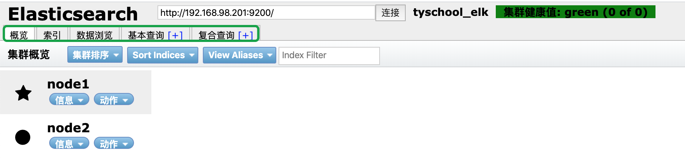

```
概览：显示ES集群及节点状态
索引：索引管理
数据浏览：查看某个索引中的数据
基本查询：查询索引中的所有数据
复合查询：数据管理[上传数据、查看数据、删除数据 doc]
```

##### **索引管理**

- 创建索引
- 管理索引
- 删除索引

a、创建索引

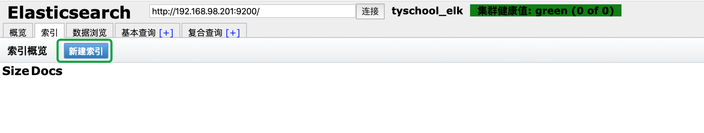

选择索引标签–新建索引

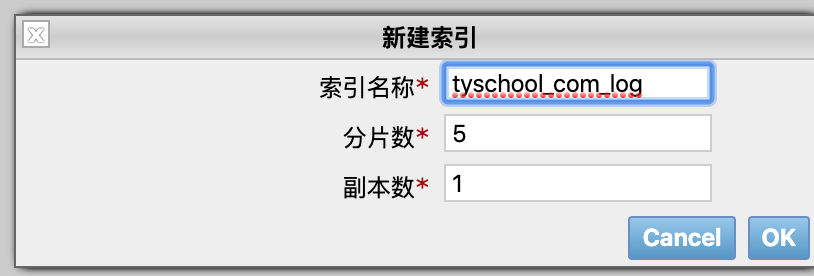

```
索引名称:根据业务起名字
分片数：创建多少个shard分片
副本数：需要多少个ES集群节点存储
```

b、查看索引


可以看到新创建的索引 zutuanxue_com_log 以及大小和文档数

也可以通过概述查看索引分片情况

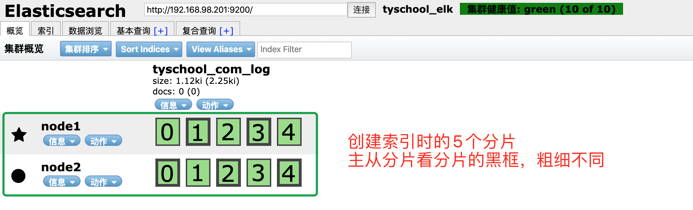

主从分片有区分的，加粗的是主分片

c、索引管理

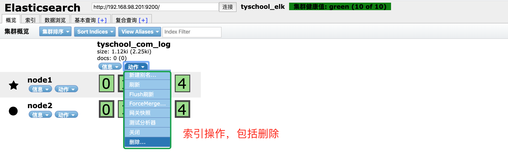

d、索引删除

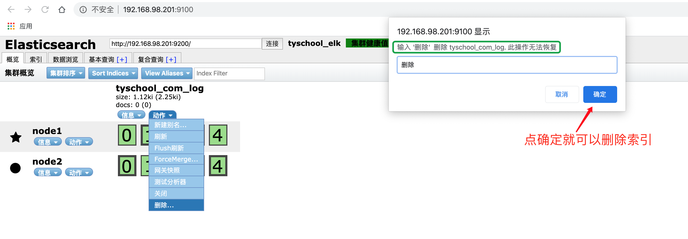

##### **数据查询**

- 符合查询
- 基本查询

a、复合查询

1）存储数据

2）查询数据

3）删除某条数据

1）存储数据

上传数据[提前创建好存储索引]

指定索引和type：zutuanxue_com_log/test

```
type是一个index中用来区分类似的数据的，但是可能有不同的fields，而且有不同的属性来控制索引建立、分词器。
```

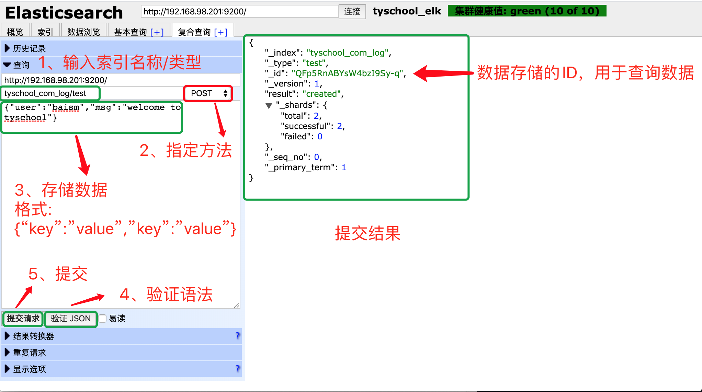

key是列Field(字段)的名字

2）查询数据

查询方法：index/type/id

```
id获得方法：
1）基本查询
2）数据浏览
```

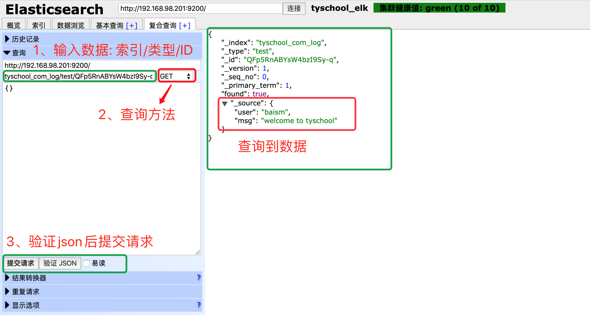

**数据删除**

通过复合查询删除指定数据

删除方法：删除数据的 索引/类型/id 删除方法:DELETE

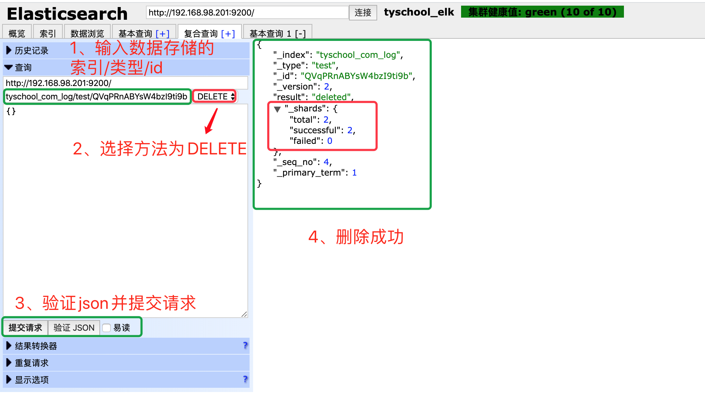

查询结果

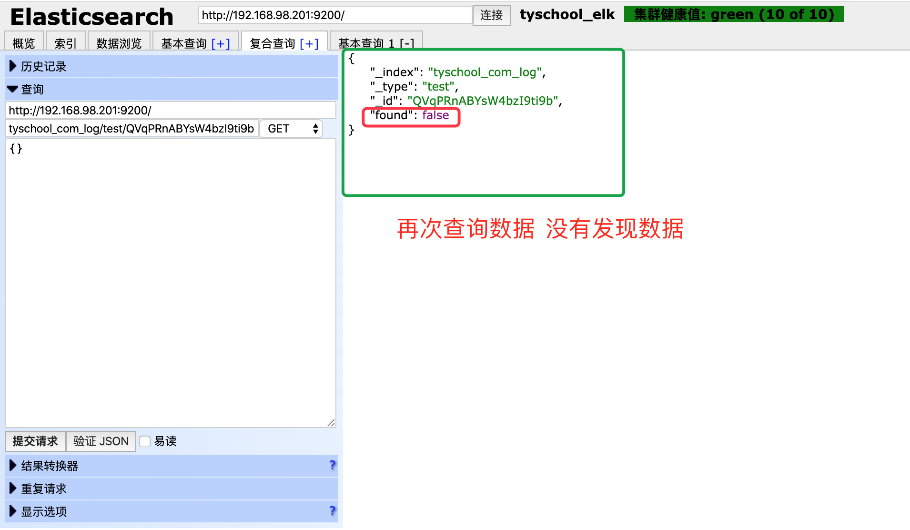

**基本查询**

查询索引中的数据

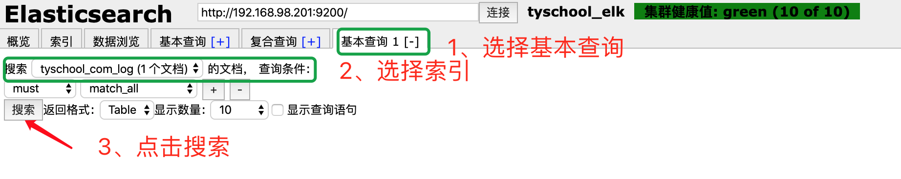

显示数据

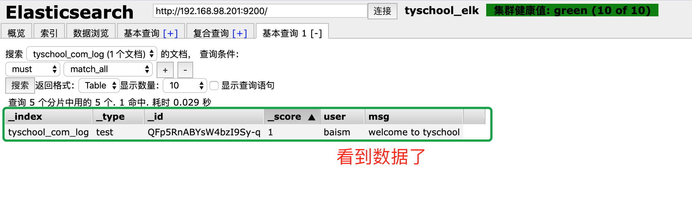

**数据浏览**

浏览索引中的所有数据

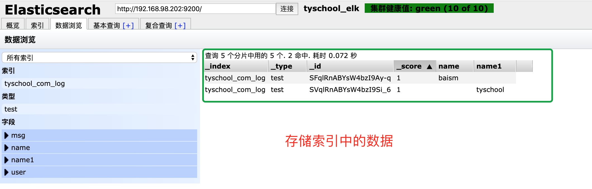
